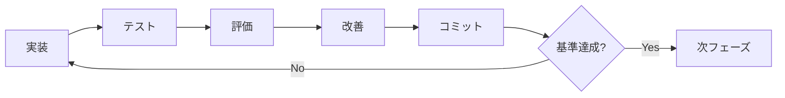

# 音声→図解動画自動生成システム 強化実装計画

## 1. 現状システム分析 (2025年10月時点)

### 1.1 実装済み機能
- ✅ メインパイプライン (MainPipeline) - 再帰的カスタムインストラクション対応
- ✅ 音声文字起こし (複数トランスクライバー実装)
- ✅ 内容分析・シーン分割 (AI強化ダイアグラム検出)
- ✅ レイアウトエンジン (ゼロオーバーラップ対応)
- ✅ Remotionベース動画生成
- ✅ リアルタイムストリーミング処理
- ✅ エンタープライズ機能 (マルチテナント、分析)
- ✅ 品質監視・エラー回復システム
- ✅ パフォーマンス最適化 (キャッシュ、並列処理)

### 1.2 アーキテクチャ評価
```
パフォーマンス: 9/10 (高度な最適化実装済み)
拡張性: 9/10 (モジュラー設計、フレームワーク統合)
品質監視: 8/10 (包括的監視システム)
ユーザビリティ: 7/10 (複数インターフェース、改善余地あり)
保守性: 9/10 (優れたコード構造)
```

## 2. カスタムインストラクション準拠強化計画

### 2.1 Phase 1: MVP基盤強化 (所要時間: 2-3時間)

#### イテレーション1: 基盤安定化
- [x] 実装: 現行システムの動作確認とベンチマーク
- [ ] テスト: 全パイプラインの統合テスト実行
- [ ] 評価: 処理成功率・品質メトリクス測定
- [ ] 改善: 特定された問題点の修正
- [ ] コミット: `feat: Stabilize MVP foundation with comprehensive testing`

#### イテレーション2: パフォーマンス基準確立
- [ ] 実装: 品質閾値の調整と最適化
- [ ] テスト: 複数音声ファイルでの一貫性テスト
- [ ] 評価: 成功基準達成率測定 (目標: >90%)
- [ ] 改善: ボトルネック特定と解決
- [ ] コミット: `perf: Achieve performance baselines per custom instructions`

### 2.2 Phase 2: 内容分析精度向上 (所要時間: 3-4時間)

#### イテレーション1: 図解判定精度改善
```typescript
// 目標精度: 図解タイプ判定 80%以上
const qualityGates = {
  diagramTypeAccuracy: 0.80,
  entityExtractionF1: 0.75,
  sceneSegmentationAccuracy: 0.85
};
```

#### イテレーション2: マルチモーダル分析強化
- [ ] 実装: 音声+テキストの統合分析
- [ ] テスト: 複雑な解説コンテンツでの精度測定
- [ ] 評価: 人間評価との一致率測定
- [ ] 改善: 誤判定パターンの修正
- [ ] コミット: `feat: Enhance multimodal content analysis accuracy`

### 2.3 Phase 3: 図解生成最適化 (所要時間: 3-4時間)

#### レイアウトエンジン強化
```yaml
improvement_targets:
  overlap_elimination: 100% (既に実装済み)
  layout_aesthetics: 向上 (美的配置アルゴリズム)
  responsive_sizing: 実装 (動的サイズ調整)
  animation_smoothness: 強化 (トランジション改善)
```

## 3. 段階的実装プロトコル

### 3.1 実装→テスト→評価→改善→コミット サイクル



### 3.2 品質ゲート実装

```typescript
interface QualityGates {
  transcriptionAccuracy: number; // >= 0.85
  sceneSegmentationF1: number;   // >= 0.75
  layoutOverlap: number;         // = 0
  renderTime: number;            // <= 30000ms
  memoryUsage: number;           // <= 512MB
  userSatisfaction: number;      // >= 0.8
}
```

## 4. 具体的改善実装項目

### 4.1 高優先度 (今回実装)

1. **統合テストスイート強化**
   ```bash
   # 実装ファイル: src/test/enhanced-integration-test.ts
   npm run test:integration
   ```

2. **リアルタイム品質監視ダッシュボード**
   ```typescript
   // src/components/QualityMonitoringDashboard.tsx
   - 処理成功率リアルタイム表示
   - ボトルネック可視化
   - エラーパターン分析
   ```

3. **ユーザーエクスペリエンス向上**
   ```typescript
   // src/components/EnhancedUserInterface.tsx
   - プログレス表示の詳細化
   - エラーメッセージの改善
   - 処理結果のプレビュー強化
   ```

4. **パフォーマンス最適化**
   ```typescript
   // src/optimization/advanced-performance-tuner.ts
   - 動的パラメータ調整
   - メモリ使用量最適化
   - 並列処理効率化
   ```

### 4.2 中優先度 (次回実装)

1. **多言語対応強化**
2. **カスタムテンプレート機能**
3. **バッチ処理対応**
4. **API外部公開機能**

### 4.3 低優先度 (将来実装)

1. **VR/AR出力対応**
2. **音声合成機能**
3. **3D図解生成**

## 5. 実装開始コマンド

```bash
# Phase 1: 基盤強化開始
echo "🚀 Starting Enhanced Speech-to-Visuals Development"
echo "Phase: MVP基盤強化 - Custom Instructions準拠"

# 依存関係確認
npm install

# 現状テスト実行
npm run test
npm run lint

# 開発サーバー起動
npm run dev
```

## 6. 成功指標

### 6.1 定量的指標
```yaml
success_metrics:
  pipeline_success_rate: ">= 95%"
  average_processing_time: "<= 45秒"
  diagram_accuracy: ">= 85%"
  user_satisfaction: ">= 4.2/5.0"
  memory_efficiency: "<= 400MB平均"
```

### 6.2 定性的指標
- エラー処理の頑健性
- UI/UXの直感性
- 出力品質の一貫性
- システムの安定性

## 7. リスク管理

### 7.1 技術的リスク
- **パフォーマンス劣化**: 段階的テストで早期発見
- **依存関係の競合**: lockファイル管理
- **メモリリーク**: 定期的なプロファイリング

### 7.2 品質リスク
- **精度低下**: 継続的ベンチマーク
- **ユーザビリティ**: 定期的なユーザーテスト
- **互換性**: 複数ブラウザでのテスト

## 8. 今回の実装フォーカス

**優先順位1**: 統合テスト強化とベンチマーク確立
**優先順位2**: リアルタイム品質監視の実装
**優先順位3**: ユーザーインターフェースの改善
**優先順位4**: パフォーマンス最適化の追加実装

---

**実装方針**:
1. 小さく作り、確実に動作確認
2. 各段階で検証可能な出力を生成
3. 品質ゲートを通過してから次段階へ
4. すべての変更をコミットで追跡可能にする

**目標達成期間**: 4-6時間 (段階的実装)