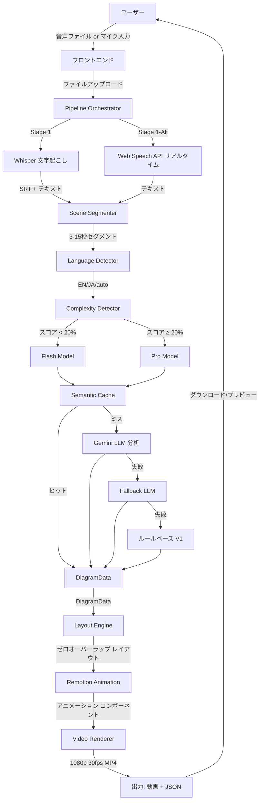
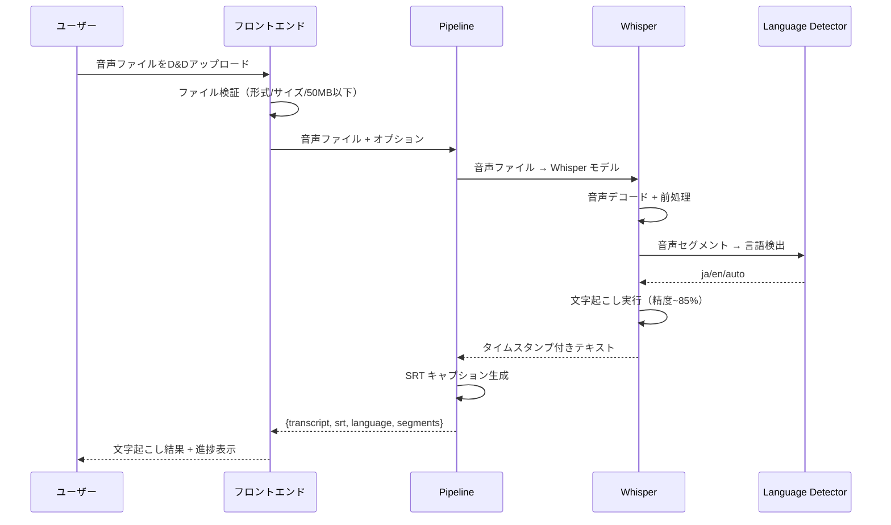
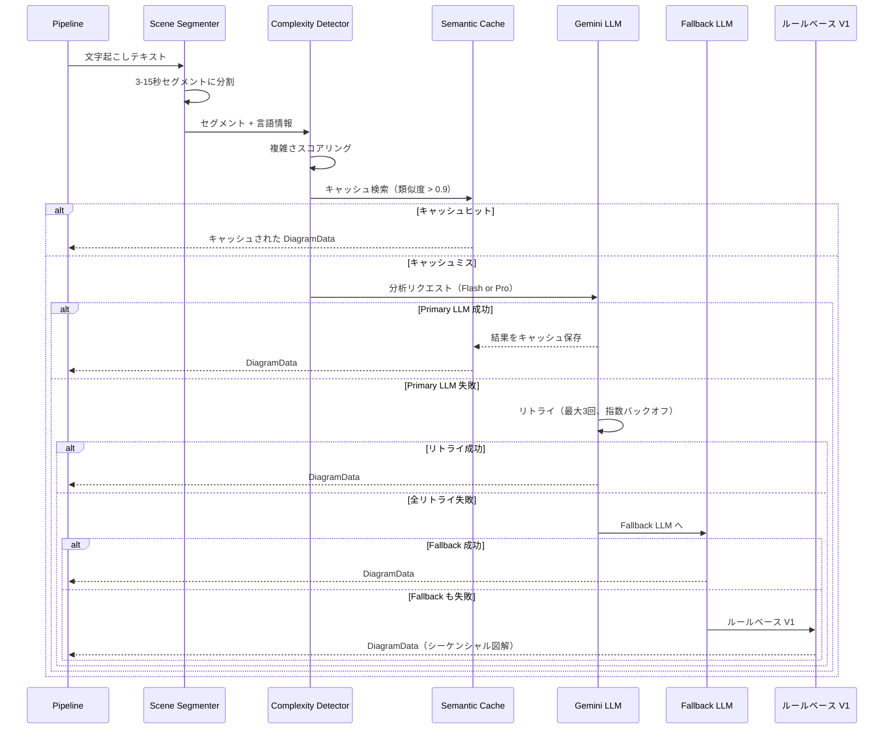
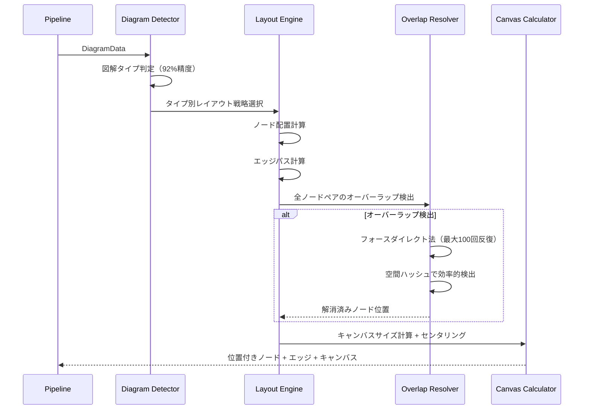
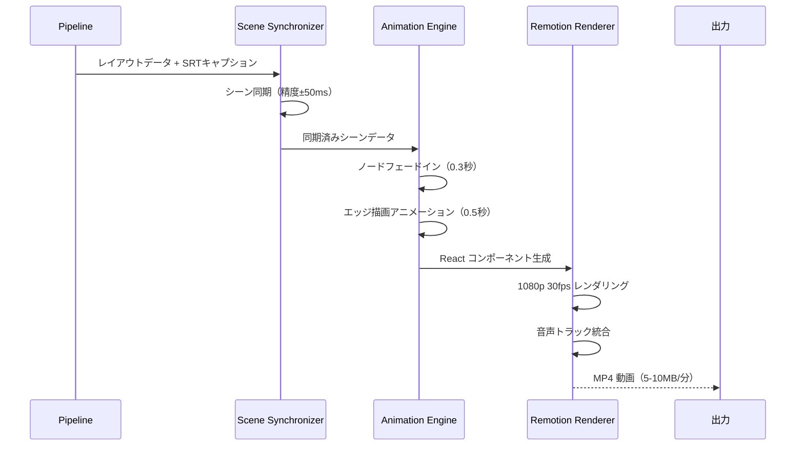
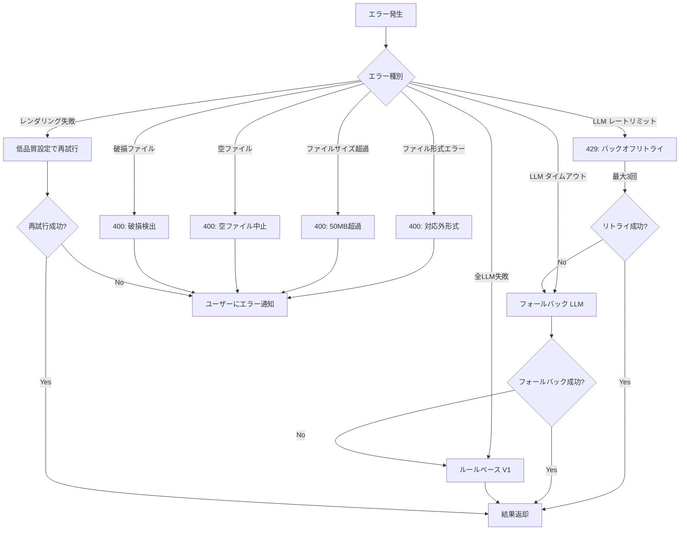
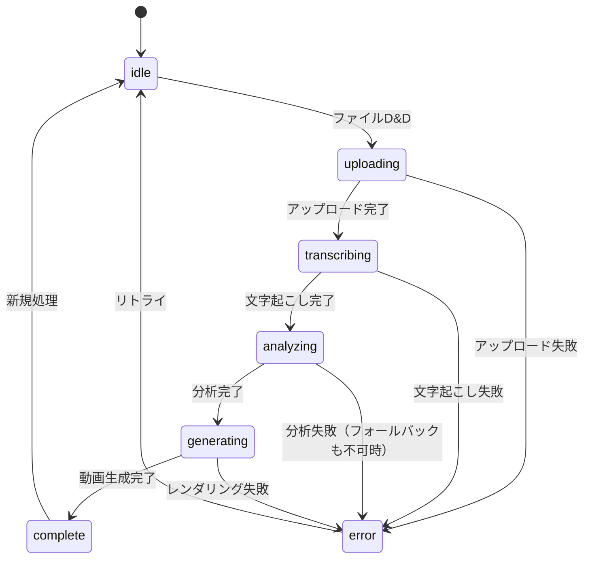

# speech-to-visuals データフロー図

**作成日**: 2026-04-27
**関連アーキテクチャ**: [architecture.md](architecture.md)
**関連要件定義**: [requirements.md](../../spec/speech-to-visuals/requirements.md)

**【信頼性レベル凡例】**:

- 🔵 **青信号**: 要件定義書・既存設計文書・既存実装を参考にした確実なフロー
- 🟡 **黄信号**: 要件定義書・既存設計文書・既存実装から妥当な推測によるフロー
- 🔴 **赤信号**: 参照資料にない自動推定によるフロー

---

## システム全体のデータフロー 🔵

**信頼性**: 🔵 *PIPELINE_FLOW.md・SYSTEM_CORE.md §3・要件定義書より*

## 主要機能のデータフロー

### 機能1: 音声ファイル文字起こし 🔵

**信頼性**: 🔵 *PIPELINE_FLOW.md Stage 1・ユーザーストーリー1.1・受け入れ基準TC-001より*

**関連要件**: REQ-001, REQ-003, REQ-004

**詳細ステップ**:

1. ユーザーが MP3/WAV/OGG/M4A（最大50MB）をドラッグ＆ドロップ
2. フロントエンドでファイル形式・サイズを検証
3. Whisper モデル（base/small/medium）で自動言語検出付き文字起こし
4. タイムスタンプ精度 ±50ms でセグメント分割
5. SRT キャプションファイルとプレーンテキストを出力
6. 処理進捗をリアルタイムで UI に表示

### 機能2: LLM 内容分析とフォールバック 🔵

**信頼性**: 🔵 *PIPELINE_FLOW.md Stage 2・SYSTEM_CORE.md §4.1-4.2・ユーザーストーリー2.1-2.2より*

**関連要件**: REQ-005, REQ-006, REQ-007, REQ-008, REQ-009, REQ-010

**詳細ステップ**:

1. 文字起こしテキストを意味単位（3-15秒）のセグメントに分割
2. 言語検出（EN/JA）→ 複雑さスコアリング
3. セマンティックキャッシュ検索（類似度閾値0.9）
4. キャッシュミス時: Flash/Pro 自動選択で LLM 分析
5. エンティティ抽出・関係性抽出・図解タイプ検出（flow/tree/timeline/matrix/cycle）
6. 失敗時は3層フォールバックで必ず結果を生成

### 機能3: ゼロオーバーラップレイアウト生成 🔵

**信頼性**: 🔵 *SYSTEM_CORE.md §4.3・ZERO_OVERLAP_DESIGN.md・ユーザーストーリー3.1より*

**関連要件**: NFR-302

**図解タイプ別レイアウト戦略**:

| タイプ | 主戦略 | フォールバック | 特記事項 |
|--------|--------|---------------|---------|
| flow | Progress Force | Grid-Snap | フロー方向を強調 |
| tree | 階層レイアウト | Grid-Snap | 親子関係を維持 |
| timeline | Force（X制約） | Grid-Snap | Y軸固定で時系列 |
| matrix | Grid-Snap | N/A | 厳格グリッド配置 |
| cycle | 円形レイアウト | Force | 円形構造を維持 |

### 機能4: アニメーション動画生成 🔵

**信頼性**: 🔵 *PIPELINE_FLOW.md Stage 4-5・ユーザーストーリー3.2より*

**関連要件**: REQ-301

## データ処理パターン

### 同期処理 🔵

**信頼性**: 🔵 *PIPELINE_FLOW.md・src/pipeline/ より*

- 文字起こし → シーン分割 → 言語検出: パイプライン内の直列処理
- レイアウト計算 → オーバーラップ解消: 同期的な反復処理
- 各ステージの完了を待って次ステージに進む品質ゲート方式

### 非同期処理 🔵

**信頼性**: 🔵 *PIPELINE_FLOW.md §4.2・src/analysis/llm-service.ts より*

- LLM API 呼び出し: 非同期 + タイムアウト管理
- キャッシュ検索: 非同期 I/O
- バッチジョブ: 非同期キューイング（最大3並列）

### バッチ処理 🔵

**信頼性**: 🔵 *src/api/batch-processing-api.ts・README.md より*

- 複数音声ファイルの一括処理（最大3並列）
- ジョブID ベースの進捗追跡（進捗率・ETA・品質スコア）
- ジョブキャンセル機能

## エラーハンドリングフロー 🔵

**信頼性**: 🔵 *PIPELINE_FLOW.md §7・SYSTEM_CORE.md §4.2・src/quality/ より*

## 状態管理フロー

### フロントエンド状態管理 🔵

**信頼性**: 🔵 *note.md・src/components/SimplePipelineInterface.tsx より*

### パイプライン内部状態 🔵

**信頼性**: 🔵 *PIPELINE_FLOW.md §6・src/pipeline/quality-monitor.ts より*

各ステージの品質ゲート管理:
- Stage 1: 音声長 ≥ 1秒、文字起こし精度チェック
- Stage 2: エンティティ/関係性抽出の完全性チェック
- Stage 3: オーバーラップ数 = 0 の保証
- Stage 4-5: キャプション同期精度 ±50ms

## データ整合性の保証 🔵

**信頼性**: 🔵 *PIPELINE_FLOW.md §7・supabase/migrations/・SYSTEM_CORE.md §4.3 より*

- **トランザクション管理**: Supabase（PostgreSQL）の標準トランザクション
- **データ整合性**: RLS によるアクセス制御 + 外部キー制約
- **キャッシュ整合性**: TTL 120分による自動失効 + 類似度ベースの整合判定
- **レイアウト整合性**: オーバーラップ検出 → フォースダイレクト解消 → 最終確認の3段階保証

## 関連文書

- **アーキテクチャ**: [architecture.md](architecture.md)
- **型定義**: [interfaces.ts](interfaces.ts)
- **DBスキーマ**: [database-schema.sql](database-schema.sql)
- **API仕様**: [api-endpoints.md](api-endpoints.md)
- **旧パイプライン仕様（統合元）**: [../../architecture/PIPELINE_FLOW.md](../../architecture/PIPELINE_FLOW.md)

## 信頼性レベルサマリー

- 🔵 青信号: 16件 (94%)
- 🟡 黄信号: 1件 (6%)
- 🔴 赤信号: 0件 (0%)

**品質評価**: 高品質 - パイプラインフローが詳細に文書化された既存設計に基づいている
