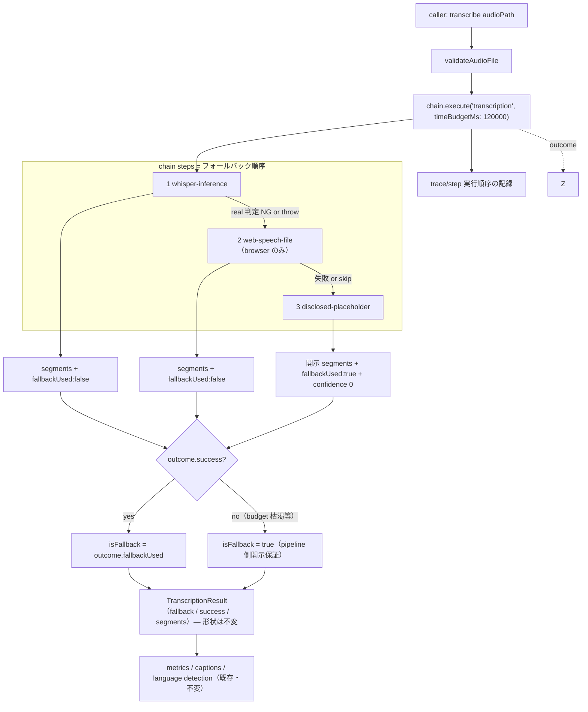
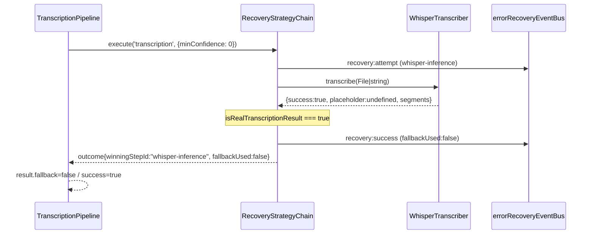
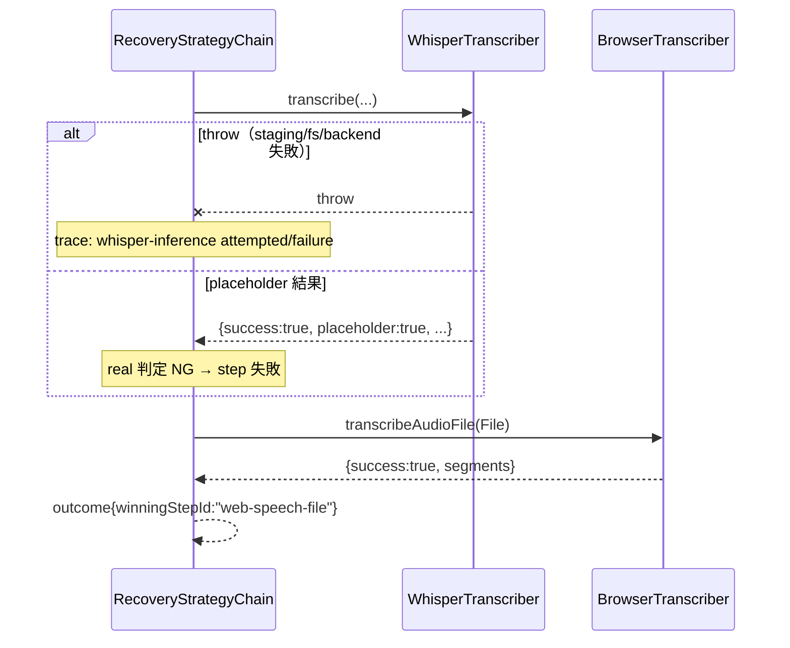
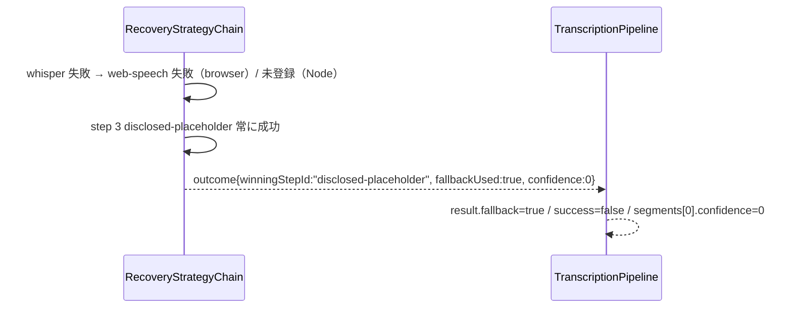
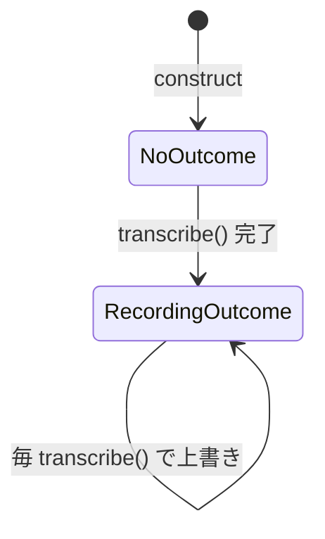

# asr-fallback-recovery-order データフロー設計


<!-- spine:anchor:begin -->
> **Spine anchor**: [speech-to-visuals アーキテクチャ設計](../speech-to-visuals/architecture.md)
>
> - parent: `speech-to-visuals/architecture.md`
> - role: `detailed`
> - status: `canonical_child`
<!-- spine:anchor:end -->

**作成日**: 2026-09-07（kairo-design・D-5 [fix/A]）
**関連アーキテクチャ**: [architecture.md](architecture.md)
**要件出典**: development_direction D-5（`.audit/development_direction.yml`）

**【信頼性レベル凡例】**:

- 🔵 **青信号**: 要件定義書・既存設計文書・既存実装を参考にした確実なフロー
- 🟡 **黄信号**: 要件定義書・既存設計文書・既存実装から妥当な推測によるフロー
- 🔴 **赤信号**: 参照資料にない自動推定によるフロー

---

## システム全体のデータフロー 🔵

**信頼性**: 🔵 *transcriber.ts transcribe()（:76-117）・recovery-strategy-chain.ts execute()（:222-370）の現行実装より*



## 主要機能のデータフロー

### 機能1: whisper 実推論成功（browser・Node 共通）🔵

**信頼性**: 🔵 *transcriber.ts:135-148 の現行 Priority 1 判定と chain step model の対応より*

**関連**: D-5 acceptance・types.ts placeholder 契約



**詳細ステップ**:

1. step 1 は `blob:` 入力を `blobUrlToFile()` で File 化してから whisper へ渡す（現行 transcriber.ts:128-133 と同一）。
2. real 判定（`success === true && segments.length > 0 && placeholder !== true`・export 述語で単一ソース）を満たせば step confidence = `meanSegmentConfidence(segments)`（undefined は 0 寄与）で勝利。`minConfidence = 0` のため confidence 値は勝敗に影響しない（順序権威）。
3. 下位 step（web-speech・placeholder）は**実行されない**（既存「whisper real なら browser engine を呼ばない」pin と同一挙動）。

### 機能2: whisper 失敗（throw / placeholder）→ Web Speech 復旧（browser）🔵

**信頼性**: 🔵 *transcriber.ts:150-158 の現行 Priority 2・recovery-strategy-chain.ts:336-352（step throw の catch）より*

**関連**: D-5 acceptance「推論失敗を注入したテストでフォールバック順序が守られ」



**備考**: throw と placeholder 結果の両方が「step 失敗」に正規化される点が現行実装（catch leg と判定 leg が分離）との内部的差分だが、外部から観測される結果（次 engine への移行）は同一。

### 機能3: 全 engine 失敗 → 開示 placeholder（terminal step）🔵

**信頼性**: 🔵 *transcriber.ts:160-162・188-197 の現行 Priority 3・getFallbackSegments（confidence 0）より*

**関連**: D-5 acceptance「最終placeholderは confidence 0 で開示される」



**詳細ステップ**:

1. step 3 は engine を呼ばず `getFallbackSegments()` を返すため失敗しない（budget 内であれば必ず実行される）。
2. budget 枯渇で chain が `success: false` に終わった場合も `runWhisperTranscription()` は同じく `getFallbackSegments()` を返す（開示の最終保証 — architecture SD4）。この場合 trace の末尾に `skipReason: 'budget_exhausted'` が残り、事後診断可能。

## データ処理パターン

### 同期処理 🔵

**信頼性**: 🔵 *現行 transcribe() が単一 Promise chain であることより*

`transcribe()` は引き続き単一 await で完了する同期契約。chain 実行・trace 収集はすべてこの Promise 内で完結し、新規の非同期 channel を追加しない。

### 非同期処理（event）🔵

**信頼性**: 🔵 *recovery-strategy-chain.ts:277-283・468-503 の既存 event emit より*

step ごとに `recovery:attempt`（実行前）・`recovery:success` / `recovery:failure`（実行後）が `errorRecoveryEventBus` へ emit される。event は fire-and-forget で `transcribe()` の完了を block しない。

## エラーハンドリングフロー 🔵

**信頼性**: 🔵 *recovery-strategy-chain.ts の skip・throw・budget 処理（:240-352）と pipeline 側開示保証の設計より*

```mermaid
flowchart TD
    A[step 実行] --> B{失敗形態}
    B -->|throw| C[trace: attempted/failure → 次 step]
    B -->|結果が real 判定 NG| C
    B -->|optional step + budget 残り <500ms| D["trace: skipReason='budget_exhausted'（実行せず）"]
    B -->|成功| E{confidence >= minConfidence (0)}
    E -->|yes| F[勝利・chain 終了]
    E -->|no は実質不可（0固定）| C
    C & D --> G{残 step あり?}
    G -->|yes| A
    G -->|no| H[outcome.success=false]
    F --> I[TranscriptionResult 組立]
    H --> J["pipeline 側開示保証: getFallbackSegments() を返す"]
    J --> I
```

## 状態管理フロー 🟡

**信頼性**: 🟡 *getRecoveryOutcome() を新設する本設計の判断（既存実装に直説する状態は無い）*



`getRecoveryOutcome(): ChainOutcome | null` は直近 1 件のみ保持（accumulation しない）。累積 stats は chain 内部の `getStats()` が既に持つため二重持しが冗長。AX-3（品質集計）はこの getter から `fallbackUsed` / `winningStepId` を読む。

## データ整合性の保証 🔵

**信頼性**: 🔵 *既存 4 leg priority test が pin する外部契約より*

- **外部契約の整合**: `TranscriptionResult` の各 field の意味は変更しない。`fallback` は「開示 placeholder 由来」、`success` は「実文字起こし」を引き続き表す。
- **trace と結果の整合**: `outcome.fallbackUsed === true` ⟺ `result.fallback === true`、`outcome.winningStepId === 'disclosed-placeholder'` ⟺ `result.success === false`（segments 非空時）を step 組立で保証する。

## 関連文書

- **アーキテクチャ**: [architecture.md](architecture.md)
- **分析記録**: [design-interview.md](design-interview.md)

## 信頼性レベルサマリー

- 🔵 青信号: 9件 (90%)
- 🟡 黄信号: 1件 (10%)
- 🔴 赤信号: 0件 (0%)

**品質評価**: 高品質（全フローが現行実装の観測可能挙動か既存 chain 機能への写像であり、新規推定は状態管理の設計判断 1 点のみ）
