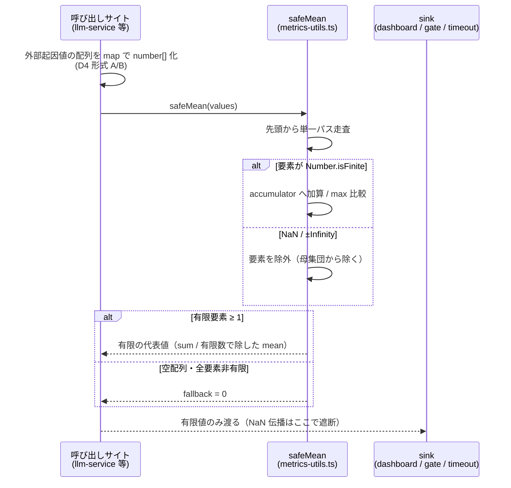
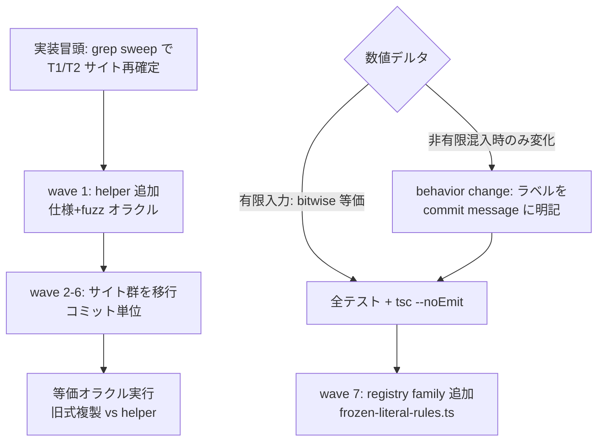
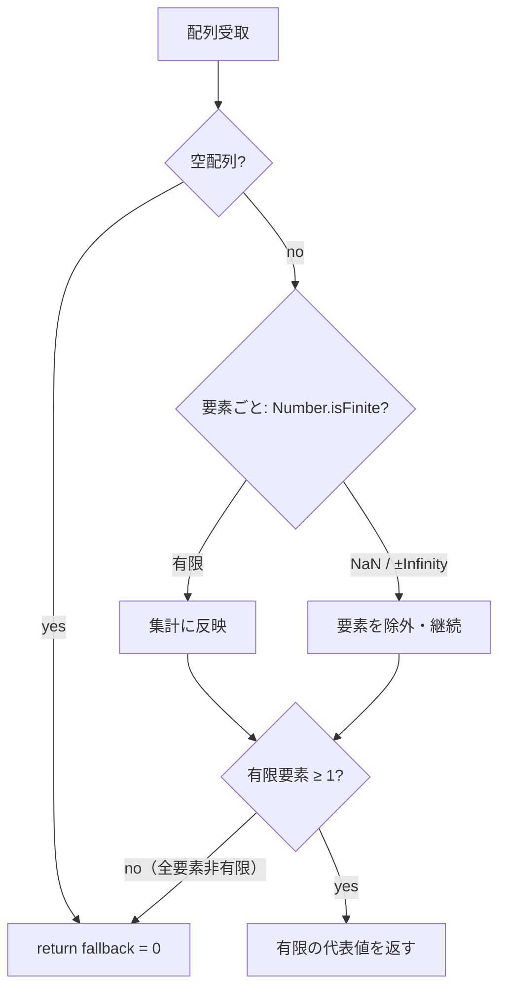

# finite-safe-aggregation データフロー図

**作成日**: 2026-08-15
**関連アーキテクチャ**: [architecture.md](architecture.md)
**関連要件定義**: [requirements.md](requirements.md)

**【信頼性レベル凡例】**:

- 🔵 **青信号**: 要件定義書・既存実装を参考にした確実なフロー
- 🟡 **黄信号**: 要件定義書・既存実装から妥当な推測によるフロー
- 🔴 **赤信号**: 参照資料にない自動推定によるフロー

---

## システム全体のデータフロー（移行後）🔵

**信頼性**: 🔵 *requirements.md 概要・llm-service.ts:724-732 の sink 実調査より*

```mermaid
flowchart TD
    EXT[外部起因値の供給源<br/>LLM 応答時間 / testResults score /<br/>segment 信頼度・duration / hit 数]
    ARR[モジュール内の数値配列<br/>responseTimeHistory 等]
    SAFE[metrics-utils.ts<br/>safeSum / safeMean / safeMax / safeMin<br/>非有限要素を除外・空なら 0]
    SINK1[dashboard / metrics 表示]
    SINK2[品質 gate 判定<br/>TEST_QUALITY_THRESHOLD 比較]
    SINK3[adaptive timeout<br/>応答時間平均からの係数]

    EXT --> ARR
    ARR -->|旧: reduce((a,b)=>a+b,0)<br/>NaN が代表値ごと伝播| BROKEN[NaN 化した代表値]
    ARR -->|移行後: helper 委譲| SAFE
    SAFE -->|有限値のみ| SINK1
    SAFE --> SINK2
    SAFE --> SINK3
    BROKEN -.->|遮断対象| SINK1
    BROKEN -.->|遮断対象| SINK3
```

移行前は全モジュールが各自の inline `reduce` / `Math.max(...spread)` で代表値を
算出しており、要素 1 個の NaN が代表値ごと NaN 化して各 sink へ漏れていた。
移行後は集計演算の入口が `metrics-utils.ts` の helper 1 点に集約される。

## 主要機能のデータフロー

### 機能1: helper による代表値算出 🔵

**信頼性**: 🔵 *REQ-001/002/101・streaming-quality-monitor.ts:210-211 の正規形より*

**関連要件**: REQ-001, REQ-002, REQ-101



**詳細ステップ**:

1. 呼び出しサイトは selector 内包の旧 `reduce((sum, x) => sum + f(x), 0)` を
   `safeSum(arr.map(f))` へ機械置換（architecture.md D4）
2. helper は加算順を旧実装と同じ先頭順に保つため、有限入力では
   bitwise 等価（D3）
3. 非有限要素は例外を投げず除外し、代表値は常に有限

### 機能2: 移行ウェーブと検証フロー 🔵

**信頼性**: 🔵 *architecture.md D5/D6 のウェーブ構成より*

**関連要件**: REQ-003, REQ-004, REQ-005, REQ-102



**備考**: sweep 再確定は要件一次リストの行ずれ対策（interview-record 残課題）。

## エラーハンドリングフロー 🔵

**信頼性**: 🔵 *REQ-002/101（throw しない fail-safe 設計）より*



例外送出は設計上ゼロ。欠損観測は「サンプル落ち」として扱い、
エラーログにも出力しない（大量観測での log flood を避ける。
欠損の検知は既存 ingestion chokepoint・monitoring の責務）。

## データ整合性の保証 🟡

**信頼性**: 🟡 *既存 freeze-guard キャンペーンの適用パターンからの推測*

- **単一ソース保証**: helper の数値仕様は `metrics-utils.ts` 1 点。
  新規 inline 集計の追加は registry family（architecture.md D7）が catch
- **等価性保証**: 数値デルタ + fuzz オラクルがコミットごとに
  「旧式との bitwise 等価（有限入力）」を pin
- **不変量**: helper の戻り値が非有限になる組み合わせは存在しない
  （仕様テストの 5 系 × 4 関数で全数確認）

## 関連文書

- **アーキテクチャ**: [architecture.md](architecture.md)
- **設計自動分析記録**: [design-interview.md](design-interview.md)
- **要件定義**: [requirements.md](requirements.md)

## 信頼性レベルサマリー

- 🔵 青信号: 5 件 (83%)
- 🟡 黄信号: 1 件 (17%)（データ整合性の registry 実効性）
- 🔴 赤信号: 0 件 (0%)

**品質評価**: 高品質
