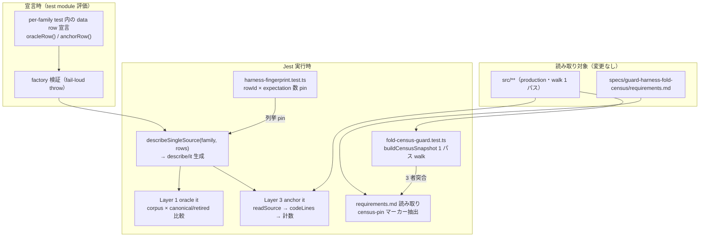
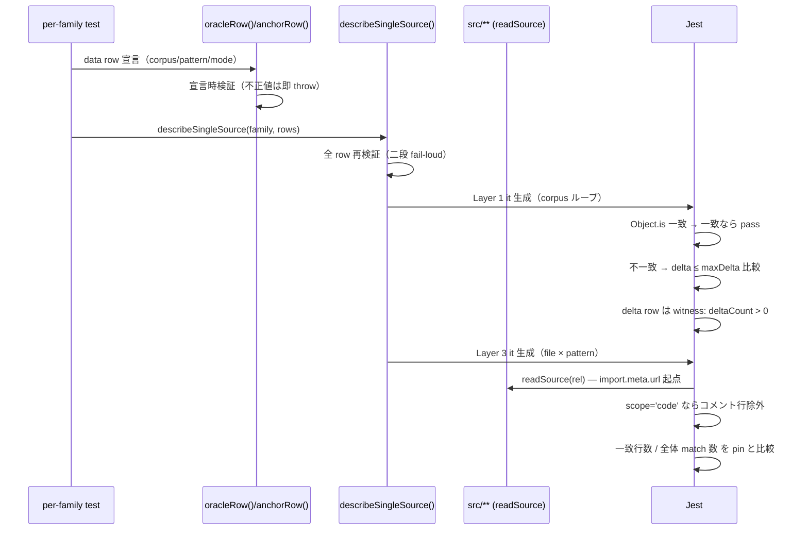
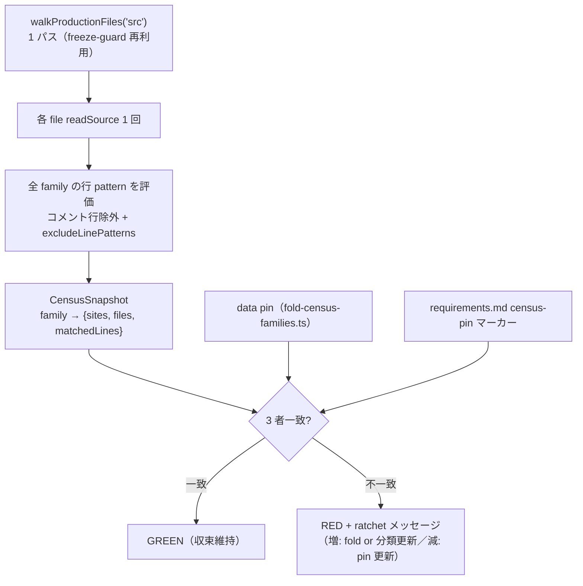

# table-driven ガードハーネス抽出と fold 収束 census データフロー設計


<!-- spine:anchor:begin -->
> **Spine anchor**: [Speech-to-Visuals システム憲法 V2.8](../../SYSTEM_CONSTITUTION.md)
>
> - parent: `SYSTEM_CONSTITUTION.md`
> - role: `feature_root`
> - status: `canonical_child`
<!-- spine:anchor:end -->

**作成日**: 2026-08-18
**関連アーキテクチャ**: [architecture.md](architecture.md)
**関連要件定義**: [requirements.md](requirements.md)
**型定義**: [interfaces.ts](interfaces.ts)

**【信頼性レベル凡例】**:

- 🔵 **青信号**: 要件定義書・既存実装・実測値を参考にした確実なフロー
- 🟡 **黄信号**: 要件定義書・既存実装から妥当な推測によるフロー
- 🔴 **赤信号**: 参照資料にない自動推定によるフロー

---

## システム全体のデータフロー 🔵

**信頼性**: 🔵 *freeze-guard.ts / frozen-literal-rules.ts / grid-packing-single-source.test.ts の実依存関係と REQ-001〜005 より*

本 feature は実行時データを持たない test-infra であり、「データフロー」=
**Jest 実行時に test コード・production ソース・要件文書がどう読まれ検証されるか**。



## 主要フロー

### フロー 1: harness による test 生成（REQ-001〜003）🔵

**信頼性**: 🔵 *round 50 grid-packing test の Layer 1/3 実構造をそのまま data row 化する設計（D1〜D6）より*



**詳細ステップ**:

1. per-family test が retired 式（verbatim）と corpus をファイル内に定義し、
   `oracleRow({ id, canonical, retired, corpus, mode })` /
   `anchorRow({ kind, file, pattern, exactly, scope })` を宣言する。
2. factory が不正 row を即時 throw（exactly<0・空 corpus・`\n` 入り
   pattern など — EDGE-001）。
3. `describeSingleSource` が row を describe/it に展開。Layer 1 は
   corpus case ごとに `Object.is` → 不一致時 delta 比較の 2 段、delta row
   はループ後に witness（EDGE-101）。Layer 3 は file × pattern ごとに
   行計数（REQ-402）。
4. 生成 it の test 名は `${family} ${layer}:${rowId}` 形式で一意化。

### フロー 2: fingerprint 等価証明（REQ-004）🔵

**信頼性**: 🔵 *round 35 fingerprint（before/after 列挙 diff + RED probe）の手法を移行 2 family に適用する設計より*

```text
移行前（現 test）                          移行後（harness row）
─────────────────────────                  ─────────────────────────
it.each(NODE_CORPUS) 249 case × 4 expect   oracleRow 1 行 × corpus 249
  → expectation 996 個                        → expectation 996 個（解析的同一）
grid-packing Layer1 6 it + Layer3 12 it    oracle 6 row + anchor 12 row
  → expectation 数の列挙                      → 同一列挙（harness-fingerprint pin）
```

- `countExpectations(row)` は純関数: object-is row = corpus 長 /
  delta row = corpus 長 + 1 / anchor row = 1。
- `harness-fingerprint.test.ts` が `family:rowId:expectations` の列挙を
  文字列 pin。row 削除・corpus 縮小・mode 変更はすべて列挙変化 = RED。
- it.each → ループ折りたたみによる **test 名列挙の変化のみ**が許容差分
  （理由記載必須 — TC-004-01）。

### フロー 3: census snapshot と ratchet（REQ-005 / 103 / 201〜202 / 404）🔵

**信頼性**: 🔵 *REQ-404（同一コマンド由来）・D7/D8/D9 設計より*



**詳細ステップ**:

1. `buildCensusSnapshot(families)` が src/ を 1 パス walk（ファイル read
   は 1 回、全 family pattern をループ評価 — NFR-001）。
2. 各 family: `sites` = コード行一致数、`files` = 一致ファイル数。
   正典モジュール（例: C1 の `src/utils/guards.ts`）は exclude で理由付き
   除外。
3. snapshot と data pin を `toEqual` 比較 — **増加・減少どちらも RED**
   （ratchet 両方向・EDGE-102 は family 行残置で担保）。
4. snapshot と requirements.md の `<!-- census-pin:... -->` マーカー値を
   突合 — doc だけ更新した逆方向乖離も RED（D9）。
5. `FOLD_SERIES_STATUS.valueNeutralCandidates` が `[]` であることを pin —
   REQ-201 の収束宣言を test が表明。

### フロー 4: CI 検証証拠（REQ-104 / 405）🔵

**信頼性**: 🔵 *interview-record A3 の実採取手順（gh run view / API・run URL + SHA）より*

```text
実装 commit → push → Actions run → green 確認
  → interview-record.md A3 へ追記: run URL + 対象 commit SHA + job 一覧
  →（Phase 3）infrastructure.yml:37 node 18→24 変更 → 再採取
```

guard 機構は持たない（記録運用）。正本は interview-record A3 のみ。

## データ処理パターン

### 同期処理（全 guard）🔵

**信頼性**: 🔵 *既存 freeze-guard / registry test がすべて同期 readFileSync ベースであることより*

Jest 実行内で完結する同期 `readFileSync` のみ。非同期 I/O・ネットワーク・
タイマーは一切使用しない（flaky test 根絶の既存方針を踏襲）。

### バッチ処理（census 1 パス walk）🔵

**信頼性**: 🔵 *D7 設計（家族別 walk 不採用）より*

全 family × 全 src file の評価を単一 walk に束ね、ファイル read を
最小化。registry sweep（rule 47 本 = 2.0s 実績）と同規模のため NFR-001
（≤10 秒）は十分裕福。

## エラーハンドリングフロー 🔵

**信頼性**: 🔵 *EDGE-001・fail-loud defaults 原則（既存プロジェクト規約）より*

```text
不正 data row ──────────────→ factory throw（suite fail・静黙 skip 不可能）
delta witness 0 件 ─────────→ RED（vacuous bound 禁止・EDGE-101）
snapshot ≠ pin ─────────────→ RED + 更新手順メッセージ
doc マーカー ≠ 実測 ────────→ RED（REQ-404 違反の機械検出）
readSource 対象欠落 ───────→ throw（cwd 依存なし・import.meta.url 起点）
```

エラーは「黙って通す」経路を一切持たない。fail value = RED。

## 状態管理フロー 🔵

**信頼性**: 🔵 *guard test はすべてモジュール読み込み時に data が確定する既存構造より*

状態を持つのは git 上の 3 不変点のみ:

1. **data row / pin**（test ソース内 — 変更は PR review 対象）
2. **production src/**（census の観測対象・REQ-401 で本 feature は触れない）
3. **requirements.md マーカー**（doc 側 pin）

実行時可変状態なし。CI 実行ごとに 3 者が再突合される。

## データ整合性の保証 🔵

**信頼性**: 🔵 *REQ-404・D9 設計より*

- **単一計測 engine**: sites/files 数値は `buildCensusSnapshot()` の 1 実装
  のみから生成（複数の数え方の併存を構造的に排除）。
- **3 点突合**: engine 実測 = data pin = doc マーカー。どれか 1 つでも
  古いと RED。
- **fingerprint**: 生成 test の期待数も data row から解析的に導出され、
  列挙 pin が drift を検出。

## 関連文書

- **アーキテクチャ**: [architecture.md](architecture.md)
- **型定義**: [interfaces.ts](interfaces.ts)
- **設計分析記録**: [design-interview.md](design-interview.md)
- **要件定義**: [requirements.md](requirements.md)
- **受け入れ基準**: [acceptance-criteria.md](acceptance-criteria.md)

## 信頼性レベルサマリー

- 🔵 青信号: 11 件 (92%)
- 🟡 黄信号: 0 件 (0%)
- 🔴 赤信号: 0 件 (0%)
  （🟡🔴 項目は architecture.md 側に集約。本書は既存実装の読み取り経路の
  正確な記述のため高信頼）

**品質評価**: 高品質 — 全フローが既存 freeze-guard の実構造に対応し、
新規機構（doc-pin 突合）も同期 I/O のみの決定論的処理。
