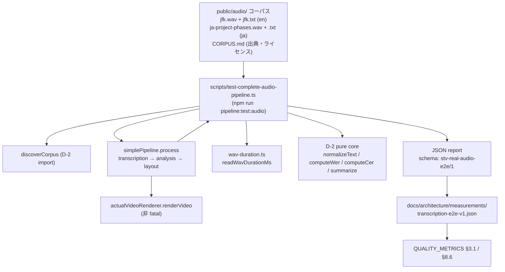

# real-audio-e2e-regression アーキテクチャ設計


<!-- spine:anchor:begin -->
> **Spine anchor**: [speech-to-visuals アーキテクチャ設計](../speech-to-visuals/architecture.md)
>
> - parent: `speech-to-visuals/architecture.md`
> - role: `system`
> - status: `canonical_child`
<!-- spine:anchor:end -->

**作成日**: 2026-09-03
**関連要件定義**: [speech-to-visuals 要件定義書](../speech-to-visuals/requirements.md) REQ-422 / REQ-423（Phase 194・提案ベース `- [ ]`）
**関連受け入れ基準**: [speech-to-visuals 受け入れ基準](../speech-to-visuals/acceptance-criteria.md) TC-406-01〜03 / TC-407-01〜02（未実施）
**分析記録**: [design-interview.md](design-interview.md)

**【信頼性レベル凡例】**:

- 🔵 **青信号**: 要件定義書・既存設計文書・既存実装を参考にした確実な設計
- 🟡 **黄信号**: 要件定義書・既存設計文書・既存実装から妥当な推測による設計
- 🔴 **赤信号**: 参照資料にない自動推定による設計

---

## システム概要 🔵

**信頼性**: 🔵 *requirements.md REQ-422/REQ-423（Phase 194）・README「音声認識の現状」より*

コアパイプライン入力段の実測基盤を完成させる。D-1（gated real whisper.cpp 推論・e5853217）と D-2（WER/CER harness・`scripts/measure-transcription-accuracy.ts`）は merge 済みだが、**実測に必要な2つの部品が依然未実装**である:

1. **D-4（REQ-422）**: `npm run pipeline:test:audio`（`scripts/test-complete-audio-pipeline.ts`）は現状 (a) 入力が hardcoded `public/jfk.wav` (b) 出力が console の timing breakdown のみで JSON report 無し (c) WER・RTF・音声長を一切測定しない (d) exit code が `qualityScore >= 70` という placeholder-friendly な heuristic で gate されている — つまり実推論が走らなくても green になり得る。これを実音声コーパス駆動の測定経路（WER / RTF / 総処理時間 / stage 別 timing / 出典を含む JSON report + fail-loud）に実質化する。
2. **D-5（REQ-423）**: `public/audio/`（D-2 harness `--corpus` の既定入力先）には音声ファイルが1つも無い（`sample-info.json` が存在しない wav を説明するのみ）。ja/en 実音声 + 参照文字起こしを出典・ライセンス開示付きで整備し、QUALITY_METRICS §3.1 Transcription Accuracy を実測値で初めて埋める。

両者は単一の実装単位として結合する（D-4 の測定対象が D-5 のコーパスであり、逆に D-5 の存在意義は D-4 による測定である）。

## アーキテクチャパターン 🔵

**信頼性**: 🔵 *D-2 harness（scripts/measure-transcription-accuracy.ts）・D-3 harness（scripts/measure-diagram-detection-accuracy.ts）の確立済みパターンより*

- **パターン**: script に pure core を持たせる測定 harness 形式（D-2/D-3 と同一）。pure core（metric 計算・corpus 発見・report 組立・argv 解析・音声長導出）は timestamp も I/O も持たず決定論的、CLI 層のみが `generatedAt` と file I/O を付与する。測定契約は **fail-loud**（測定でない run は green を出さない — D-2 の all-placeholder exit 1・D-3 の `summarizeDetection([])` throw と同一契約）。
- **選択理由**: CI 上に whisper.cpp binary / ggml model が存在しないため実推論 run は CI 外でしか行えない。よって CI test は構造（schema・fail-loud・単一ソース委譲・音声長 formula）を pin し、実測数値は測定 artifact と QUALITY_METRICS 記録で担保する（D-3 が決定論 offline 測定で exact baseline pin を取れたのに対する必要な分岐 — 詳細は design-interview A9）。

## コンポーネント構成

### 評価コーパス `public/audio/`（D-5）🔵

**信頼性**: 🔵 *D-2 harness の corpus 規約（`discoverCorpus`・`AUDIO_EXTENSIONS`）・REQ-423 より*

- **ファイル形式**: 既存 corpus 規約をそのまま使う — `<name>.<audio-ext>`（wav/mp3/ogg/m4a）に `<name>.txt`（UTF-8 参照文字起こし）を同伴。新形式を発明しない。
- **音声の技術要件**: **WAV PCM 16kHz mono** を corpus に限定する。`stageAudioForWhisper`（src/transcription/whisper-transcriber.ts:290）は resampling 無しで生 bytes を whisper.cpp へ渡すため、decode 不可能な形式は推論失敗に直結する。16kHz mono WAV は whisper.cpp が native に decode する唯一の安全な形式である。
- **v1 構成ファイル**:

| file | 言語 | 由来 | ライセンス |
|------|------|------|-----------|
| `public/audio/jfk.wav` | en | `public/jfk.wav`（352,078 byte・Phase 29 実績）の copy | Public Domain（1961年米大統領就任演説・米連邦政府の著作物。CORPUS.md に出典と根拠を記載）🟡 |
| `public/audio/jfk.txt` | en | 就任演説本文からの**human-entered** 参照文字起こし（`public/srt/jfk.srt` は過去 ASR 由来の可能性があって循環するため参照には使わない） | 同上 |
| `public/audio/ja-project-phases.wav` | ja | maintainer による読み上げ録音（原稿 = 現 `public/audio/test-audio.txt` の「プロジェクト管理」スクリプト） | 録音者（maintainer）が著作権者。CORPUS.md に CC0 1.0 としての提供宣言を記載 🟡 |
| `public/audio/ja-project-phases.txt` | ja | 録音原稿そのもの（読み上げ原稿 = 参照文字起こし。転写推定を介さない） | 同上 |
| `public/audio/CORPUS.md` | — | corpus manifest: 各 file の言語・出典 URL・ライセンス・参照文字起こしの由来（human-entered / 原稿）・録音条件（16kHz mono への変換手順） | — |

- **`sample-info.json` / `test-audio.txt` の扱い**: `sample-info.json` は存在しない wav を説明する phantom metadata であるため削除する。`test-audio.txt` は ja 録音の原稿として `ja-project-phases.txt` へ移行する（内容は verbatim）。両者への code 参照は無い（grep 実測: `docs/llm-wiki/**` の生成 inventory のみ）。
- **拡張パス（v1 では blocking にしない）**: en 追加は LibriSpeech（CC BY 4.0・attribution 必須）、ja/en 追加は Mozilla Common Voice（CC0）を候補とし、いずれも CORPUS.md 行として出典・ライセンスを開示してから追加する。🟡
- **規模**: 実音声 1 file あたり 60 秒以内・corpus 全体で 2MB 程度を上限目安とする（git 収容と測定時間の双方に対する実用上限）。🟡

### E2E 測定 script `scripts/test-complete-audio-pipeline.ts`（D-4）🔵

**信頼性**: 🔵 *現行実装（466 行・stage timing 保有）と REQ-422 要件の差分より*

`npm run pipeline:test:audio` の指す先は変えず、script 本体を測定経路に実質化する:

1. **corpus 駆動化**: hardcoded `public/jfk.wav` をやめ、D-2 harness から import した `discoverCorpus` で `public/audio/` の pair を走査する（corpus 発見の単一ソース化 — skip reason も既存の pinned 文言に一本化）。argv は D-2 と同型の `--corpus <dir>`（既定 `public/audio`）/ `--output <file>` のみを受容する。
2. **full pipeline 実行**: 各 corpus file について現行と同じ production 経路（`simplePipeline.process({ audioFile, options: { includeVideoGeneration: false, useEnhancedLayout: false, layoutQuality: 'enhanced' } })` + `actualVideoRenderer.renderVideo`・render 失敗は非 fatal のまま）を走らせる。既存の per-stage timing（`Stage.duration` / `totalDuration`）はそのまま report に入れる。
3. **WER/CER 測定**: hypothesis は pipeline 出力の `SimplePipelineResult.transcript`（下流に渡る製品出力そのもの）とし、D-2 pure core の `normalizeText` → `computeWer` / `computeCer` に委譲する。**第二の WER/CER 実装を作らない**（duplicate-formula class。TC-406-03）。ja は whitespace token WER が機能しないため **CER 主体**で評価し、report は両 metric を持つ（§3.1 記録時も en は WER・ja は CER を探す）。
4. **集計**: 測定行集計は D-2 `FileMeasurement` 行を構築して `summarize` に委譲する（micro-average・real/placeholder 計数の単一ソース化）。report の schema は accuracy harness とは別に `stv-real-audio-e2e/1` を新設する（timing・RTF は transcription accuracy の管轄外のため）。
5. **fail-loud への置換**: `qualityScore >= 70` heuristic による exit gate を廃止し、測定契約で gate する — (a) corpus に pair が 0 件 → exit 1 (b) 全 run が placeholder / fallback 経路（`inferenceRan` false）→ D-2 と同一の stderr メッセージ契約で exit 1（合成音・placeholder 経路の run は測定ではない）(c) 実測 run が 1 件以上あり report が出力された場合のみ exit 0。video render 失敗は非 fatal のまま report に記録する。

### 音声長導出 helper `src/transcription/wav-duration.ts`（新設）🔵

**信頼性**: 🔵 *whisper-transcriber.ts に音声長導出が存在しないこと（grep 実測: RTF/audio-duration helper は src/scripts/tests 全域で zero match）と WAV 規格より*

RTF の分母（音声長）は doc の記載に頼らず WAV header から決定論的に導出する:

- `readWavDurationMs(bytes: Uint8Array): number` — RIFF chunk walk（`fmt ` の `audioFormat`/`sampleRate`/`channels`/`bitsPerSample`/`byteRate` を読み、`data` chunk size を探す）し、`durationMs = dataSize / byteRate × 1000` を返す pure 関数（fs に触れないため test は合成 bytes で可能）。`audioFormat !== 1`（PCM 以外）・chunk 欠損・size 不整合は fail-loud（throw）。
- script 側の薄い fs wrapper が `readFileSync` した bytes を渡す。corpus が WAV 16kHz mono に限定されているため mp3/m4a 等の duration 推定は対象外（corpus 規約で弾く）。
- 交差検証 field として report に `transcriptEndMs`（最終 segment の end）を併記し、header 由来 duration との大幅乖離（silent tail など）を読み取れるようにする（警告であって失敗ではない）。🟡

### 測定値の記録先 🔵

**信頼性**: 🔵 *docs/architecture/QUALITY_METRICS.md §3.1/§8.2/§8.5 の現状と REQ-423 (c)(d) より*

- **§3.1 Transcription Accuracy**: コーパス整備 + 実測 run が完了するまで「未測定」を維持（TC-407-02 の guard 対象）。実測後は WER（en）/ CER（ja）・測定日・コマンド・artifact path を記載した実測値で埋める。
- **§3.1 Processing Speed**: 出典の無い現行値 `2.0x`（Time(process)/Time(audio)）を、本測定の `transcriptionRtf` 実測値で置換する（同一 run で得られる）。
- **§8.6（新設）**: transcription 測定器セクション（`npx tsx scripts/test-complete-audio-pipeline.ts` / `scripts/measure-transcription-accuracy.ts`・fail-loud 契約・§3.1 記録の前提）を D-3 の §8.5 と同型で追加する。
- **測定 artifact**: 実測 run の JSON report を `docs/architecture/measurements/transcription-e2e-v1.json` として commit し、§3.1 記載値の出典とする（CI 再現不能な測定は artifact が証跡 — 「測定証跡のない数値更新」禁止の開発方向要件を満たす唯一の形）。🟡

## システム構成図



**信頼性**: 🔵 *上記コンポーネント構成（既存実装 path はすべて実在）より*

## ディレクトリ構造（差分）🔵

**信頼性**: 🔵 *現行 tree と本設計の差分より*

```
public/audio/
├── CORPUS.md                     # 新設: corpus manifest（出典・ライセンス・録音条件）
├── jfk.wav                       # 新設: public/jfk.wav の copy (en)
├── jfk.txt                       # 新設: human-entered 参照文字起こし (en)
├── ja-project-phases.wav         # 新設: maintainer 録音 (ja, 16kHz mono)
├── ja-project-phases.txt         # 新設: 録音原稿 = 参照文字起こし (ja)
├── (sample-info.json             # 削除: 存在しない wav の phantom metadata)
└── (test-audio.txt               # 移行: ja-project-phases.txt へ verbatim 吸収)

src/transcription/
└── wav-duration.ts               # 新設: readWavDurationMs (pure, bytes → durationMs)

scripts/
└── test-complete-audio-pipeline.ts  # 実質化: corpus 駆動・JSON report・fail-loud gate

tests/scripts/
├── test-complete-audio-pipeline.test.ts  # 新設: 構造 pin（TC-406-01〜03）
└── real-audio-corpus.test.ts             # 新設: corpus 契約 pin（TC-407-01〜02）

docs/architecture/
├── QUALITY_METRICS.md            # §3.1 実測化 + §8.6 新設（実測 run 後）
└── measurements/
    └── transcription-e2e-v1.json # 新設: 実測 artifact
```

## 主要設計決定

### D1: WAV header 由来の音声長（RTF 分母の単一ソース）🔵

**信頼性**: 🔵 *docs 記載値と bytes 計算の不一致（LLM_INTEGRATION_REPORT.md は jfk.wav を「32 seconds」と記載するが 352,078 byte ÷ 32,000 byte/s ≒ 11.0 秒）の実在より*

音声長は header から導出する。doc 記載値は出典が不明で相互矛盾するため使わない。`duration` / `processingTime` は TranscriptionResult で既に ms であり（src/transcription/types.ts）、RTF = transcription 段処理時間 ÷ header 由来音声長（ms/ms・無次元）として定義する。

### D2: RTF と総処理時間の分離 🔵

**信頼性**: 🔵 *QUALITY_METRICS §3.1 Processing Speed 行（Time(process)/Time(audio)）が transcription stage の指標であることより*

report は `transcriptionRtf`（transcription 段の processingTime ÷ 音声長 — §3.1 Processing Speed の実測値になる）と `totalProcessingMs`（E2E 全 stage 合計）を別 field で持つ。REQ-422 の「RTF（処理時間 ÷ 音声長）」を総処理時間側に解釈すると分析・レイアウト・render 時間が混入し §3.1 の指標定義と衝突するため、この分離を設計として固定する。

### D3: hypothesis は `SimplePipelineResult.transcript` 🔵

**信頼性**: 🔵 *SimplePipelineResult 型定義（src/pipeline/simple-pipeline.ts）より*

WER の対象は pipeline が下流へ渡す最終文字起こし `transcript: string` とする（D-2 harness が segments join を使うのは file 単体測定の都合であり、E2E は製品出力を測る）。`transcript` が空のときのみ segments join に fallbackする。🟡（fallback 経路の要否は実装時に `transcript` 常在性を確認して決める）

### D4: fail-loud の3条件 🔵

**信頼性**: 🔵 *REQ-422 (a)・D-2 exit 1 契約（scripts/measure-transcription-accuracy.ts:406-411）より*

exit 0 は「1 件以上の実推論 run があり・有限な測定値が揃い・report が出力された」場合のみ。(a) corpus 空 → exit 1 (b) 全 run placeholder（binary/model 欠損で gate が閉じた状態を含む）→ exit 1 + stderr（D-2 と同一の「placeholder run is NOT a measurement」文言系）(c) 部分的 placeholder は skipped/計数として report に残すが green 判定の分子には入れない。現行 `qualityScore >= 70` gate はこの契約で置換される（placeholder 経路でも満たせる heuristic が exit を握っている状態の解消）。

### D5: 実測値は test pin に入れない（D-3 との戦略分岐）🔵

**信頼性**: 🔵 *whisper.cpp binary / ggml model が CI に存在しないこと（本 worktree の node_modules 実測でも欠損）と model/binary 版数依存の再現性より*

D-3（決定論 offline）は exact baseline pin で detector drift を防げた。本測定は (a) CI で再現不能（gate が閉じる）(b) 同一 model でも binary 版数・実行環境で RTF が変わる。よって test が pin するのは**構造のみ**（schema field 存在・数値有限性・fail-loud・`computeWer` import witness・WAV duration 手計算値）とし、実測数値の drift 防止は「QUALITY_METRICS 記載値 = committed artifact と一致」を検査する guard で行う（数値そのものではなく証跡との一致を pin）。🟡（guard の実装形状は実装時に確定）

### D6: 参照文字起こしの循環禁止 🔵

**信頼性**: 🔵 *public/srt/jfk.srt が過去の pipeline 実行由来である可能性（README Phase 29 記述）より*

`public/srt/jfk.srt` / `jfk.captions.json` を参照文字起こしに使わない（ASR 出力を正解にすると WER が自己参照的に楽観化する）。jfk 参照は public domain の演説本文から human-entered する。ja 参照は読み上げ原稿そのものであるため構造的に循環しない。

### D7: whisper provision は 測定実行者の責務で README/CORPUS.md に明記 🔵

**信頼性**: 🔵 *gate 実装（resolveWhisperInferencePaths: binary `node_modules/whisper-node/lib/whisper.cpp/main` + model `STV_WHISPER_MODEL` または `models/ggml-<model>.bin`）より*

binary / model の取得（`npx whisper-node download` 等）は repo へ commit せず、測定実行手順として §8.6 と CORPUS.md に記載する。gate が閉じた状態での run は D4 の (b) で exit 1 になるため、手順漏れは静かな偽測定にならない。

## 非機能要件の実現方法

### パフォーマンス 🔵

**信頼性**: 🔵 *現行 stage timing 実装と corpus 規模上限より*

- 測定対象: corpus 全 file × 1 run（現行と同じ逐次実行）。60 秒以内 × 数 file で実用時間に収まる。
- report 出力: stdout JSON（既定）+ `--output` で file 書き出し（D-2 と同型）。

### セキュリティ・ライセンス 🔵

**信頼性**: 🔵 *REQ-423 (b)「無断音声の commit 禁止」より*

- 音声の権利処理は CORPUS.md の行単位開示が gate（TC-407-01 の pin 対象）。出典・ライセンス・参照文字起こしの由来が揃わない file は corpus に入れない。
- repo に LICENSE file が無い（実測）ため、corpus 内ライセンスは CORPUS.md での per-file 宣言で運用する。

### 互換性 🔵

**信頼性**: 🔵 *package.json scripts の現状より*

- `npm run pipeline:test:audio` / `pipeline:batch`（既に `./public/audio` 参照）の script 定義は変更しない。
- `public/jfk.wav` 本体は `scripts/transcribe.ts` / `phase29-system-validation.ts` 等が参照するため残置し、corpus 側へ copy する（344KB の重複は許容・`git mv` による参照更新は本 feature の範囲外）。

## Acceptance criteria

**信頼性**: 🔵 *TC-406-01〜03 / TC-407-01〜02（acceptance-criteria.md・未実施 `- [ ]`）と本設計の対応関係より*

- [ ] **AC-D4-1**（≡ TC-406-01 / REQ-422）: `npm run pipeline:test:audio` が `public/audio` corpus 駆動で実音声 full-pipeline を走らせ、`stv-real-audio-e2e/1` JSON report（file × 参照文字起こし出典 / stage 別 timing / `transcriptionRtf` / `totalProcessingMs` / WER・CER）を出力すること。検証（履行時）: `tests/scripts/test-complete-audio-pipeline.test.ts` の report 構造 pin が RED→GREEN
- [ ] **AC-D4-2**（≡ TC-406-02 / REQ-422）: corpus 空・全 run placeholder（合成音・gate 閉）の run が非 zero exit で失敗扱いになること（`qualityScore >= 70` gate の廃止含む）。検証（履行時）: fail-loud leg が RED→GREEN
- [ ] **AC-D4-3**（≡ TC-406-03 / REQ-422）: report の WER/CER・集計が `scripts/measure-transcription-accuracy.ts` pure core に委譲され、第二実装が存在しないこと。検証（履行時）: 委譲 import witness が RED→GREEN
- [ ] **AC-D5-1**（≡ TC-407-01 / REQ-423）: `public/audio/` に ja/en 実音声 + 参照文字起こし + CORPUS.md（出典・ライセンス開示）が整備されること（WAV 16kHz mono・`<name>.wav`+`<name>.txt` 規約・sample-info.json 削除含む）。検証（履行時）: `tests/scripts/real-audio-corpus.test.ts` の corpus 契約 pin が RED→GREEN
- [ ] **AC-D5-2**（≡ TC-407-02 / REQ-423）: corpus に実音声が揃い実測 run が完了するまで QUALITY_METRICS §3.1 が「未測定」を維持し、実測後のみ artifact 出典付き実測値（en WER / ja CER・Processing Speed は実測 RTF）で記録されること。検証（履行時）: corpus 空状態での §3.1 実測値記載を検出する guard が RED→GREEN

## 関連文書

- **データフロー**: [dataflow.md](dataflow.md)
- **分析記録**: [design-interview.md](design-interview.md)
- **要件定義（正本）**: [speech-to-visuals 要件定義書](../speech-to-visuals/requirements.md) REQ-422 / REQ-423（Phase 194）
- **受け入れ基準（正本）**: [speech-to-visuals 受け入れ基準](../speech-to-visuals/acceptance-criteria.md) TC-406-01〜03 / TC-407-01〜02
- **測定器（D-2）**: `scripts/measure-transcription-accuracy.ts`
- **測定器（D-3・§8.5 前例）**: `scripts/measure-diagram-detection-accuracy.ts`

## 信頼性レベルサマリー

- 🔵 青信号: 16件（概要 / パターン / コーパス / E2E script / wav-duration / 記録先 / 構成図 / ディレクトリ / D1 / D2 / D3 / D4 / D5 / D6 / D7 / 互換性）
- 🟡 黄信号: 5件（jfk ライセンス確定 / ja 録音 CC0 宣言 / corpus 規模上限 / artifact path / §3.1 一致 guard の形状）
- 🔴 赤信号: 0件

**品質評価**: 高品質（実装 agent が追加質問なしで進められる粒度 — 対象 path・委譲先 export・fail-loud 条件・argv・file 規約が全て実在コードに接地。ライセンス確定と maintainer 録音のみ実装時の人的確認事項として design-interview 残課題に列挙）
