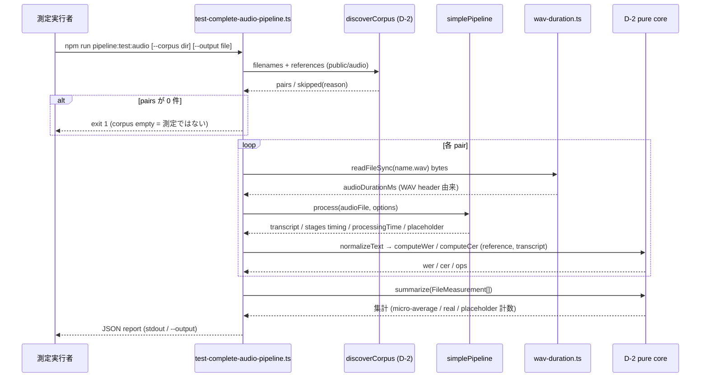
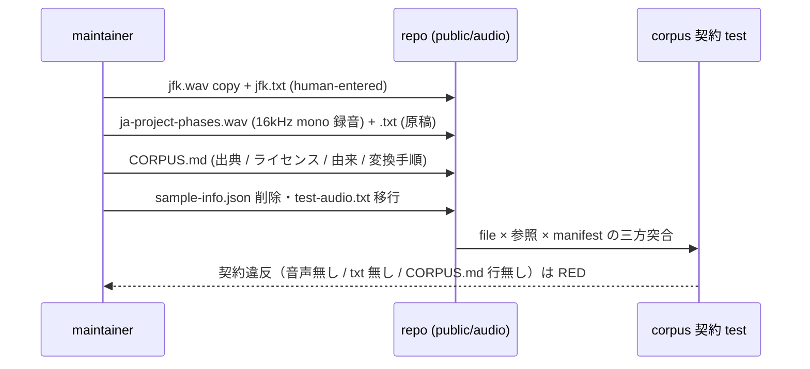
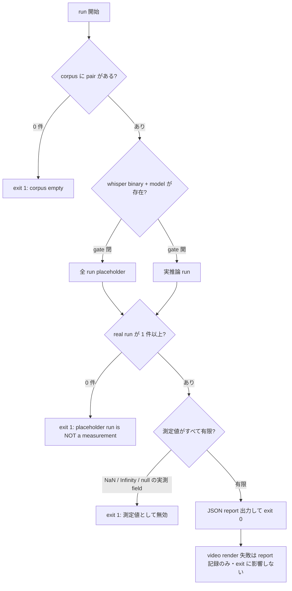

# real-audio-e2e-regression データフロー図


<!-- spine:anchor:begin -->
> **Spine anchor**: [speech-to-visuals アーキテクチャ設計](../speech-to-visuals/architecture.md)
>
> - parent: `speech-to-visuals/architecture.md`
> - role: `detailed`
> - status: `canonical_child`
<!-- spine:anchor:end -->

**作成日**: 2026-09-03
**関連アーキテクチャ**: [architecture.md](architecture.md)
**関連要件定義**: [speech-to-visuals 要件定義書](../speech-to-visuals/requirements.md) REQ-422 / REQ-423（Phase 194）

**【信頼性レベル凡例】**:

- 🔵 **青信号**: 要件定義書・既存設計文書・既存実装を参考にした確実なフロー
- 🟡 **黄信号**: 既存設計文書・既存実装から妥当な推測によるフロー
- 🔴 **赤信号**: 参照資料にない自動推定によるフロー

---

## システム全体のデータフロー 🔵

**信頼性**: 🔵 *scripts/test-complete-audio-pipeline.ts（現行 stage 構成）・scripts/measure-transcription-accuracy.ts（corpus 規約）・REQ-422/423 より*

```mermaid
flowchart TD
    A[public/audio/ corpus<br/>jfk.wav+jfk.txt / ja-project-phases.wav+.txt] --> B[test-complete-audio-pipeline.ts<br/>discoverCorpus (D-2 import)]
    B -->|pair ごと| C[simplePipeline.process<br/>transcription - analysis - layout]
    C --> D[actualVideoRenderer.renderVideo<br/>非 fatal]
    A --> E[readFileSync bytes]
    E --> F[wav-duration.ts<br/>readWavDurationMs]
    C --> G[SimplePipelineResult<br/>transcript / processingTime / stages]
    G --> H[D-2 pure core<br/>normalizeText - computeWer - computeCer - summarize]
    F --> I[JSON report<br/>stv-real-audio-e2e/1]
    H --> I
    I -->|stdout / --output| J[実測 artifact<br/>docs/architecture/measurements/]
    J --> K[QUALITY_METRICS.md<br/>§3.1 実測値 / §8.6 手順]
```

## 主要機能のデータフロー

### 機能1: corpus 発見と実測 run（D-4 本体）🔵

**信頼性**: 🔵 *D-2 `discoverCorpus` の既存規約（`<name>.<audio-ext>` + `<name>.txt`・skip reason 文言は test pin 済み）と REQ-422 より*

**関連要件**: REQ-422 (a)(b)(c)



**詳細ステップ**:

1. argv 解析は D-2 と同型（`--corpus` 既定 `public/audio` / `--output`・unknown flag・値欠落は拒否）。pure core として切り出し単体 test 可能にする。🔵
2. `inferenceRan` 判定は D-2 と同一規則（`success === true && segments.length > 0 && placeholder !== true && fallback !== true`）を再利用する — pipeline result から同じ導出を1箇所で行う。🔵
3. WER の hypothesis は `SimplePipelineResult.transcript`（空時のみ segments join fallback）🟡。reference は `<name>.txt` を UTF-8 で読んだ素のテキスト。🔵

### 機能2: コーパス整備（D-5）🔵

**信頼性**: 🔵 *REQ-423 (a)(b) と現行 public/audio の実測（音声 0 件・sample-info.json のみ）より*



- CORPUS.md は表形式 manifest（file / language / durationSec / source / license / transcript provenance）。`<name>.wav` があるのに `<name>.txt` が無い file は D-2 skip reason で自動的に測定対象から漏れるため、corpus 契約 test は「音声 file すべてに参照と CORPUS.md 行がある」ことを検査する。🔵

## データ処理パターン

### 同期処理 🔵

**信頼性**: 🔵 *現行 script が同期逐次で stage を回す実装より*

corpus file ごとの pipeline 実行・測定値計算・report 出力まではすべて同期逐次（測定の再現性を壊す並列化はしない）。`performance.now()` による stage timing は現行実装を踏襲する。

### 非同期処理 🔵

**信頼性**: 🔵 *simple-pipeline / actualVideoRenderer が async である現行実装より*

pipeline 実行・video render は既存の async API をそのまま使う。render は失敗しても report に `videoRender: { attempted, success }` として記録し run を止めない（現行の非 fatal 方針を維持）。

### バッチ処理 🔵

**信頼性**: 🔵 *D-2 harness が corpus 全体を走査する形式より*

`pipeline:batch`（`./public/audio` 既定）は本設計の対象外だが、corpus が実音声で埋まることで同 script も実音声に対して動くようになる（整合性のみ記録）。

## エラーハンドリングフロー 🔵

**信頼性**: 🔵 *REQ-422 (a)・D-2 exit 1 契約（scripts/measure-transcription-accuracy.ts:406-411）・D-3 `summarizeDetection([])` throw と同一契約より*



- WAV header 破損・非 PCM（`audioFormat !== 1`）は `readWavDurationMs` が throw し、その file を skipped（reason 付き）として続行 — 全 file skipped なら real run 0 件として X2 に合流する。🟡
- WER/CER の `null`（reference 空）は D-2 仕様の「測定不能」であり、summary の null 集計として report に残す（run 全体の失敗ではない）。🔵

## 状態管理フロー

### script 内の状態 🔵

**信頼性**: 🔵 *現行 `Stage` / `CompleteAudioPipelineTest` の形状より*

per-file 測定行（`FileMeasurement` 相当 + stage timings + rtf）を配列に蓄積 → `summarize` → `buildReport` 相当の組立、という純関数の直列適用。script が保持する可変状態は進捗表示のみとし、測定値は pure core に流入する前の plain object に限る。

## データ整合性の保証 🔵

**信頼性**: 🔵 *「測定証跡のない数値更新」禁止（AI_HUB_DEVELOPMENT_DIRECTION）と D-3 §8.5 前例より*

- **トランザクション性**: 測定 run → artifact commit → QUALITY_METRICS 記載は同一 PR 内で行う（数値だけが先に動く状態を作らない）。
- **整合性検査**: §3.1 記載値と committed artifact の一致を検査する guard（AC-D5-2・D5 設計決定）が、artifact なしの数値更新と artifact 更新なしの数値 drift の両方向を RED にする。🟡

## 関連文書

- **アーキテクチャ**: [architecture.md](architecture.md)
- **分析記録**: [design-interview.md](design-interview.md)
- **要件定義（正本）**: [speech-to-visuals 要件定義書](../speech-to-visuals/requirements.md) REQ-422 / REQ-423

## 信頼性レベルサマリー

- 🔵 青信号: 12件（全体フロー / 機能1 / 機能2 / 同期 / 非同期 / バッチ / エラーフロー / null 集計 / 状態管理 / 整合性 / 手計算前提の argv・計上規則 ほか）
- 🟡 黄信号: 2件（header 破損時の skip 続行 / §3.1 一致 guard の形状）
- 🔴 赤信号: 0件

**品質評価**: 高品質（全フローが実在モジュール（discoverCorpus / simplePipeline / actualVideoRenderer / D-2 pure core）への委譲として描かれ、新規の判断分岐は fail-loud 契約に集約される）
