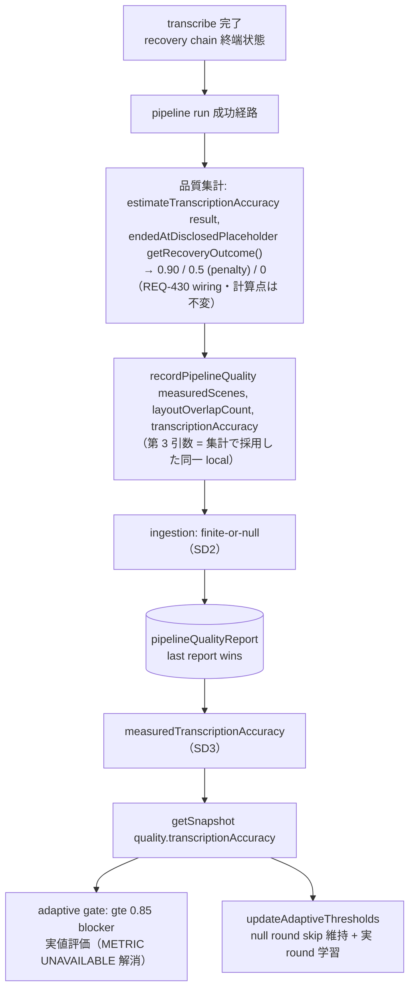
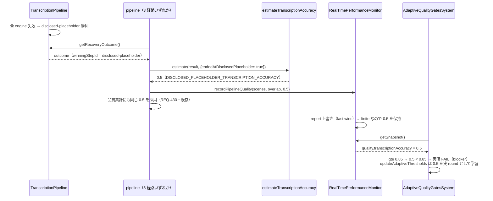
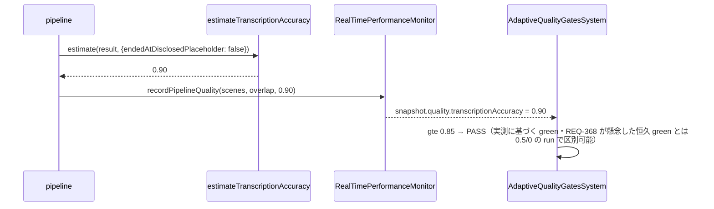
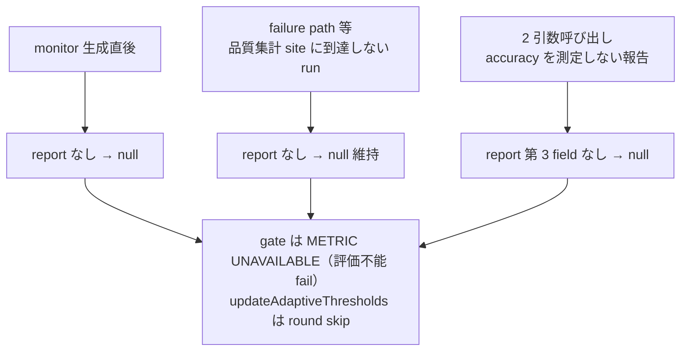
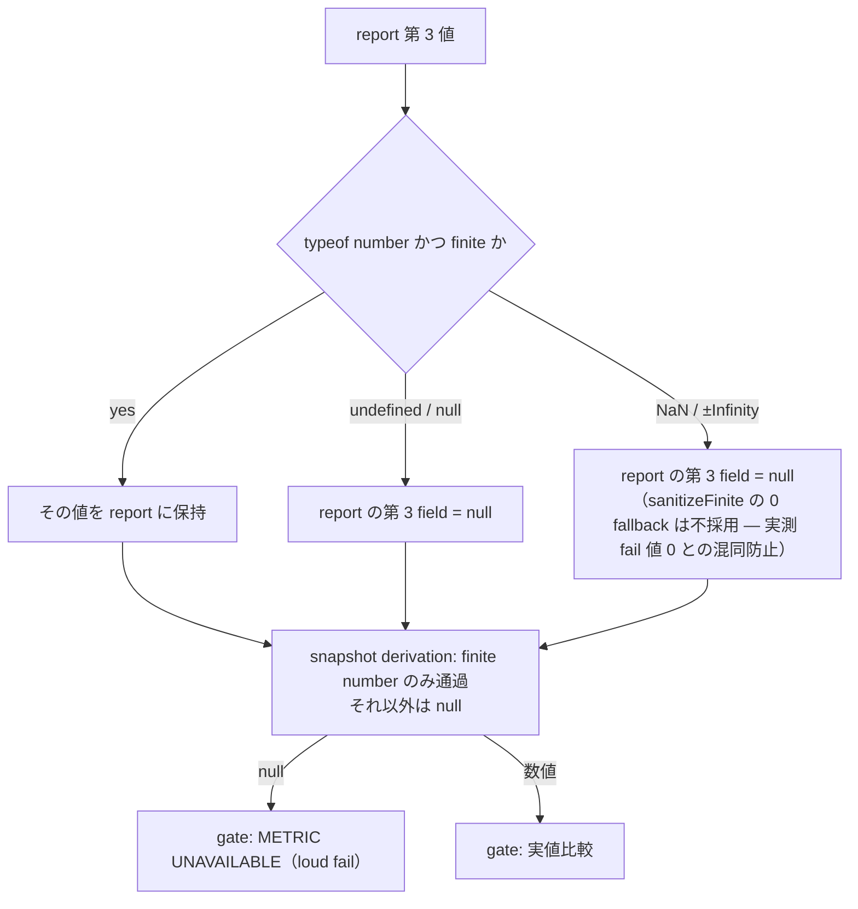
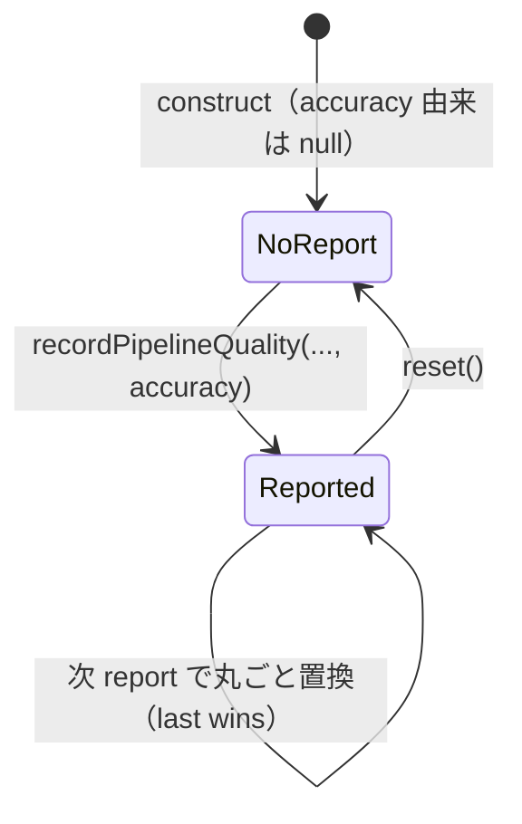

# rtpm-transcription-accuracy-producer データフロー設計

<!-- spine:anchor:begin -->
> **Spine anchor**: [speech-to-visuals アーキテクチャ設計](../speech-to-visuals/architecture.md)
>
> - parent: `speech-to-visuals/architecture.md`
> - role: `detailed`
> - status: `canonical_child`
<!-- spine:anchor:end -->

**作成日**: 2026-09-07（kairo-design・Phase 302 [fix/A]）
**関連アーキテクチャ**: [architecture.md](architecture.md)
**要件出典**: [requirements.md REQ-431](../speech-to-visuals/requirements.md)（Phase 302）

**【信頼性レベル凡例】**:

- 🔵 **青信号**: 要件定義書・既存設計文書・既存実装を参考にした確実なフロー
- 🟡 **黄信号**: 要件定義書・既存設計文書・既存実装から妥当な推測によるフロー
- 🔴 **赤信号**: 参照資料にない自動推定によるフロー

---

## システム全体のデータフロー 🔵

**信頼性**: 🔵 *3 site（main-pipeline.ts:398+405-412・simple-pipeline.ts:608+615-619・framework-integrated-pipeline.ts:288+299）・real-time-performance-monitor.ts:597-604+710-720・adaptive-quality-gates.ts:345-371 の現行実装より*

集計計算・report・snapshot・gate 評価のいずれも新規経路を作らず、既存の REQ-430（集計）と REQ-372（report 構造）の経路に第 3 値を乗せるのみ。

## 主要機能のデータフロー

### 機能1: disclosed-placeholder 終端 run（減点 0.5 の実値化）🔵

**信頼性**: 🔵 *transcriber.ts getRecoveryOutcome（D-5 実装）・quality-estimators.ts:87・REQ-431 (d) より*

**関連**: REQ-431 (a)(b)(d)・TC-424-01/03

**詳細ステップ**:

1. 減点 context の注入は pipeline test で `getRecoveryOutcome()` spy に stub outcome を返すことで行う（REQ-430 実装の simple-pipeline.test.ts:546-565 と同一手法）。
2. monitor 偱に再計算は存在しない — report された 0.5 が snapshot を経て gate に届くまでに値の変換は finite-or-null 判定のみ。

### 機能2: whisper 実推論成功 run（0.90 の実値化）🔵

**信頼性**: 🔵 *quality-estimators.ts:88（成功 + ≥1 scene → 0.90）・REQ-431 (d) より*

**関連**: REQ-431 (d)・TC-424-03（null でない実 round の学習対象）

**備考**: REQ-368 の除外根拠は「**常に** 0.85 を上回る」ことであり、下位 run が実在する現在では 0.90 の green は実測に基づく正当な評価である。

### 機能3: 報告前・測定なし run（null 維持）🔵

**信頼性**: 🔵 *real-time-performance-monitor.ts:718（現状無条件 null）・REQ-431 (c)・REQ-372 の 7-leg 契約より*

**関連**: REQ-431 (c)・TC-424-02

**備考**: failure path の run は現行どおり `recordPipelineQuality` を呼ばない（呼び出し site が成功経路の品質集計点にのみ存在するため）。省略時の意味は「この run は accuracy を測定しなかった」であり、直前の run の値を引き継がない（last report wins の report 単位语义）。

## データ処理パターン

### 同期処理 🔵

**信頼性**: 🔵 *recordPipelineQuality / getSnapshot が同期 method である現行実装より*

report も snapshot も gate 評価もすべて同期呼び出しのまま。新規の非同期 channel・event・timer を追加しない。

### バッチ処理・非同期処理 🔵

**信頼性**: 🔵 *該当する処理が存在しないこと（run 完了時の 1 回の report）より*

対象なし。適応学習（updateAdaptiveThresholds）は gate 評価ごとの既存逐次処理のまま。

## エラーハンドリングフロー 🔵

**信頼性**: 🔵 *REQ-431 (c)・memory-backend.ts:51 finiteOrNull と同型の SD2 設計より*

pipeline 側の計算は total function（estimator は常に有限値を返す）のため、非有限値は「未来の drift に対する防御」であり、通常経路では発生しない。

## 状態管理フロー 🔵

**信頼性**: 🔵 *real-time-performance-monitor.ts:252-257（report 保持）・:909（reset）の現行実装より*

accuracy 単独の状態は持たない — `pipelineQualityReport` object 全体で置換・消去される（scenes/overlap との原子性）。

## データ整合性の保証 🔵

**信頼性**: 🔵 *REQ-431 (a)・REQ-430 (a)（単一権威）の文言と SD1 設計より*

- **報告値 = 集計値**: 3 site とも monitor へ渡す local と品質集計に採用する local が同一変数（Main は `sanitizeFinite(est, 0)` 恒等、Simple/FIP は raw estimator 出力）。二重計算による乖離は構造的に発生しない。
- **単一権威の継承**: 減点有無の判断は `endedAtDisclosedPlaceholder(getRecoveryOutcome())` のみが持ち、monitor・gate は判定しない。TC-424-04 の捏造定数 mutation がこの分離を検出する。

## 関連文書

- **アーキテクチャ**: [architecture.md](architecture.md)
- **分析記録**: [design-interview.md](design-interview.md)
- **要件定義**: [requirements.md REQ-431](../speech-to-visuals/requirements.md)（Phase 302）

## 信頼性レベルサマリー

- 🔵 青信号: 10件 (100%)
- 🟡 黄信号: 0件 (0%)
- 🔴 赤信号: 0件 (0%)

**品質評価**: 高品質（全フローが REQ-430/372 の既存経路に第 3 値を乗せる写像であり、新規経路・新規推定はゼロ）
