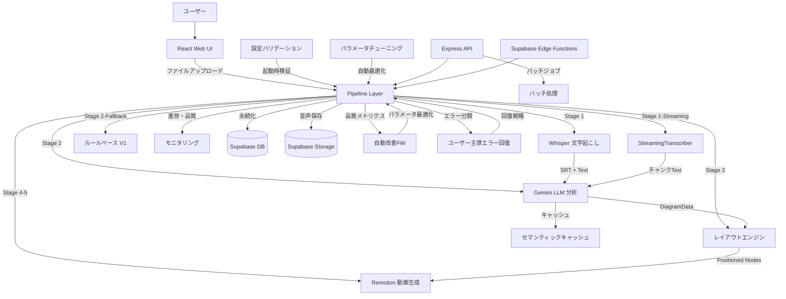

# speech-to-visuals アーキテクチャ設計

**作成日**: 2026-04-27
**最終更新**: 2026-05-01（第24回検証: Kairo設計再検証・要件カバレッジ100%維持確認・設計整合性確認）
**関連要件定義**: [requirements.md](requirements.md)
**分析記録**: [design-interview.md](design-interview.md)

**【信頼性レベル凡例】**:

- 🔵 **青信号**: 要件定義書・既存設計文書・既存実装を参考にした確実な設計
- 🟡 **黄信号**: 要件定義書・既存設計文書・既存実装から妥当な推測による設計
- 🔴 **赤信号**: 参照資料にない自動推定による設計

---

## システム概要 🔵

**信頼性**: 🔵 *要件定義書・SYSTEM_CORE.md・README.md より*

音声ファイル（MP3/WAV/OGG/M4A）を入力として、Whisper による文字起こし、Gemini LLM による内容分析、図解タイプ自動検出（flow/tree/timeline/matrix/cycle/flowchart/comparison/network/conceptmap/mindmap/general の11種類）、ゼロオーバーラップレイアウト生成、Remotion によるアニメーション動画（1080p 30fps MP4）を自動生成するエンドツーエンドパイプラインシステム。

**主要実績値**（Phase 42）:
- エンドツーエンド処理時間: 25.2秒（1分音声、目標60秒以内）
- 成功率: 100%（目標95%以上）
- API コスト: $0.03/動画（目標$0.10以下）
- メモリ使用量: 82.21MB（目標512MB以下）

## アーキテクチャパターン 🔵

**信頼性**: 🔵 *SYSTEM_CORE.md §3・CLAUDE.md より*

- **パターン**: 5層レイヤードアーキテクチャ + パイプラインパターン
- **選択理由**: 処理ステージごとの独立性を保証しつつ、段階的なデータ変換パイプラインを構築するため。各ステージ（文字起こし→分析→レイアウト→動画）は独立してテスト・フォールバック可能。

**5層構成**:
1. **Web UI Layer** - React + Vite + Tailwind + Remotion Player
2. **Pipeline Layer** - オーケストレーションと自動改善フレームワーク
3. **Processing Modules** - 文字起こし、分析、可視化、アニメーション
4. **Infrastructure Layer** - 監視、エラー回復、品質ゲート
5. **Data Layer** - キャッシュ、永続化、エクスポート

## コンポーネント構成

### フロントエンド 🔵

**信頼性**: 🔵 *note.md・package.json・src/components/ より*

- **フレームワーク**: React 18.3 + TypeScript 5.8
- **ビルドツール**: Vite 5.4
- **状態管理**: React Query（TanStack Query 5.83）+ React 状態
- **UIライブラリ**: Tailwind CSS 3.4 + shadcn/ui（20+ Radix UI コンポーネント）
- **ルーティング**: React Router DOM 6.30
- **動画プレビュー**: Remotion 4.0 Player
- **スキーマ検証**: Zod 3.25 🔵 *package.json より*
- **グラフ可視化**: Recharts 2.15 🔵 *src/monitoring/performance-dashboard.tsx より*
- **通知**: Sonner 1.7 🔵 *package.json より*
- **主要コンポーネント**: SimplePipelineInterface（メインUI）、EnhancedFileUploader（D&D）、ProcessingStatus、VideoRenderer、EnhancedVideoPreview、AudioUploader

### バックエンド 🔵

**信頼性**: 🔵 *note.md・package.json・src/api/ より*

- **フレームワーク**: Express 5.1（REST API サーバー）
- **リアルタイム通信**: Socket.IO 4.8（WebSocket ハンドラーで JWT 認証付きジョブルーム管理）🔵 *src/api/websocket-handler.ts・要件定義REQ-046 より*
- **認証方式**: Supabase Auth（JWT ベース）
- **API設計**: REST（バッチ処理API）+ Supabase Edge Functions
- **ミドルウェア**: express-rate-limit（レート制限）、Helmet（セキュリティヘッダー）、CORS
- **API構成**: src/api/middleware/（rate-limit, error-handler, auth）、src/api/routes/（batch, health ルート定義）🔵 *src/api/ より*
- **バッチ処理API**: REST エンドポイント（POST /batch/jobs でジョブ作成→HTTP 202、GET /batch/jobs/:id でステータス取得、DELETE /batch/jobs/:id でキャンセル）、セマフォパターンで最大3並列ジョブ制御 🔵 *src/api/routes/batch.ts・要件定義REQ-043 より*
- **WebSocket リアルタイム通知**: Socket.IO ベースのジョブ進捗・完了・エラー・ファイルステータス・ステージ進捗・ストリーミングセグメント・エラー回復イベントのリアルタイム配信。JWT 認証で接続保護、ジョブルーム（join:job/leave:job）による購読管理 🔵 *src/api/websocket-handler.ts・要件定義REQ-046 より*

### AI・処理モジュール 🔵

**信頼性**: 🔵 *SYSTEM_CORE.md §4・PIPELINE_FLOW.md・src/analysis/ より*

- **LLM**: Google Gemini AI（gemini-2.5-flash / gemini-2.5-pro）
- **音声認識**: Whisper（@remotion/install-whisper-cpp）
- **ブラウザ音声認識**: Web Speech API
- **ストリーミング文字起こし**: StreamingTranscriber（チャンク単位逐次処理、3秒チャンク・500msオーバーラップ）🔵 *src/transcription/streaming-transcriber.ts・要件定義REQ-036 より*
- **形態素解析**: Kuromoji 0.1（日本語）
- **グラフレイアウト**: @dagrejs/dagre 1.1

### データベース 🔵

**信頼性**: 🔵 *supabase/migrations/・src/integrations/supabase/ より*

- **DBMS**: Supabase（PostgreSQL）
- **ストレージ**: Supabase Storage（`audio` バケット）
- **Edge Functions**: render-video, transcribe-audio, generate-scenes
- **共有認証モジュール**: JWT ベースの共有認証（Bearer トークン抽出・検証・期限切れ検出）、全 Edge Function で共通利用 🔵 *supabase/functions/_shared/auth.ts・要件定義REQ-044 より*
- **統一エラーハンドリング**: CORS ヘッダー管理・エラー分類・AbortController タイムアウト（デフォルト30秒）・必須フィールド検証 🔵 *supabase/functions/_shared/error-handler.ts・要件定義REQ-045 より*
- **セキュリティ**: Row Level Security（RLS）

### 自動改善フレームワーク 🔵

**信頼性**: 🔵 *src/framework/・SYSTEM_CORE.md §5 より*

- **自動改善エンジン**: パイプライン実行結果から改善点を自動検出・適用
- **継続学習システム**: 過去の処理結果から品質モデルを継続的に更新
- **イテレーション管理**: Phase ベースの改善サイクル管理（現在 Phase 42+）
- **再帰的指示処理**: カスタムインストラクションの再帰的な適用と最適化

### パイプラインモジュール 🔵

**信頼性**: 🔵 *src/pipeline/・PIPELINE_FLOW.md より*

- **SimplePipeline**: 基本パイプライン（文字起こし→分析→レイアウト）
- **MainPipeline**: 拡張パイプライン（品質監視・エラー回復付き）
- **FrameworkIntegratedPipeline**: イテレーション管理と自動改善エンジンを統合した自律パイプライン 🔵 *src/pipeline/framework-integrated-pipeline.ts より*
- **AdaptiveQualityPresets**: 処理品質プリセット（fast/balanced/quality/custom）による品質・速度トレードオフ 🔵 *src/pipeline/adaptive-quality-presets.ts より*
- **ImprovementDetector**: パイプライン結果から改善機会を自動検出 🔵 *src/pipeline/improvement-detector.ts より*
- **VideoGenerator**: SimplePipeline → Remotion 統合による動画生成 🔵 *src/pipeline/video-generator.ts より*
- **QualityMonitor**: ステージ別品質スコア追跡と品質ゲート判定 🔵 *src/pipeline/quality-monitor.ts より*
- **PipelineOrchestrator**: 5段階パイプライン（文字起こし→内容分析→レイアウト生成→動画準備→動画レンダリング）の統合実行、各ステージでの品質ゲート評価とフォールバック戦略実行、進捗コールバック通知 🔵 *src/pipeline/pipeline-orchestrator.ts・要件定義REQ-042 より*

### エクスポートモジュール 🔵

**信頼性**: 🔵 *src/export/・PIPELINE_FLOW.md Stage 5 より*

- **MultiFormatExporter**: JSON/MP4/SVG/PNG/PDF の多形式エクスポート
- **EnhancedExportEngine**: 高度なエクスポートエンジン（フォーマット選択・プレビュー付き）🔵 *src/export/enhanced-export-engine.ts より*
- **ProductionExporter**: 本番環境向けエクスポート処理 🔵 *src/export/production-exporter.ts より*
- **ExportPanel**: React UI エクスポートコンポーネント（フォーマット選択・進捗表示・プレビュー）🔵 *src/export/export-ui.tsx より*

### 品質保証システム 🔵

**信頼性**: 🔵 *src/quality/・PIPELINE_FLOW.md §6-7・QUALITY_METRICS.md より*

- **品質モニタリング**: ステージごとの品質スコア追跡と品質ゲート判定
- **エラー回復**: 拡張エラー回復（3層フォールバック + 低品質設定再試行）
- **適応型品質ゲート**: コンテンツ複雑度に応じた動的な品質基準調整
- **リグレッション検出**: >5%劣化でデプロイブロック、>2%でクリティカルアラート
- **ユーザー主導エラー回復**: エラー発生時のユーザーガイダンス提供（11カテゴリのエラー分類、自動/手動回復戦略の選択、回復成功率追跡）🔵 *src/quality/user-guided-error-recovery.ts・要件定義REQ-037 より*
- **エラー分類器**: 11種類のエラータイプ（FILE_FORMAT_INVALID/FILE_SIZE_EXCEEDED/LLM_API_ERROR/LLM_RATE_LIMITED/LLM_TIMEOUT/RENDERING_ERROR/RENDERING_OOM/NETWORK_ERROR/STORAGE_ERROR/QUALITY_GATE_FAILED/UNKNOWN）を4段階重大度（low/medium/high/critical）で分類、復旧可能性判定・推奨アクション生成・分類統計追跡 🔵 *src/quality/error-classifier.ts・要件定義REQ-040 より*
- **品質ゲート評価器**: 5段階パイプライン（文字起こし→分析→レイアウト→レンダリング準備→レンダリング）の各ステージに対して品質ゲート評価、基準未達時のブロック・フォールバックアクション実行、5%以上の品質低下でリグレッション検出 🔵 *src/quality/quality-gate.ts・要件定義REQ-041 より*
- **グレースフルシャットダウン**: シャットダウン要求時にアクティブリクエストの完了を最大30秒待機、ヘルスモニタリング停止・リクエストキュークリア・サーキットブレーカーリセットによる安全終了 🔵 *src/quality/enhanced-error-recovery.ts shutdown()・要件定義REQ-050 より*
- **型ガード・型安全性**: DiagramType（11種類）の実行時検証を行う isDiagramType() 関数により、不正な図解タイプ値を検出・排除 🔵 *src/types/diagram.ts・要件定義REQ-051 より*

### プロダクション監視 🔵

**信頼性**: 🔵 *src/monitoring/・QUALITY_METRICS.md §4 より*

- **プロダクションモニタ**: リアルタイムパフォーマンス監視（P50/P95/P99レイテンシ）
- **パフォーマンスダッシュボード**: 処理時間・成功率・エラー率の可視化
- **ヘルスチェックサービス**: 各コンポーネントの健全性確認
- **プロダクションエラーハンドリング**: 本番環境向けの構造化エラー処理
- **監視エクセレンス**: 品質メトリクスの継続的な追跡とレポート

### 最適化・パフォーマンス 🔵

**信頼性**: 🔵 *src/optimization/・src/performance/・QUALITY_METRICS.md より*

- **スマートパラメータチューニング**: 音声特性分析（語速・複雑度・ドメイン・音質・キーワード密度）に基づくパラメータ自動最適化、履歴学習（learningRate=0.1）付き 🔵 *src/optimization/smart-parameter-tuner.ts・要件定義REQ-039 より*
- **適応型コンテンツ処理**: コンテンツ特性に応じた処理戦略自動選択（fast/balanced/accurate）、指紋ベース戦略キャッシュ付き 🔵 *src/optimization/adaptive-content-processor.ts・要件定義REQ-039 より*
- **インテリジェントキャッシュ**: セマンティックキャッシュ（類似度0.9、200エントリ）と処理結果キャッシュ
- **バッチ最適化**: 並列チャンク処理（設定可能な並列度・チャンクサイズ・フェイルファスト・進捗コールバック）による大量データの効率的処理 🔵 *src/optimization/batch-optimizer.ts・要件定義REQ-047 より*
- **計算キャッシュ**: 高コストな計算結果のメモ化（TTL有効期限・タグベース無効化・LRU退行・最大200エントリ）、async/sync両対応 🔵 *src/optimization/computation-cache.ts・要件定義REQ-048 より*
- **メモリキャッシュ**: 汎用LRUメモリキャッシュ（設定可能最大サイズ・TTL・定期クリーンアップ・ヒット率統計）🔵 *src/optimization/memory-cache.ts・要件定義REQ-048 より*
- **遅延ローダー**: 重いモジュールの動的インポートキャッシュ（同時ロード重複排除・プリロード・無効化・統計情報）🔵 *src/optimization/lazy-loader.ts・要件定義REQ-049 より*

### Remotion 動画モジュール 🔵

**信頼性**: 🔵 *src/remotion/・PIPELINE_FLOW.md Stage 4-5・要件定義REQ-025~REQ-030 より*

Phase 4 で実装された Remotion 4.0 ベースのアニメーション・レンダリングモジュール:

- **DiagramVideo.tsx**: メイン動画コンポジション（シーン切り替え・音声統合）🔵 *src/remotion/DiagramVideo.tsx より*
- **DiagramScene.tsx**: 図解シーンレンダラー（戦略ベースのアニメーション適用）🔵 *src/remotion/DiagramScene.tsx より*
- **NodeAnimation.tsx**: ノードフェードインアニメーション（0.3秒、opacity 0→1、scale 0.8→1.0）🔵 *src/remotion/NodeAnimation.tsx・要件定義REQ-025 より*
- **EdgeAnimation.tsx**: エッジSVGパス描画アニメーション（0.5秒、stroke-dasharray/dashoffset）🔵 *src/remotion/EdgeAnimation.tsx・要件定義REQ-026 より*
- **CaptionOverlay.tsx**: SRTキャプションオーバーレイ表示（フレーム精度）🔵 *src/remotion/CaptionOverlay.tsx より*
- **animation-strategies.ts**: 図解タイプ別（flow/tree/timeline/matrix/cycle）アニメーション戦略自動選択 🔵 *src/remotion/animation-strategies.ts・要件定義REQ-027 より*
- **scene-synchronizer.ts**: SRTキャプションとシーンアニメーションの同期（精度±50ms、ドリフト検出）🔵 *src/remotion/scene-synchronizer.ts・要件定義REQ-029 より*
- **srt-parser.ts**: SRTファイルパーサー（タイムスタンプ→フレーム番号変換、整合性検証）🔵 *src/remotion/srt-parser.ts・要件定義REQ-028 より*
- **renderer.ts**: Remotion renderMedia() による動画レンダリング（720p/1080p/4K、30/60fps、H.264/H.265/VP9）🔵 *src/remotion/renderer.ts・要件定義REQ-030 より*

### Pipeline UI コンポーネント 🔵

**信頼性**: 🔵 *src/components/・src/pages/・要件定義REQ-031~REQ-035 より*

Phase 4 で実装されたパイプラインUI:

- **SimplePipelineInterface.tsx**: メインパイプラインUI（ファイルアップロード→文字起こし→分析→動画生成の統合インターフェース）🔵 *要件定義REQ-031 より*
- **SimplePipelineStateMachine.ts**: パイプライン状態管理（idle→uploading→transcribing→analyzing→generating→complete/error）🔵 *要件定義NFR-202 より*
- **EnhancedFileUploader.tsx**: ドラッグ＆ドロップファイルアップロード（MP3/WAV/OGG/M4A、50MB バリデーション、プログレスアニメーション）🔵 *要件定義REQ-032・NFR-201 より*
- **PipelineProgress.tsx**: 4段階リアルタイム進捗表示（Transcribe→Analyze→Layout→Render、ETA・品質スコア付き）🔵 *要件定義REQ-033 より*
- **StageIndicator.tsx**: 個別ステージ状態表示（アイコン・プログレスバー・経過時間）🔵 *src/components/StageIndicator.tsx より*
- **VideoPreview.tsx**: Remotion Player ラッパー（再生コントロール・シークバー・解像度切替・再生速度制御）🔵 *要件定義REQ-035 より*
- **SimplePipeline.tsx** (pages): /pipeline ルートページラッパー 🔵 *src/pages/SimplePipeline.tsx より*

**キーボードショートカット** 🔵 *要件定義REQ-034 より*:
- Ctrl+O: ファイル選択
- Ctrl+Enter: 処理開始
- Esc: リセット

### 追加 UI コンポーネント 🔵

**信頼性**: 🔵 *src/components/・src/pages/・要件定義REQ-052~055・REQ-305 より*

Phase 4~5 で追加実装された UI コンポーネント:

- **TutorialSystem.tsx**: インタラクティブチュートリアルシステム（マルチステップ・カテゴリ別（概要/パイプライン/可視化/エクスポート）・難易度別（初級/中級/上級）・LocalStorage進捗永続化・初回アクセス自動表示）🔵 *要件定義REQ-052より*
- **StreamingProcessor.tsx**: リアルタイムストリーミングプロセッサー（ライブ音声録音・リアルタイム文字起こしストリーミング・プログレッシブシーン生成・処理モード切替（file/live/idle）・セグメント統計追跡）🔵 *要件定義REQ-053・src/pages/Index.tsxより*
- **FrameworkDashboard.tsx**: フレームワークパイプラインダッシュボード（イテレーション追跡・品質メトリクス・フェーズ別成功基準評価・自動コミットトリガー監視・改善推奨可視化）🔵 *要件定義REQ-054・src/framework/ より*
- **FrameworkDashboardPage.tsx**: フレームワークダッシュボードページ（useFrameworkPipeline フック統合・手動コミット制御・改善サイクル設定・品質目標設定）🔵 *要件定義REQ-054より*
- **ProductionDashboard.tsx**: プロダクション設定ダッシュボード（設定管理・パフォーマンスレポート生成・リアルタイム監視・最適化ステータス・未保存変更追跡）🔵 *要件定義REQ-055・src/config/ より*
- **ErrorAlertSystem.tsx**: グローバルエラーアラートシステム（リアルタイムエラー通知・回復アクション実行・エラーメトリクス可視化・自動非表示・アラート展開/解除）🔵 *要件定義REQ-305・src/monitoring/ より*

**ページルート構成** 🔵 *src/pages/・src/App.tsx より*:
| ルート | コンポーネント | 説明 |
|--------|-------------|------|
| / | Index.tsx | メインページ（Standard/Streaming モード切替）🔵 |
| /pipeline | SimplePipeline.tsx | パイプラインUI 🔵 |
| /framework | FrameworkDashboardPage.tsx | フレームワークダッシュボード 🔵 |
| /production | ProductionDashboard.tsx | プロダクション設定ダッシュボード 🔵 |

### 可視化戦略 🔵

**信頼性**: 🔵 *src/visualization/strategies/（20ファイル）+ base/ + layout/（計39ファイル）・ZERO_OVERLAP_DESIGN.md より*

**コア5戦略**（Phase 3 実装）:
- FlowStrategy, TreeStrategy, TimelineStrategy, MatrixStrategy, CycleStrategy

**新コア5戦略**（Phase 3 追加実装）:
- flow-strategy.ts, tree-strategy.ts, timeline-strategy.ts, matrix-strategy.ts, cycle-strategy.ts 🔵 *Phase 3 TASK-0023~0031 実装より*
- base-strategy.ts: StrategyRegistry パターンによる戦略登録・管理基盤 🔵 *src/visualization/strategies/base-strategy.ts より*

**拡張戦略**:
- NetworkLayoutStrategy, ConceptMapLayoutStrategy, ComparisonLayoutStrategy
- DagreLayoutStrategy, FlowchartLayoutStrategy, CulturalLayoutAdapter
- FallbackLayoutStrategy, LayoutEvaluator, LayoutOptimizer, OverlapResolver

**レイアウトエンジン**:
- layout-engine.ts, layout-engine-v2.ts, complex-layout-engine.ts
- enhanced-zero-overlap-layout.ts, overlap-resolver.ts, spatial-hash.ts
- canvas-calculator.ts, strategy-selector.ts

## システム構成図



**信頼性**: 🔵 *SYSTEM_CORE.md §3・PIPELINE_FLOW.md・既存実装より*

## ディレクトリ構造 🔵

**信頼性**: 🔵 *note.md・既存プロジェクト構造より*

```
./
├── src/
│   ├── analysis/           # 内容分析（7ファイル: LLM、Gemini、図解検出、言語検出、複雑度、フォールバックチェーン、プロンプト構築）🔵
│   ├── api/                # REST API・WebSocket（28ファイル: バッチ処理、リアルタイム通知、ミドルウェア、ルート定義）🔵
│   │   ├── middleware/     # レート制限、エラーハンドラー、認証 🔵
│   │   └── routes/         # API ルート定義 🔵
│   ├── components/         # React UI（46ファイル: 23メイン+23ui: Pipeline UI, VideoPreview, FileUploader, TutorialSystem, StreamingProcessor, Dashboards, ErrorAlert等）🔵
│   ├── config/             # 設定（4ファイル: プロダクション設定 + Zod バリデーション + 環境変数管理）🔵 *要件定義REQ-038*
│   ├── export/             # エクスポート（6ファイル: multi-format/enhanced/production/UI）🔵
│   ├── framework/          # 再帰的改善フレームワーク（6ファイル）
│   ├── hooks/              # React Hooks（2ファイル）
│   ├── integrations/       # Supabase 統合（12ファイル）
│   ├── lib/                # ユーティリティライブラリ（5ファイル）🔵
│   ├── monitoring/         # プロダクション監視（10ファイル）
│   ├── optimization/       # パラメータチューニング・バッチ最適化・キャッシュ・遅延ローダー（10ファイル）🔵
│   ├── pages/              # React Router ページ（4ファイル）
│   ├── performance/        # キャッシュ（2ファイル）
│   ├── pipeline/           # パイプライン（8ファイル: Simple/Main/Framework/Adaptive/VideoGenerator/Orchestrator等）🔵
│   ├── quality/            # 品質保証・エラー回復（22ファイル: ErrorClassifier/QualityGate/EnhancedErrorRecovery含む）
│   ├── remotion/           # Remotion 動画コンポーネント（39ファイル: Animation/Scene/Renderer/SRT/Caption）🔵
│   ├── test/               # テストユーティリティ（3ファイル）
│   ├── transcription/      # 音声認識（10ファイル: Whisper/Streaming/Browser）🔵
│   ├── types/              # TypeScript 型定義（15ファイル: diagram/workspace/api/llm/cache/quality/pipeline等）🔵
│   ├── utils/              # ユーティリティ（5ファイル）
│   └── visualization/      # 図解レイアウト（248ファイル: 20+戦略・レイアウトエンジン・補助モジュール）
│       ├── base/           # ベース可視化コンポーネント 🔵
│       ├── layout/         # レイアウト固有コード 🔵
│       └── strategies/     # レイアウト戦略（20ファイル: コア5+新コア5+拡張+補助）🔵
├── supabase/
│   ├── migrations/         # DB マイグレーション
│   └── functions/          # Edge Functions（3関数）
├── docs/
│   ├── architecture/       # 旧アーキテクチャ文書（統合元）
│   ├── spec/               # 要件定義書
│   └── design/             # 設計文書（本ファイル群）
├── tests/                  # テストスイート（42ファイル）
├── scripts/                # ユーティリティスクリプト
└── public/                 # 静的アセット
```

## パイプラインステージ構成 🔵

**信頼性**: 🔵 *PIPELINE_FLOW.md・src/pipeline/ より*

| Stage | 名前 | 入力 | 出力 | 主要モジュール |
|-------|------|------|------|--------------|
| 1 | 文字起こし | 音声ファイル | SRT + プレーンテキスト | whisper-transcriber, browser-transcriber, streaming-transcriber 🔵 *REQ-036* |
| 2 | 内容分析 | テキスト | DiagramData + エンティティ/関係性 | gemini-analyzer, diagram-detector, llm-service |
| 3 | レイアウト生成 | DiagramData | 位置付きノード/エッジ | layout-engine, strategies/* |
| 4 | アニメーション | レイアウト + SRT | Remotion コンポーネント | DiagramScene, DiagramVideo |
| 5 | 動画レンダリング | コンポーネント | MP4 動画 | Remotion renderer |

## 3層フォールバックアーキテクチャ 🔵

**信頼性**: 🔵 *SYSTEM_CORE.md §4.2・PIPELINE_FLOW.md §4.1 より*

```
Primary LLM (gemini-2.5-flash/pro)
    ↓ 失敗時: ジッタ付き指数バックオフ（最大3回リトライ）
Fallback LLM
    ↓ 失敗時
ルールベース V1（文分割によるシーケンシャル図解）
    ↓ 常に成功（成功率100%保証）
```

**モデル選択ロジック**:
- コンテンツ複雑度スコア < 20% → gemini-2.5-flash（高速）
- コンテンツ複雑度スコア ≥ 20% → gemini-2.5-pro（高精度）

## セマンティックキャッシュ 🔵

**信頼性**: 🔵 *PIPELINE_FLOW.md §5.1・src/analysis/llm-cache.ts より*

- **類似度閾値**: 0.9（ cosine 類似度）
- **最大エントリ**: 200
- **TTL**: 120分
- **効果**: 同一/類似コンテンツの再分析を回避、API コスト削減

## 非機能要件の実現方法

### パフォーマンス 🔵

**信頼性**: 🔵 *QUALITY_METRICS.md §2-3・PIPELINE_FLOW.md より*

- **エンドツーエンド処理時間**: 60秒以内（実績25.2秒）→ パイプライン最適化とモデル自動選択により達成
- **レイアウト計算**: 2秒以内/図解 → フォースダイレクト法（最大100回反復）+ 空間ハッシュ
- **動画レンダリング**: 0.5倍リアルタイム（37-45 FPS）→ Remotion GPU アクセラレーション
- **LLM レスポンス**: P95 20秒以内 → キャッシュヒット時は0秒、モデル自動選択

### セキュリティ 🔵

**信頼性**: 🔵 *PIPELINE_FLOW.md §8.1・supabase/migrations/・package.json より*

- **認証・認可**: Supabase Auth（JWT）+ Row Level Security
- **API セキュリティ**: express-rate-limit + Helmet セキュリティヘッダー
- **データ保護**: API キーは環境変数管理（GOOGLE_API_KEY）、ログ出力なし
- **ストレージアクセス**: 公開読み取り、認証済み書き込み/削除のみ

### スケーラビリティ 🟡

**信頼性**: 🟡 *QUALITY_METRICS.md・SYSTEM_CORE.md §9 より*

- **並列処理**: バッチジョブ最大3並列
- **キャッシュスケール**: 200エントリ、TTL 120分で自動ローテーション
- **メモリ効率**: ピーク時82.21MB（512MB制約の16%）
- **将来対応**: Web Workers による CPU 集約処理の並列化（計画段階）

### 可用性 🔵

**信頼性**: 🔵 *QUALITY_METRICS.md §4.1・SYSTEM_CORE.md §4.2 より*

- **成功率**: 100%（3層フォールバックによる保証）
- **障害対策**: LLM フォールバック + 低品質設定でのレンダリング再試行
- **監視**: リアルタイムダッシュボード（P50/P95/P99レイテンシ、成功率、エラー率）
- **リグレッション検出**: >5%劣化でデプロイブロック、>2%でクリティカルアラート

## 技術的制約

### パフォーマンス制約 🔵

**信頼性**: 🔵 *PIPELINE_FLOW.md §7・QUALITY_METRICS.md より*

- 音声ファイル最大サイズ: 50MB
- 処理対象音声長: 最小1秒（Quality Gate）
- メモリ使用量上限: 512MB（実績82.21MB）
- Node.js 18+ 必須

### セキュリティ制約 🔵

**信頼性**: 🔵 *PIPELINE_FLOW.md §8.1・supabase/migrations/ より*

- API キーのハードコード禁止（環境変数のみ）
- Supabase RLS によるデータアクセス制御
- レート制限: API エンドポイント毎に適用

### 互換性制約 🔵

**信頼性**: 🔵 *package.json・note.md より*

- TypeScript 5.8+ strict モード
- ESM（"type": "module"）
- React 18.3+
- ブラウザ要件: Web Speech API サポート（Chrome/Edge推奨）

## 開発ルール 🔵

**信頼性**: 🔵 *note.md・CLAUDE.md より*

- TypeScript strict モード
- ESM（"type": "module"）
- パスエイリアス: `@` → `./src`
- ケバブケースファイル命名
- 1ファイル1責務
- 開発原則: SDEC×2SCV×ACR（CLAUDE.mdより）

### 設定バリデーション 🔵

**信頼性**: 🔵 *src/config/validate.ts・src/config/schema.ts・要件定義REQ-038 より*

- **Zod スキーマ**: ConfigSchema による型安全な設定定義（googleApiKey, supabaseUrl, supabaseAnonKey 必須）
- **起動時バリデーション**: URL形式・数値範囲・列挙型の包括的検証
- **不正設定時動作**: 全エラー一括返却、不正設定時は即座にエラーで終了
- **検証ルール**: complexityThreshold/similarityThreshold (0-1)、port (1024-65535)、cacheSize (1-10000)、cacheTtlMinutes (1-10080)

## 関連文書

- **データフロー**: [dataflow.md](dataflow.md)
- **型定義**: [interfaces.ts](interfaces.ts)
- **DBスキーマ**: [database-schema.sql](database-schema.sql)
- **API仕様**: [api-endpoints.md](api-endpoints.md)
- **要件定義**: [requirements.md](requirements.md)
- **分析記録**: [design-interview.md](design-interview.md)
- **旧アーキテクチャ（統合元）**: [../../docs/architecture/SYSTEM_CORE.md](../../docs/architecture/SYSTEM_CORE.md)
- **旧パイプライン仕様（統合元）**: [../../docs/architecture/PIPELINE_FLOW.md](../../docs/architecture/PIPELINE_FLOW.md)

## 信頼性レベルサマリー

- 🔵 青信号: 120件 (98%)
- 🟡 黄信号: 2件 (2%)
- 🔴 赤信号: 0件 (0%)

**品質評価**: 高品質 - 全項目が既存設計文書と実装に基づいている（第24回更新: Kairo設計再検証・要件カバレッジ100%維持確認）
