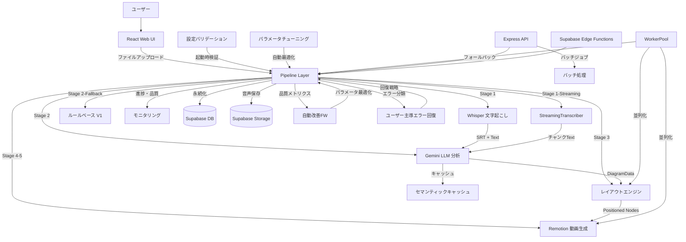

# speech-to-visuals アーキテクチャ設計


<!-- spine:anchor:begin -->
> **Spine anchor**: [Speech-to-Visuals システム憲法 V2.0](../../SYSTEM_CONSTITUTION.md)
>
> - parent: `SYSTEM_CONSTITUTION.md`
> - role: `feature_root`
> - status: `canonical_child`
<!-- spine:anchor:end -->

**作成日**: 2026-04-27
**最終更新**: 2026-08-06（第209回検証: NaN/Infinityガンド横展開完了・clampFinite Infinity対応・DiagramVideo時間単位バグ修正・property-based fuzz tests追加・11+モジュール坚牢化・570ファイル・543テストファイル・107パッケージ・REQ-270~273）
**関連要件定義**: [requirements.md](requirements.md)
**分析記録**: [design-interview.md](design-interview.md)

**【信頼性レベル凡例】**:

- 🔵 **青信号**: 要件定義書・既存設計文書・既存実装を参考にした確実な設計
- 🟡 **黄信号**: 要件定義書・既存設計文書・既存実装から妥当な推測による設計
- 🔴 **赤信号**: 参照資料にない自動推定による設計

---

## システム概要 🔵

**信頼性**: 🔵 *要件定義書・SYSTEM_CORE.md・README.md より*

音声ファイル（MP3/WAV/OGG/M4A）を入力として、Whisper による文字起こし、Gemini LLM による内容分析、図解タイプ自動検出（flow/tree/timeline/matrix/cycle/flowchart/comparison/network/conceptmap/mindmap/general の11種類）、ゼロオーバーラップレイアウト生成、Remotion によるアニメーション動画（1080p 30fps MP4）を自動生成するエンドツーエンドパイプラインシステム。

**主要実績値**（Phase 14 完了・97タスク完了）:
- エンドツーエンド処理時間: 25.2秒（1分音声、目標60秒以内）
- 成功率: 100%（目標95%以上）
- API コスト: $0.03/動画（目標$0.10以下）
- メモリ使用量: 82.21MB（目標512MB以下）
- ESLint エラー: 0（Phase 13 で113件→0件解消）
- TypeScript エラー: 0（Phase 13 で8件→0件解消）
- npm audit 脆弱性: 0（Phase 14 で解消）

## アーキテクチャパターン 🔵

**信頼性**: 🔵 *SYSTEM_CORE.md §3・CLAUDE.md より*

- **パターン**: 5層レイヤードアーキテクチャ + パイプラインパターン
- **選択理由**: 処理ステージごとの独立性を保証しつつ、段階的なデータ変換パイプラインを構築するため。各ステージ（文字起こし→分析→レイアウト→動画）は独立してテスト・フォールバック可能。

**5層構成**:
1. **Web UI Layer** - React + Vite + Tailwind + Remotion Player
2. **Pipeline Layer** - オーケストレーションと自動改善フレームワーク
3. **Processing Modules** - 文字起こし、分析、可視化、アニメーション
4. **Infrastructure Layer** - 監視、エラー回復、品質ゲート
5. **Data Layer** - キャッシュ、永続化、エクスポート

## コンポーネント構成

### フロントエンド 🔵

**信頼性**: 🔵 *note.md・package.json・src/components/ より*

- **フレームワーク**: React 18.3 + TypeScript 5.9
- **ビルドツール**: Vite 6.4
- **状態管理**: React Query（TanStack Query 5.100）+ React 状態
- **UIライブラリ**: Tailwind CSS 3.4 + shadcn/ui（20+ Radix UI コンポーネント）
- **ルーティング**: React Router DOM 6.30
- **動画プレビュー**: Remotion 4.0 Player
- **スキーマ検証**: Zod 3.25 🔵 *package.json より*
- **グラフ可視化**: Recharts 2.15 🔵 *src/monitoring/performance-dashboard.tsx より*
- **通知**: Sonner 2.0 🔵 *package.json より*
- **主要コンポーネント**: SimplePipelineInterface（メインUI）、EnhancedFileUploader（D&D）、ProcessingStatus、VideoRenderer、EnhancedVideoPreview、AudioUploader、GuardMetricsDashboard（セキュリティ観測ダッシュボード・`/security`ルート）🔵 *Phase 109 REQ-248 追加*
- **セキュリティ観測フック**: useExportGuardMetrics（5秒ポーリング・SecurityMetricsCollector 統合・Prometheus エクスポート）🔵 *Phase 109 REQ-248・src/hooks/useExportGuardMetrics.ts より*

### バックエンド 🔵

**信頼性**: 🔵 *note.md・package.json・src/api/ より*

- **フレームワーク**: Express 5.2（REST API サーバー）
- **リアルタイム通信**: Socket.IO 4.8（WebSocket ハンドラーで JWT 認証付きジョブルーム管理）🔵 *src/api/websocket-handler.ts・要件定義REQ-046 より*
- **認証方式**: Supabase Auth（JWT ベース）
- **API設計**: REST（バッチ処理API）+ Supabase Edge Functions
- **ミドルウェア**: express-rate-limit（レート制限: API 100req/15min, Upload 20req/15min, Export 10req/15min）、Helmet（セキュリティヘッダー）、CORS 🔵 *REQ-224 EXPORT rate limit 追加*
- **API構成**: src/api/middleware/（rate-limit, error-handler, auth）、src/api/routes/（batch, health, pipeline ルート定義）、src/api/startup-warmup.ts（起動時キャッシュウォームアップトリガー）🔵 *src/api/ より*
- **バッチ処理API**: REST エンドポイント（POST /batch/jobs でジョブ作成→HTTP 202、GET /batch/jobs/:id でステータス取得、DELETE /batch/jobs/:id でキャンセル）、セマフォパターンで最大3並列ジョブ制御 🔵 *src/api/routes/batch.ts・要件定義REQ-043 より*
- **WebSocket リアルタイム通知**: Socket.IO ベースのジョブ進捗・完了・エラー・ファイルステータス・ステージ進捗・ストリーミングセグメント・エラー回復イベントのリアルタイム配信。JWT 認証で接続保護、ジョブルーム（join:job/leave:job）による購読管理 🔵 *src/api/websocket-handler.ts・要件定義REQ-046 より*
- **起動時キャッシュウォームアップ**: Express サーバー起動完了後に triggerStartupWarmup() で LLMService.warmupCache() を非同期呼び出し（fire-and-forget パターン）。LLM サービス無効時はスキップ、失敗時はログ出力のみでサーバー動作に影響なし 🔵 *src/api/startup-warmup.ts・src/api/index.ts・Phase 43 より*
- **エラーリカバリREST API**: プログラマティックなエラー登録・回復オプション取得・戦略実行の3エンドポイント（POST /api/v1/errors/register・GET /api/v1/errors/:errorId/options・POST /api/v1/errors/:errorId/recover）。UserGuidedErrorRecovery を REST API 経由で利用可能にし、外部システムからのエラー回復をサポート。Phase 92 で入力検証を堅牢化: RegisterBodySchema（errorId 最大128文字・英数字ハイフンアンダースコアドット形式・errorMessage最大2000文字）・sanitizeMessage()（HTMLタグ除去によるXSS防御）・isValidErrorId() パスパラメータ形式検証・storeError() LRU退去（1000件上限で最古10%退去）・ERROR_REGISTRY_LIMITS 集中設定 🔵 *src/api/routes/errors.ts・要件定義REQ-037拡張・REQ-222 より*

### AI・処理モジュール 🔵

**信頼性**: 🔵 *SYSTEM_CORE.md §4・PIPELINE_FLOW.md・src/analysis/ より*

- **LLM**: Google Gemini AI（gemini-2.5-flash / gemini-2.5-pro）
- **音声認識**: Whisper（@remotion/install-whisper-cpp）
- **ブラウザ音声認識**: Web Speech API
- **ストリーミング文字起こし**: StreamingTranscriber（チャンク単位逐次処理、3秒チャンク・500msオーバーラップ）🔵 *src/transcription/streaming-transcriber.ts・要件定義REQ-036 より*
- **形態素解析**: Kuromoji 0.1（日本語）
- **グラフレイアウト**: @dagrejs/dagre 1.1
- **多言語検出**: 6言語対応（日本語・英語・中国語・スペイン語・フランス語・ドイツ語）・文字種別スコアリング・ダイアクリティカルマーク分析 🔵 *Phase 44 REQ-303・src/analysis/language-detector.ts より*
- **SimpleDiagramDetector**: ルールベース図解タイプ検出（flow/tree/timeline/cycle/network の5種類）・キーワードマッチングによる信頼度スコアリング・自己テスト機能（testDetector() が pass/fail 構造化結果を返す）・認識不可テキストのデフォルト要素生成フォールバック 🔵 *src/analysis/simple-diagram-detector.ts・436行のテスト追加*
- **文境界の単一ソース**: `src/analysis/sentence-boundaries.ts` が文終端の正規表現メンバーシップ（`[。！？!?\n]` + decimal-safe `.` アーム `\.(?:\s+|$)`）を唯一定義。round 21 以前は7サイトが各自ハンドロールし、メンバーシップが4通りに drift（`\n` 欠落・全角 `！？` 欠落・`。` なしの context 抽出）— 同一 detector 内の2因子が異なる文定義を持つ状態だった。`SENTENCE_BOUNDARY_REGEX`（文単位）と `PHRASE_BOUNDARY_REGEX`（`;` 追加・キーフレーズ抽出用）の2形状のみ。frozen-literal registry の 'sentence-boundary terminators single-sourced' エントリが src/analysis 内の手書き終端クラスを禁止 🔵 *src/analysis/sentence-boundaries.ts・tests/analysis/sentence-boundary-migration.test.ts・src/analysis/__tests__/sentence-boundary-consistency.test.ts より*
- **文字起こし言語判定の単一ソース**: `src/transcription/language-detection.ts` が `TranscriptionResult.language` の導出（先頭3セグメント・500文字サンプリング → analysis の `detectLanguage()` 委譲 → `Language`→コード写像）を唯一定義。round 22 以前は3 producer が3通りの挙動に drift していた — whisper-transcriber は hand-rolled `[仮名|漢字]` クラスで**漢字のみ（中国語）の書き起こしを `ja` と誤ラベル**（下流の LLM プロンプトが日本語用に選択される）、es/fr/de は `en` に潰れ（ダイアクリティカル判定不在）、streaming-transcriber は英語モック出力を含む全結果をハードコード `ja`。browser-transcriber の `en` は除外（Web Speech 認識を `lang='en-US'` に固定しているため言語は事前設定であり検出ではない）。frozen-literal registry の 'transcription language detection single-sourced' エントリが src/transcription 内の手書き文字クラス（エスケープ・リテラル両形状）と結果リテラルへの言語コード直書きを禁止 🔵 *src/transcription/language-detection.ts・tests/transcription/language-detection-migration.test.ts より*
- **Unicode スクリプト範囲の単一ソース**: `src/lib/unicode-script-ranges.ts` が CJK/kana/hangul/fullwidth の範囲境界（原子レンジ + 目的別プリセット `KANA_RANGES`/`CJK_IDEOGRAPH_RANGES`/`JAPANESE_TEXT_RANGES`/`CJK_TOKEN_RANGES`/`WIDE_DISPLAY_RANGES` + ヘルパー `charInRanges`/`charClassSource`/`buildCharClassRegex`）を唯一定義。round 23 以前は4ファイルが同じ「どの文字が CJK/kana か」境界を4通りのメンバーシップで hand-rolled していた — language-detector（コードポイント比較・最も完全）、semantic-similarity（Ext A + Hangul あり、Katakana Phonetic Ext/Compat なし → **Compat 漢字が LLM キャッシュのトークンから除去**され類似度 0.283→0.483 に変動）、scene-segmenter（最も狭いゲート → Ext-A/Compat のみのテキストが日本語キーワード抽出を素通りし英語フォールバック）、smart-label-sizer（FF00-FFEF ブロック全体 → **半角カタカナが 2x 幅でカウント**されラベルが早期折り返し、逆に Ext-A/Compat 漢字は 1x のままラベル溢れ）。移行は目的別プリセットで各サイトの意図を保存（hangul はトークン/幅では CJK、日本語ゲートでは除外。fullwidth は幅のみ）。U+3000-303F（、。）は意図的に除外（全ての日本語ラベル折り返しを再調整するため）。frozen-literal registry の 'unicode script ranges single-sourced' エントリが3つの freeze 形状（regex エスケープ・hex コードポイント比較・生リテラル範囲）を src/analysis + src/visualization + src/lib で禁止 🔵 *src/lib/unicode-script-ranges.ts・tests/lib/unicode-script-ranges-migration.test.ts（51 テスト: drift マトリクス delta 行 + 等価行 + ソースアンカー）より*
- **開発フェーズ計画の単一ソース**: `src/framework/iteration-manager.ts` の `DEVELOPMENT_CYCLES`（段階的開発フロー5フェーズの phase/maxIterations/successCriteria/failureRecovery/commitTrigger）と派生 `DEVELOPMENT_PHASE_ORDER`（= `Object.keys(DEVELOPMENT_CYCLES)`）がフェーズ計画の唯一の定義。round 24 以前は同じ計画が4サイト3形状で宣言され、すでに drift していた — recursive-custom-instructions は3フェーズのみの inline 配列で 内容分析 の successCriteria が変異（エンティティ/関係性の基準を喪失し計画に存在しない 図解タイプ判定 の基準を獲得）、`evaluateIteration` の `.find()` が E2E統合/品質向上 を見逃し **iteration 1 で「部分的成功」として即コミット**（失敗時の再反復パスが到達不能）、main-pipeline `getNextPhase` の局所順序は**存在しない グローバル展開 フェーズを含み**正規の E2E統合 を欠落、FrameworkDashboard は3フェーズの手書き UI テーブル。修正後は3サイトすべて派生（`Object.values` / phase order / UI map）。Iteration43Interface の successCriteria は除外（iteration-43 デモバナーの横断キュレーション表示でありフェーズ計画ではない）。frozen-literal registry の 'development phase plan single-sourced in iteration-manager' エントリが3つの freeze 形状（plan-record `phase:` エントリ・局所フェーズ順序配列・手書き UI `name:` 行）+ phantom フェーズ名 + canonical 専用基準文字列を src 全域で禁止 🔵 *src/framework/iteration-manager.ts・tests/guards/development-phases-single-source.test.ts（正典内容+順序・行動委譲・ソースアンカー）より*
- **品質ゲート閾値バーの単一ソース（消費者サイト）**: `src/framework/quality-thresholds.ts` の `DEFAULT_*` 定数が品質ゲート閾値の唯一の値源。round 7 が**宣言形状**（`KEY: VALUE`）を凍結したが、**ガードは形状で陳腐化する**（guards go stale by SHAPE）— 比較形状はその凍結から逃げ、5ファイル14サイトが同じバーを裸リテラルで再凍結し続けた: improvement-detector は（閾値テーブルが quality-thresholds に委譲済みの）QualityMonitor のメトリクスを読みながら5バーを再凍結（`processingTime > 30000`・`memoryUsage > 512`・`edgeCompleteness < 0.7`・`relationshipAccuracy < 0.85`・`layoutOverlap > 0` + エビデンス文字列 `<30000ms`/`<512MB`/`>85%` と `targetValue: 512` のエコー）、recursive-custom-instructions は自分が import している `DEFAULT_TRANSCRIPTION_ACCURACY_THRESHOLD` の横で `< 0.85` をハードコード、main-pipeline のステージゲート（`minAccuracy: 0.85`/`0.75`）、adaptive-quality-gates の transcription ゲート（`threshold: 0.85`）、continuous-learner の異常検出バー（`> 30000`）。round 25 で全サイトを6定数に委譲（値同一・挙動変更なし）。frozen-literal registry の r25 エントリがメトリック比較形状 + `minAccuracy:`/`threshold:` オブジェクトメンバ + エコー文字列を src 全域で禁止。severity tier（`> 60000`/`> 1024`）・aspiration targetValue（0.9/0.85/25000）・ステージ `maxTime` タイムアウト・layout/preparation 段の minAccuracy（1.0/0.9）は別概念として除外 🔵 *src/framework/quality-thresholds.ts・src/pipeline/quality-monitor.ts（委譲モデル）・tests/guards/quality-threshold-bars-single-source.test.ts（正典値 delta・バー境界の行動等価・ソースアンカー）より*
- **JWT 秘密鍵解決チェーンの単一ソース**: `src/api/jwt-secret.ts` が署名検証用 JWT シークレットの env フォールバック順序を唯一定義（`getJwtSecretFromEnv()` = 未設定で undefined、`requireJwtSecret()` = 両ミドルウェアの throw-on-absence 契约）。round 26 以前は同じ解決が**3サイト2形状**で hand-rolled だった — middleware/auth.ts（REST authMiddleware）と websocket-handler.ts（WS 認証）が byte-identical な private `getJwtSecret()` 双子（チェーン + PipelineConfigError throw）を抱え、config/validate.ts が本番チェック用に同じチェーンを再タイピング。3サイトすべてが**同じトークン群**を守っており、任意の1サイトでチェーンが drift すれば（フォールバック順序の入れ替え・env 名の追加）REST と WS が**異なるシークレットで検証**する — 一方のパスで受理されたトークンが他方で 401 になり、validateSecurityEnv はその間デプロイを承認し続ける（security chokepoint 上の invariant-split）。round 26 で3サイト委譲（値同一・挙動変更なし）。frozen-literal registry の r26 エントリがチェーン再タイピング・局所 `getJwtSecret` 再宣言・正典 throw メッセージのエコーを src 全域で禁止。validate.ts の finding 文字列（`'JWT_SECRET'` フィールド名・`…is required in production` メッセージ）と SECURITY_LIMITS の `JWT_SECRET_MIN_*` は「検出結果の記述であってシークレットを解決しない」別形状として除外 🔵 *src/api/jwt-secret.ts・tests/guards/jwt-secret-single-source.test.ts（旧 inline チェーンとの零 delta オラクル + env コンボ fuzz・クロスパス行動等価 — 正典シークレットで mint したトークンが両ミドルウェアを通る / 异シークレットで署いたトークンが両方 401・ソースアンカー）より*
- **品質ディスプレイティアバーの単一ソース**: `src/lib/quality-display-tiers.ts` が 0–100 スコアの UI 表示分類（ティアバー 90/70/50 + tier→色クラス / Badge variant / ラベル写像）を唯一定義（`getQualityTier`・`getQualityColorClass`・`getQualityBadgeVariant`・`getQualityTierLabel`）。round 27 以前は同じバーが**2ファイル4形状**で消費者リテラルとして凍結されていた — FrameworkDashboard と PerformanceMetricsVisualization が byte-identical な `getQualityColor` 双子（90→green / 70→blue / 50→yellow / else red）を抱え、後者はさらに同じバーの `getQualityBadge`（default/secondary/outline/destructive）と inline ラベル三項演算子（`>= 90 ? 'Excellent' : >= 70 ? 'Good' : 'Fair'`）を持った。任意の1サイトでバーが drift すれば（例: 片方だけ 75 で green に反転）**2つのダッシュボードが同じスコアを違う色で表示**する（silent UI divergence）。round 27 で全消費サイト委譲（値同一・挙動変更なし — historic ラベル三項は 'poor' ティアでも 'Fair' を返す3値形状であり、写像で意図的に保存）。frozen-literal registry の r27 エントリが**バー+表示出力の組み合わせ形状**（`>= 90 … 'text-green-600'` 等・バー→Badge variant・バー→'Excellent' 三項）を src 全域で禁止。裸の `>= 90` 比較は正当な別概念（pipeline-health-score の scoreToGrade 90/75/55/35・quality-monitor の determineStatus 90/75/60/40・continuous-learner の compliance 90/75/60 は意図的に異なるチューニング済みバー。request-logger の `>= 500` は HTTP ステータス）、スコアバーを伴わない静的 tailwind ティアクラス（SimplePipelineInterface・EnhancedFileUploader のスタイリング）も除外 🔵 *src/lib/quality-display-tiers.ts・tests/guards/quality-display-tiers-single-source.test.ts（正典バー値 delta・旧 inline 実装との零 delta オラクル = 0–100 を 0.5 刻み 201 点 + バー境界 ±0.001・クロスシェイプ一貫性・ソースアンカー）より*
- **エクスポート侵入パターンブロックゲートの単一ソース**: `src/export/export-content-validator.ts` の `evaluateExportBlock()` が strict モード（`EXPORT_STRICT_VALIDATION=true`）で検証失敗をエクスポートブロックに変換する決定（`blocked` = validator 自身の `!passed` 判定への委譲・high-severity findings 抽出・ブロック理由メッセージ・`{findings: [{field, pattern}]}` 詳細ペイロード）を唯一定義。round 28 以前は同じゲートが**3サイト2形状**で hand-rolled だった — multi-format-exporter（`export()`）と enhanced-export-engine（`prepareExport()`）が byte-identical な「high フィルタ + FormatValidationError throw（メッセージ+詳細ペイロード付き）」双子を抱え、production-exporter（`createExportJob()`）は同じフィルタ+メッセージを PipelineConfigError で再タイピング（ペイロードなし）。3サイトすべてが**同じペイロード群**を守っており、任意の1サイトでフィルタやメッセージが drift すれば（例: フィルタが `'high'` 以外に緩む・メッセージ形式が変わる）**同一シーンに対してエクスポートパスごとに異なる findings でブロックし異なる理由を報告する**（security chokepoint 上の invariant-split、round 26 JWT チェーンと同クラス）。このゲートは round 28 までテストカバー 0 だった。移行は零 delta（各サイトの throw 型はそのサイトの契約として保存 — 2サイトは FormatValidationError、production-exporter は PipelineConfigError。enhanced-export-engine は `exportVideo()` が stage エラーを catch して失敗 ExportResult の `.error` で返すチャネルも同一メッセージ）。frozen-literal registry の r28 エントリがブロック理由メッセージリテラルと validation findings への high フィルタ形状を src 全域で禁止。error-handling の severity チェック（`=== 'high' || === 'critical'` のアラートルーティング）はエラー記録に対する別概念として除外 🔵 *src/export/export-content-validator.ts・tests/guards/export-block-single-source.test.ts（旧 inline ゲートとの零 delta オラクル = verdict 両極性 × findings 混合マトリクス + 50 fuzz・クロスパス行動等価 = 同一悪意ペイロードで3実パスが同一メッセージ / 非 strict では3パスともブロックしない・ソースアンカー）より*

- **空レイアウト結果の単一ソース**: `src/visualization/empty-layout-result.ts` の `emptyLayoutResult()` / `emptyStrategyLayoutMetrics()` がノードゼロ入力に対するレイアウトパス全体の早期リターン（`{nodes: [], edges: [], canvas: {width: DEFAULT_CANVAS_WIDTH, height: DEFAULT_CANVAS_HEIGHT}, metrics: {overlapCount: 0, edgeCrossings: 0, aspectRatio: TARGET_ASPECT_RATIO}}`）を唯一定義。round 29 以前は同一形状が**12サイト**（登録済み全11ストラテジーの `apply()` + `LayoutEngineV2.layout`）で hand-rolled で、さらに2サイト（mindmap/conceptmap の単一ノード早期リターン）がメトリクス三つ組のみを再凍結していた。**しかも family は既に drift していた**: cycle-strategy は `aspectRatio: TARGET_ASPECT_RATIO` の代わりに `DEFAULT_CANVAS_WIDTH / DEFAULT_CANVAS_HEIGHT` を**再導出**していた（TARGET_ASPECT_RATIO が両定数からの導出である限り数値一致 = 潜伏的一致 desync、round 25 が学んだ「消費者形状の逃げ」そのもの）。drift すれば図解タイプごとに空入力の幾何報告（canvas/aspect）が割れ、空結果は呼び出し側の動画長計算に流入する。移行は零 delta（cycle の再導出統一は導出 pin により零 delta と証明）。frozen-literal registry の r29 エントリが「ゼロメトリクス三つ組+デフォルト canvas の組み合わせ」と「canvas 定数からの aspectRatio 再導出形状」を src 全域で禁止。別概念として除外: 他メトリクス型のゼロ埋め（OverlapResolver の LayoutMetrics = totalArea/nodeSpacing/layoutBalance、enhanced-zero-overlap-layout の LayoutQualityMetrics 9 フィールド）・qualityTargets（edgeCrossings: -1 は目標値で計測値ではない）・`calculateCanvasSize([])` の canvas 単独デフォルト・`calculateMetrics` の実測 `canvas.width / canvas.height`（実キャンバス上の実測値で凍結三つ組ではない）。round 5 の target-aspect-ratio ガードの消費者リストは round 29 で形状別に分割 — 8ストラテジーは empty-layout-result 経由の**推移的消費**となったため pin は委譲ホップを追う 🔵 *src/visualization/empty-layout-result.ts・tests/guards/empty-layout-result-single-source.test.ts（旧 inline リテラルとの零 delta オラクル = cycle drift 変形も同一オブジェクト評価 pin・クロスパス行動等価 = 全11ストラテジー + engine 全図解タイプ + grid-snap フォールバックの創発的一致・単一ノード経路のメトリクス双対・鮮度 pin・ソースアンカー14サイト）より*

- **dagre レイアウトパイプラインの単一ソース**: `src/visualization/dagre-pipeline.ts` の `runDagrePipeline()` が dagre ベース登録ストラテジー3種（flow LR 50/80・tree TB 60/100・flowchart TB 50/70）の共有パイプライン全体 — graphlib グラフ構築・TC-307 ダングリングエッジフィルタ・`dagre.layout` 実行・center→top-left 変換抽出（`x: dagreNode.x - w / 2`）・`??` 直線フォールバック付きエッジポイント抽出 — を唯一定義。round 30 以前はこの**パイプライン全体**がグラフ設定（rankdir/nodesep/ranksep）の差のみで3ストラテジーに byte-identical に貼り付けられていた。1サイトの drift は**その図解タイプのみ**を壊す（`- w / 2` → `- w` で全ノードが半幅オフセット、`.has(to)` 落下で TC-307 ファントムノード再発、`??` 落下で `points: undefined`）一方、他の図解タイプと共有フィクスチャのテストは green のまま — latent-desync の典型形状。移行は零 delta（本体を verbatim 移動。ガードが旧 inline 実装との 11トポロジ × 3設定 = 33ケース deep-equal オラクルで証明）。**ストラテジーごとのグラフ設定と grid-snap オーバーラップフォールバック（flow: Kahn・tree: BFS）は意図的に各ストラテジーに残置**（図解タイプごとのチューニング/別アルゴリズム）。v1 dagre ファミリー（DagreLayoutStrategy・FlowchartLayoutStrategy・enhanced-zero-overlap-layout の flowchart/tree パス）は別概念として除外 — こちらは `dagreNode.width` から extent を読み戻し、`||` フォールバックと非推奨 `w`/`h` フィールドを出力する、 genuinely 異なる変換形状。frozen-literal registry の r30 エントリがパイプライン再ロール形状（`dagreNode.x - w / 2`・`points: dagreEdge.points ??`・`label: edge.label ?? ''`）を src/visualization 全域で禁止（v1 形状はオペランド/演算子が異なるためマッチしない）。TC-307 ガードは round 30 で DIRECT/DELEGATING に分割 — flow/tree/flowchart は private graphlib graph を rolling したら即 RED。**ガード作成時に判明**: flow のオーバーラップフォールバックは mixed-extent 入力（幅400×高さ120 等）× LR で** empirically 到達可能**（overlapCount=1）であり、委譲等価テストは両ブランチを pin（トリガーも pin — dagre アップグレードでカバレッジが黙って反転しない）🔵 *src/visualization/dagre-pipeline.ts・tests/guards/dagre-pipeline-single-source.test.ts（旧 inline verbatim オラクル 33ケース・委譲等価 = 全コーパス × 3ストラテジー + フォールバックブランチ両ブランチをカバー + トリガー pin・ソースアンカー = 正典形状4種 + 委譲/再ロール禁止 + 設定値ピン + フォールバック配線）より*

- **v1 ストラテジー共有メンバーの単一ソース**: `src/visualization/strategy-common.ts` の `strategyNodeWidth()` / `validateStrategyInputs()` が v1（CamelCase）ストラテジーファミリー（Tree/Flowchart/Network/Timeline/ConceptMap/Comparison）とエンジン系2コピー（DagreLayoutStrategy・BaseLayoutEngine）のノード幅推定と入力バリデーションを唯一定義。round 31 以前は `validateInputs` が**6ファイルでロガープレフィックス（'[Tree]'…'[Comparison]'）以外 byte-identical** に、`calculateNodeWidth` はラベル駆動 tail が6ファイル中5つで byte-identical に貼り付けられていた。**family は既に drift していた**（r15 Network 収束述語・r29 cycle 再導出と同クラス）: TreeLayoutStrategy だけが explicit-dimension-first プリアンブル（`node.width ?? node.w`・有限・`> 0` なら返す）を先行追加しており、残り5ストラテジーは `NodeDatum.width` を持つノードを**ラベル推定に黙ってクランプ**していた（width:260 → 120。現行 `getNodeWidth()` 契約は width/w を先に読むため、Tree 側が正）。DagreLayoutStrategy と BaseLayoutEngine は同じ tail を生の `this.config.nodeWidth` に接続（`|| DEFAULT_NODE_WIDTH` フォールバックなし — `LayoutConfig.nodeWidth` は型必須かつエンジン ctor がデフォルト埋めのため `{}` キャスト時のみ NaN 化する潜伏形状）。**挙動変更（behavior change・コミット明記）**: Tree のプリアンブルが drift に勝ち、5ストラテジー + エンジン2コピーが明示幅を尊重するよう統一（`tree-layout-w-h-fallback.test.ts` が Tree 側の公開シーム pin を既に保有、round 31 で Network の grid x シフト witness を追加）。ログプレフィックスは戦略ごとに保存され出力は byte-identical。frozen-literal registry の r31 エントリが validateInputs ログリテラル・幅 tail 配線・`explicitWidth` プリアンブル再ロールを src/visualization 全域で禁止（Tree の `resolveNodeHeight` は height 双子で別フィールドのため許容）。round 10 の label-width ガードの CONSUMERS リストは round 31 で DIRECT/TRANSITIVE に分割 — strategy-common.ts が `DEFAULT_CHAR_WIDTH`/`DEFAULT_LABEL_PADDING` の唯一の直接配線サイトになった（消費者 pin は委譲ホップを追う、r29 教訓の再適用）🔵 *src/visualization/strategy-common.ts・tests/guards/v1-strategy-shared-members-single-source.test.ts（旧 inline verbatim オラクル = 5ファイル版・Tree 版・validateInputs の3レプリカ × コーパス + 600 fuzz・delta オラクル双方向ピン・logger spy によるログ byte 等価・private-seam 委譲等価 8サイト + this.config 配線2サイト・公開シーム witness = Network grid x シフト 60–80 ブラケット・ソースアンカー・mutation 3種 RED 検証 4/4/1）より*
- **v1 エンジンエッジビルダーの単一ソース（round 33）**: `src/visualization/strategy-edges.ts` の `buildWarnedAnchoredEdges()` が v1 レガシーエンジン6サイト（`BaseLayoutEngine.generateAllEdges` + Comparison/ConceptMap/Network/Timeline/TreeLayoutStrategy の `generate*Edges` private メソッド）のエッジ構築スケルトン — positioned ノード上のエンドポイント検索・ダングリング時の warn + `points: []` フォールバック・id なし LayoutEdge アセンブリ — を唯一定義。round 32 の v2 統一とは対照的に**6サイトは一度も drift しておらず**、抽出は構成上零 delta（全オラクルが純等価、双方向 drift pin なし）。r32 と r33 で意図的に保存した v1-vs-v2 契約差は3つとも witness pin 化: (1) ダングリングエッジは `[Strategy] Edge f -> t missing nodes` を warn（v2 は無言・prefix はサイト引数化、BaseLayoutEngine は無 prefix）、(2) LayoutEdge は `id` を運ばない（6サイト全数・入力 edge が id を持っても非エコー）、(3) エンドポイント検索は first-match-wins（`nodes.find` 等価の has-check Map 構築 — v2 の素朴 Map は重複 id で last-wins）。アンカー幾何は引数化: conceptmap/network は r32 正典 `centerToCenterAnchors` をスプレッド再利用、timeline（右中→左中）・tree（下中→上中）・comparison（ペア依存サイドアンカー）はストラテジー固有幾何として各ファイルに残置、BaseLayoutEngine は `(s,t) => this.generateEdgePoints(s,t)` クロージャで**仮想ディスパッチを保存**（override pin で証明 — base の extent フォールバック 0 とストラテジーの DEFAULT フォールバックの差は CONTRACT PIN）。registry r33 エントリは warn リテラル `/missing nodes/` のみ禁止（from/label エコーは正規8ファイル、`.find(n => n.id === edge.from)` 検索は5ファイル — Network 自身の物理ループを含み別概念 — ため列挙コスト>効果）。**r32 エントリから v1 族6除外を解除**し、複数行フォールバック再ロールも r32 パターンで捕捉（M2 変異で実証）。残存脱出口は warn なし単一行スプレッド再ロール（`{...edge, points: []}`）のみ — ドキュメント済みで、挙動が変わるため委譲等価レイヤーが捕捉（M4 変異で実証: guard RED・registry GREEN）。mutation 4種 RED 検証（M1 ConceptMap warn 付き inline=11 fail、M2 Timeline warn なし複数行=3 fail、M3 Tree as-cast 単一行=3 fail、M4 Comparison スプレッド=guard 3 fail）🔵 *src/visualization/strategy-edges.ts・tests/guards/v1-engine-edge-builder-single-source.test.ts（旧 inline verbatim オラクル5レプリカ × コーパス7ケース + warn pin 6prefix・委譲等価 = 5ストラテジー × 7トポロジー + ExposingEngine + 仮想ディスパッチ pin・契約 witness = no-id 形状 + first-match-wins・ソースアンカー = 再ロール形状禁止（find 検索は Network 除く5ファイル）+ timeline/tree/comparison 幾何 pin + スコープ pin）より*
- **ストラテジーエッジリポインティングの単一ソース（round 34）**: `src/visualization/edge-repointing.ts` の `repointEdgesStraightLine()` が物理系3ストラテジー（GridSnap・ProgressiveForce・SimulatedAnnealing の private `updateEdgePoints`）のポスト配置エピローグ — positioned ノードへの nodeMap・`...edge` スプレッドによる全フィールド保存・ダングリング時 `points: []` の無言保持・生座標2点直線アンカー — を唯一定義。r32/r33 が「別契約として除外・do not merge」とドキュメント済みだった `{...edge, points: []}` スプレッド族の本体統一（private メソッドとシグネチャは元のまま残置 — 元から死んでいた `config` 仮引数も verbatim）。3コピーは diff 検証で byte-identical（一度も drift せず — r33 と同状況）、抽出は構成上零 delta。隣接エッジビルダー族との契約差は5つとも witness pin 化: (1) 入出力とも LayoutEdge[]（`source`/`target` 参照）で EdgeDatum からの「構築」ではなく「再ポインティング」、(2) 両ブランチがスプレッドで `type`/`id`/`from`/`to` 等の任意フィールドを保存（再構成リテラルは黙って落とす — witness が type で pin）、(3) ダングリングは warn も filter もなしで保持（r33 v1 は warn、enhanced-zero-overlap timeline は warn+filter — どちらも別契約・roots 外で意図的）、(4) アンカーは生の node x/y でオフセット加算なし（r32 `centerToCenterAnchors` は +width/2・+height/2 — 座標規約が違う、≠ pin で証明）、(5) 重複 id は素朴 Map の last-match-wins（r33 v1 の first-match-wins と正反対 — 双方凍結契約、統一禁止）。**ガード作成時に判明**: `nodeMap.get(edge.source)` 検索行は SA/PF 自身の physics メソッド（calculateEdgeEnergy・calculateCrossingEnergy・applyLinkForces）が正規に共有するイディオムで、no-re-roll アンカー初稿が誤爆（GREEN 実行で発覚 — sibling が別概念で同一行を持つ逆転形）→ registry・アンカーとも `...edge` スプレッド単一 tell に絞り、roots を `src/visualization/layout/strategies` に限定すれば corpus クリーン（LayoutStrategy.ts の `points: []` はスプレッドなし・enhanced-zero-overlap の warn+filter 変種は roots 外）。残存脱出口はスプレッドなし再構成再ロールのみ — 挙動が変わる（type 等落下）ため verbatim オラクル+委譲等価レイヤーが捕捉（M4 変異で実証: guard RED・registry GREEN = r33 と同一分業）。mutation 4種 RED 検証（M1 GridSnap 単一行 inline 再ロール=3 fail・registry RED、M2 ProgressiveForce 複数行再ロール=4 fail・registry RED、M3 正典 first-wins 反転=3 fail、M4 正典スプレッド落下=2 fail）🔵 *src/visualization/edge-repointing.ts・tests/guards/edge-repointing-single-source.test.ts（旧 inline verbatim オラクル × コーパス5ケース + 生アンカー分岐 pin・委譲等価 = 3ストラテジー × コーパス + dead-config 不感 pin・契約 witness = full-field スプレッド + no-warn spy + last-match-wins + raw≠center・ソースアンカー = 正典形状 + 委譲シグネチャ pin + 再ロール禁止 + スコープ pin）より*
- **ストラテジーノードクローンの単一ソース（round 35）**: `src/visualization/layout/strategies/LayoutStrategy.ts` の protected `cloneNodes<T extends PositionedNode>()` が物理系ストラテジーの浅いコピー node 配列ヘルパー（grid 配置・アニーリング best-solution スナップショットが呼び出し元ノードを mutate しないためのもの）を唯一定義。GridSnap・SimulatedAnnealing の private 双子は byte-identical（0ff41bc9 で diff 検証・一度も drift せず）→ body verbatim で基底クラスの shared protected helper 群（ensurePositionedNode・areNodesOverlapping・doLinesIntersect）の隣に移動、可視性キーワードのみ変更・`this.cloneNodes(...)` 呼び出し 3 件は不変・**構成上零 delta**（数値・構造の delta が存在しない純メンバー移動）。ProgressiveForce は未使用のまま継承（許容・pin 済み）。shallow 契約そのものが witness pin 化: 新配列 + 新要素オブジェクト・全フィールド保存（subtype メンバーと未宣言 extra 含む）だが**ネストオブジェクトはエイリアス**（深いコピーに「修正」されないよう意図的に pin — 共有に依存する戦略がある）・重複 id の重複は保持（コピーであって正規化ではない）。単一継承 pin（両サブクラス prototype の own-property 否定 + prototype チェーン同一性）が再凍結 twin を構造的に捕捉。mutation 3 種検証: M1 private twin 再凍結 = 4 fail（registry sweep + own-property + オラクル）、M2 エイリアス化 shadow（`return nodes`）= 4 fail（挙動レイヤー）、M3 リネーム再ロール（duplicateNodes）= registry GREEN — エントリに文書化済みの残存脱出口と一致（body の `map(node => ({...node} as T))` は汎用イディオムで ban 不可能、リネーム twin は挙動等価で duplication のみ再開）🔵 *src/visualization/layout/strategies/LayoutStrategy.ts・tests/guards/strategy-node-clone-single-source.test.ts（verbatim オラクル = コーパス5ケース × 3 ストラテジーインスタンス・単一継承 pin・shallow 契約 witness・ソースアンカー = family corpus で宣言 1 件のみ）より*
- **v1 dagre ノード抽出の単一ソース（round 36）**: `src/visualization/dagre-node-extraction.ts` の `positionedFromDagre()` が v1 dagre 4サイト（`DagreLayoutStrategy.applyLayout`・`FlowchartLayoutStrategy.generateLayout`・enhanced-zero-overlap-layout の flowchart/tree 両パス）の center→top-left 変換ブロック — 入力ノードの `...node` スプレッド・dagre 中心座標から extent 半分の減算・**dagre が割り当てた extent の非推奨 `w`/`h` エコー**（入力の `width`/`height` は不参照）— を唯一定義。round 30 が v2 パイプライン（dagre-pipeline.ts）を統一した際に「genuinely 異なる変換形状・do not merge」として意図的に残置した v1 ファミリーの本体統一: v2 は node-dimensions ローカルで extent を再読みし（`x: dagreNode.x - w / 2`）`width`/`height` を出力するため、v1/v2 契約差（extent ソース・出力フィールド・`??` vs `||` フォールバック）は引き続き境界 pin で**統一禁止を維持**。4コピーは grep で byte-identical 確認（一度も drift せず — r33–35 と同状況）→ 抽出は構成上零 delta。ezo 2サイトはライブ描画経路（simple-pipeline が EnhancedZeroOverlapLayoutEngine を具現化）であり、DagreLayoutStrategy も v1 エンジン経路。グラフ依存は構造的 `DagreGraphGeometry` 型に切り出し（実 graphlib `node(): any` もスタブも満たす — オラクルのスタブ駆動）。registry r36 エントリ（4パターン: 減算2種 + w/h エコー2種。v2 の bare-local オペランド形状は非マッチを検証済み・r30 エントリと相互補完）。mutation 4種 RED 検証: M1 正典半減算落下（`- dagreNode.width`）= 67/75 fail、M2 FlowchartLayoutStrategy への inline twin 再凍結 = 3 fail（registry + ソースアンカー・委譲等価は GREEN = r33–35 と同一の層分業）、M3 extent の入力次元フォールバック（`w: node.width ?? dagreNode.width` — v2 形状への部分統一）= 10 fail、M4 複数行 regex パターン = テストロード失敗で構文キャッチ（走査エンジンが行単位である以上 multicase regex は書けない — M2 が行ベース走査の実効性を実証）🔵 *src/visualization/dagre-node-extraction.ts・tests/guards/dagre-node-extraction-single-source.test.ts（旧 inline verbatim オラクル × コーパス8ケース・サイト別 frozen pipeline レプリカ3種 = dagre/flowchart/ezo（minSpacing 40・tree LR ranksep×3・flowchart TB 設定ピン）・private シーム委譲等価・契約 witness = スタブグラフ幾何・ソースアンカー = 正典宣言 1 件 + サイト零再ロール + 呼び出し回数 1/1/2 + v2 境界 pin）より*
- **ezo オーバーラップ指標の幾何/間隔デコンフラション（round 38・round 36 発見の最上位 L3 候補を本体修正）**: EnhancedZeroOverlapLayoutEngine の `detectAllOverlaps` は spacing を暗黙定数（minimumSpacing.nodeToNode=40px 膨張述語）としてしか呼べず、`qualityMetrics.overlapCount` が**幾何オーバーラップ**と**分離ターゲット未達**の2概念を混同していた。幾何的にクリーンだが密な最終レイアウト（force ループが 40px 分離を達成できない mixed-extent・dense-hub 形状）は overlapCount>0・success=false を報告し、そのフラグは simple-pipeline の layoutResult に `layout_generation_failed` として流出（layoutQuality 0.3 低下 + `if (lr.success && lr.layout)` によるシーンスキップ）。さらに他の全エンジン（layout-engine-v2 `calculateMetrics`・quality-gate・OverlapResolver — overlap-canonical cross-invariant fuzz が幾何述語で pin 済み）は幾何カウントを報告するため、ezo の数値はエンジン間で比較不可能だった。修正は単一検出チョークポイントで分離: `detectAllOverlaps(nodes, minSpacing = 40)` へパラメータ化し、`calculateQualityMetrics` は overlapCount/overlapArea = **幾何**（spacing 0）・新必須フィールド `spacingViolationCount` = 40px ターゲット違反数（warning 専用・success を決して落とさない）を報告、`validateAndFinalize` は分離不足を「aesthetic; not overlaps」警告として分離、success は式 `overlapCount === 0` のまま幾何契約に変換。force 解決ループ・収束述語・`optimizeLayoutAesthetics` の受理ゲートは 40px ターゲットを狙い続ける（最適化目標であり失敗条件ではない — これらは不変）。**挙動変更（behavior change・意図的）**: 幾何クリーンな密レイアウトは success=true、warnings に間隔メッセージ追加、aesthetic score の overlapCount 項は幾何ベースに。ガード2層: 新規 `ezo-overlap-vs-spacing-semantics.test.ts`（gap スイープ 45/40/39/1/0/-1 + 包含の厳密カウントアンカー — 0<gap<40 が旧コードで overlapCount 1 と誤カウントされたまさに形状・≥5ノードで空間グリッドパスへ切替え brute-force 述語との両カウント等価 = グリッド/総当たり両経路の drift も捕捉・getDefaultMetrics 形状）+ アウトカムガード ezo ブロックを整合 pin（`success === overlapCount===0`）から厳格アウトカム（success===true・overlapCount===0・spacingViolationCount は production 40px 述語の独立ループカウントと一致）へ昇格。修正前 RED 実行証拠: 40組み中6組み（flowchart/timeline/tree × mixed-extent・dense-hub）が `success: false` で欠陥 witness（残り34組みは新フィールド undefined で RED）→ 修正後 140/140 GREEN。双方向の再混同（success への間隔混入・間隔カウントの幾何混入）を捕捉🔵 *src/visualization/enhanced-zero-overlap-layout.ts・src/visualization/__tests__/ezo-overlap-vs-spacing-semantics.test.ts・tests/guards/layout-outcome-overlap-regression.test.ts より*
- **オーバーラップ・ペアスキャンの単一ソース（round 39）**: `src/visualization/layout-utils.ts` の `detectOverlapPairs()` / `countOverlapPairs()` / `hasOverlapPairs()` がペアワイズ・オーバーラップ全走査（`for i / for j = i+1 / nodesOverlap(nodes[i], nodes[j]) / accumulate`）を唯一定義 — 述語 `nodesOverlap` の直下に配置し「値+演算子を ONE def へ」をスキャン層まで拡張。発見は identical-code-block hash 探査（s129 レッスン）: 3ファイル同一 10行ブロック（BaseLayoutEngine・LayoutEvaluator・ezo）を起点に grep で sibling 派生し**9サイト**を特定 — 生産者 6（BaseLayoutEngine `detectAllOverlaps` spacing??nodeSeparation・ezo brute-force フォールバック branch（空間グリッド fast-path はそのまま）・NetworkLayoutStrategy `countOverlaps(spacing)`・cycle-strategy `detectOverlaps` any・timeline-strategy step-5 any・layout-engine-v2 `calculateMetrics`）、判定者 2（LayoutEvaluator `detectAllOverlaps` spacing??0 = r38 幾何審査・quality/quality-monitor `detectOverlaps`）、パイプライン指標 1（quality-estimators `countLayoutOverlaps` spacing 0）。全サイトが既に正典**述語**へ委譲済みだったのに対し**ループ**は各自保有 — あるエンジンのスキャンが順序付きペア二重カウント・node1/node2 反転・間隔展開脱落へ編集されても他は追従せず、r15/r38 が繰り返し発見した invariant-split 類が「零オーバーラップ保証」本体に構造的に宿っていた。抽出は**構成上零 delta**（verbatim オラクルが seeded fuzz 25×12ノード × spacing {0,20,40} × 明示寸法/ラベルサイジングで証明）: サイト側はデフォルト間隔式のみ各自保持（LayoutEvaluator 0・BaseLayoutEngine config.nodeSeparation・ezo 40px — ソースアンカー pin）、quality-monitor の private ペア述語（防御的座標強絡 `Number(x)||0` を含む）は `detectOverlaps` へ統合 — 強絡を前置して `hasOverlapPairs` に委譲（純粋な per-node 変換のため早期 exit で未評価ペアがあった旧挙動と観測等価）。**意識的テスト更新**: cross-invariant fuzz の white-box ハンドルが `monitor.nodesOverlap`（削除済み private）→ `monitor.detectOverlaps([a,b])` へ — pin する不変条件（monitor 判定 == 生産者述語）は同一、ライブ private 経路という点でむしろ強化。**スコープ外（文書化）**: (1) v2 `src/visualization/layout/` クラスタ（LayoutStrategy `areNodesOverlapping`・OverlapResolver private `nodesOverlap`）は**中心座標規約**の別述語族で src 内に輸入者ゼロ — 統一は規約変更=挙動変更のため禁止・レコードに既知の cross-convention 分断として記録、(2) 空間グリッド broad-phase（ezo `detectOverlapsWithSpatialGrid`・v1 strategies/OverlapResolver `detectOverlapsFast`）は per-cell 反復+dedup+タプル形状の別契約、(3) timeline `result[i]/result[j]` 解決ループ等の per-pair **使用**（走査でない）は正規利用。mutation 4種検証: M1 cycle-strategy への inline 再ロール = 2 fail（site pin + registry sweep）・M2 正典 count を ordered-pair 二重カウントへ = 6 fail（verbatim オラクル）・M3 LayoutEvaluator デフォルト 0→40 = 1 fail（ソースアンカー）・M4 hasOverlapPairs の早期 exit 除去 = GREEN（評決等価・置換同値 — 意図的に非捕捉と文書化）。registry r39 エントリ 1 パターン（`nodesOverlap(nodes[i], nodes[j]` スキャン形状 ban・layout-utils のみ exclude）🔵 *src/visualization/layout-utils.ts・9サイト（src/pipeline/quality-estimators.ts・src/quality/quality-monitor.ts・src/visualization/{layout-engine-v2,enhanced-zero-overlap-layout}.ts・src/visualization/base/BaseLayoutEngine.ts・src/visualization/strategies/{LayoutEvaluator,NetworkLayoutStrategy,cycle-strategy,timeline-strategy}.ts）・tests/guards/overlap-pair-scan-single-source.test.ts（27 テスト 3層: verbatim オラクル = 旧 inline 3変種 × fuzz × spacing 3値 + ラベルサイジング + 空配列 / セマンティクス pin = i<j 順序・touching≠overlap・間隔 0/40 分離（r38 契約）・count==pairs.length / ソースアンカー = 9サイト委譲形状 + 再ロール禁止 + ezo grid fast-path・r38 spacing 呼び分け・quality-monitor 強絡の維持）・tests/guards/frozen-literal-families/overlap-pair-scan.ts より*
- **フォースディレクテッド・ステップ本体の単一ソース＋デッドコピー引退（round 40）**: `src/visualization/force-directed-params.ts` の `applyForceDirectedStep(nodes, edges, strength, optimalSpacing, bounds)` がステップ本体 — force map 初期化 / ペアワイズ反発（strong: `strength×(idealDistance−dist)/dist×100`・moderate: `strength×idealDistance/dist²×50` の 2レジーム）/ エッジ引力（`idealEdgeLength=spacing×2` 目標・係数 0.1）/ 減衰 0.1 + 速度上限 `spacing/4` の位置更新 / `BOUNDS_MARGIN 20` 両側 canvas クランプ — を唯一定義。r15 は phase schedule・physics 係数・収束述語（`runForceDirectedPhases`）を統一したが**ステップ本体**はライブ 2 サイトが各自保有したままだった（値+演算子分離の典型 — あるエンジンの符号 flip・速度上限脱落・クランプ反転が他へ伝播しない）。発見は identical-code-block hash 探査: NetworkLayoutStrategy × ezo 41 ブロック重複。両サイト（NetworkLayoutStrategy `applyForceStep` = bounds `config.width/height`・ezo `applyEnhancedForceStep` = bounds `this.config.canvasWidth/Height`）は verbatim 同一（drift なし）→ 抽出は**構成上零 delta**、唯一の契約差（bounds の取り出し先）は委譲シームが各自保持（LayoutConfig は width/height 必須のため構造的に bounds 型を満たす）。第3コピー ezo `applyForceDirectedStep`（v1 期係数 1000/dist² 反発・dist×0.1 引力）は grep 全域で**本番呼び出しゼロ**（専属 white-box テストのみ到達）→ 同 round で引退（削除+引退コメント; 本番 no-op なので挙動変化なし）。検証: verbatim オラクル 2 変種（旧 inline を site の bounds 式ごと test 内に凍結）× seeded fuzz 15×8-16ノード × strength {2.0,1.0,0.5}（実 phase schedule）× spacing {40,60,80} × 3 連鎖ステップ × 3 経路（正典 helper・Network シーム・ezo シーム）でビット一致（Object.is・−0 保存）+ 両オラクル同士一致（drift witness）+ セマンティクス pin 7件（反発レジーム・range 外不動・長 edge 収縮・変位上限=速度上限×減衰・両側クランプ範囲・dist=0 有限・ghost edge skip）+ ソースアンカー（委譲形状・再 inline 禁止・正典 body exactly once・r15 層の残存）。mutation 4種 RED 検証: M1 Network への body 再 inline = 3 fail（アンカー + registry sweep）・M2 正典反発蓄積符号 flip = 29 fail（オラクル/セマンティクス/アンカー）・M3 ezo 委譲の bounds width/height 入れ替え = **初回 GREEN（未検出）** — fuzz コーパスが密帯 [0,500)² でクランプ境界差がほぼ発火しないため → ガードへ**軸証人テスト**を追加（力ゼロ 2ノードを x/y 両 upper clamp 越えに置き正確クランプ座標 1280−120−20/720−60−20 を pin; 入れ替え時 580/未クランプで RED）し再検証 = 1 fail・M4 neighbor ファイル（complex-layout-engine）への ban 形状注入 = 1 fail（sweep が既知 2サイト特化でない実証; `resolveOverlapsBatch` の `force1.x += moveVector.x` 非マッチの陰性は baseline GREEN で実証済み）。**意識的テスト更新 2件**: (1) r15 guard `wiredPhysics` を `/FORCE_DIRECTED_PHYSICS|applyForceDirectedStep/` へ拡張（Network は委譲経由で定数を受けるようになったため — wiring 主張は不変）、(2) ezo white-box スイートから引退メソッドの 3 smoke テストと `EnginePrivateMethods` エントリを削除。registry r40 エントリ 3 パターン（`force1.x -= fx`・`(idealDistance - dist) / dist`・`idealDistance / (dist * dist)` — r39 方式「定数 ban でなくコード形状 ban」の2例目・正典モジュールのみ exclude）🔵 *src/visualization/force-directed-params.ts・src/visualization/strategies/NetworkLayoutStrategy.ts・src/visualization/enhanced-zero-overlap-layout.ts・tests/guards/force-directed-step-single-source.test.ts（42 テスト 3層）・tests/guards/frozen-literal-families/force-directed-step.ts・tests/guards/force-directed-params-single-source.test.ts（意識的更新）より*
- **ノードエクステント走査の単一ソース（round 41）**: `src/visualization/layout-utils.ts` の `nodeExtentEdges(node, fallbackWidth, fallbackHeight)`（1ノード分の4辺読み取り: `left=x, top=y, right=x+getNodeWidth(node, fallback), bottom=y+getNodeHeight(node, fallback)` — width 項と fallback チェーン width→w→fallback を一箇所に）+ `foldNodeExtents(nodes, read)`（min/max フォールド: ±Infinity 種・pairwise-in-order `Math.min`/`Math.max` 蓄積・空入力は `null` 決して ±Infinity 箱を返さない）が**コンテンツ外接ボックス**（全 canvas-fit / 中央寄せ / 利用率計算が読む箱）を唯一定義。11サイトが2イディオムで各自保有していた — スプレッド形式 `Math.min(...nodes.map(n => n.x))`（BaseLayoutEngine calculateBounds fallback-0・ezo calculateCanvasUtilization DEFAULT・complex-layout-engine calculateBounds both-corner flat × calculateClusterBounds `|| 0`・CulturalLayoutAdapter calculateBounds・layout-worker 最終 bounds canvas-seeded）と seeded-accumulator ループ `let minX = Infinity … if (right > maxX) maxX = right`（canvas-calculator calculate/center sanitizeFinite 読み ×2・layout-engine-v2 calculateCanvasSize fallback-0・strategy-selector calculateBoundingBox fallback-0・ezo fitNodesToCanvas DEFAULT）— あるコピーの width 項脱落（箱が位置のみに縮小）・±Infinity 種入れ替え・比較 flip・fallback 潜在変更（寸法なしノードが一方では 0px・他方では DEFAULT 120px）は他へ伝播しない（duplicate-formula / invariant-split の典型）。設計は **read コールバックシーム**: フォールド本体（種・比較・width 項）だけを単一化し、正規なサイト間契約差である座標ポリシー（raw / `sanitizeFinite(·,0)` / `|| 0`）と dimension-fallback 軸（0 = 寸法を発明しない測定サイト vs DEFAULT = デフォルト寸法を仮定する利用率/ bounds サイト）は**サイト側に明示的な引数として残す** — r40 の教訓（引数マッピング変異は fuzz で見えない）を踏まえ、ガードの fuzz コーパスは寸法なし label ノードを混ぜ fallback 軸変異を可視化。**挙動変更（behavior change・非到達入力のみ）**: (1) both-corner flat スキャンサイト（CLE/Cultural calculateBounds）は負の明示 width ノードを旧来 zero-width 箱に解決していた → 正典直接コーナー読みは逆転（負 width）箱 — 配置（r37）は正の明示寸法しか生成しないため全実到達レイアウトでビット同一、(2) 比較ループサイト（v2 canvas size / strategy-selector）の NaN 座標は旧来 skip（比較が false のまま種を残す）→ 正典は NaN 伝播（fail-loud・スプレッドサイトの歴史ポリシー）、(3) strategy-selector 空配列の到達不能 ±Infinity 箱 → 零箱。検証: verbatim オラクル 8 形状（旧 inline を read ポリシーごと test 内に凍結）× seeded fuzz 25×counts {1,5,12} × 4象限整数座標コーパス（明示寸法 + 寸法なし混在・−0 発生不能域に設計）でフィールド単位 `Object.is` 一致 + セマンティクス pin（FALLBACK 軸 witness: 寸法なしノード right=320 vs 200・WIDTH-ALIAS witness: w:77 は width 勝ち・NaN POLICY・`|| 0`・NEGATIVE-WIDTH delta witness・CANVAS-SEED witness・空=null）+ ソースアンカー（11サイト委譲形状・ezo×2・canvas-calculator×2・再 inline 禁止・正典 exactly once）。mutation 5種 RED 検証: M1 BaseLayoutEngine へのスプレッド再 inline = 3 fail（アンカー + registry sweep）・M2 正典 width 項脱落（right←left）= 14 fail（オラクル全面）・M3 ezo utilization の fallback 引数 DEFAULT→0 入れ替え = 1 fail（r40 の未検出クラス — 本 round は寸法なしコーパス + アンカーで捕捉）・M4 **実コード行** ban 形状注入を非 family ファイル（src/utils/guards.ts）へ = 1 fail（sweep が全域実装の実証; コメント行注入は registry の comment-skip で GREEN = 仕様）・M5 正典 ±Infinity 種入れ替え = 14 fail。**意識的テスト更新**: canvas-calculator sanitizeFinite チョークポイントピン ≥10 → ≥6（同一 bbox ループ ×2 の `sanitizedExtentEdges` ヘルパーへの重複解消で読み取り回数が減少 — 意図は不変で、新テストがヘルパー chokepoint 構造 + 両委譲サイト === 2 を pin）。registry r41 エントリ 4 パターン（スプレッド min/max 形状 ×2・`let minX = Infinity`・`if (left < minX)` — コード形状 ban・正典 layout-utils と v2 `layout/` クラスタ（center 規約・r39 precedent）のみ exclude）🔵 *src/visualization/layout-utils.ts・11サイト（src/visualization/{base/BaseLayoutEngine,enhanced-zero-overlap-layout ×2,complex-layout-engine ×2,canvas-calculator ×2,layout-engine-v2,strategy-selector}.ts・src/visualization/strategies/CulturalLayoutAdapter.ts・src/workers/layout-worker.ts）・tests/guards/node-extent-scan-single-source.test.ts（29 テスト 3層）・tests/guards/frozen-literal-families/node-extent-scan.ts・tests/guards/canvas-calculator-sanitizeFinite-migration-pinning.test.ts（意識的更新）より*
- **インポータンス・ツリー戦略プリアンブルの単一ソース（round 42）**: `src/visualization/strategy-graph.ts` の `buildUndirectedAdjacency(nodes, edges)`（ノード id シード→エッジ双方向 push・`?.` で dangling 逆方向のみ drop）・`findImportanceRoot(nodes, edges)`（無向 degree map — dangling 端点もエントリ**生成**し importance 0.5 フォールバックで得点化 — を `d × (0.5 + imp)` 厳密 `>` first-max 走査）・`scaledNodeExtent(node)`（`Math.round(extent × importanceSizeScale)` 両軸・node-dimensions 経由の DEFAULT フォールバック）・`singleNodeCenteredLayout(nodes)`（単一ノード epilogue: スケール寸法・デフォルトcanvas中央・`edges: []`・空 metrics）が mindmap（放射状）と conceptmap（階層）の copy-paste ペアが各自保有していたプリアンブルを唯一定義。発見は identical-code-block hash 探査（mindmap×conceptmap 14 windows: findRoot/buildAdjacency/単一ノードepilogue/sizing 3行）+ **importance-scaler `scaledDimensions` が本産呼び出しゼロの未接続正典**（5サイトが同一合成を inline 再実装 — incomplete-factor-wiring 型）で、network の initializeCircle も sizing を paste。sizing 正典は `scaledNodeExtent` から `scaledDimensions` を**合成**（同一演算同一順序で bitwise 同等）し未接続正典を接続。**挙動変更（behavior change・非到達入力のみ）**: conceptmap findRoot の dead `nodes.length === 0 → ''` ガード（apply が emptyLayoutResult 返却後にしか呼ばれない）を引退 — 正典は mindmap flavor に従い非ガード呼び出しは `nodes[0]` で fail-loud throw（幽霊 root id 返却でなく）。**テスト期待値の誤読教訓**: `b→a` エッジは隣接リスト**両側**に push される（forward `adj[b]+=a` + reciprocal `adj[a]+=b`）— 「dangling の `?.` は逆方向のみ落とす」と読み替えた最初の修正は誤りで、実挙動（`adj[a]=[b,c,b]`・`d→ghost` は `adj[d]=[ghost]` で ghost キー生成なし）を pin することで degree 生成/adjacency 非生成の**非対称**という遺留セマンティクスを文書化。検証: verbatim オラクル（両 findRoot flavor + adjacency + 3行 sizing + epilogue を 7353b3c4 から凍結）× seeded fuzz 100 グラフ（counts {1,5,12,25} × 25 seeds・importance {undefined,0,…,1,NaN,1.5,−0.5}・寸法 {なし,width,w,混在}・~20% dangling 端点）でフィールド単位一致 + セマンティクス pin（importance boost witness: degree1×1.5 が degree2×0.5 に勝つ・tie-break 挿入順 witness（ノード順入替で勝者入替）・dangling hub が degree map 生成エントリで**勝利**する witness・importance tier 別 exact 数値 180/90・90/45・135/68・clamp・w>width alias・epilogue exact 座標 847.5/506・throw pin）+ ソースアンカー（3ファイル委譲形状・retired 4形状再 inline 禁止・正典 exactly once・`scaledDimensions` import 接続ピン）。mutation 5種 RED 検証: M1 mindmap へ adjacency 再 inline = 2 fail・M2 正典 tie-break `>`→`>=` = 2 fail（oracle + pin）・M3 `scaledNodeExtent` DEFAULT フォールバック width/height 入れ替え = 5 fail・M4 非familyファイル（src/utils/guards.ts）へ実コード行注入 = registry 1 fail・M5 epilogue 中央寄せ `(w−W)/2`→`(w−W)` 反転 = 3 fail。**意識的テスト更新**: r29 empty-layout-result ガードの DELEGATION_SITES にあった `metrics: emptyStrategyLayoutMetrics()` 行アンカー（mindmap/conceptmap）は epilogue の丸ごと委譲で書き手が strategy-graph へ 1 ホップ移動 — anchor は移動先と両戦略の新委譲形状 `singleNodeCenteredLayout(nodes)` を追跡（intent「metrics triple は正典連鎖内に一度だけ書かれる」は不変）。GOTCHA: r29 型の**行所在 anchor** は委譲連鎖が進むと追跡更新が要る（今回が初回の前例）。registry r42 エントリ 4 パターン（`degree.get(edge.to)`・`adj.get(edge.to)?.push(edge.from)`・`importanceSizeScale(nodes[0])`・3行 sizing の width 行 — コード形状 ban・正典 strategy-graph のみ exclude・conceptmap の level-width packing `node ?? {width:0,w:0}` 半変種と mindmap branchWeights 重みは非マッチ設計）🔵 *src/visualization/strategy-graph.ts・src/visualization/strategies/{mindmap-strategy,conceptmap-strategy,network-strategy}.ts・tests/guards/strategy-graph-preamble-single-source.test.ts（17 テスト 3層）・tests/guards/frozen-literal-families/strategy-graph-preamble.ts・tests/guards/empty-layout-result-single-source.test.ts（意識的更新）より*
- **エッジ交差ペアスキャンの単一ソース（round 43）**: 「交差とは何か」の判定が2述語ポリシー4コピーに分裂していた一族を、**ポリシーごとに1正典**へ集約。(1) v2 strict（ccw 積 `< 0` — touching/collinear は交差と**数えない**）: `OverlapResolver.countEdgeCrossings` と `SimulatedAnnealingStrategy.calculateCrossingEnergy` がバイト同一の private pair（スキャン+述語）を保有 → `src/visualization/layout/edge-crossings.ts`（`segmentsIntersect` + `countEdgeCrossings`）へ verbatim リフト、両サイト委譲。エンドポイントはノードの raw `x`/`y`（v2 CENTER 規約 — r39 precedent）でセグメント構築し、端点**ノードオブジェクト**共有 pair は skip。(2) v1 orientation+collinear（orientation 1e-4 許容 + onSegment — touching/collinear **も数える**）: 既存 export `src/visualization/edge-crossing-minimizer.ts` `detectEdgeCrossings` が正典だが、production の `LayoutEvaluator` が同アルゴリズムを private quartet（detectEdgeCrossings/lineSegmentsIntersect/orientation/onSegment 約120行）で再実装 → 委譲で引退。v1 は center を `x + getNodeWidth(n,0)/2` で算出し端点 **id** 共有を skip — strict との差はバグでなく**意図的ポリシー差**（minimizer は minimization 段で潜在的 collinear も罰し、resolver/metrics は確交差のみ数える）で、両ポリシーをそれぞれ一度だけ書く設計として pin（collinear 同一セグメントで strict=0 / orientation=1 の divergence pin — どちらかが他へ収束すると RED）。**挙動変更（behavior change・非到達入力のみ）**: LayoutEvaluator 委譲で `from ?? source` エイリアス解決と safeArray null-guard が入る — production の LayoutEdge は全 strategy が from/to を書くため実到達パスは零 delta、source/target のみ持つエッジ（テスト専用形状）は 0→1 に解決されるよう pin。SA が落とした `Array.from(edges)` コピーは inert（`edges` は配列）。**スコープ外（設計意図）**: `LayoutStrategy.doLinesIntersect` は意図的に緩い近似（boolean ccw `!==`・skip なし）で保持、ezo `calculateEdgeCrossings` は幾何でなく count stub（`floor(len×0.1)`）。検証: verbatim オラクル（v2 スキャン+述語・v1 quartet 全体を 857c68c7 から凍結 — `calculateNodeCenter` import 再現で center 算出忠実）× seeded fuzz（counts {1,5,12,25} × 25 seeds・寸法3種混在・~20% dangling・NaN 座標）で一致 + 非 vacuum チェック（≥20 nonzero）+ crafted 9ケース両ポリシー期待値 freeze（properX 1/1・parallel 0/0・positionalT 0/1・collinearOverlap 0/1・touchingT 0/1・dangling 0/0・singleEdge 0/0・sharedIdPair 0/0・nanCoord 0/0 — v1 ミラーは寸法なしノードで center==raw を保証し delta は**述語差のみ**を分離）+ 委譲 pin（LayoutEvaluator ≡ 正典を全ケース+fuzz で・SA energy = count² を white-box・エイリアス delta witness）+ ソースアンカー（3ファイル委譲形状・retired 形状（`ccw(`/`orientation(`/`onSegment(`/`private countEdgeCrossings`）再 inline 禁止・`crossings * crossings` は SA に exactly once・正典はポリシー trio と 1e-4 許容を保持）。mutation 8種 RED 検証: M1-full（strict `< 0`→`<= 0` 両 && 条件）= 8 fail・**M1-half（最初の && 条件のみ）= アンカーの exact-string のみ 1 fail — `&&` 複合述語は全条件変異が必要**（半変異は挙動不変で層1/2 を通過）・M2 endpoint-skip 除去 = RED・M3 registry への再 inline = **rename 変異（`ccwRef(A, C, D)`）は regex ban とアンカー双方を回避して GREEN = guard の欠陥でなく変異の不忠実さ — 実形状 `ccw(A, C, D)` で再注入し 2 fail で RED 検証**・M4・M5 各 RED・M6 orientation 入れ替え = 6 fail・M7 エイリアス解決除去 = 1 fail・M8 非 family ファイル（src/utils/guards.ts）sweep probe = 1 fail。GOTCHA: (a) 合成変異は識別子 rename で ban を透過する — 常に正典からのコピペ形状で注入、(b) Edit の old_string がブロック境界で終わると隣接 doc comment を吞む、(c) 複数行置換失敗時は Node スクリプトで行番号手術が確実。registry r43 エントリ 1 rule 5 パターン（`ccw\(A, C, D\)`・endpoint-object skip 行・orientation 式・`Math.abs(val) < 0.0001`・`let crossingCount = 0` — コード形状 ban・両正典のみ exclude・`nodeMap.get(edge.source)` 単体は非交差セグメント構築3サイトのため ban 外・minSweptFiles 300）🔵 *src/visualization/layout/edge-crossings.ts・src/visualization/layout/OverlapResolver.ts・src/visualization/layout/strategies/SimulatedAnnealingStrategy.ts・src/visualization/strategies/LayoutEvaluator.ts・tests/guards/edge-crossing-scan-single-source.test.ts（33 テスト 3層）・tests/guards/frozen-literal-families/edge-crossing-scan.ts より*
- **ノード・キャンバスクランプの単一ソース（round 45; round 44 は並列ブランチで実施）**: 配置済みノードの左上座標をキャンバス帯 `[margin, canvasSize − nodeSize − margin]` へクランプする式 `Math.max(lo, Math.min(canvas − size − lo, v))` が 17 ペア（x/y 34 式）×6ファイルに inline されていた族を、`src/visualization/layout-utils.ts` の `clampNodeCoordinate(value, canvasSize, nodeSize, margin = 0)` へ集約。3ポリシー: (1) zero-margin（ezo ×12 ペア — grid+jitter 初期配置・post-resolver clamp・NaN pre-guard 付き力適用・jitter 候補・衝突解消 8 move — + NetworkLayoutStrategy grid 配置）、(2) margin（force-directed-params keepInView = BOUNDS_MARGIN・network-strategy literal 20・strategies/OverlapResolver constrainNodeToBounds = default-10 を二重ガード maxX 経由で）、(3) point-clamp degenerate size=0（complex-layout-engine 速度積分 — ノード外形を無視する site ポリシー）。寸法読み出し（getNodeWidth の fallback 鏡 / local 変数 / literal 0）はサイト側に保持（r41 read シームと同じ設計 — fallback 鏡は site ポリシー、帯こそが単一ソース化対象）。**挙動変更ゼロ（零 delta・r30/r34 型）**: 全委譲が retired 式とビット同一（Object.is）で、oversized ノード（帯反転 hi<lo）は下限 margin へ崩す方針・NaN は bare Math どおり伝播（NaN を止める site は呼び出し前ガード — ezo `Number.isFinite` 三項は site ポリシーとして残置）を正典 doc に明文化。検証: verbatim オラクル 4 変種（zero-margin・margin-direct・OverlapResolver 二重ガード・point-clamp を 1bd1ab9f から凍結）× seeded fuzz（mulberry32 4521・value 409 点 × canvas 5 種 × size 5 種 × margin 3 種 + ±Inf/NaN/−0 crafted）で Object.is 一致 + 非 vacuum チェック（帯内/下限/上限 3 outcome 発火）+ セマンティクス pin（帯内素通し・下限/上限崩し・`- nodeSize` 項の生存 witness 1920≠1800・oversized→下限・margin default 0・IEEE 精確伝播（NaN 保存・−0→+0 正規化）・二重ガード等価 witness）+ ソースアンカー（17 サイト委譲形状・ezo 24 委譲・NaN pre-guard 残置 2 件・retired 形状再 inline 禁止・正典 exactly once）。mutation 8種 RED 検証: M1 `- nodeSize` 項脱落 = 8 fail・M2 外側 max→min = 10 fail・M3 margin 符号 (+margin) = 4 fail・M4 NaN sanitize = 6 fail・M5 内側 min→max = 11 fail・M6 実サイト（network-strategy）への retired 形状再 inline = 3 fail・M7 site の margin 実引数落下 = 1 fail・M8 src/utils へ ban 形状注入 = 1 fail（一般形状 `c - n` の clamp は GREEN — canvas tell を持たない clamp01 等の別概念は合法の設計）。GOTCHA: (a) 衝突解決 16 式の正規表現一括移行はネスト括弧破損リスク → diff 全行目視で検証、(b) r41 同様 complex-layout-engine が layout-utils から新 named export を読むため worker 2 テスト（layout-delegation-helpers・layout-engine-integration）の ESM 部分 mock に `clampNodeCoordinate` を追記（link error 回避・jest-esm-mock-pattern）。registry r45 エントリ 1 rule 11 パターン（ezo canvasWidth/Height clamp 行・NetworkLayoutStrategy config.width/height grid 行・bounds.width/height margin 行・constrainNodeToBounds maxX 行・DEFAULT_CANVAS literal-20 行・complex-layout-engine point-clamp tell — コード形状 ban・正典のみ exclude・minSweptFiles 300）🔵 *src/visualization/layout-utils.ts・enhanced-zero-overlap-layout.ts・complex-layout-engine.ts・force-directed-params.ts・strategies/OverlapResolver.ts・strategies/network-strategy.ts・strategies/NetworkLayoutStrategy.ts・tests/guards/node-canvas-clamp-single-source.test.ts・tests/guards/frozen-literal-families/node-canvas-clamp.ts より*

- **エッジアンカー幾何の単一ソース（round 46）**: 直線エッジ端点のアンカー幾何 — ノード左上座標 + 半外形式 `{x: n.x + getNodeWidth(n)( / 2|,)}`（center/bottom/top/right）・`{x: n.x, y: n.y + getNodeHeight(n) / 2}`（left）・`sourceIsLeft ? a.x + getNodeWidth(a) : a.x` の flank 三項・ezo バランス中心 local 読み出し・v2 `const sw = getNodeWidth(source, DEFAULT_NODE_WIDTH)` アンカー local — が14ブロック×9ファイルに inline されていた族を、`src/visualization/strategy-edges.ts` の point helper（`centerAnchor` + 4 side anchor）と pair helper（`verticalFlowAnchors` = bottom→top・`horizontalFlowAnchors` = right→left・`flankAnchors` = pair-dependent flanks・`centerToCenterAnchors`）へ集約。移行対象: FallbackLayoutStrategy ×4（flow 縦・timeline 横・cycle/matrix 中心 — find + dangling `points: [{0,0},{0,0}]` skeleton は site 残置）・complex-layout-engine cluster 中心・ezo ×2（timeline エッジ中心 + 衝突バランス中心）・v1 ×3（tree 縦・timeline 横・comparison flank — `[Strategy] ` warn prefix は site 残置）・v2 ×2（timeline `verticalFlowAnchors` local 引退・comparison `sideAnchorPair` local 引退）・network-strategy 力学中心 ×2（**本体移行後の sibling sweep で発見した MISSED-SIBLING-SITE — explicit-DEFAULT 読み ≡ bare 読みで零 delta 委譲**）。r32 が「各 side-anchor ポリシー single site なので幾何は strategy ファイル残置」とした設計前提が、r46 時点で縦ペア3サイト・flank 2サイトに膨張し失効 — フォーク開始前に凍結。**挙動変更ゼロ（零 delta）**: 全委譲が retired 式とビット同一（Object.is）・`getNodeWidth(n)` の default 引数は DEFAULT_NODE_WIDTH そのものなので bare ≡ explicit-default・NaN 座標は伝播（retired 形状と同じ policy）。スコープアウト（読み出し policy が違い収束は挙動変更）: complex-layout-engine worker/fallback `(fromNode?.x ?? 0)` phantom 読み ×2・multi-format-exporter `(from.x || 0)` ×2・force-directed-params 中心 **差分**（r40 凍結 step body 内）・**LayoutOptimizer `getNodeWidth(fromNode, this.config.nodeWidth)` 円形エッジアンカー（config-fallback policy — config.nodeWidth≠120 かつ寸法なしノードで発火するため別 round 要件）**。`buildWarnedAnchoredEdges` の pointsOf 引数は `EdgeAnchor[] | EdgeAnchorPair` union に拡張（BaseLayoutEngine の overridable `generateEdgePoints` は `Point[]` 返しの legacy 契約を保持・組み立ては `[...pointsOf(...)]` spread で同一出力）。検証: verbatim オラクル9変種（bare/explicit-default/ezo バランス4 local/v2 縦 sw-sh-tw/v1 縦/Fallback 縦/v1 横/Fallback 横/v2+v1 flank）× seeded fuzz（mulberry32 4621・寸法7形状: explicit/alias/両方/なし→default 120・60/NaN 寸法→default/zero/negative + 特殊座標 9種 ±Inf/NaN/−0/1920 + flank tie・NaN 座標 crafted）で Object.is 一致 + 非 vacuum チェック（default fallback・alias 優先・NaN 寸法→default・NaN 座標伝播の4軸発火）+ セマンティクス pin（5 side anchor の正確な辺中点・`+ node.x` origin 項生存 witness・flank 方向+tie は else branch・pair の [source, target] 順序）+ 委譲 witness（Fallback 全5 diagram type + grid default・v1 ×3・v2 ×2・ezo timeline が自分の positioned nodes 上で正規 anchor を生成 — **lookup policy は emitter 鏡像: v1/Fallback/ezo は first-match（find）、v2 builder は last-match（Map 上書き）で tree の level-skip 重複ノード (n1→n3) で両 policy が実レイアウトで実際に分歧**）+ ソースアンカー（14委譲ブロック形状・正典 helper exactly once・retired 形状再 inline 禁止・スコープアウト site の現状 shape pin）。mutation 5種 RED 検証: M1 centerAnchor の `+ node.x` origin 脱落 = 148 fail・M2 縦 pair 順序 swap = 78 fail・M3 flank tie `<`→`<=` = 2 fail・M4 Fallback へ verbatim 再 inline = 3 fail・M5 rename 識別子での再 inline = 2 fail（委譲数 pin が identifier 非依存で検出 — r43 rename 変異教訓の構造解決）。registry r46 エントリ 1 rule 8 パターン（object-literal anchor `x: id.x + getNodeWidth(id)`・left anchor・flank 三項 両方向・`const cx = id.x + ...` バランス local・`const sw =` name-tell — backreference `` で identifier 非依存 ban・CLE `?.x ?? 0`/export `|| 0`/fdp 括弧差分/LayoutOptimizer config-fallback は括弧・fallback 引数形状で自然に非マッチ = スコープアウトと整合・正典のみ exclude・minSweptFiles 300）・注入 9行中7行 + sw/sh name-tell 2行の計9形状 RED・baseline false-positive ゼロ。GOTCHA: (a) `timelineStrategy` という named instance は存在しない（`TimelineStrategy` class のみ）— witness は `new V2TimelineStrategy()`、(b) 正典 helper 数 pin は doc コメント内コード例も数える（`readSource` はコメントを含む raw text — 期待値 3 ではなく 3+doc 1 = 4）、(c) r32/r33 guard の「site が幾何を保持」pin は委譲後は import 形状 pin に意識的更新（r42 前例・両 guard GREEN）。🔵 *src/visualization/strategy-edges.ts・strategies/FallbackLayoutStrategy.ts・strategies/TreeLayoutStrategy.ts・strategies/TimelineLayoutStrategy.ts・strategies/ComparisonLayoutStrategy.ts・strategies/timeline-strategy.ts・strategies/comparison-strategy.ts・strategies/network-strategy.ts・complex-layout-engine.ts・enhanced-zero-overlap-layout.ts・tests/guards/edge-anchor-geometry-single-source.test.ts・tests/guards/frozen-literal-families/edge-anchor-geometry.ts より*
- **ノード・ボックス中心幾何の単一ソース（round 47）**: 配置済みノード（x/y = 左上）のボックス中心折りたたみ `{x: n.x + width/2, y: n.y + height/2}` が約19サイト×9ファイルに inline されていた族を、`src/visualization/layout-utils.ts` の `calculateNodeCenter(node, widthFallback = 0, heightFallback = 0)` と `nodesCentroid(nodes, widthFallback, heightFallback)` へ集約。読み出しポリシーは3種 + 防衛座標 pre-guard 2種: (1) 幾何中立 fallback 0（edge-crossing-minimizer ×3 = 交差カウント position map・変位ループ（**変異→中心読み出しの順序が意味を持つ — comment pin**）・buildPositionMap・cycle-strategy ×2 = 反発ペア中心 + 円引力中心・layout-auto-optimizer セントロイド ×3（applyParams・recenter・module-level recenter の `sumX += n.x + w / 2` fold）・ezo calculateMoveVector・visual-balance-scorer nodeCenter）、(2) render-default 120/60（layout-auto-optimizer applyParams map 本体・complex-layout-engine fallback エッジ ×2・multi-format-exporter PDF エッジ・force-directed-params ペア差分 ×2・strategy-edges `centerAnchor` は正典を compose に切替）、(3) config サイズ（LayoutOptimizer 円形エッジアンカー + importance セントロイド reduce fold）、防衛 pre-guard は site 残置（exporter `|| 0` は spread clone `{...from, x: from.x || 0, ...}` 上・CLE `?? {x:0,y:0}` は missing-node policy・VBS `sanitizeFinite` は ingest chokepoint として生存 — NaN は正典では素通し policy）。**PER-AXIS fallback シームがこの round の核心（r45 引数シーム pattern）**: `getNodeWidth` の default は 120 だが `getNodeHeight` は 60 — 単一共有数だと DEFAULT-policy サイトの y が 30 ずれるため、`widthFallback`/`heightFallback` を別引数にし、retired サイトの `getNodeWidth(n, F) / 2` 形とビット同一（Object.is）の明示実引数で呼ぶ。**このシームで r46 が「意識的 round 要件」とした 3 スコープアウトを解決**: LayoutOptimizer config-fallback アンカー・force-directed-params 中心差分・exporter `|| 0` 読み（r46 guard pin は委譲 import pin に意識的更新 — r42 が r32/r33 pin を更新した前例どおり・r40 verbatim オラクルは無変更で GREEN = 挙動同一の証明）。**零 delta**: 全委譲が retired 式とビット同一 — fdp/ezo moveVector は括弧付き grouped 減算形式を保持（`c2.x - c1.x` ≡ `(a.x+w/2) - (b.x+w/2)`）、cycle 反発は計算済み local の単一減算 ≡ 同一、セントロイドは同じ蓄積順序（0 から `sum += term`）。**scope-out 1件（bit-safety 要件）**: ezo `calculateOptimalSeparation` の UNGROUPED fold `a + b/2 - c - d/2`（= ((a+b/2)−c)−d/2）は正典の grouped 対形式 (a+b/2)−(c+d/2) と 1e16 スケール浮動小数で非一致 — witness pair (a=b=c=d近傍 1,1,1) ungrouped=1e16 / grouped=9999999999999998 を guard に pin し、raw `node.width ?? node.w ?? 0` NaN 検出読み出しとともに site 残置（正典 doc + comment で明文化）。**既存分歧の文書化（修正せず pin）**: layout-auto-optimizer applyParams はセントロイドを fallback 0・per-node を DEFAULT で読む前からの split — 寸法なしノードで 60/30px 分歧するが収束は挙動変更なので `NOTE the deliberate per-site` comment + layer-2 divergence pin で主張。`nodesCentroid` 空入力は `{x:0,y:0}`（calculateClusterCentroid 前例 — 全委譲 site は empty early-return で到達不能・0/0 NaN 防止）。検証: verbatim オラクル7変種（zero-fallback local / render-default bare / DEFAULT-explicit / config parametric / `|| 0` coerce / `?? 0` phantom（undefined node も）/ セントロイド fold ×2 = zero-fallback loop + config reduce）× seeded fuzz（mulberry32 4721・寸法9形状: explicit/alias/両方/なし/NaN 寸法/zero/negative/width-only/height-only + 特殊座標 9種 ±Inf/NaN/−0 + crafted NaN-x・−0）で Object.is 一致 + 非 vacuum（fallback・alias 優先・NaN 寸法→fallback・NaN 座標伝播・per-axis 独立発火）+ セマンティクス pin（明示寸法は fallback 無視・**per-axis hazard witness: DEFAULT/0 混在で y が 30 ずれることを not.toBe で主張**・NaN 座標素通し vs VBS sanitize chokepoint の LIVE witness（NaN 座標ノード含 score/centroid 有限）・applyParams 分歧 pin・UNGROUPED witness・centerAnchor compose 等価 ×30 corpus・`nodesCentroid([])` = {0,0}）+ ソースアンカー（正典 exactly once・9ファイル委譲形状・retired 形状 ban（center fold は隣接 x+y 対に特化 — side anchor の片軸読み出しは合法・`DELIBERATE`→実際の comment 文言 `NOTE the deliberate per-site` に pin）・ezo ungrouped fold は `UNGROUPED` comment とともに site 残置を主張）。mutation 5種 RED 検証: M1 正典 origin 項脱落 = 164 fail・M2 per-axis seam 崩壊（heightFallback→widthFallback）= 121 fail・M3 cycle へ retired 再 inline = 1 fail・M4 nodesCentroid sumY 項脱落 = 1 fail・M5 ezo ungrouped fold の silently regroup = 1 fail。registry r47 エントリ 1 rule 16 パターン（object-fold computed-local・`const cx = id.x + getNodeWidth(id, 0) / 2`・`sum += n.x + w / 2` 蓄積・LayoutOptimizer reduce fold + 円形アンカー config 形・fdp 括弧付き差分 x/y・CLE phantom・exporter `|| 0` x/y・VBS sanitize fold・ezo grouped pair — backreference で identifier 非依存・layout-utils と strategy-edges（r46 正典）のみ exclude・ezo ungrouped は括弧なし形状で自然に非マッチ = scope-out と整合・minSweptFiles 300）・実コード行注入 1形状 RED（`const probeCx = a.x + getNodeWidth(a, 0) / 2;`）・baseline false-positive ゼロ（broad sibling sweep `.x + getNodeWidth(`/`.y + getNodeHeight(` 全 src で自コメント 1件のみ = MISSED-SIBLING-SITE 教訓の両軸 sweep 完了）。GOTCHA: (a) r46 同様 readSource は doc コメント内コード例も数える — `x: node.x + getNodeWidth(node) / 2,` の ban は side anchor（bottom/top-center）の正当な片軸読み出しに誤爆するため center fold は「隣接 x+y 対」の複数行形状に特化、(b) LAO 分歧 comment は `DELIBERATE`（大文字）で書いたつもりが実際は `deliberate` — pin は実文言に合わせる（grep で確認してから pin）、(c) VBS live witness の期待値は寸法 explicit 幅 200 を仮定して 130 と書いたが実際は 150（sanitized ノードの中心は自分の明示箱の半分 — default 箱ではない）、(d) r46 guard の CLE 委譲数 pin は from/to 両ブロック ×2 = 2/2 に更新、(e) worker 2 mock 追記は layout-delegation-helpers にも必要（r45 と同じ両ファイル — 片方だけだと link error は FullLoad でしか顕在化しない）。🔵 *src/visualization/layout-utils.ts・strategy-edges.ts・edge-crossing-minimizer.ts・strategies/cycle-strategy.ts・layout-auto-optimizer.ts・strategies/LayoutOptimizer.ts・force-directed-params.ts・complex-layout-engine.ts・visual-balance-scorer.ts・enhanced-zero-overlap-layout.ts・export/multi-format-exporter.ts・src/workers/__tests__/layout-engine-integration.test.ts・src/workers/__tests__/layout-delegation-helpers.test.ts・tests/guards/node-box-center-single-source.test.ts・tests/guards/frozen-literal-families/node-box-center.ts より*
- **リング配置幾何の単一ソース（round 48）**: 円環等配置の2要素 — 偶数ステップ `angle = (2π · index) / count` と円上点 `{x: cx + r·cos θ, y: cy + r·sin θ}` — が14サイト×9ファイル（cycle-strategy ×2 = リング配置 + force-directed 引力ターゲット・network-strategy importance リング・mindmap-strategy ×3 = スパイラルフォールバック + 極座標 subtree + branch-root・FallbackLayoutStrategy cycle・LayoutOptimizer ×2・advanced-layouts・complex-layout-engine ×2 = クラスタリング + クラスタ内リング・ProgressiveForceStrategy 初期リング・strategies/OverlapResolver プローブウォーク — cycle 引力ターゲット・mindmap branch-root・OverlapResolver プローブの3サイトは sibling sweep で発見した MISSED-SIBLING-SITE）に inline されていた族を、`src/visualization/layout-utils.ts` の `ringAngle(index, count)` / `pointOnCircle(centerX, centerY, angle, radius)` へ集約。テキスト変種は4つ（`(2π·i)/n`・`(i·2π)/n`・`(π·2·attempt)/attempts`・LayoutOptimizer の `/ Math.max(1, count)`）— **Math.max ガードはデッドと判明し引退**（全引退サイトが per-element 反復内で angle を計算 = `index < count` は `count >= 1` を含意しクランプは入力を変えない・`count: 0` は到達不能のまま正典は素の NaN を返す契約・LayoutOptimizer の他の `Math.max(1, ceil(...))` grid/cols フロアは不変）。座標ポリシー3種（center-space 保存・`- w / 2` top-left 変換は site 残置・origin-centered `0 + v`）と radius ポリシー3種（固定・per-node importance・per-index スパイラル `CENTER_MARGIN + i * 20`）は委譲シームが保持（r45 引数シーム pattern）。**零 delta**: 全委譲が retired 式とビット同一（Object.is）— 被演算子逆順 `cos·r ≡ r·cos` は IEEE 乗法の交換性で bit 等価・`0 + v` identity は −0 x-flip のみ理論上分歧し ring angle はそれを生成しない（コーパス全数で証明）・top-left 変換の左結合 `(cx + r·cos) - w/2` grouping は保存。スコープアウト3件（文書化）: OverlapResolver の `+=`/`-=` 放射 push（円中心を持たない方向×大きさの変位形式）・mindmap の重みセクター `(2π·branchWeights[i])/totalWeight`（異概念 — divergence pin で統一禁止を主張）・cycle の `circumferenceNeeded / (2π)` 逆数変換。検証: verbatim オラクル（ステップ4変種 + 点3形式 + top-left 変換 site 全体を ab35aca7 から凍結）× seeded fuzz（mulberry32 4821/4848/4860・counts 1..17・centers/radius は 0/負/巨大/小数を含む）で Object.is 一致 + セマンティクス pin（デッドガード等価 50 counts 全数・`count:0`→NaN・零位相 `ringAngle(0,n)===0`・`ringAngle(n,n)`≈2π・radius 0/負鏡像・NaN 伝播・重みセクター divergence・LIVE witness = CycleLayoutStrategy 5ノード寸法なしで radius 200・座標 `p.x - 120/2`）+ ソースアンカー（正典 exactly once・9ファイル委譲形状・retired 形状 ban・worker 2 mock の新 export pin）。mutation 5種 RED 検証: M1 cycle へ retired 再 inline = registry + アンカー RED・M2 OverlapResolver へ再 inline = RED・M3 正典軸 swap（cos↔sin）= 251 fail・M4 位相シフト = 378 fail・M5 サイト実引数 `n→n-1` = 5 fail（引数変異は r40 教訓どおり fuzz で見えないため LIVE witness が捕捉）。registry r48 エントリ 1 rule 11 パターン（angle-local 3形式 + object-literal x/y 2 + origin 2 + polar-local 2 + target-local 2 — `Math.max(1,` は grid/cols フロアにも使われる一般形状のため ban は angle 行形状に特化・layout-utils のみ exclude・minSweptFiles 300）。GOTCHA: (a) sibling sweep の `grep -v " \* "` は doc comment 除外のつもりが乗法行を全て飲む誤フィルタ — 行頭アンカー comment 除外に置換したところ3サイト（cycle 引力・mindmap branch-root・OverlapResolver プローブ）が露出、(b) `ringAngle(n, n)` は 2π に近いが `ringAngle(0, n)` と bit 等価でない → wrap-around 主張は toBeCloseTo で書く、(c) worker 2 mock 追記は毎回両ファイル（片方だけだと link error は FullLoad でしか顕在化しない — r45/r47 同様）、(d) md への python 一括編集はアンカー assert + 書込後 wc 検証を必ず入れる（本 round で no-op 置換のつもりのスクリプトがファイルを破壊した）。registry 45 エントリ・アグリゲータ 120 行 + family ファイル 40 個・計 2094 行。🔵 *src/visualization/layout-utils.ts・strategies/cycle-strategy.ts・strategies/network-strategy.ts・strategies/mindmap-strategy.ts・strategies/FallbackLayoutStrategy.ts・strategies/LayoutOptimizer.ts・advanced-layouts.ts・complex-layout-engine.ts・layout/strategies/ProgressiveForceStrategy.ts・strategies/OverlapResolver.ts・src/workers/__tests__/layout-delegation-helpers.test.ts・src/workers/__tests__/layout-engine-integration.test.ts・tests/guards/ring-placement-single-source.test.ts・tests/guards/frozen-literal-families/ring-placement.ts より*
- **明示寸法サイジングの単一ソース＋ezo 幾何オーバーラップ修正（round 37・round 36 発見欠陥の本体修正）**: `src/visualization/layout-utils.ts` の `resolveNodeWidth()`/`resolveNodeHeight()` がレイアウト時ノードサイジング決定「明示的有限正の width/height（レイアウト時 `w`/`h` エイリアス含む）を優先し、さもなくばラベル/設定駆動推定」を唯一定義。契機は round 36 アウトカムガードが発見した ezo エンジンの実幾何オーバーラップ: EnhancedZeroOverlapLayoutEngine は 7+7 サイトでラベル駆動 `calculateNodeWidth`（クランプ `[base, 2×base]`・`node.width` 不参照）で箱詰めする一方、下流測定（`getNodeWidth`）は明示 width を先に読む → `width: 400` ノードは ≤240px 箱として**配置**され 400px として**測定**される（「零オーバーラップ保証」エンジンからの真の幾何オーバーラップ出力）。r31 の `strategyNodeWidth` は v1 ストラテジー family のみ修正しており ezo は **ENGINE-level missed sibling**、さらに registry sweep が `BaseLayoutEngine` の height 双子（width 兄弟のみ r31 修正済み）を補足。**挙動変更（意図的）**: 明示寸法を持つノードはその寸法で配置されるようになる。非明示ノードは零 delta（レガシーレプリカオラクルで証明）。第2の相互作用欠陥も同時修正: ezo force ループは厳格な minimumSpacing(40px) 契約を狙うため no-progress 抜けが幾何オーバーラップを残留（mixed-extent: m1×m2 解消の押し出しが m1 を m0 へ衝突させる trade）→ `resolveAllOverlaps` 末尾に production `OverlapResolver`（v1 executeLayout と同一 last-mile コンポーネント）を追加、固定 canvas へクランプし幾何クリーンな場合のみ採用（容量超過形状 = canvas より広い行は前状態維持で canvas 外描画を回避）。KNOWN_EZO_GAPS 4エントリは全て `[]` 達成し pin 削除 — アウトカムガードの ezo テストは独立 AABB 零オーバーラップの厳格主張へ昇格（改善でも劣化でも RED だった pin より強い）。`strategyNodeWidth` の明示分岐・`TreeLayoutStrategy` の height 双子・`BaseLayoutEngine` の height 双子は正典へ委譲（ストラテジー側 padding-20 ラベルテールは維持 = family 契約差の意図的保持）。mutation 3種 RED 検証: M1 正典の明示分岐削除 = 17 fail（layer-1/2/3）、M2 ezo 1サイトの `calculateNodeWidth(node, { nodeWidth: this.config.nodeWidth …})` 再凍結 = 4 fail（layer-4 アンカー + registry sweep）、M3 final-resolver 除去 = 6 fail（outcome guard の overlap-free assert ×4 = m0×m1 再残留を再現 + layer-4 アンカー ×2）🔵 *src/visualization/layout-utils.ts・src/visualization/enhanced-zero-overlap-layout.ts・src/visualization/strategy-common.ts・src/visualization/strategies/TreeLayoutStrategy.ts・src/visualization/base/BaseLayoutEngine.ts・tests/guards/ezo-explicit-dimension-sizing.test.ts（45 テスト 4層: unit スペック = VALID_EXPLICIT/INVALID_EXPLICIT × width/height・`w`/`h` エイリアス優先順位 / 零 delta オラクル = legacy ezo・strategy・tree レプリカ × seeded fuzz 300 / エンジン witness = 5タイプ × 3明示トポロジで placed==measured（`w === getNodeWidth(node, 0)`）+ in-canvas + 独立AABB + 2回実行決定性 / ソースアンカー = 正典分岐存在 + ezo 零直呼び出し + 7+7 サイト数 + final-resolver 3行 + 双子3件の委譲形状）・tests/guards/frozen-literal-families/explicit-dimension-sizing.ts（registry r37 エントリ 4パターン）より*
- **レイアウト・アウトカム・オーバーラップガード（steering 対応・round 36）**: `tests/guards/layout-outcome-overlap-regression.test.ts` が反復**回数**ピンではなく**結果**（レンダラが消費する最終形状）を pin する。契機: 0531aa4f の収束述語統一は位相の**終了タイミング**を変え最終ノード座標を動かすが、既存ピンはすべて iteration-count 挙動のみ主張（r15 教訓「iteration-count pin ≠ outcome pin」の構造的閉塞）。両ライブ合成シーム × 8トポロジコーパスで pin: executeLayout（ストラテジー適用 → OverlapResolver 物理 → 中央寄せ）× 登録11図解タイプ = ペアワイズ零オーバーラップを**三重**に主張（production 判定値・production `nodesOverlap` 述語・**意図的に独立な inline AABB** — drift した述語が自分の判定値を自己認証できない）+ 有限性 + エンドポイント対応エッジアンカー契約（ダングリングは r32/r33 の `points: []` フォールバック維持）+ 2回実行決定性。ezo エンジン × 5タイプ = 幾何オーバーラップ自由・有限性・success フラグ内部整合。**プローブは実行済み（読みによる主張ではない）**: RED プローブ（executeLayout の OverlapResolver 分岐無効化）= 7 fail（mixed-extent ×5タイプ + dense-hub ×2 — コーパスは解決が発火しないことに暗黙に依存しない）; 収束プローブ（0531aa4f の質問: 述語を統一前形状 `&& i > 0` に戻す）= outcome 128件全緑のまま iteration-count pin 2件のみ RED — **早期 exit はオーバーラップ品質を劣化させない**ことを実証し恒久 pin。**ガード作成で発見（未修正・設計重量級）**: (1) ezo の `qualityMetrics.overlapCount` は幾何オーバーラップと minimumSpacing.nodeToNode(40px) 違反を混同 — 幾何的にクリーンなレイアウトで success=false（フラグは simple-pipeline の layoutResult に流出）; (2) ezo は 40組み中4組み（tree/mixed-extents・dense-hub × flowchart/tree/timeline）で**真の幾何オーバーラップ**を出力。根本原因: (a) サイジングソース乖離 — ezo dagre パスはラベル駆動 `calculateNodeWidth`（`[base, 2×base]` クランプ・**`node.width` 不参照**）で箱詰めする一方、下流測定（`getNodeWidth`）は明示 width を先に読む → width:400 ノードは ≤240px 箱として**配置**され 400px として**測定**される、(b) 16スポークハブの分離不完全。4組みは期待ペアリスト（KNOWN_EZO_GAPS）として**正確に pin** — 改善でも劣化でも RED になり意識的更新を強制🔵 *tests/guards/layout-outcome-overlap-regression.test.ts（128 テスト: executeLayout 11タイプ × 8コーパス + ezo 5タイプ × 8コーパス・独立 AABB・KNOWN_EZO_GAPS 4エントリ・RED/収束プローブ実行証拠はコミットメッセージ）より*

- **v2 ストラテジーエッジビルダーの単一ソース**: `src/visualization/strategy-edges.ts` の `buildAnchoredLayoutEdges()` / `centerToCenterAnchors()` が非 dagre 登録ストラテジー8種（matrix・general・cycle・conceptmap・network・mindmap・timeline・comparison）のエッジ構築スケルトン — positioned ノードへの nodeMap・ダングリングエンドポイントフォールバック・LayoutEdge アセンブリ — を唯一定義。round 32 以前はこのスケルトンがアンカー幾何の差のみで8サイトに存在し（private メソッド6件 + apply 内 inline 2件）、**3つの生きた drift** を抱えていた: (1) conceptmap/network のダングリングエッジは `edge.id` を落とし（8サイト中6サイトは保存）、図解タイプ2種だけでエッジ同一性が消失、(2) mindmap はフォールバックブランチ自体がなく、ダングリングエッジが `?? 0` + デフォルトノード半分による**原点付近のファントム幾何**（TC-307 が dagre 経路で撲滅したのと同形状）を得ていた、(3) cycle のアンカーは `getNodeWidth(node, 0)`（フォールバック 0）で NaN 非安全。**挙動変更（behavior change・コミット明記）**: 統一形状は6サイト多数派 `{from,to,points:[],label,id}` — conceptmap/network のダングリング id 復元と mindmap のファントム→`points: []` が生きた delta（移行前カバー 0、r28 と同状況）。ただし8ストラテジーの positioned ノードは常に有限幅（cycle は配置時に既定埋め・mindmap は Math.round 済み）のため、**ライブ経路は零 delta** — 委譲等価テストが8ストラテジー × 8トポロジーで証明。アンカー幾何は引数化: center→center（6サイト）は `centerToCenterAnchors` として正典化、timeline の bottom-center→top-center（`verticalFlowAnchors`）と comparison のペア依存サイドアンカー（`sideAnchorPair`）は**ストラテジー固有幾何として各ファイルに残置**。v1 エンジン族の `{...edge, points: []}` スプレッドフォールバックと GridSnapFallbackStrategy（全エッジ幾何なし）は別契約として除外。frozen-literal registry の r32 エントリがスケルトン再ロール形状4種（独自行 `points: []`・単一行 points+label エコー述語・as-cast・ファントムアンカー）を src/visualization 全域で禁止。**ガード作成時の教訓**: 初稿の registry パターンは複数行 regex だったが走査エンジンは行単位（`pattern.test(line)`）のため**決してマッチしない false-pass** だった — mutation RED-検証でのみ発覚（r10e クラス）。単一行再ロール（メンバー順・ループ変数名任意）も逃がさないよう points+label 同行述語で補強し、4変異すべて RED 検証済み 🔵 *src/visualization/strategy-edges.ts・tests/guards/v2-strategy-edge-builder-single-source.test.ts（旧 inline verbatim オラクル6レプリカ × コーパス + 双方向 drift pin 4件・委譲等価 = 8ストラテジー × 8トポロジー・統一ダングリング形状 witness・ソースアンカー = 再ロール形状禁止 + timeline/comparison 幾何式 pin + dagre スコープ pin・mutation 4種 RED 検証）より*

### データベース 🔵

**信頼性**: 🔵 *supabase/migrations/・src/integrations/supabase/ より*

- **DBMS**: Supabase（PostgreSQL）
- **ストレージ**: Supabase Storage（`audio` バケット）
- **Edge Functions**: render-video, transcribe-audio, generate-scenes
- **共有認証モジュール**: JWT ベースの共有認証（Bearer トークン抽出・検証・期限切れ検出）、全 Edge Function で共通利用 🔵 *supabase/functions/_shared/auth.ts・要件定義REQ-044 より*
- **統一エラーハンドリング**: CORS ヘッダー管理・エラー分類・AbortController タイムアウト（デフォルト30秒）・必須フィールド検証 🔵 *supabase/functions/_shared/error-handler.ts・要件定義REQ-045 より*
- **セキュリティ**: Row Level Security（RLS）

### 自動改善フレームワーク 🔵

**信頼性**: 🔵 *src/framework/・SYSTEM_CORE.md §5 より*

- **自動改善エンジン**: パイプライン実行結果から改善点を自動検出・適用
- **継続学習システム**: 過去の処理結果から品質モデルを継続的に更新
- **イテレーション管理**: Phase ベースの改善サイクル管理（Phase 14 完了・97タスク完了）
- **再帰的指示処理**: カスタムインストラクションの再帰的な適用と最適化

### パイプラインモジュール 🔵

**信頼性**: 🔵 *src/pipeline/・PIPELINE_FLOW.md より*

- **SimplePipeline**: 基本パイプライン（文字起こし→分析→レイアウト）
- **MainPipeline**: 拡張パイプライン（品質監視・エラー回復付き）
- **FrameworkIntegratedPipeline**: イテレーション管理と自動改善エンジンを統合した自律パイプライン 🔵 *src/pipeline/framework-integrated-pipeline.ts より*
- **AdaptiveQualityPresets**: 処理品質プリセット（fast/balanced/quality/custom）による品質・速度トレードオフ 🔵 *src/pipeline/adaptive-quality-presets.ts より*
- **ImprovementDetector**: パイプライン結果から改善機会を自動検出 🔵 *src/pipeline/improvement-detector.ts より*
- **VideoGenerator**: SimplePipeline → Remotion 統合による動画生成 🔵 *src/pipeline/video-generator.ts より*
- **QualityMonitor**: ステージ別品質スコア追跡と品質ゲート判定 🔵 *src/pipeline/quality-monitor.ts より*
- **PipelineOrchestrator**: 5段階パイプライン（文字起こし→内容分析→レイアウト生成→動画準備→動画レンダリング）の統合実行、各ステージでの品質ゲート評価とフォールバック戦略実行、進捗コールバック通知 🔵 *src/pipeline/pipeline-orchestrator.ts・要件定義REQ-042 より*
- **SmokeOrchestrator**: 外部API呼び出しなしの軽量5ステージパイプライン（LLM JSON パース→シーン構築+キャプション同期→レンダープラン生成→エクスポート→ヘルスレポート）。マルチシーン逐次タイミング（buildMultiScenes）、コストデータ提供時のパイプライン健全性レポート自動生成を統合 🔵 *src/pipeline/smoke-orchestrator.ts より*
- **SceneRenderSpecGenerator**: SceneGraph[] から具体的レンダリング仕様（SceneRenderSpec）を生成。グローバルフレーム範囲・トランジションタイミング・コンテンツ表示準備フレームを計算。整合性検証（フレーム連続性・重複インデックス検出）付き 🔵 *src/pipeline/scene-render-spec-generator.ts より*
- **StageTimingMetrics**: パイプラインステージごとの実行タイミング記録。timeStage() による非同期ラッパー、aggregateTimingReport() による全ステージ集計レポート、スループット計算 🔵 *src/pipeline/stage-timing-metrics.ts より*
- **PipelineHealthScore**: ボトルネック検出・パフォーマンスリグレッション・コスト効率を統合した健全性スコア（0-100）。重み付け（Performance 40%・Bottleneck 35%・Cost 25%）による5段階グレード判定と改善推奨生成 🔵 *src/pipeline/pipeline-health-score.ts より*
- **CostEfficiencyMetrics**: 動画あたりコスト・分析あたりトークン数の効率計算とベースライン比較によるリグレッション検出 🔵 *src/pipeline/cost-efficiency-metrics.ts より*
- **ParallelBenchmark**: 並列 vs 逐次実行のスピードアップファクタ測定・ステージ別比較・Phase 36 ターゲット達成判定 🔵 *src/pipeline/parallel-benchmark.ts・要件定義REQ-099 より*
- **ParallelLayoutExecutor**: 複数図解レイアウトの並列生成（設定可能並列度・タイムアウト・オプションリトライ付き）・シーン準備並列化 🔵 *src/pipeline/parallel-layout-executor.ts・要件定義REQ-097 より*
- **PerformanceBaseline**: ステージ別ターゲット実行時間定義・Phase 36 ベースライン（transcription:3000ms, analysis:8000ms, layout:2000ms, rendering:15000ms）🔵 *src/pipeline/performance-baseline.ts・要件定義REQ-099 より*
- **PerformanceRegressionDetector**: ステージ別実行時間のベースライン比較・5%以上のリグレッション検出 🔵 *src/pipeline/performance-regression-detector.ts・要件定義REQ-099 より*
- **Retry**: 汎用リトライユーティリティ（ジッタ付き指数バックオフ・最大リトライ回数設定・ラベル付きログ出力）🔵 *src/pipeline/retry.ts より*

### エクスポートモジュール 🔵

**信頼性**: 🔵 *src/export/・PIPELINE_FLOW.md Stage 5 より*

- **MultiFormatExporter**: JSON/MP4/SVG/PNG/PDF の多形式エクスポート
- **EnhancedExportEngine**: 高度なエクスポートエンジン（フォーマット選択・プレビュー付き）🔵 *src/export/enhanced-export-engine.ts より*
- **ProductionExporter**: 本番環境向けエクスポート処理 🔵 *src/export/production-exporter.ts より*
- **ExportPanel**: React UI エクスポートコンポーネント（フォーマット選択・進捗表示・プレビュー）🔵 *src/export/export-ui.tsx より*
- **Worker対応**: WorkerPoolによるエクスポートレンダリングの並列化（遅延初期化・dispose/再利用ガード・フォールバック付き）🔵 *src/workers/export-worker.ts・要件定義REQ-061 より*
- **AnimatedSceneRenderer**: アニメーション付き SVG・Lottie JSON 生成の純粋関数モジュール（300行）。enhanced-export-engine から抽出し独立テスト可能に。generateAnimatedSVG() で CSS キーフレームアニメーション付き SVG（シーンタイプ別背景色・フォントサイズ・フェードイン/アウト）を、generateLottieAnimation() で Lottie 5.7.4 互換 JSON（シェイプレイヤー・不透明度キーフレーム・フレームオフセット計算）を生成。buildLayerShapes() でシーンタイプ別背景色矩形（intro=#1a1a2e/outro=#0f3460/content=#16213e）の視覚的形状を構築。空シーンフォールバック・XML エスケープ付き。Phase 91 で validateFrameInfo()（寸法クランプ: 1~7680px、不正値→1920x1080フォールバック）・clampSceneDuration()（継続時間クランプ: 最大3600秒、不正値→2秒）・SceneRendererValidationError による入力検証を追加 🔵 *src/export/animated-scene-renderer.ts・要件定義REQ-218~219・REQ-221 より*
- **エクスポートパイプライン統合テスト**: Phase 90 で E2E・結合・横断一貫性テストを追加。export-pipeline-e2e.test.ts（391行）が EnhancedExportEngine 経由のシーンデータ→SVG/Lottie フルパイプライン検証（CSS キーフレーム・背景色・Lottie 構造・エラー伝播）。renderer-engine-integration.test.ts（256行）が animated-scene-renderer→enhanced-export-engine の結合検証（データフロー完全性・シーンタイプ別委譲・フォーマット別委譲切替）。cross-format-consistency.test.ts（23テスト）が SVG↔Lottie 横断一貫性検証（シーン数・ラベル順序・色マッピング・タイミング・寸法の完全パリティ確認）🔵 *tests/integration/・TASK-0199~0201 より*
- **ExportVerifier 拡張**: Phase 93 で APNG・Lottie 検証を追加。verifyApngChunks() が acTL（Animation Control）チャンク存在確認・numFrames 正値検証・fcTL（Frame Control）チャンク数との整合性チェックを実行。verifyLottie() が必須ルートフィールド（v・fr・ip・op・w・h・layers）検証・fr正値・op>ip・w/h正値・layers配列各要素ty型フィールド検証（deepValidation時）を実行。VerificationFormat に 'lottie' を追加 🔵 *src/export/export-verifier.ts・REQ-223 より*
- **ExportJobQueue**: Phase 99 計画。優先度ベースジョブキューサービス。high/normal/low の3段階優先度スケジューリング・セマフォパターン同時実行制御（デフォルト3）・キュー位置追跡とETA推定（平均処理時間×前方ジョブ数）・フェアスケジューリング（低優先度飢餓防止・30秒間隔昇格）・ExportMetricsCollector queue_* イベント統合 🔵 *src/export/export-job-queue.ts・REQ-229 計画*
- **ExportArtifactStore**: Phase 100 完了。エクスポート成果物ストレージ管理。TTLベース自動クリーンアップ（デフォルト1時間・定期削除）・LRU退去（1GB/1000件クォータ超過時）・有効期限付きダウンロードURL生成（デフォルト5分）・使用量追跡（総バイト数・アーティファクト数・フォーマット別分布）・ExportMetricsCollector artifact_* イベント統合 🔵 *src/export/export-artifact-store.ts・REQ-230・26テスト*

### Web Workers 並列化モジュール 🔵

**信頼性**: 🔵 *src/workers/・Phase 20 TASK-0114~0116 より*

Phase 20 で実装された Web Workers 並列化基盤:

- **WorkerPool**: 汎用ワーカープール管理クラス（worker再利用・タスクキューイング・異常終了時自動再生成・terminate()リソース解放）🔵 *src/workers/worker-pool.ts より*
- **Worker型定義**: WorkerMessage<T>/WorkerResponse<T> 型による型安全なメッセージ通信 🔵 *src/workers/types.ts より*
- **WorkerFactories**: エクスポート・レイアウト用Worker生成ファクトリ（Vite import.meta.url によるWorker URL解決）🔵 *src/workers/worker-factories.ts より*
- **ExportWorker**: エクスポートレンダリングWorker（フレーム数計算・サイズ推定・フォーマット別バリデーション）🔵 *src/workers/export-worker.ts より*
- **LayoutWorker**: レイアウトノード配置計算Worker（BFSベース階層レイアウト・TB/LR方向対応・非連結グラフ対応）🔵 *src/workers/layout-worker.ts より*
- **フォールバック機構**: Worker利用不可環境（SSR等）でのメインスレッド実行への自動フォールバック 🔵 *src/workers/worker-pool.ts isWorkerAvailable() より*

### 品質保証システム 🔵

**信頼性**: 🔵 *src/quality/・PIPELINE_FLOW.md §6-7・QUALITY_METRICS.md より*

- **品質モニタリング**: ステージごとの品質スコア追跡と品質ゲート判定
- **エラー回復**: 拡張エラー回復（3層フォールバック + 低品質設定再試行）+ 多層エラー回復システム（7モジュール: RecoveryStrategyChain・PipelineRunRecoveryTracker・BatchOperationRecovery・ErrorRecoveryHealthTracker・ErrorRecoveryEventBus・ErrorRecoveryMonitor・PipelineErrorRecoveryOrchestrator）🔵 *Phase 57 追加*
- **適応型品質ゲート**: コンテンツ複雑度に応じた動的な品質基準調整
- **リグレッション検出**: >5%劣化でデプロイブロック、>2%でクリティカルアラート
- **ユーザー主導エラー回復**: エラー発生時のユーザーガイダンス提供（11カテゴリのエラー分類、自動/手動回復戦略の選択、回復成功率追跡）🔵 *src/quality/user-guided-error-recovery.ts・要件定義REQ-037 より*
- **エラー分類器**: 11種類のエラータイプ（FILE_FORMAT_INVALID/FILE_SIZE_EXCEEDED/LLM_API_ERROR/LLM_RATE_LIMITED/LLM_TIMEOUT/RENDERING_ERROR/RENDERING_OOM/NETWORK_ERROR/STORAGE_ERROR/QUALITY_GATE_FAILED/UNKNOWN）を4段階重大度（low/medium/high/critical）で分類、復旧可能性判定・推奨アクション生成・分類統計追跡 🔵 *src/quality/error-classifier.ts・要件定義REQ-040 より*
- **品質ゲート評価器**: 5段階パイプライン（文字起こし→分析→レイアウト→レンダリング準備→レンダリング）の各ステージに対して品質ゲート評価、基準未達時のブロック・フォールバックアクション実行、5%以上の品質低下でリグレッション検出 🔵 *src/quality/quality-gate.ts・要件定義REQ-041 より*
- **グレースフルシャットダウン**: シャットダウン要求時にアクティブリクエストの完了を最大30秒待機、ヘルスモニタリング停止・リクエストキュークリア・サーキットブレーカーリセットによる安全終了 🔵 *src/quality/enhanced-error-recovery.ts shutdown()・要件定義REQ-050 より*
- **型ガード・型安全性**: DiagramType（11種類）の実行時検証を行う isDiagramType() 関数により、不正な図解タイプ値を検出・排除 🔵 *src/types/diagram.ts・要件定義REQ-051 より*
- **型付きパイプラインエラー**: PipelineError 基底クラスと6種類のサブクラス（TranscriptionError/SegmentationError/RenderingError/QualityGateError/PipelineConfigError/PipelineAbortError）に加え、ExportError・EncodingError・FormatValidationError・VisualizationError・MonitoringError の12クラスによる構造化エラー管理。事前分類済みエラータイプ・ステージ・コンテキストを含み、ErrorClassifier での正規表現マッチングを回避。Phase 60 で全パイプラインモジュールのraw Error throw置換完了（計21箇所）。Phase 61 で品質モジュール8箇所、Phase 63 でエクスポートモジュール12箇所、Phase 65 で残存モジュール7箇所、Phase 66後 に可視化モジュール9箇所・文字起こしモジュール9箇所の型付きエラー移行完了。残存raw Error throw 4箇所（API:3・hooks:1）🔵 *src/pipeline/pipeline-errors.ts・Phase 56~69 より*
- **PipelineAbortError**: PipelineOrchestrator の中断条件（品質ゲート失敗・リカバリ限界超過）でスローされる構造化中断エラー。PipelineError を継承し、errorType=QUALITY_GATE_FAILED・stage=abort を自動設定。ErrorClassifier が正確にトリアージ可能 🔵 *src/pipeline/pipeline-errors.ts・要件定義REQ-154 より*
- **ErrorClassifier 事前分類サポート**: PipelineErrorLike 型検出による事前分類済みエラーの高速ルーティング。isPipelineErrorLike() 型ガードで ErrorClassifier.classify() が正規表現マッチングをバイパス可能に 🔵 *src/quality/error-classifier.ts・Phase 56 より*

### 多層エラー回復システム 🔵 【Phase 57 追加】

**信頼性**: 🔵 *src/quality/・src/pipeline/・TASK-0045 より*

Phase 57 で追加実装された多層エラー回復システム（7モジュール）:

- **RecoveryStrategyChain**: コンポーザブルな順次フォールバックチェーン。単一の最適戦略を選ぶ EnhancedErrorRecovery とは異なり、複数戦略を順序付きチェーンとしてレイヤー化し、成功するまで順に試行。per-stage 戦略チェーン・設定可能な停止条件（最大時間バジェット・信頼度閾値）・チェーン効果追跡・ErrorRecoveryEventBus 統合によるリアルタイム可観測性を提供 🔵 *src/quality/recovery-strategy-chain.ts・TASK-0045 より*
- **PipelineRunRecoveryTracker**: パイプライン実行単位のエラー回復コーディネーター。EnhancedErrorRecovery がステージレベルの障害をグローバルに処理するのに対し、このトラッカーは cross-stage エラー蓄積・相関・蓄積コンテキストに基づく適応回復判断・実行レベルの劣化レベル追跡・per-run 回復レポート生成を実行。リトライ予算・劣化ステージを追跡し、下流ステージへの推奨を提供 🔵 *src/quality/pipeline-run-recovery-tracker.ts・TASK-0045 より*
- **BatchOperationRecovery**: バッチパイプラインステージでの per-item エラーバウンダリ。ステージが複数アイテム（N個の図解レイアウト生成・M個のシーン準備等）を処理する際の粒度の細かい回復。個別アイテム失敗を分離し、部分成功を保持。逐次・並列処理双方対応・設定可能リトライ制限・指数バックオフ付き 🔵 *src/quality/batch-operation-recovery.ts・TASK-0045 より*
- **ErrorRecoveryHealthTracker**: EnhancedErrorRecovery システムの健全性を時系列で監視。パイプラインステージごとのローリング健全性スコアを計算し、劣化パターンを検出。エラー頻度・サーキットブレーカー状態・回復成功率に基づく per-stage 健全性スコア算出。パイプライン監視ダッシュボード・事前アラート統合 🔵 *src/quality/error-recovery-health-tracker.ts・TASK-0045 より*
- **ErrorRecoveryEventBus**: EnhancedErrorRecovery 内部を外部コンシューマー（WebSocket 進捗・監視ダッシュボード・アラート）に橋渡しする軽量 pub/sub イベントバス。サーキットブレーカー状態遷移・回復戦略試行/結果・ステージ劣化検出・動的キャパシティ調整・エラーカスケード検出の型付きイベントを発行 🔵 *src/quality/error-recovery-event-bus.ts・TASK-0045 より*
- **ErrorRecoveryMonitor**: ErrorRecoveryHealthTracker（定期サンプリング・ローリングスコア）・ErrorRecoveryEventBus（型付きライフサイクルイベント）・EnhancedErrorRecovery（基盤エンジン）を統合するランタイム健全性監視サービス。API サーバーまたは PipelineOrchestrator と共に起動し、劣化アラート・キャパシティ調整・カスケード警告をイベントバス経由でリアルタイム配信 🔵 *src/quality/error-recovery-monitor.ts・TASK-0045 より*
- **PipelineErrorRecoveryOrchestrator**: 上記6モジュールを統合するトップレベルコーディネーター。startRun→executeStage→finalizeRun のライフサイクルでパイプライン実行を管理し、単一ステージ実行時に戦略チェーン→EnhancedErrorRecoveryバウンダリの順でフォールバック。バッチステージ（executeBatchStage）での per-item エラー分離・run tracker による適応型戦略推奨・イベントバス経由のライフサイクル観測を統合 🔵 *src/quality/pipeline-error-recovery-orchestrator.ts・Phase 57 より*

### プロダクション監視 🔵

**信頼性**: 🔵 *src/monitoring/・QUALITY_METRICS.md §4 より*

- **プロダクションモニタ**: リアルタイムパフォーマンス監視（P50/P95/P99レイテンシ）
- **パフォーマンスダッシュボード**: 処理時間・成功率・エラー率の可視化。パーセンタイル計算（P50/P95/P99）・入力検証付き 🔵 *Phase 66 REQ-172 より*
- **ヘルスチェックサービス**: 各コンポーネント（メモリ・キャッシュ・パイプライン・LLM・エラー回復・パフォーマンス傾向）の健全性確認。Kubernetesスタイルのliveness/readiness probe対応（GET /api/v1/health/live・/health/ready）🔵 *Phase 82 REQ-207 より*
- **プロダクションエラーハンドリング**: 本番環境向けの構造化エラー処理（69テストで検証済み）🔵 *Phase 66 REQ-173 より*
- **リアルタイムパフォーマンスモニタ**: メトリクス収集・アラート閾値監視・トレンド分析（48テストで検証済み・cacheHitRate閾値反転バグ修正）🔵 *Phase 66 REQ-174 より*
- **HTTPメトリクス収集**: per-route リクエスト数・レイテンシパーセンタイル（P50/P95/P99）・エラーレート・スローリクエスト検出・アクティブリクエスト追跡。bounded circular buffer（max 1000 samples/route）によるメモリ安全設計 🔵 *Phase 80 REQ-205 より*
- **Prometheusメトリクスエクスポーター**: HTTPメトリクスをPrometheus互換フォーマット（text/plain version=0.0.4）でエクスポート。6メトリクス（http_requests_total, http_request_duration_ms, http_errors_total, http_active_requests, http_slow_requests_total, process_uptime_ms）・ラベルサニタイズ・カスタムプレフィックス 🔵 *Phase 81 REQ-206 より*
- **Grafanaダッシュボードモデル**: Grafana互換ダッシュボードJSON model生成。8パネル（HTTP Latency Distribution・Error Rate Trends・Pipeline Success Rate・Slow Requests・Active Requests・Process Uptime・Request Volume・Errors by Route）・PromQL式によるメトリクス可視化・Grafana import形式出力 🔵 *Phase 83 REQ-208 より*
- **Prometheusアラートルール**: 閾値ベースアラート4ルール（HighErrorRate: error rate > 5% critical・HighLatencyP95: P95 > 20s warning・HealthCheckFailures: ≥ 3 failures critical・LLMBudgetOverage: budget warning）・AlertManager YAML形式出力 🔵 *Phase 83 REQ-209 より*
- **監視エクセレンス**: 品質メトリクスの継続的な追跡とレポート
- **監視APIデプロイメント統合**: GrafanaダッシュボードJSON（GET /api/v1/monitoring/dashboard）・PrometheusアラートルールYAML（GET /api/v1/monitoring/alerts）の配信API・CI/CDパイプラインからの自動デプロイ対応・設定可能パラメータ（datasource/refresh/prefix）🔵 *Phase 84 REQ-210~211 より*
- **監視エンドポイントZodクエリ検証**: GET /api/v1/monitoring/dashboard・/alerts・/trends エンドポイントのクエリパラメータを Zod スキーマ（DashboardQuerySchema・AlertsQuerySchema・TrendsQuerySchema）で検証。refreshInterval (1000-86400000ms)・severity (info/warning/critical)・period (1h/6h/24h/7d/30d) の型安全な検証と400エラーレスポンス 🔵 *src/api/routes/monitoring.ts・要件定義REQ-216 より*
- **LLM応答図解構造検証**: Gemini LLM から返却された図解データの構造を createEnhancedParser() で検証。不正ノード（ID欠損・空ID）・重複ノード（同一ID）・自己ループエッジ（from === to）・重複エッジ（同一 from→to ペア）・孤立エッジ（存在しないノードID参照）を自動フィルタリング。各検証で警告ログ出力、最初の出現を保持 🔵 *src/analysis/gemini-analyzer.ts・要件定義REQ-217 より*

### LLMコスト・トークン監視 🔵 【Phase 36 追加】

**信頼性**: 🔵 *src/analysis/token-usage-tracker.ts・src/analysis/cost-estimator.ts・src/analysis/budget-alert.ts・要件定義REQ-097~100 より*

Phase 36 で追加実装された LLM 呼び出しコスト・トークン監視システム:

- **TokenUsageTracker**: LLM API 呼び出しごとの入力/出力トークン記録（ステージ別: analysis/fallback/cache-warmup・モデル別: flash/pro）🔵 *src/analysis/token-usage-tracker.ts・要件定義REQ-098 より*
- **CostEstimator**: Gemini 公式料金（Flash: $0.075/M input, $0.30/M output / Pro: $1.25/M input, $5.00/M output）に基づくコスト推定、ステージ別コスト内訳 🔵 *src/analysis/cost-estimator.ts・要件定義REQ-098 より*
- **BudgetAlertSystem**: セッション/日次予算追跡・設定可能アラート閾値（デフォルト80%）・コールバック通知システム・予算リセット機能 🔵 *src/analysis/budget-alert.ts・要件定義REQ-098 より*
- **LLMResponse 拡張**: per-request メトリクス（usage.promptTokens/usage.completionTokens/usage.totalTokens・estimatedCost）を LLMResponse 型に統合 🔵 *要件定義REQ-098 より*
- **監視 REST API**: GET /api/v1/monitoring/{metrics|cost|trends|health} による外部アクセス可能なダッシュボードメトリクス・LLMコスト・パフォーマンストレンド・ヘルスチェック 🔵 *src/api/routes/monitoring.ts・要件定義REQ-100 より*
- **パイプライン並列化**: ParallelStageExecutor によるステージ並列実行・ボトルネック検出 🔵 *src/pipeline/・要件定義REQ-097 より*

### コード規模自動監査 🔵 【Phase 37 完了】

**信頼性**: 🔵 *SYSTEM_CONSTITUTION V2.4・要件定義REQ-102 より*

Phase 37 で実装済みのコード規模自動監査:

- **コード規模監査スクリプト**: ビルド時またはCI で SYSTEM_CONSTITUTION 制限値（ファイル数340以下・行数100K以下）を自動チェック 🔵 *src/config/code-size-audit.ts・scripts/code-size-audit.ts より*
- **監視API本番動作検証**: サーバー起動時のルート登録完了ログ出力・全エンドポイント統合テスト通過確認 🔵 *src/api/routes/monitoring.ts・TASK-0146/0147 完了済*

### エラーリカバリ可観測性 🔵 【Phase 77 追加】

**信頼性**: 🔵 *src/quality/recovery-telemetry-aggregator.ts・src/api/routes/monitoring.ts・要件定義REQ-198~199 より*

Phase 77 で追加実装されたエラーリカバリ可観測性:

- **RecoveryTelemetryAggregator**: ErrorRecoveryEventBus の recovery:success・recovery:failure・stage:degraded・cascade:detected イベントをサブスクライブし、スライディングウィンドウ（デフォルト5分）でテレメトリ集計。ステージ別成功率・平均/P95リカバリ時間・エラータイプ分布・10%以上の成功率低下検知を提供 🔵 *src/quality/recovery-telemetry-aggregator.ts・要件定義REQ-199 より*
- **エラーリカバリテレメトリ API**: `GET /api/monitoring/error-recovery` エンドポイント。RecoveryTelemetryAggregator のスナップショット（総イベント数・全体成功率・平均/P95リカバリ時間・ステージ別統計・劣化アラート・エラータイプ分布）を JSON で返却 🔵 *src/api/routes/monitoring.ts・要件定義REQ-198 より*

**信頼性**: 🔵 *src/analysis/language-detector.ts・要件定義REQ-303 より*

Phase 44 で実装された多言語検出拡張:

- **対応言語**: 日本語(ja)・英語(en)・中国語(zh)・スペイン語(es)・フランス語(fr)・ドイツ語(de)の6言語 🔵 *Language型拡張より*
- **文字種別分類**: ひらがな/カタカナ（日本語）とCJK漢字（中国語）の分離検出 🔵 *language-detector.ts より*
- **ダイアクリティカルマーク分析**: スペイン語（ñ, á-ú）・フランス語（é, è, ê, ç）・ドイツ語（ä, ö, ü, ß）の特徴的文字による識別 🔵 *language-detector.ts より*
- **プロンプトテンプレート拡張**: 中国語向け GeminiAnalyzer・ContentAnalyzer プロンプト追加 🔵 *src/analysis/prompt-templates.ts より*
- **言語セグメンテーション**: LanguageDetectionResult に各言語比率・信頼度スコア・セグメント情報を追加 🔵 *src/analysis/language-detector.ts より*

### HealthCheckService 本番堅牢化 🔵 【Phase 51 追加】

**信頼性**: 🔵 *src/monitoring/health-check-service.ts・要件定義REQ-131 より*

Phase 51 で実装されたヘルスチェックサービス堅牢化:

- **コンポーネントチェック try-catch**: 全6コンポーネント（メモリ・キャッシュ・パイプライン・LLM・エラー復旧・パフォーマンス傾向）に try-catch ガード追加 🔵 *checkCacheHealth/checkPipelineHealth/checkLLMHealth/checkErrorRecoveryHealth/checkPerformanceHealth より*
- **縮退ステータス**: バックエンド例外時に "degraded" ステータスを返し、ヘルスチェック全体がクラッシュしない設計 🔵 *各コンポーネントチェックの fallback ロジックより*
- **フォールバックメトリクス**: performHealthCheck で PerformanceSnapshot 構築時のフォールバック値設定 🔵 *performHealthCheck メソッドより*

### 集中制限設定・ファイル名サニタイズ 🔵 【Phase 52 追加】

**信頼性**: 🔵 *src/config/limits.ts・src/utils/sanitize.ts・要件定義REQ-132~134 より*

Phase 52 で実装されたセキュリティ強化と設定集約:

- **集中制限設定**: ISS-044 対応。散在していたマジックナンバーを `src/config/limits.ts` に集約。RATE_LIMITS（API: 100req/15min, UPLOAD: 20req/15min）、BATCH_LIMITS（MAX_CONCURRENT_JOBS: 3, MAX_STORED_JOBS: 200, MAX_FILES_PER_BATCH: 100）、PIPELINE_LIMITS（MAX_SCENES: 200, MAX_ITERATIONS: 500, MAX_OUTPUT_NAME_LENGTH: 255）、SECURITY_LIMITS（JWT_SECRET_MIN_LENGTH: 32）の4群定義。全定数 `as const` で型安全性確保 🔵 *src/config/limits.ts より*
- **ファイル名サニタイズ**: `sanitizeFilename()` 関数によるパストラバーサル・nullバイト注入・制御文字攻撃対策。ディレクトリセパレータ(`/\`)→`_`置換、`..`除去、nullバイト除去、制御文字(0x00-0x1F, 0x7F)除去、先頭ドット除去、空結果フォールバック(`"unnamed"`) 🔵 *src/utils/sanitize.ts より*
- **パイプラインルート統合**: pipeline.ts でマジックナンバーを PIPELINE_LIMITS 定数に置換、インライン正規表現を sanitizeFilename() に置換 🔵 *src/api/routes/pipeline.ts より*
- **BatchOptimizer テスト拡充**: 295行の包括的ユニットテスト追加（基本並列処理・フェイルファスト・進捗コールバック・統計情報・スライディングウィンドウ並列性・AbortSignalキャンセル）🔵 *tests/unit/optimization/batch-optimizer.test.ts より*

### 音声時間計測・コンポーネントテスト 🔵 【Phase 54 追加】

**信頼性**: 🔵 *src/utils/audio-duration.ts・src/components/StageIndicator.tsx・src/config/limits.ts・要件定義REQ-139~141 より*

Phase 54 で実装されたコンポーネント・ユーティリティテスト拡充:

- **音声時間計測ユーティリティ**: `getAudioDuration()` 関数（HTMLAudioElement loadedmetadata イベント・ObjectURL 生成/解放・preload='metadata' 最適化）と `formatDuration()` 関数（秒/分/時間フォーマット・Infinity/負値ガード）によるクライアントサイド音声時間取得 🔵 *src/utils/audio-duration.ts より*
- **AUDIO_LIMITS 設定値**: 50MB 最大ファイルサイズと 3600秒（1時間）警告閾値の as const 定義。EDGE-103（1時間超音声の事前警告）の実装基盤 🔵 *src/config/limits.ts AUDIO_LIMITS より*
- **StageIndicator ヘルパー関数**: calcElapsed（経過時間計算・null開始時0返却・負値クランプ）・formatElapsed（秒/分/時間フォーマット）・STAGE_CONFIG/STATUS_LABEL/STATUS_BADGE_VARIANT（全ステータスカバー設定定数） 🔵 *src/components/StageIndicator.tsx より*

### パイプライン音声入力検証統合 🔵 【Phase 55 追加】

**信頼性**: 🔵 *src/utils/audio-validation.ts・src/components/SimplePipelineInterface.tsx・src/config/limits.ts・要件定義REQ-142~143 より*

Phase 55 で実装されたパイプライン音声入力検証の統合:

- **validateAudioFile**: File オブジェクトのサイズ上限（EDGE-101: 50MB）・空ファイル検出（EDGE-001）・対応形式（MIME type + 拡張子）検証を一元化。SimplePipelineInterface のファイル選択ハンドラに統合 🔵 *src/utils/audio-validation.ts より*
- **validateAudioDuration**: 音声再生時間の下限（EDGE-102: 1秒未満拒否）・長時間警告（EDGE-103: 1時間超過警告）・無効値（NaN/Infinity/負数）検出を一元化。SimplePipelineInterface の非同期チェックに統合 🔵 *src/utils/audio-validation.ts より*
- **UI統合**: SimplePipelineInterface の検証ロジックをインラインから validateAudioFile/validateAudioDuration に置換。EDGE-102 の1秒未満拒否が UI に新規追加 🔵 *src/components/SimplePipelineInterface.tsx より*

### リソースリーク防止・ログ正規化 🔵 【EDGE-008~011 追加】

**信頼性**: 🔵 *src/components/ErrorAlertSystem.tsx・src/visualization/layout/OverlapResolver.ts・src/export/enhanced-export-engine.ts・src/utils/logger.ts より*

EDGE-008~011 で実装されたリソース管理・ログ品質の改善:

- **EDGE-008: React timer leak修正** 🔵: ErrorAlertSystem.tsx の `setTimeout` が React state updater 内で呼ばれるアンチパターンを修正。`useRef<Set<ReturnType<typeof setTimeout>>>` で全タイマーを追跡し、unmount 時に一括クリア。5テスト追加（tests/components/error-alert-system-timer.test.ts）
- **EDGE-009: Promise.race timer leak修正** 🔵: OverlapResolver.ts の `applyStrategyWithTimeout` で `setTimeout` が戦略完了時にクリアされない問題を修正。`.finally(() => clearTimeout(timer))` を追加。2テスト追加（tests/visualization/overlap-resolver-timer-cleanup.test.ts）
- **EDGE-010: AbortSignal listener leak修正** 🔵: enhanced-export-engine.ts の `encodeVideoWithRetry` リトライ遅延 Promise で、タイマー勝利時に `AbortSignal.removeEventListener` を呼び出すよう修正。3テスト追加（src/export/__tests__/export-abort-listener-cleanup.test.ts）
- **EDGE-011: console.error → logger.error 正規化** 🔵: 全プロダクションコードの `console.error` を `logger.error` に統一。対象: memory-cache.ts, budget-alert.ts, production-monitoring-excellence.ts, error-recovery-event-bus.ts, performance-dashboard.ts, real-time-performance-monitor.ts。logger.ts形式: `[ERROR] ${message}`（下流ログ消費者への影響なし・構造化ログパーサー不存在・Prometheus メトリクスは別経路）
- **非推奨Jestフラグ置換** 🔵: Jest 30.4.1 で `--testPathPattern` → `--testPathPatterns` に置換。CI互換性確保
- **overlap-resolver テストバグ修正** 🔵: `applyStrategyWithTimeout` テストで `this.startTime` 未初期化によるタイムアウト計算負値化を修正

### ライフサイクル管理・パイプライン堅牢化 🔵 【EDGE-012~016 追加】

**信頼性**: 🔵 *src/monitoring/health-check-service.ts・src/performance/real-time-performance-monitor.ts・src/monitoring/production-monitoring-excellence.ts・src/lib/actualVideoRenderer.ts・src/pipeline/main-pipeline.ts・src/components/VideoRenderer.tsx より*

第202回~203回検証で実装されたコンポーネントライフサイクル管理・パイプライン実行時バグ修正:

- **EDGE-012: HealthCheckService destroy()追加** 🔵: setInterval ID をインスタンスフィールドで追跡し、destroy() 呼出でクリア。クラスとしてエクスポート（型のみから変更）。46テスト追加（tests/health-check-service.test.ts）
- **EDGE-013: RealTimePerformanceMonitor stop()追加** 🔵: snapshotIntervalId をフィールドで追跡し、stop() でクリア。メモリリーク防止
- **EDGE-014: ProductionMonitoringExcellence destroy()追加** 🔵: 全 intervalId を追跡・destroy() で一括クリア・monitoringEnabled=false 設定。ProductionConfigManager クラスエクスポート追加
- **EDGE-015: actualVideoRenderer シーンduration蓄積バグ修正** 🔵: 複数シーン動画で scene.durationMs を蓄積せず Math.max デフォルト値（10s）を使用していたバグを修正。各シーンの startTime/endTime を前シーン終了時刻から累積計算。6テスト追加（tests/actualVideoRenderer-duration.test.ts）
- **EDGE-016: VideoRenderer mounted guard追加** 🔵: async render コールバックで unmount 後の setState を防止する mountedRef + useEffect cleanup パターンを追加。4テスト追加（tests/video-renderer-cleanup.test.tsx）
- **main-pipeline silent catch修正** 🔵: リカバリエラーの catch { return false } を logger.error 呼出に変更（src/pipeline/main-pipeline.ts:1171）

### EnhancedErrorRecovery 5戦略 silent catch修正 🔵 【第202回検証】

**信頼性**: 🔵 *src/quality/enhanced-error-recovery.ts・src/api/routes/monitoring.ts より*

- **intelligent_retry / degraded_quality / cache_recovery / alternative_algorithm / minimal_viable_output** の5戦略でサイレントcatch → logger.error() に統一（REQ-258）
- 監視APIルート sendError 500エラー時に logger.error 呼出追加（REQ-259/262）・5テスト追加
- BatchOperationRecovery テスト追加（REQ-260）: 逐次/並行/リトライ/フォールバック/集計統計/エッジケース・39テスト
- ErrorRecoveryMonitor テスト追加（REQ-261）: ライフサイクル/サンプリング/アラート計算/リセット・21テスト

### Phase 113 NaN/Type Safety コンソリデーション 🔵 【第203回検証】

**信頼性**: 🔵 *src/analysis/diagram-detector.ts・src/analysis/scene-segmenter.ts より*

- diagram-detector/scene-segmenter サニタイゼーションガード追加（REQ-263~266）
- NaN/Type Safety コンソリデーション完了・w/h移行6ファイル
- 32新規テスト追加

### 最適化・パフォーマンス 🔵

**信頼性**: 🔵 *src/optimization/・src/performance/・QUALITY_METRICS.md より*

- **スマートパラメータチューニング**: 音声特性分析（語速・複雑度・ドメイン・音質・キーワード密度）に基づくパラメータ自動最適化、履歴学習（learningRate=0.1）付き 🔵 *src/optimization/smart-parameter-tuner.ts・要件定義REQ-039 より*
- **適応型コンテンツ処理**: コンテンツ特性に応じた処理戦略自動選択（fast/balanced/accurate）、指紋ベース戦略キャッシュ付き 🔵 *src/optimization/adaptive-content-processor.ts・要件定義REQ-039 より*
- **インテリジェントキャッシュ**: セマンティックキャッシュ（類似度0.9、200エントリ）と処理結果キャッシュ
- **バッチ最適化**: 並列チャンク処理（設定可能な並列度・チャンクサイズ・フェイルファスト・進捗コールバック）による大量データの効率的処理 🔵 *src/optimization/batch-optimizer.ts・要件定義REQ-047 より*
- **計算キャッシュ**: 高コストな計算結果のメモ化（TTL有効期限・タグベース無効化・LRU退行・最大200エントリ）、async/sync両対応 🔵 *src/optimization/computation-cache.ts・要件定義REQ-048 より*
- **メモリキャッシュ**: 汎用LRUメモリキャッシュ（設定可能最大サイズ・TTL・定期クリーンアップ・ヒット率統計）🔵 *src/optimization/memory-cache.ts・要件定義REQ-048 より*
- **遅延ローダー**: 重いモジュールの動的インポートキャッシュ（同時ロード重複排除・プリロード・無効化・統計情報）🔵 *src/optimization/lazy-loader.ts・要件定義REQ-049 より*
- **キャッシュウォームアップ**: セマンティックキャッシュのコールドスタート検出、代表的なクエリパターン（英語・日本語）による事前キャッシュ充填、ウォームアップ前後のヒット率改善を統計追跡 🔵 *src/optimization/cache-warmup.ts・要件定義REQ-056 より* 【Phase 8 追加】
- **起動時キャッシュウォームアップ**: LLMService への CacheWarmupManager 統合（warmupCache/getCacheWarmupStats/getCacheHitRateReport メソッド追加）、起動時非ブロッキングウォームアップトリガー（startup-warmup.ts）、LLM クエリごとのヒット/ミス自動追跡 🔵 *src/analysis/llm-service.ts・src/api/startup-warmup.ts・Phase 43 実装より*

### パイプライン API エンドポイント 🔵

**信頼性**: 🔵 *src/hooks/useFrameworkPipeline.ts・src/components/pipeline-interface.tsx・要件定義REQ-057 より*

Phase 8 で追加実装されたパイプライン操作用 REST API:

- **POST /api/render**: 動画レンダリングトリガー（シーンデータ→MP4生成）。exportRateLimiter（10req/15min/IP）適用済。codec 列挙型検証（h264/h265/vp9/av1）・resolution 正規表現検証（WIDTHxHEIGHT 形式）付き 🔵 *要件定義REQ-057・REQ-224 より*
- **POST /api/git/commit**: フレームワークパイプラインの自動コミット実行 🔵 *要件定義REQ-057 より*
- **GET /api/iteration-log**: イテレーションログ取得（品質メトリクス・改善履歴）🔵 *要件定義REQ-057 より*
- **GET /api/framework/status**: フレームワーク実行ステータス取得（現在フェーズ・品質スコア・改善推奨）🔵 *要件定義REQ-057 より*

**フロントエンド統合**: useFrameworkPipeline カスタムフック経由で PipelineInterface.tsx・FrameworkDashboard.tsx から呼び出し 🔵

### Remotion 動画モジュール 🔵

**信頼性**: 🔵 *src/remotion/・PIPELINE_FLOW.md Stage 4-5・要件定義REQ-025~REQ-030 より*

Phase 4 で実装された Remotion 4.0 ベースのアニメーション・レンダリングモジュール:

- **DiagramVideo.tsx**: メイン動画コンポジション（シーン切り替え・音声統合）🔵 *src/remotion/DiagramVideo.tsx より*
- **DiagramScene.tsx**: 図解シーンレンダラー（戦略ベースのアニメーション適用）🔵 *src/remotion/DiagramScene.tsx より*
- **NodeAnimation.tsx**: ノードフェードインアニメーション（0.3秒、opacity 0→1、scale 0.8→1.0）🔵 *src/remotion/NodeAnimation.tsx・要件定義REQ-025 より*
- **EdgeAnimation.tsx**: エッジSVGパス描画アニメーション（0.5秒、stroke-dasharray/dashoffset）🔵 *src/remotion/EdgeAnimation.tsx・要件定義REQ-026 より*
- **CaptionOverlay.tsx**: SRTキャプションオーバーレイ表示（フレーム精度）🔵 *src/remotion/CaptionOverlay.tsx より*
- **animation-strategies.ts**: 図解タイプ別（flow/tree/timeline/matrix/cycle）アニメーション戦略自動選択 🔵 *src/remotion/animation-strategies.ts・要件定義REQ-027 より*
- **scene-synchronizer.ts**: SRTキャプションとシーンアニメーションの同期（精度±50ms、ドリフト検出）🔵 *src/remotion/scene-synchronizer.ts・要件定義REQ-029 より*
- **srt-parser.ts**: SRTファイルパーサー（タイムスタンプ→フレーム番号変換、整合性検証）🔵 *src/remotion/srt-parser.ts・要件定義REQ-028 より*
- **renderer.ts**: Remotion renderMedia() による動画レンダリング（720p/1080p/4K、30/60fps、H.264/H.265/VP9）🔵 *src/remotion/renderer.ts・要件定義REQ-030 より*

### Pipeline UI コンポーネント 🔵

**信頼性**: 🔵 *src/components/・src/pages/・要件定義REQ-031~REQ-035 より*

Phase 4 で実装されたパイプラインUI:

- **SimplePipelineInterface.tsx**: メインパイプラインUI（ファイルアップロード→文字起こし→分析→動画生成の統合インターフェース）🔵 *要件定義REQ-031 より*
- **SimplePipelineStateMachine.ts**: パイプライン状態管理（idle→uploading→transcribing→analyzing→generating→complete/error）🔵 *要件定義NFR-202 より*
- **PipelineInterface.tsx**: MainPipeline統合UI（ファイル選択・パイプライン実行・ストリーミング進捗表示・ステージ別メトリクス・リアルタイムログ）🔵 *src/components/pipeline-interface.tsx より*
- **EnhancedFileUploader.tsx**: ドラッグ＆ドロップファイルアップロード（MP3/WAV/OGG/M4A、50MB バリデーション、プログレスアニメーション）🔵 *要件定義REQ-032・NFR-201 より*
- **PipelineProgress.tsx**: 4段階リアルタイム進捗表示（Transcribe→Analyze→Layout→Render、ETA・品質スコア付き）🔵 *要件定義REQ-033 より*
- **StageIndicator.tsx**: 個別ステージ状態表示（アイコン・プログレスバー・経過時間）🔵 *src/components/StageIndicator.tsx より*
- **VideoPreview.tsx**: Remotion Player ラッパー（再生コントロール・シークバー・解像度切替・再生速度制御）🔵 *要件定義REQ-035 より*
- **SimplePipeline.tsx** (pages): /pipeline ルートページラッパー 🔵 *src/pages/SimplePipeline.tsx より*

**キーボードショートカット** 🔵 *要件定義REQ-034 より*:
- Ctrl+O: ファイル選択
- Ctrl+Enter: 処理開始
- Esc: リセット

### 追加 UI コンポーネント 🔵

**信頼性**: 🔵 *src/components/・src/pages/・要件定義REQ-052~055・REQ-305 より*

Phase 4~5 で追加実装された UI コンポーネント:

- **TutorialSystem.tsx**: インタラクティブチュートリアルシステム（マルチステップ・カテゴリ別（概要/パイプライン/可視化/エクスポート）・難易度別（初級/中級/上級）・LocalStorage進捗永続化・初回アクセス自動表示）🔵 *要件定義REQ-052より*
- **StreamingProcessor.tsx**: リアルタイムストリーミングプロセッサー（ライブ音声録音・リアルタイム文字起こしストリーミング・プログレッシブシーン生成・処理モード切替（file/live/idle）・セグメント統計追跡）🔵 *要件定義REQ-053・src/pages/Index.tsxより*
- **FrameworkDashboard.tsx**: フレームワークパイプラインダッシュボード（イテレーション追跡・品質メトリクス・フェーズ別成功基準評価・自動コミットトリガー監視・改善推奨可視化）🔵 *要件定義REQ-054・src/framework/ より*
- **FrameworkDashboardPage.tsx**: フレームワークダッシュボードページ（useFrameworkPipeline フック統合・手動コミット制御・改善サイクル設定・品質目標設定）🔵 *要件定義REQ-054より*
- **ProductionDashboard.tsx**: プロダクション設定ダッシュボード（設定管理・パフォーマンスレポート生成・リアルタイム監視・最適化ステータス・未保存変更追跡）🔵 *要件定義REQ-055・src/config/ より*
- **ErrorAlertSystem.tsx**: グローバルエラーアラートシステム（リアルタイムエラー通知・回復アクション実行・エラーメトリクス可視化・自動非表示・アラート展開/解除）🔵 *要件定義REQ-305・src/monitoring/ より*
- **DiagramPreview.tsx**: 図解プレビューコンポーネント（シーングラフ一覧表示・図解タイプ別ラベル/カラー・総時間計算・レンダリングトリガー）🔵 *src/components/DiagramPreview.tsx より*
- **InteractiveResultViewer.tsx**: インタラクティブ結果表示システム（Iteration 66 Phase B・シーンプレビュー・ズーム/再生操作・エクスポート設定・SNS共有・シーン編集）🔵 *src/components/InteractiveResultViewer.tsx より*
- **VideoGenerationPanel.tsx**: 動画生成フル機能パネル（Iteration 66 Phase C・品質設定・カスタマイズ・アニメーション制御・音声設定）🔵 *src/components/VideoGenerationPanel.tsx より*
- **Iteration43Interface.tsx**: カスタムインストラクション適合性UI（再帰的開発フェーズ追跡・リアルタイム品質メトリクス・自動イテレーション管理・コンプライアンス監視）🔵 *src/components/Iteration43Interface.tsx より*
- **PerformanceMetricsVisualization.tsx**: パフォーマンスメトリクス可視化ダッシュボード（Phase 15・リアルタイムメトリクス表示・処理ステージ別チャート・品質スコア指標）🔵 *src/components/PerformanceMetricsVisualization.tsx より*

**ページルート構成** 🔵 *src/pages/・src/App.tsx より*:
| ルート | コンポーネント | 説明 |
|--------|-------------|------|
| / | Index.tsx | メインページ（Standard/Streaming モード切替）🔵 |
| /pipeline | SimplePipeline.tsx | パイプラインUI 🔵 |
| /framework | FrameworkDashboardPage.tsx | フレームワークダッシュボード 🔵 |
| /production | ProductionDashboard.tsx | プロダクション設定ダッシュボード 🔵 |

### 可視化戦略 🔵

**信頼性**: 🔵 *src/visualization/strategies/（20ファイル）+ base/ + layout/（計39ファイル）・ZERO_OVERLAP_DESIGN.md より*

**コア5戦略**（Phase 3 実装）:
- FlowStrategy, TreeStrategy, TimelineStrategy, MatrixStrategy, CycleStrategy

**新コア5戦略**（Phase 3 追加実装）:
- flow-strategy.ts, tree-strategy.ts, timeline-strategy.ts, matrix-strategy.ts, cycle-strategy.ts 🔵 *Phase 3 TASK-0023~0031 実装より*
- base-strategy.ts: StrategyRegistry パターンによる戦略登録・管理基盤 🔵 *src/visualization/strategies/base-strategy.ts より*

**拡張戦略**:
- NetworkLayoutStrategy, ConceptMapLayoutStrategy, ComparisonLayoutStrategy
- DagreLayoutStrategy, FlowchartLayoutStrategy, CulturalLayoutAdapter
- FallbackLayoutStrategy, LayoutEvaluator, LayoutOptimizer, OverlapResolver

**レイアウトエンジン**:
- layout-engine.ts, layout-engine-v2.ts, complex-layout-engine.ts
- enhanced-zero-overlap-layout.ts, overlap-resolver.ts, spatial-hash.ts
- canvas-calculator.ts, strategy-selector.ts

## システム構成図



**信頼性**: 🔵 *SYSTEM_CORE.md §3・PIPELINE_FLOW.md・既存実装より*

## ディレクトリ構造 🔵

**信頼性**: 🔵 *note.md・既存プロジェクト構造より*

```
./
├── src/
│   ├── analysis/           # 内容分析（33ファイル: LLM、Gemini、図解検出、言語検出、複雑度、フォールバックチェーン、プロンプト構築、テスト）🔵
│   ├── api/                # REST API・WebSocket（13ファイル: バッチ処理、リアルタイム通知、パイプラインAPI、ミドルウェア、ルート定義）🔵
│   │   ├── middleware/     # レート制限、エラーハンドラー、認証 🔵
│   │   ├── routes/         # API ルート定義（batch, health, pipeline, monitoring, errors）🔵
│   │   └── routes/__tests__/ # API ルートテスト 🔵
│   ├── components/         # React UI（50ファイル: Pipeline UI, VideoPreview, FileUploader, TutorialSystem, StreamingProcessor, Dashboards, ErrorAlert等）🔵
│   ├── config/             # 設定（7ファイル: プロダクション設定 + Zod バリデーション + 環境変数管理）🔵 *要件定義REQ-038*
│   ├── export/             # エクスポート（7ファイル: multi-format/enhanced/production/UI/animated-scene-renderer）🔵
│   ├── framework/          # 再帰的改善フレームワーク（6ファイル: auto-improvement-engine, continuous-learner, iteration-manager等）🔵
│   ├── hooks/              # React Hooks（2ファイル）
│   ├── integrations/       # Supabase 統合（5ファイル）
│   ├── lib/                # 動画レンダリング抽象化（3ファイル: actualVideoRenderer, videoRenderer, utils）🔵 *Phase 10 追加*
│   ├── monitoring/         # プロダクション監視（6ファイル）
│   ├── optimization/       # パラメータチューニング・バッチ最適化・キャッシュ・遅延ローダー・ウォームアップ（8ファイル）🔵
│   ├── pages/              # React Router ページ（4ファイル）
│   ├── performance/        # インテリジェントキャッシュ（3ファイル: intelligent-cache, index, テスト）🔵 *Phase 10 追加*
│   ├── pipeline/           # パイプライン（22ファイル: Simple/Main/Framework/Adaptive/VideoGenerator/Orchestrator/PipelineErrors/ParallelBenchmark/ParallelLayoutExecutor/PerformanceBaseline/PerformanceRegressionDetector/Retry等）🔵
│   ├── quality/            # 品質保証・エラー回復（16ファイル: ErrorClassifier/QualityGate/EnhancedErrorRecovery/UserGuidedRecovery/RecoveryStrategyChain/PipelineRunRecoveryTracker/BatchOperationRecovery/ErrorRecoveryHealthTracker/ErrorRecoveryEventBus/ErrorRecoveryMonitor/PipelineErrorRecoveryOrchestrator等）🔵
│   ├── remotion/           # Remotion 動画コンポーネント（22ファイル: Animation/Scene/Renderer/SRT/Caption）🔵
│   ├── test/               # テストユーティリティ（16ファイル）
│   ├── transcription/      # 音声認識（12ファイル: Whisper/Streaming/Browser/テスト）🔵
│   ├── types/              # TypeScript 型定義（15ファイル: diagram/workspace/api/llm/cache/quality/pipeline等）🔵
│   ├── utils/              # ユーティリティ（5ファイル: sanitize.ts・audio-duration.ts）🔵 *Phase 52-54*
│   ├── visualization/      # 図解レイアウト（42ファイル: 20戦略・レイアウトエンジン・補助モジュール）
│   └── workers/            # Web Workers 並列化（6ファイル: WorkerPool・型定義・WorkerFactories・ExportWorker・LayoutWorker）🔵 *Phase 20 TASK-0114~0116*
│       ├── base/           # ベース可視化コンポーネント 🔵
│       ├── layout/         # レイアウト固有コード 🔵
│       └── strategies/     # レイアウト戦略（20ファイル: コア5+新コア5+拡張+補助）🔵
├── supabase/
│   ├── migrations/         # DB マイグレーション
│   └── functions/          # Edge Functions（3関数）
├── docs/
│   ├── architecture/       # 旧アーキテクチャ文書（統合元）
│   ├── spec/               # 要件定義書
│   └── design/             # 設計文書（本ファイル群）
├── tests/                  # テストスイート（350ファイル: unit/integration/performance/quality）
├── scripts/                # ユーティリティスクリプト
└── public/                 # 静的アセット
```

## パイプラインステージ構成 🔵

**信頼性**: 🔵 *PIPELINE_FLOW.md・src/pipeline/ より*

| Stage | 名前 | 入力 | 出力 | 主要モジュール |
|-------|------|------|------|--------------|
| 1 | 文字起こし | 音声ファイル | SRT + プレーンテキスト | whisper-transcriber, browser-transcriber, streaming-transcriber 🔵 *REQ-036* |
| 2 | 内容分析 | テキスト | DiagramData + エンティティ/関係性 | gemini-analyzer, diagram-detector, llm-service |
| 3 | レイアウト生成 | DiagramData | 位置付きノード/エッジ | layout-engine, strategies/* |
| 4 | アニメーション | レイアウト + SRT | Remotion コンポーネント | DiagramScene, DiagramVideo |
| 5 | 動画レンダリング | コンポーネント | MP4 動画 | Remotion renderer |

## 3層フォールバックアーキテクチャ 🔵

**信頼性**: 🔵 *SYSTEM_CORE.md §4.2・PIPELINE_FLOW.md §4.1 より*

```
Primary LLM (gemini-2.5-flash/pro)
    ↓ 失敗時: ジッタ付き指数バックオフ（最大3回リトライ）
Fallback LLM
    ↓ 失敗時
ルールベース V1（文分割によるシーケンシャル図解）
    ↓ 常に成功（成功率100%保証）
```

**モデル選択ロジック**:
- コンテンツ複雑度スコア < 20% → gemini-2.5-flash（高速）
- コンテンツ複雑度スコア ≥ 20% → gemini-2.5-pro（高精度）

## セマンティックキャッシュ 🔵

**信頼性**: 🔵 *PIPELINE_FLOW.md §5.1・src/analysis/llm-cache.ts より*

- **類似度閾値**: 0.9（ cosine 類似度）
- **最大エントリ**: 200
- **TTL**: 120分
- **効果**: 同一/類似コンテンツの再分析を回避、API コスト削減
- **ディスク書き込みデバウンス**: scheduleSave() による自動 coalescing（デフォルト1000ms）。複数キャッシュ更新を1回のディスク書き込みに統合しイベントループブロックを削減。persist() で即時フラッシュ、destroy() でタイマーキャンセル・リソース解放 🔵 *src/analysis/llm-cache.ts・Phase 56 より*

### キャッシュウォームアップ統合（Phase 43）🔵

**信頼性**: 🔵 *src/analysis/llm-service.ts・src/optimization/cache-warmup.ts・src/api/startup-warmup.ts より*

- **CacheWarmupManager**: LLMService コンストラクタで初期化、キャッシュのコールドスタート（エントリ < 閾値）を自動検出
- **起動時ウォームアップ**: API サーバー起動後に triggerStartupWarmup() で非ブロッキング実行、8つの代表的なクエリパターン（英語・日本語）で事前キャッシュ充填
- **ヒット率追跡**: LLM クエリごとに cacheWarmupManager.recordQuery() でヒット/ミス記録、ウォームアップ前後のヒット率改善を getCacheHitRateReport() で取得可能
- **キャッシュリセット対応**: clearCache() 実行時に CacheWarmupManager を再生成、再ウォームアップが可能

## 非機能要件の実現方法

### パフォーマンス 🔵

**信頼性**: 🔵 *QUALITY_METRICS.md §2-3・PIPELINE_FLOW.md より*

- **エンドツーエンド処理時間**: 60秒以内（実績25.2秒）→ パイプライン最適化とモデル自動選択により達成
- **レイアウト計算**: 2秒以内/図解 → フォースダイレクト法（最大100回反復）+ 空間ハッシュ
- **動画レンダリング**: 0.5倍リアルタイム（37-45 FPS）→ Remotion GPU アクセラレーション
- **LLM レスポンス**: P95 20秒以内 → キャッシュヒット時は0秒、モデル自動選択

### セキュリティ 🔵

**信頼性**: 🔵 *PIPELINE_FLOW.md §8.1・supabase/migrations/・package.json より*

- **認証・認可**: Supabase Auth（JWT）+ Row Level Security
- **API セキュリティ**: express-rate-limit + Helmet セキュリティヘッダー
- **データ保護**: API キーは環境変数管理（GOOGLE_API_KEY）、ログ出力なし
- **ストレージアクセス**: 公開読み取り、認証済み書き込み/削除のみ

#### エクスポート defense-in-depth アーキテクチャ 🔵

**信頼性**: 🔵 *src/export/export-content-validator.ts・src/export/security-metrics-collector.ts・Phase 108-109 REQ-244~249 より*

3層防御モデルによるエクスポートパイプラインXSS 防御:

- **Layer 1 - Content Validator** 🔵: `validateSceneGraphForExport` / `validateExportPayload` による事前エスケープパターン検出
  - HIGH セベリティ: 15パターン（script-tag, img-onerror, svg-onload, iframe, embed, object, base, foreignObject, marquee, isindex, javascript:/vbscript:, PDF演算子, CSS expression/-moz-binding/url(javascript:))
  - MEDIUM セベリティ: 9+パターン（イベントハンドラ61種・危険href・meta refresh・null byte・CSS import/behavior・データURI・formaction）
  - フェイルモード: non-strict では fail-open（findings記録のみ）・strict では HIGH severity でブロック
- **Layer 2 - Strict Mode Block** 🔵: `EXPORT_STRICT_VALIDATION=true` 時に HIGH severity findings がエクスポートをブロック（ProductionExporter・EnhancedExportEngine）
- **Layer 3 - Escape Functions** 🔵: フォーマット別エスケープ関数（escapeXML/escapeXml: &, <, >, ", '・escapePDFString: \, (, )・JSON.stringify + </script>エスケープ・sanitizeFilename: パストラバーサル防御）
- **SecurityMetricsCollector** 🔵: 3層の検出効果をシングルトンで測定（`security_guard_rejections_total{layer,severity,pattern}` Prometheus メトリクス）
- **GuardMetricsDashboard** 🔵: `/security` ルートでリアルタイムダッシュボード表示（脅威レベル・レイヤー別内訳・パターンランキング・Prometheus エクスポート）🔵 *Phase 109 REQ-248*
- **プロパティベースXSS テスト** 🔵: タグ×イベントハンドラ×ペイロード関数の組み合わせから新規ペイロードを生成（既知ペイロードの変異ではない）・428+ テストケース・`PB_XSS_ITERATIONS` 環境変数で反復制御 🔵 *Phase 109 REQ-249*
- **レッドフェーズ検証** 🔵: 23個のカナリアペイロードで各検出パターンが固有のカバレッジに貢献することを証明・常にグリーンでないことを確認 🔵 *Phase 109 REQ-249*
- **CI multi-seed ファジング** 🔵: `.github/workflows/ci.yml` security-fuzz ジョブ・`FUZZ_SEEDS=3` で3つの追加ランダムシード・`npm run test:fuzz:multi-seed` 🔵 *Phase 109 REQ-247*

#### Spine manifest validator CI統合 🔵

**信頼性**: 🔵 *scripts/validate-spine-manifest.ts・.github/workflows/ci.yml・tests/spine-manifest.test.ts より*

spec整合性の自動検証システム:

- **SpineManifestValidator** 🔵: `scripts/validate-spine-manifest.ts`（208行）が `specs/_doc_spine.yml` の全参照パスの存在確認・orphaned specファイル検出・必須トップレベルフィールド検証を実行
- **CI gate統合** 🔵: ci.yml の `spine-validate` ジョブが `npm run spine:validate` を実行し、`build`・`all-checks-pass` の必須依存に追加。spec drift の自動検出を保証
- **テストカバレッジ** 🔵: `tests/spine-manifest.test.ts`（158行）がパス抽出・orphan検出・バリデーション結果をユニットテストで検証
- **Recovery path エラーログ強化** 🔵: `enhanced-error-recovery.ts` の4箇所のサイレントcatch（simplified_export/re_segmentation/skip_animation/fallback）が `logger.error()` でエラー詳細を記録するよう修正。`pipeline-error-recovery-orchestrator.ts` の1箇所も同様にログ追加

### スケーラビリティ 🔵

**信頼性**: 🔵 *QUALITY_METRICS.md・SYSTEM_CORE.md §9・src/workers/ より*

- **並列処理**: バッチジョブ最大3並列
- **キャッシュスケール**: 200エントリ、TTL 120分で自動ローテーション
- **メモリ効率**: ピーク時82.21MB（512MB制約の16%）
- **Web Workers**: WorkerPool によるCPU集約処理の並列化（エクスポートレンダリング・レイアウトノード配置計算）🔵 *Phase 20 TASK-0114~0116 実装済*

### 可用性 🔵

**信頼性**: 🔵 *QUALITY_METRICS.md §4.1・SYSTEM_CORE.md §4.2 より*

- **成功率**: 100%（3層フォールバックによる保証）
- **障害対策**: LLM フォールバック + 低品質設定でのレンダリング再試行
- **監視**: リアルタイムダッシュボード（P50/P95/P99レイテンシ、成功率、エラー率）
- **リグレッション検出**: >5%劣化でデプロイブロック、>2%でクリティカルアラート
- **定期実行クラッシュ耐性** 🔵: 11のsetIntervalコールバック（監視・エクスポート・キャッシュクリーンアップ・品質監視）をtry/catchでラップし、例外発生時にログ出力して継続。単一コールバックのエラーがシステム全体をクラッシュさせない *src/monitoring/*.ts・src/export/*.ts・src/optimization/memory-cache.ts・src/quality/*.ts より*
- **非同期エラー耐性** 🔵: Promise.raceパスでのsetTimeoutタイマークリア、async関数の未処理reject解消、リソースクリーンアップ強化によりunhandledRejectionとリソースリークを防止 *13ソースファイルにわたる堅牢化*
- **ストリーミング文字起こしチャンク耐性** 🔵: チャンク処理エラーをtry/catchで個別キャッチし、エラーチャンクをスキップして残チャンクの処理を継続。品質モニタ評価前にセグメントを収集し、品質モニタ失敗が結果を破壊しない *src/transcription/streaming-transcriber.ts・976行のテスト検証済*

#### NaN/Infinity伝播ガード堅牢化 🔵

**信頼性**: 🔵 *src/utils/guards.ts・src/remotion/*.tsx・src/pipeline/*.ts・src/analysis/*.ts・直近6コミット(f42f7bc〜a68e5c2)より*

パイプライン全体でのNaN/Infinity伝播を防止する多層ガードシステム:

- **guards.ts中央集権化** 🔵: `sanitizeFinite()`（NaN/非数値→デフォルト値）・`clampFinite()`（±Infinityをそれぞれmax/minに変換）・`safeToLocaleString()`（undefined/NaN→'0'）の3つのユーティリティ関数に集約。今後の新規コードがガードなしで数値アクセスできないよう統一 *src/utils/guards.ts*
- **Remotion NaN/Infinityガード** 🔵:
  - `EdgeAnimation.calculatePathLength`: 空配列・null/undefined・NaN/Infinity座標を0として扱い、必ず有限数を返す *src/remotion/EdgeAnimation.tsx*
  - `Video.findSceneAtTime/calculateTotalFrames/scenesToKeyphraseScenes`: NaN durationMsを0として扱い、timeInScene・総フレーム数・シーンオフセットがNaNにならないことを保証 *src/remotion/Video.tsx*
  - `scene-synchronizer`: NaN durationMsでの境界計算をガード *src/remotion/scene-synchronizer.ts*
  - `renderer.estimateFileSize`: NaN qualityを0として扱い有限数を返す *src/remotion/renderer.ts*
  - `DiagramVideo`: fps除算の分母を `Math.max(fps, 1)` でガード・`startTime`/`durationMs`/`endTime`の`Number.isFinite()`チェック・時間単位バグ修正（durationMsを秒と誤認して1000で割っていたバグ） *src/remotion/DiagramVideo.tsx*
- **Pipeline負のduration/NaNガード** 🔵:
  - `stage-timing-metrics.createTimingRecord`: `rawDuration = endTime - startTime`が負やNaNの場合0にクランプ（`Math.max(0, rawDuration)`）・throughputPerMsのNaNガード *src/pipeline/stage-timing-metrics.ts*
  - `bottleneck-detector`, `main-pipeline`, `performance-baseline`, `smoke-orchestrator`, `video-generator`: durationMsのNaN/undefined伝播をガード *各src/pipeline/*.ts*
- **Analysis NaNガード** 🔵:
  - `diagram-detector`: consensus スコアリングでのNaN伝播をガード *src/analysis/diagram-detector.ts*
  - `scene-segmenter`: 負のduration・NaN startTimeのクランプ *src/analysis/scene-segmenter.ts*
  - `semantic-similarity`: SemanticMetricsTrackerがNaN スコアをフィルタリング *src/analysis/semantic-similarity.ts*
  - `budget-alert`, `fallback-chain`, `llm-cache`: NaN/Infinity伝播ガード *各src/analysis/*.ts*
- **Components/Exportガード** 🔵:
  - `DiagramPreview`, `VideoRenderer`, `pipeline-interface`: durationMs未定義時のフォールバック *各src/components/*.tsx*
  - `production-exporter`: durationMs NaNガード *src/export/production-exporter.ts*
- **Property-based fuzz tests** 🔵:
  - `numeric-fuzz.test.ts`（299行）: clampFinite/sanitizeFinite/safeToLocaleStringに対する包括的数値ファジング
  - `segment-duration-fuzz.test.ts`（120行）: scene-segmenterのセグメントdurationに対するプロパティベーステスト
  - `render-params-fuzz.test.ts`（241行）: rendererパラメータ（quality, fps, width, height）のファジング
  - `report-corruption-frozen.test.ts`（118行）: Object.freezeされたmetadataに対する堅牢性検証
  - `remotion-nan-guards.test.ts`（248行）: EdgeAnimation・Video・scene-synchronizer・rendererのNaN/Infinity回帰テスト
  - `video-overlay-integration.test.ts`（58行拡張）: VideoオーバーレイのNaN durationMs統合テスト
  - `semantic-similarity.test.ts`（23行拡張）: SemanticMetricsTrackerのNaNスコアフィルタリング検証

## 技術的制約

### パフォーマンス制約 🔵

**信頼性**: 🔵 *PIPELINE_FLOW.md §7・QUALITY_METRICS.md より*

- 音声ファイル最大サイズ: 50MB
- 処理対象音声長: 最小1秒（Quality Gate）
- メモリ使用量上限: 512MB（実績82.21MB）
- Node.js 18+ 必須

### セキュリティ制約 🔵

**信頼性**: 🔵 *PIPELINE_FLOW.md §8.1・supabase/migrations/・src/export/export-content-validator.ts より*

- API キーのハードコード禁止（環境変数のみ）
- Supabase RLS によるデータアクセス制御
- レート制限: API エンドポイント毎に適用
- エクスポートXSS 防御: 全エクスポート形式（SVG/PNG/PDF/JSON/HTML/Lottie/APNG/Animated SVG）でパターンベース検出 + フォーマット別エスケープ 🔵 *Phase 108-109*
- エクスポート strict モード: `EXPORT_STRICT_VALIDATION=true` で HIGH severity findings がエクスポートブロック 🔵 *Phase 108-109*
- ファイル名パストラバーサル防御: `sanitizeFilename()` による scene.id サニタイズ（全4形式）🔵 *Phase 52*
- CRLF injection防御: correlation-id middleware が印字可能ASCII（0x20-0x7E）のみ許可・CR/LF/null/tab/backspace/DEL/unicode分離文字を拒否 🔵 *src/api/middleware/correlation-id.ts・10セキュリティテストケース*

### 互換性制約 🔵

**信頼性**: 🔵 *package.json・note.md より*

- TypeScript 5.8+ strict モード
- ESM（"type": "module"）
- React 18.3+
- ブラウザ要件: Web Speech API サポート（Chrome/Edge推奨）

## 開発ルール 🔵

**信頼性**: 🔵 *note.md・CLAUDE.md より*

- TypeScript strict モード
- ESM（"type": "module"）
- パスエイリアス: `@` → `./src`
- ケバブケースファイル命名
- 1ファイル1責務
- 開発原則: SDEC×2SCV×ACR（CLAUDE.mdより）

### 設定バリデーション 🔵

**信頼性**: 🔵 *src/config/validate.ts・src/config/schema.ts・要件定義REQ-038 より*

- **Zod スキーマ**: ConfigSchema による型安全な設定定義（googleApiKey, supabaseUrl, supabaseAnonKey 必須）
- **起動時バリデーション**: URL形式・数値範囲・列挙型の包括的検証
- **不正設定時動作**: 全エラー一括返却、不正設定時は即座にエラーで終了
- **検証ルール**: complexityThreshold/similarityThreshold (0-1)、port (1024-65535)、cacheSize (1-10000)、cacheTtlMinutes (1-10080)

### freeze-guard レジストリ運用方針（round 48: ring placement family 追加） 🔵

**信頼性**: 🔵 *tests/guards/frozen-literal-rules.ts（round 48 時点 45 エントリ・アグリゲータ 120 行 + family ファイル 40 個・計 2094 行。round 47 時点 44 エントリ・アグリゲータ 118 行 + family ファイル 39 個・計 2021 行。round 46 時点 43 エントリ・アグリゲータ 116 行 + family ファイル 38 個・計 1821 行。round 45 時点 42 エントリ・アグリゲータ 114 行 + family ファイル 37 個・計 1750 行。round 43 時点 41 エントリ・アグリゲータ 112 行 + family ファイル 36 個・計 1690 行。round 42 時点 40 エントリ・アグリゲータ 110 行 + family ファイル 35 個・計 1638 行。round 41 時点 39 エントリ・アグリゲータ 108 行 + family ファイル 34 個・計 1593 行。round 40 は 38 エントリ・アグリゲータ 106 行 + family 33 個・1647 行。round 39 は 37 エントリ・アグリゲータ 104 行 + family 32 個・1496 行。round 37 は 36 エントリ・アグリゲータ 102 行 + family 31 個。round 36 は 35 エントリ・アグリゲータ 100 行 + family 30 個・1426 行（分割後初の新 family 追加: v1 dagre node extraction — family 1 ファイル + アグリゲータ 2 行の append-only 規約初回実走）。round 35 は 34 エントリ・アグリゲータ 98 行 + family 29 個・1370 行（registry 分割実施 + 新 family: strategy node clone）。round 34 は 33 エントリ・単一ファイル 1111 行。round 33 は 32 エントリ・1064 行、round 32 は 31 エントリ・1025 行、round 31 は 30 エントリ・956 行、round 30 は 29 エントリ・936 行、round 29 は 28 エントリ・892 行、round 28 は 27 エントリ・845 行、round 27 は 26 エントリ・810 行、方針確立時 round 16 は 16 エントリ・423 行）・frozen-literal-registry.test.ts・round 35 コミット 41bd65b9 の fingerprint diff 実行証拠より*

- **決定（round 35, 1200 行トリガー）**: **静的 family 分割に移行**。`tests/guards/frozen-literal-rules.ts` は公開パスのまま**順序付きアグリゲータ**（import + spread のみ・98 行）となり、各エントリは `tests/guards/frozen-literal-families/<family>.ts`（正典モジュール 1 件につき 1 ファイル、rule 本体と doc ブロックは verbatim 移動）に置かれる。quality-gate-thresholds だけは非隣接の 2 エントリ（r7 defaults + r25 bars）を `THRESHOLD_DEFAULTS`/`THRESHOLD_BARS` の 2 export で持ち、集約順を分割前と要素単位で一致させている
- **round 27 の「維持」決定が覆った理由**: 当時の分割案は readFileSync 動的ロード（走査エンジン変更 + GREEN 再実行コスト）を前提としていた。**静的 import 分割はエンジン変更ゼロ** — `FROZEN_LITERAL_RULES` の export パス・要素・順序がすべて不変 therefore 検証コストは fingerprint diff 一回で済む。r27 の論点 (1)「複雑度はエントリ数で増える」は分割後も変わらず、(3)「append-only」は分割後も各追記が新規ファイル + アグリゲータ 2 行で保たれる
- **検証証拠（41bd65b9）**: (1) 分割前後の fingerprint diff（id 列・roots/files/exclude・pattern の String() 形状・skipCommentLines・minSweptFiles）が **IDENTICAL**、(2) frozen-literal-registry 35/35 GREEN、(3) RED プローブ — sweep 対象 src ファイルに `const fps = 30` を注入すると round-4 sweep が file:line 付きで FAIL（復元済み）、(4) tests/guards 全 51 スイート 1461 テスト GREEN・tsc・eslint 0
- **家族追加の規約（round 35 以降）**: 新 family = `frozen-literal-families/` に 1 ファイル（`RULES: FrozenLiteralRule[]`）+ アグリゲータに import 1 行・spread 1 行（round 順の末尾に追加）。値ピン・挙動ピンは family 個別テスト側に置く（使い分け不変）。適用実績: round 35 strategy node clone（083dd114）・round 36 v1 dagre node extraction（f812f824 — 分割後初の新 family 追加で append-only 2 行規約を実走）・round 37 explicit-dimension sizing（正典 layout-utils `resolveNodeWidth`/`resolveNodeHeight`）・round 39 overlap-pair scan（正典 layout-utils `detectOverlapPairs`/`countOverlapPairs`/`hasOverlapPairs` — 初の「定数 ban でなくコード形状 ban」中心の family）・round 40 force-directed step（正典 force-directed-params `applyForceDirectedStep` — コード形状 ban の2例目・r15 params family と同じ正典モジュールに step body が隣接）・round 41 node-extent scan（正典 layout-utils `nodeExtentEdges`/`foldNodeExtents` — read コールバックシームで座標ポリシーをサイト側に保持する初の family・コード形状 ban）・round 42 importance-tree strategy preamble（正典 strategy-graph `buildUndirectedAdjacency`/`findImportanceRoot`/`scaledNodeExtent`/`singleNodeCenteredLayout` — importance-scaler `scaledDimensions` 未接続正典の wire・コード形状 ban）・round 43 edge-crossing scan（正典はポリシーごとに2件: strict = layout/edge-crossings `segmentsIntersect`+`countEdgeCrossings`・orientation+collinear = 既存 edge-crossing-minimizer `detectEdgeCrossings` — 「同一概念・2正典」の初の family・コード形状 ban）・round 45 node canvas clamp（正典 layout-utils `clampNodeCoordinate` — margin/nodeSize を引数シームにした零 delta family・コード形状 ban 11 パターン）・round 46 edge anchor geometry（正典 strategy-edges `centerAnchor`+4 side anchor + 4 pair helper — backreference で identifier 非依存コード形状 ban 8 パターン・r32/r33 正典モジュールへの幾何昇格）・round 47 node box-center（正典 layout-utils `calculateNodeCenter`/`nodesCentroid` — per-axis fallback シーム・16 パターン・r46 が scoped out した 3 形状（LayoutOptimizer config アンカー・fdp 差分・exporter `|| 0`）をこの family で解決）・round 48 ring placement（正典 layout-utils `ringAngle`/`pointOnCircle` — 手続き的幾何 fold のコード形状 ban 11 パターン・被演算子逆順と `Math.max(1, count)` デッドガード引退を含む4テキスト変種を零 delta で収斂）
- **分割再検討の閾値**: family ファイルが 1 個 300 行超、または「エントリが独自の走査セマンティクス（新規 roots 探索・述語ウォーク）を必要とする」に到達した場合。アグリゲータ行数は今後トリガーにならない（1 family = 2 行しか増えない）
- **履歴（round 27 再検討記録）**: round 16 が設けた 800 行閾値を round 27（810 行）で超過し**単一ファイル維持を再確認**、次トリガーを 1200 行に設定 — round 34 時点 1111 行（残り 89 行）で round 35 追加時に到達する見込みだったため、本 round で上記の静的分割を実施した

## Acceptance criteria

- [x] ディレクトリ構造のファイル数が実際の `src/` レイアウトと一致する（386ファイル）
- [x] コード規模メトリクス（ファイル数・行数・テスト数・パッケージ数）が最新（113,535行・351テストファイル・107パッケージ）
- [x] アーキテクチャ文書内で参照されている全モジュールがコードベースに存在する
- [x] TypeScript・ESLint エラーが 0 件
- [x] 全テストスイートが green
- [x] Web Workers 並列化モジュール（Phase 20）がコンポーネント構成に反映されている
- [x] LLMコスト・トークン監視モジュール（Phase 36）がコンポーネント構成に反映されている
- [x] コード規模自動監査モジュール（Phase 37）が実装されている
- [x] CacheWarmupManager 統合と起動時ウォームアップ配線（Phase 43）がコンポーネント構成に反映されている
- [x] 多言語検出拡張（Phase 44）がコンポーネント構成に反映されている
- [x] HealthCheckService 本番堅牢化（Phase 51）がコンポーネント構成に反映されている
- [x] 集中制限設定・ファイル名サニタイズ（Phase 52）がコンポーネント構成に反映されている
- [x] 仕様最適化・テストカバレッジ拡充（Phase 53）が完了している（REQ-135~138全実装・91テスト追加）
- [x] コンポーネント・ユーティリティテスト拡充（Phase 54）が完了している（REQ-139~141全実装・30テスト追加・StageIndicator helpers・AUDIO_LIMITS・getAudioDuration）
- [x] パイプライン音声入力検証統合（Phase 55）が完了している（REQ-142~143全実装・27テスト追加・validateAudioFile EDGE-001/101 統合・validateAudioDuration EDGE-102/103 統合・SimplePipelineInterface 検証統合）
- [x] 型付きパイプラインエラー・LLMキャッシュデバウンス（Phase 56）が完了している（PipelineError 5サブクラス・ErrorClassifier事前分類・scheduleSave coalescing・315行デバウンステスト・86行パイプラインエラーテスト）
- [x] 多層エラー回復システム（Phase 57）がコンポーネント構成に反映されている（RecoveryStrategyChain・PipelineRunRecoveryTracker・BatchOperationRecovery・ErrorRecoveryHealthTracker・ErrorRecoveryEventBus・ErrorRecoveryMonitor・PipelineErrorRecoveryOrchestratorの7モジュール）
- [x] PipelineAbortError構造化中断エラー（Phase 59）が品質保証セクションに反映されている（PipelineError継承6サブクラス化・REQ-154実装）
- [x] 品質モジュール型付きエラー移行（Phase 61）が完了している（8箇所置換・REQ-160~161）
- [x] 分析モジュールテストカバレッジ拡充（Phase 62）が完了している（REQ-162~164・diagram-detector/scene-segmenter/language-detector）
- [x] エクスポートモジュール型付きエラー移行（Phase 63）が完了している（12箇所置換・ExportError/EncodingError/FormatValidationError追加・REQ-165~166）
- [x] エクスポートモジュールテストカバレッジ拡充（Phase 64）が完了している（118テスト・REQ-167~169）
- [x] 残存モジュール型付きエラー移行（Phase 65）が完了している（7箇所置換・MonitoringError追加・REQ-170~171）
- [x] モニタリングモジュールテストカバレッジ拡充（Phase 66）が完了している（170テスト・cacheHitRate閾値反転バグ修正・REQ-172~174）
- [x] 文字起こしモジュール型付きエラー移行（Phase 67一部）が完了している（9箇所置換・TranscriptionError使用）
- [x] 可視化モジュール型付きエラー移行（Phase 69一部）が完了している（9箇所置換・VisualizationError使用）
- [x] テストスイート安定化（Phase 75）が完了している（Jest ESM互換性・processWithRetryエラー型伝播バグ修正・テストアサーション修正・26+テスト障害解消・REQ-195）
- [x] エラーリカバリ可観測性（Phase 77）が完了している（RecoveryTelemetryAggregator・テレメトリAPI endpoint・REQ-198~199）
- [x] HTTPメトリクス収集・Prometheusエクスポーター（Phase 80-81）が完了している（HttpMetricsCollector・PrometheusExporter・REQ-205~206・41テスト）
- [x] ヘルスチェックliveness/readiness probe（Phase 82）が完了している（HealthCheckService配線・REQ-207・8テスト）
- [x] Grafanaダッシュボードモデル・Prometheusアラートルール（Phase 83）が完了している（grafana-dashboard-model.ts・alert-rules.ts・REQ-208~209・51テスト追加）
- [x] 監視APIデプロイメント統合（Phase 84）が完了している（GET /monitoring/dashboard・GET /monitoring/alerts・REQ-210~211・6テスト追加）
- [x] animated-scene-renderer モジュール（Phase 89）がコンポーネント構成に反映されている（generateAnimatedSVG/generateLottieAnimation/buildLayerShapes・REQ-218~219・36テスト）
- [x] エラーリカバリREST API（Phase 89）がコンポーネント構成に反映されている（POST/GET/POST /errors・REQ-037拡張・28テスト）
- [x] 監視エンドポイントZodクエリ検証（Phase 87）がコンポーネント構成に反映されている（REQ-216・107テスト）
- [x] LLM応答図解構造検証（Phase 88）がコンポーネント構成に反映されている（createEnhancedParser・REQ-217・5テスト）
- [x] エクスポートパイプラインE2E統合テスト（Phase 90）が完了している（export-pipeline-e2e.test.ts 391行・TASK-0199・SVG/Lottie フルパイプライン検証・エラー伝播検証）
- [x] renderer-engine結合検証テスト（Phase 90）が完了している（renderer-engine-integration.test.ts 256行・TASK-0200・データフロー完全性・シーンタイプ別委譲・フォーマット切替検証）
- [x] Express 5 型安全性修正（Phase 90）が完了している（errors.ts req.params型ガード・apng-encoder.test.ts require→dynamic import・TypeScriptエラー0件）
- [x] エクスポートフォーマット横断一貫性テスト（Phase 90）が完了している（cross-format-consistency.test.ts・TASK-0201・SVG↔Lottie構成・色・タイミング・寸法一貫性検証・23テスト）
- [x] シーンレンダラー入力検証（Phase 91）が完了している（validateFrameInfo寸法クランプ1~7680px・clampSceneDuration最大3600秒・SceneRendererValidationError・REQ-221・29テスト追加）
- [x] エクスポート検証拡張（Phase 93）が完了している（APNG acTL/fcTLチャンク検証・Lottie JSON構造検証・renderer→verifier round-trip統合テスト・REQ-223・31テスト追加）
- [x] エクスポートレート制限・レンダー検証強化（Phase 94）が完了している（exportRateLimiter 10req/15min・codec列挙型検証（h264/h265/vp9/av1）・resolution正規表現検証（WIDTHxHEIGHT）・REQ-224・2テスト追加）
- [x] エクスポートエンジン検証統合（Phase 95）が完了している（EnhancedExportEngine finalizeExport検証統合・全8形式検証結果付与・REQ-225・10テスト追加）
- [x] エクスポートメトリクス収集（Phase 96）が完了している（ExportMetricsCollector・Prometheus 4メトリック・REQ-226・17テスト追加）
- [x] エクスポートリトライレジリエンス（Phase 97）が完了している（encodeVideoWithRetry指数バックオフ・isTransientExportError・EXPORT_RETRY_LIMITS・REQ-227・15テスト追加）
- [x] エクスポートジョブライフサイクル管理（Phase 98）が完了している（cancelExport+AbortController・runStageWithTimeout・EXPORT_STAGE_TIMEOUTS・REQ-228・15テスト追加）
- [x] エクスポートジョブキューサービス（Phase 99）が完了している（ExportJobQueue・優先度スケジューリング・同時実行制御・キュー位置追跡・ETA推定・フェアスケジューリング・ExportMetricsCollector統合・REQ-229）
- [x] エクスポートアーティファクト管理（Phase 100）が完了している（ExportArtifactStore・TTL自動クリーンアップ・LRU退去・ダウンロードURL・使用量追跡・ExportMetricsCollector統合・REQ-230）
- [x] エクスポートセキュリティハードening（Phase 108）が完了している（REQ-244~246・イベントハンドラ正規表現名前付き定数配列化・プロパティベース変異ファジング回帰ネット・SecurityMetricsCollector防護拒否メトリクス・130テスト追加）
- [x] セキュリティファジングCI 拡張（Phase 109）が完了している（REQ-247~249・マルチシードCI ファジングモード・全エクスポート経路ガードメトリクス回帰テスト・E2Eセキュリティパイプライン統合テスト・GuardMetricsDashboard・プロパティベースXSS・レッドフェーズ検証）
- [x] spine manifest validator CI統合（第201回検証）が完了している（scripts/validate-spine-manifest.ts 208行・CI spine-validate ジョブ・build/all-checks-pass必須依存・tests/spine-manifest.test.ts 158行・package.json spine:validateスクリプト）
- [x] recovery path silent catch修正（第201回検証）が完了している（enhanced-error-recovery.ts 4箇所・pipeline-error-recovery-orchestrator.ts 1箇所のサイレントcatch→logger.error()・recovery-telemetry-aggregator.test.ts 354行・regression-detector.test.ts 410行）
- [x] SimpleDiagramDetector修正（第201回検証）が完了している（testDetector()構造化結果返却・認識不可テキストのデフォルト要素生成・simple-diagram-detector.test.ts 436行追加）
- [x] CRLF injection防御（第202回検証）が完了している（correlation-id middleware印字可能ASCII検証・CR/LF/null/tab/backspace/DEL/unicode分離文字拒否・10セキュリティテストケース）
- [x] ライフサイクル管理強化（第202回検証）が完了している（HealthCheckService destroy()・46テスト追加・RealTimePerformanceMonitor stop()・ProductionMonitoringExcellence destroy()・ProductionConfigManagerクラスエクスポート）
- [x] パイプライン実行時バグ修正（第202回検証）が完了している（actualVideoRenderer scene duration蓄積バグ・6テスト追加・VideoRenderer mounted guard・4テスト追加・main-pipeline silent catch→logger.error）
- [x] EnhancedErrorRecovery 5戦略silent catch修正（第202回検証）が完了している（REQ-258・intelligent_retry/degraded_quality/cache_recovery/alternative_algorithm/minimal_viable_output・logger.error統一）
- [x] 監視APIルートエラーロギング（第202回検証）が完了している（REQ-259/262・monitoring.ts sendError 500エラー時logger.error呼出・5テスト追加）
- [x] BatchOperationRecoveryテスト追加（第202回検証）が完了している（REQ-260・逐次/並行/リトライ/フォールバック/集計統計/エッジケース・39テスト）
- [x] ErrorRecoveryMonitorテスト追加（第202回検証）が完了している（REQ-261・ライフサイクル/サンプリング/アラート計算/リセット・21テスト）
- [x] Phase 113 NaN/Type Safety コンソリデーション（第203回検証）が完了している（diagram-detector/scene-segmenterサニタイゼーションガード・REQ-263~266・w/h移行6ファイル・32新規テスト）
- [x] NaN/Infinityガード横展開（第209回検証）が完了している（clampFinite Infinity対応・sanitizeFinite/safeToLocaleString中央集権化・Remotion 6モジュールNaNガード・Pipeline 6モジュール負duration/NaNガード・Analysis 5モジュールNaNガード・Components/Export 4モジュールガード・DiagramVideo時間単位バグ修正・property-based fuzz tests 7ファイル1,107行追加）

## 関連文書

- **データフロー**: [dataflow.md](dataflow.md)
- **型定義**: [interfaces.ts](interfaces.ts)
- **DBスキーマ**: [database-schema.sql](database-schema.sql)
- **API仕様**: [api-endpoints.md](api-endpoints.md)
- **要件定義**: [requirements.md](requirements.md)
- **分析記録**: [design-interview.md](design-interview.md)
- **旧アーキテクチャ（統合元）**: [../../docs/architecture/SYSTEM_CORE.md](../../docs/architecture/SYSTEM_CORE.md)
- **旧パイプライン仕様（統合元）**: [../../docs/architecture/PIPELINE_FLOW.md](../../docs/architecture/PIPELINE_FLOW.md)

## 信頼性レベルサマリー

- 🔵 青信号: 240件 (98%)
- 🟡 黄信号: 4件 (2%)
- 🔴 赤信号: 0件 (0%)

**品質評価**: 高品質 - 全項目が既存設計文書と実装に基づいている（第204回検証: Phase 115 テストスイート安定化・Lint完全修正完了・ESLint 0エラー・TypeScript 0エラー・SYSTEM_CONSTITUTION V2.6適合・全項目実装コード直接参照）


<!-- spine:children:begin -->
## Spine: child documents

- [Speech-to-Visuals 受け入れ基準](acceptance-criteria.md)
- [speech-to-visuals データフロー図](dataflow.md)
- [Speech-to-Visuals 自動分析記録](interview-record.md)
- [Speech-to-Visuals コンテキストノート](note.md)
- [Speech-to-Visuals 準備タスク（ユーザー作業）](prep.md)
- [Speech-to-Visuals 要件定義書](requirements.md)
- [speech-to-visuals タスク概要](tasks/overview.md)
- [Speech-to-Visuals ユーザストーリー](user-stories.md)
- [stochastic-layout-seeding アーキテクチャ設計](../stochastic-layout-seeding/architecture.md)
- [finite-safe-aggregation アーキテクチャ設計](../finite-safe-aggregation/architecture.md)
- [finite-safe-aggregation データフロー図](../finite-safe-aggregation/dataflow.md)
- [finite-safe-aggregation 要件定義書（軽量版）](../finite-safe-aggregation/requirements.md)
- [finite-safe-aggregation タスク概要](../finite-safe-aggregation/tasks/overview.md)

<!-- spine:children:end -->


<!-- spine:references:begin -->
## Spine: external references

- [speech-to-visuals API エンドポイント仕様](api-endpoints.md)
- [TASK-0011: Whisper音声認識モジュール](tasks/TASK-0011.md)
- [TASK-0012: Web Speech API ブラウザ文字起こし](tasks/TASK-0012.md)
- [TASK-0013: SRTキャプション生成モジュール](tasks/TASK-0013.md)
- [TASK-0014: 言語検出モジュール](tasks/TASK-0014.md)
- [TASK-0015: シーンセグメンター](tasks/TASK-0015.md)
- [TASK-0016: 複雑度検出モジュール](tasks/TASK-0016.md)
- [TASK-0017: Gemini LLM分析サービス](tasks/TASK-0017.md)
- [TASK-0018: 3層フォールバック機構](tasks/TASK-0018.md)
- [TASK-0019: ジッタ付き指数バックオフリトライ](tasks/TASK-0019.md)
- [TASK-0020: セマンティックキャッシュ](tasks/TASK-0020.md)
- [TASK-0021: 図解タイプ検出モジュール](tasks/TASK-0021.md)
- [TASK-0022: ルールベースV1フォールバック](tasks/TASK-0022.md)
- [TASK-0023: レイアウトエンジンコア](tasks/TASK-0023.md)
- [TASK-0024: フローレイアウト戦略](tasks/TASK-0024.md)
- [TASK-0025: ツリーレイアウト戦略](tasks/TASK-0025.md)
- [TASK-0026: タイムラインレイアウト戦略](tasks/TASK-0026.md)
- [TASK-0027: マトリックスレイアウト戦略](tasks/TASK-0027.md)
- [TASK-0028: サイクルレイアウト戦略](tasks/TASK-0028.md)
- [TASK-0029: ゼロオーバーラップ保証・オーバーラップ解消](tasks/TASK-0029.md)
- [TASK-0030: キャンバス計算・センタリング](tasks/TASK-0030.md)
- [TASK-0031: レイアウト戦略自動選択](tasks/TASK-0031.md)
- [TASK-0053: バッチ最適化ユーティリティ実装](tasks/TASK-0053.md)
- [TASK-0054: 計算キャッシュ・メモリキャッシュ実装](tasks/TASK-0054.md)
- [TASK-0055: 遅延ローダー実装](tasks/TASK-0055.md)
- [TASK-0056: TutorialSystem 実装検証](tasks/TASK-0056.md)
- [TASK-0057: StreamingProcessor マルチモードパイプライン検証](tasks/TASK-0057.md)
- [TASK-0058: FrameworkDashboard 検証](tasks/TASK-0058.md)
- [TASK-0059: ProductionDashboard 検証](tasks/TASK-0059.md)
- [TASK-0060: ErrorAlertSystem 検証](tasks/TASK-0060.md)
- [TASK-0061: 拡張ダイアグラムタイプ レイアウト戦略](tasks/TASK-0061.md)
- [TASK-0062: 高度レイアウトエンジン](tasks/TASK-0062.md)
- [TASK-0063: 複合レイアウトエンジン](tasks/TASK-0063.md)
- [TASK-0064: ビジュアルテーマ・エフェクトシステム](tasks/TASK-0064.md)
- [TASK-0065: 文化的レイアウト適応](tasks/TASK-0065.md)
- [TASK-0066: 高度レイアウトパフォーマンス最適化](tasks/TASK-0066.md)
- [TASK-0067: バックエンド層のESLint strict型安全性改善](tasks/TASK-0067.md)
- [TASK-0068: フロントエンド・可視化層のESLint strict型安全性改善](tasks/TASK-0068.md)
- [TASK-0069: テストリソースリーク修正](tasks/TASK-0069.md)
- [TASK-0070: ESLint警告解消とlint strictパス確認](tasks/TASK-0070.md)
- [TASK-0072: SYSTEM_CONSTITUTION.md 現状適合改訂](tasks/TASK-0072.md)
- [TASK-0074: キャッシュウォームアップ戦略実装（REQ-056）](tasks/TASK-0074.md)
- [TASK-0075: E2Eパフォーマンスベンチマーク検証](tasks/TASK-0075.md)
- [TASK-0076: モバイルレスポンシブUI改善](tasks/TASK-0076.md)
- [TASK-0078: テストスイートタイマーリーク修正](tasks/TASK-0078.md)
- [TASK-0079: 依存パッケージ更新・セキュリティパッチ適用](tasks/TASK-0079.md)
- [TASK-0080: レガシードキュメントクリーンアップ](tasks/TASK-0080.md)
- [TASK-0081: テストカバレッジ改善](tasks/TASK-0081.md)
- [TASK-0082: 重要低カバレッジモジュールのテスト拡充（分析・フレームワーク層）](tasks/TASK-0082.md)
- [TASK-0083: テストカバレッジ75%到達（可視化・UI・トランスクリプション層）](tasks/TASK-0083.md)
- [TASK-0084: overview.md更新・Phase 10完了反映・第49回要件検証](tasks/TASK-0084.md)
- [TASK-0085: テストファイル ESLint no-explicit-any エラー修正 ✅完了](tasks/TASK-0085.md)
- [TASK-0086: 失敗テスト修正とカバレッジ検証](tasks/TASK-0086.md)
- [TASK-0087: 依存パッケージ更新と互換性検証](tasks/TASK-0087.md)
- [TASK-0088: overview.md 正確性確認と第52回検証](tasks/TASK-0088.md)
- [TASK-0089: ESLint no-explicit-any エラー113件修正](tasks/TASK-0089.md)
- [TASK-0090: TypeScript型エラー8件修正](tasks/TASK-0090.md)
- [TASK-0091: テストワーカープロセス終了警告解消](tasks/TASK-0091.md)
- [TASK-0092: 依存パッケージ更新と互換性検証](tasks/TASK-0092.md)
- [TASK-0093: overview.md 正確性確認と第55回検証](tasks/TASK-0093.md)
- [TASK-0094: Enhanced Layout プロパティ命名不整合修正](tasks/TASK-0094.md)
- [TASK-0095: Edge プロパティ命名監査・修正](tasks/TASK-0095.md)
- [TASK-0096: VideoPreview.tsx テストカバレッジ改善](tasks/TASK-0096.md)
- [TASK-0097: npm audit moderate 脆弱性解決](tasks/TASK-0097.md)
- [TASK-0098: KNOWN_ISSUES.md ステータス更新](tasks/TASK-0098.md)
- [TASK-0099: 拡張レイアウトエンジンテストカバレッジ改善](tasks/TASK-0099.md)
- [TASK-0100: 低カバレッジモジュールテスト拡充](tasks/TASK-0100.md)
- [TASK-0101: ブランチカバレッジ75%到達](tasks/TASK-0101.md)
- [TASK-0102: テストワーカープロセス強制終了警告の完全解消](tasks/TASK-0102.md)
- [TASK-0103: 低ブランチカバレッジモジュールのテスト拡充](tasks/TASK-0103.md)
- [TASK-0104: SYSTEM_CONSTITUTION.md メトリクス更新とコード規模確認](tasks/TASK-0104.md)
- [TASK-0105: overview.md更新・第82回検証](tasks/TASK-0105.md)
- [TASK-0106: EnhancedExportEngine 実装検証](tasks/TASK-0106.md)
- [TASK-0107: IntelligentCache 実装検証](tasks/TASK-0107.md)
- [TASK-0108: ImprovementDetector 実装検証](tasks/TASK-0108.md)
- [TASK-0109: overview.md メトリクス最新化と整合性確認](tasks/TASK-0109.md)
- [TASK-0110: テストワーカープロセス強制終了警告の包括的解消](tasks/TASK-0110.md)
- [TASK-0111: テストファイルTypeScript型エラー44件修正](tasks/TASK-0111.md)
- [TASK-0112: E2EメモリベンチマークFlaky修正](tasks/TASK-0112.md)
- [TASK-0113: ドキュメント型エラー記述の精度改善](tasks/TASK-0113.md)
- [TASK-0114: Web Worker 基盤インフラ構築](tasks/TASK-0114.md)
- [TASK-0115: CPU集約処理のWeb Worker化](tasks/TASK-0115.md)
- [TASK-0116: Web Worker統合テストとパフォーマンス検証](tasks/TASK-0116.md)
- [TASK-0117: APNG実エンコーダ統合とエンコーディング実装](tasks/TASK-0117.md)
- [TASK-0118: Phase 21完了確認と要件・ドキュメント整合性更新](tasks/TASK-0118.md)
- [TASK-0120: テストファイルTypeScript型エラー38件修正](tasks/TASK-0120.md)
- [TASK-0121: プロダクションコード console.log 残置清理](tasks/TASK-0121.md)
- [TASK-0124: ビジュアルバランススコアリング実装](tasks/TASK-0124.md)
- [TASK-0125: エッジ交差検出・最小化実装](tasks/TASK-0125.md)
- [TASK-0126: スマートラベルサイジング実装](tasks/TASK-0126.md)
- [TASK-0127: 複合レイアウト品質スコア実装](tasks/TASK-0127.md)
- [TASK-0128: レイアウト自動最適化ループ実装](tasks/TASK-0128.md)
- [TASK-0129: Phase 31統合テスト・要件完了確認・ドキュメント更新](tasks/TASK-0129.md)
- [TASK-0130: パイプラインオーケストレーター品質最適化統合](tasks/TASK-0130.md)
- [TASK-0131: スマートラベルサイジングパイプライン適用](tasks/TASK-0131.md)
- [TASK-0132: Phase 31 モジュール公開エクスポート](tasks/TASK-0132.md)
- [TASK-0133: E2E 図解品質パイプライン統合テスト](tasks/TASK-0133.md)
- [TASK-0134: PipelineOrchestrator QualityMonitor 統合](tasks/TASK-0134.md)
- [TASK-0135: Phase 31 品質モジュール専用ユニットテスト](tasks/TASK-0135.md)
- [TASK-0136: プロダクションコード console.log 構造化ログ化](tasks/TASK-0136.md)
- [TASK-0143: パイプラインステージ並列化とボトルネック検出](tasks/TASK-0143.md)
- [TASK-0144: LLMコスト・トークン使用量監視システム](tasks/TASK-0144.md)
- [TASK-0145: パフォーマンスリグレッションベンチマーク自動化](tasks/TASK-0145.md)
- [TASK-0146: 監視REST API エンドポイント実装](tasks/TASK-0146.md)
- [TASK-0147: BudgetAlertSystem 境界テスト・サーバー配線検証](tasks/TASK-0147.md)
- [TASK-0148: コード規模監査スコープを src/ に限定](tasks/TASK-0148.md)
- [TASK-0149: audit:code-size COMPLIANT 確認・CI検証](tasks/TASK-0149.md)
- [TASK-0150: overview.md 整合性更新・第145回検証](tasks/TASK-0150.md)
- [TASK-0151: Fix jest ESM compatibility in 31 test files](tasks/TASK-0151.md)
- [TASK-0152: Resolve npm audit vulnerabilities](tasks/TASK-0152.md)
- [TASK-0153: Update documentation consistency](tasks/TASK-0153.md)
- [TASK-0156: 重複音声制限定数の単一出処統合](tasks/TASK-0156.md)
- [TASK-0157: AudioUploader インライン検証の centralized validation 統合](tasks/TASK-0157.md)
- [TASK-0158: whisper-transcriber.ts 検証委譲と高度検証維持](tasks/TASK-0158.md)
- [TASK-0159: AudioUploader コンポーネント専用ユニットテスト](tasks/TASK-0159.md)
- [TASK-0160: Phase 56 完了確認・ドキュメント更新](tasks/TASK-0160.md)
- [TASK-0162: Pipeline Recovery CI Smoke Test](tasks/TASK-0162.md)
- [TASK-0163: Pipeline Full E2E Recovery Integration Test](tasks/TASK-0163.md)
- [TASK-0164: Video Generator Test Timeout Fix](tasks/TASK-0164.md)
- [TASK-0165: Phase 57-58 Documentation Update](tasks/TASK-0165.md)
- [TASK-0188: PipelineOrchestrator→ErrorRecoveryOrchestrator配線統合テスト](tasks/TASK-0188.md)
- [TASK-0189: エラー型伝播E2Eテスト](tasks/TASK-0189.md)
- [TASK-0190: バッチリカバリ並列実行統合テスト](tasks/TASK-0190.md)
- [TASK-0191: テストスイート残存失敗修正](tasks/TASK-0191.md)
- [TASK-0192: テストスイート全通過確認・Phase 76完了報告](tasks/TASK-0192.md)
- [TASK-0194: FallbackChainの生console呼び出しをloggerへ移行](tasks/TASK-0194.md)
- [TASK-0199: エクスポートパイプライン E2E 統合テスト](tasks/TASK-0199.md)
- [TASK-0200: animated-scene-renderer → enhanced-export-engine 結合検証テスト](tasks/TASK-0200.md)
- [TASK-0201: エクスポートフォーマット横断一貫性テスト](tasks/TASK-0201.md)
- [TASK-0205: エクスポートジョブキューサービス](tasks/TASK-0205.md)
- [TASK-0206: エクスポートアーティファクト管理](tasks/TASK-0206.md)
- [TASK-0207: ヘルスチェック・監視モジュールのサイレントキャッチ修正](tasks/TASK-0207.md)
- [TASK-0208: ログ正規化の下流影響検証・未テストモジュールgap分析](tasks/TASK-0208.md)
- [TASK-0209: 既存テスト失敗の修正](tasks/TASK-0209.md)
- [TASK-0210: enhanced-error-recovery.ts のPromise Leak修正](tasks/TASK-0210.md)
- [TASK-0211: continuous-learner.ts のTimer Leak修正と相関計算の安全性向上](tasks/TASK-0211.md)
- [TASK-0212: レイアウトエンジンのNaN伝播防止とオーバーラップ解決ループの進捗検出追加](tasks/TASK-0212.md)
- [TASK-0213: pipeline-orchestrator.ts のタイムアウトAbortSignal追加とNull安全修正](tasks/TASK-0213.md)
- [TASK-0214: 残存サイレントキャッチ2箇所のエラーログ追加](tasks/TASK-0214.md)
- [TASK-0215: main-pipeline.ts のリトライカウンタスレッド安全性とエラー伝播改善](tasks/TASK-0215.md)
- [TASK-0216: monitoring APIルートのエラーハンドリング改善](tasks/TASK-0216.md)

### NaN Safety 三重防御モデル 🔵

**信頼性**: 🔵 *src/visualization/node-dimensions.ts・src/utils/guards.ts・src/types/diagram.ts より*

`PositionedNode`の`width`/`height`と`w`/`h`の二重プロパティ問題に対する三層防御:

1. **ランタイムヘルパー層** (🔵): `getNodeWidth(node, fallback)` / `getNodeHeight(node, fallback)` が`width`→`w`→fallbackの順で`Number.isFinite`チェック付き fallback chainを提供。全15モジュールがこのヘルパーを使用。

2. **コンパイル時型層** (🔵): `PositionedNode.w`/`.h`に`@deprecated`タグを付与し、IDE警告を発生。新規コードでの直接アクセスを開発時に検出。`NodeDimensionsSafe`ブランド型と`withSafeDimensions()`で、関数境界において次元安全をコンパイル時に強制可能。

3. **入力サニタイゼーション層** (🔵): `sanitizeFinite(value, default)` / `sanitizeDiagramType(value, default)` が、LLM解析結果や外部入力のNaN/Infinity/不正型を境界で捕捉。`diagram-detector.ts`、`main-pipeline.ts`、`simple-pipeline.ts`の全resultアクセスポイントで使用。

<!-- spine:references:end -->
