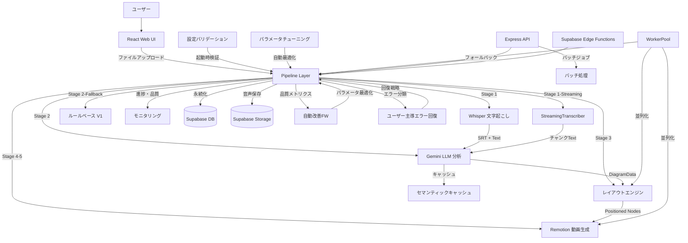

# speech-to-visuals アーキテクチャ設計


<!-- spine:anchor:begin -->
> **Spine anchor**: [Speech-to-Visuals システム憲法 V2.0](../../SYSTEM_CONSTITUTION.md)
>
> - parent: `SYSTEM_CONSTITUTION.md`
> - role: `feature_root`
> - status: `canonical_child`
<!-- spine:anchor:end -->

**作成日**: 2026-04-27
**最終更新**: 2026-08-06（第209回検証: NaN/Infinityガンド横展開完了・clampFinite Infinity対応・DiagramVideo時間単位バグ修正・property-based fuzz tests追加・11+モジュール坚牢化・570ファイル・543テストファイル・107パッケージ・REQ-270~273）
**関連要件定義**: [requirements.md](requirements.md)
**分析記録**: [design-interview.md](design-interview.md)

**【信頼性レベル凡例】**:

- 🔵 **青信号**: 要件定義書・既存設計文書・既存実装を参考にした確実な設計
- 🟡 **黄信号**: 要件定義書・既存設計文書・既存実装から妥当な推測による設計
- 🔴 **赤信号**: 参照資料にない自動推定による設計

---

## システム概要 🔵

**信頼性**: 🔵 *要件定義書・SYSTEM_CORE.md・README.md より*

音声ファイル（MP3/WAV/OGG/M4A）を入力として、Whisper による文字起こし、Gemini LLM による内容分析、図解タイプ自動検出（flow/tree/timeline/matrix/cycle/flowchart/comparison/network/conceptmap/mindmap/general の11種類）、ゼロオーバーラップレイアウト生成、Remotion によるアニメーション動画（1080p 30fps MP4）を自動生成するエンドツーエンドパイプラインシステム。

**主要実績値**（Phase 14 完了・97タスク完了）:
- エンドツーエンド処理時間: 25.2秒（1分音声、目標60秒以内）
- 成功率: 100%（目標95%以上）
- API コスト: $0.03/動画（目標$0.10以下）
- メモリ使用量: 82.21MB（目標512MB以下）
- ESLint エラー: 0（Phase 13 で113件→0件解消）
- TypeScript エラー: 0（Phase 13 で8件→0件解消）
- npm audit 脆弱性: 0（Phase 14 で解消）

## アーキテクチャパターン 🔵

**信頼性**: 🔵 *SYSTEM_CORE.md §3・CLAUDE.md より*

- **パターン**: 5層レイヤードアーキテクチャ + パイプラインパターン
- **選択理由**: 処理ステージごとの独立性を保証しつつ、段階的なデータ変換パイプラインを構築するため。各ステージ（文字起こし→分析→レイアウト→動画）は独立してテスト・フォールバック可能。

**5層構成**:
1. **Web UI Layer** - React + Vite + Tailwind + Remotion Player
2. **Pipeline Layer** - オーケストレーションと自動改善フレームワーク
3. **Processing Modules** - 文字起こし、分析、可視化、アニメーション
4. **Infrastructure Layer** - 監視、エラー回復、品質ゲート
5. **Data Layer** - キャッシュ、永続化、エクスポート

## コンポーネント構成

### フロントエンド 🔵

**信頼性**: 🔵 *note.md・package.json・src/components/ より*

- **フレームワーク**: React 18.3 + TypeScript 5.9
- **ビルドツール**: Vite 6.4
- **状態管理**: React Query（TanStack Query 5.100）+ React 状態
- **UIライブラリ**: Tailwind CSS 3.4 + shadcn/ui（20+ Radix UI コンポーネント）
- **ルーティング**: React Router DOM 6.30
- **動画プレビュー**: Remotion 4.0 Player
- **スキーマ検証**: Zod 3.25 🔵 *package.json より*
- **グラフ可視化**: Recharts 2.15 🔵 *src/monitoring/performance-dashboard.tsx より*
- **通知**: Sonner 2.0 🔵 *package.json より*
- **主要コンポーネント**: SimplePipelineInterface（メインUI）、EnhancedFileUploader（D&D）、ProcessingStatus、VideoRenderer、EnhancedVideoPreview、AudioUploader、GuardMetricsDashboard（セキュリティ観測ダッシュボード・`/security`ルート）🔵 *Phase 109 REQ-248 追加*
- **セキュリティ観測フック**: useExportGuardMetrics（5秒ポーリング・SecurityMetricsCollector 統合・Prometheus エクスポート）🔵 *Phase 109 REQ-248・src/hooks/useExportGuardMetrics.ts より*

### バックエンド 🔵

**信頼性**: 🔵 *note.md・package.json・src/api/ より*

- **フレームワーク**: Express 5.2（REST API サーバー）
- **リアルタイム通信**: Socket.IO 4.8（WebSocket ハンドラーで JWT 認証付きジョブルーム管理）🔵 *src/api/websocket-handler.ts・要件定義REQ-046 より*
- **認証方式**: Supabase Auth（JWT ベース）
- **API設計**: REST（バッチ処理API）+ Supabase Edge Functions
- **ミドルウェア**: express-rate-limit（レート制限: API 100req/15min, Upload 20req/15min, Export 10req/15min）、Helmet（セキュリティヘッダー）、CORS 🔵 *REQ-224 EXPORT rate limit 追加*
- **API構成**: src/api/middleware/（rate-limit, error-handler, auth）、src/api/routes/（batch, health, pipeline ルート定義）、src/api/startup-warmup.ts（起動時キャッシュウォームアップトリガー）🔵 *src/api/ より*
- **バッチ処理API**: REST エンドポイント（POST /batch/jobs でジョブ作成→HTTP 202、GET /batch/jobs/:id でステータス取得、DELETE /batch/jobs/:id でキャンセル）、セマフォパターンで最大3並列ジョブ制御 🔵 *src/api/routes/batch.ts・要件定義REQ-043 より*
- **WebSocket リアルタイム通知**: Socket.IO ベースのジョブ進捗・完了・エラー・ファイルステータス・ステージ進捗・ストリーミングセグメント・エラー回復イベントのリアルタイム配信。JWT 認証で接続保護、ジョブルーム（join:job/leave:job）による購読管理 🔵 *src/api/websocket-handler.ts・要件定義REQ-046 より*
- **起動時キャッシュウォームアップ**: Express サーバー起動完了後に triggerStartupWarmup() で LLMService.warmupCache() を非同期呼び出し（fire-and-forget パターン）。LLM サービス無効時はスキップ、失敗時はログ出力のみでサーバー動作に影響なし 🔵 *src/api/startup-warmup.ts・src/api/index.ts・Phase 43 より*
- **エラーリカバリREST API**: プログラマティックなエラー登録・回復オプション取得・戦略実行の3エンドポイント（POST /api/v1/errors/register・GET /api/v1/errors/:errorId/options・POST /api/v1/errors/:errorId/recover）。UserGuidedErrorRecovery を REST API 経由で利用可能にし、外部システムからのエラー回復をサポート。Phase 92 で入力検証を堅牢化: RegisterBodySchema（errorId 最大128文字・英数字ハイフンアンダースコアドット形式・errorMessage最大2000文字）・sanitizeMessage()（HTMLタグ除去によるXSS防御）・isValidErrorId() パスパラメータ形式検証・storeError() LRU退去（1000件上限で最古10%退去）・ERROR_REGISTRY_LIMITS 集中設定 🔵 *src/api/routes/errors.ts・要件定義REQ-037拡張・REQ-222 より*

### AI・処理モジュール 🔵

**信頼性**: 🔵 *SYSTEM_CORE.md §4・PIPELINE_FLOW.md・src/analysis/ より*

- **LLM**: Google Gemini AI（gemini-2.5-flash / gemini-2.5-pro）
- **音声認識**: Whisper（@remotion/install-whisper-cpp）
- **ブラウザ音声認識**: Web Speech API
- **ストリーミング文字起こし**: StreamingTranscriber（チャンク単位逐次処理、3秒チャンク・500msオーバーラップ）🔵 *src/transcription/streaming-transcriber.ts・要件定義REQ-036 より*
- **形態素解析**: Kuromoji 0.1（日本語）
- **グラフレイアウト**: @dagrejs/dagre 1.1
- **多言語検出**: 6言語対応（日本語・英語・中国語・スペイン語・フランス語・ドイツ語）・文字種別スコアリング・ダイアクリティカルマーク分析 🔵 *Phase 44 REQ-303・src/analysis/language-detector.ts より*
- **SimpleDiagramDetector**: ルールベース図解タイプ検出（flow/tree/timeline/cycle/network の5種類）・キーワードマッチングによる信頼度スコアリング・自己テスト機能（testDetector() が pass/fail 構造化結果を返す）・認識不可テキストのデフォルト要素生成フォールバック 🔵 *src/analysis/simple-diagram-detector.ts・436行のテスト追加*

### データベース 🔵

**信頼性**: 🔵 *supabase/migrations/・src/integrations/supabase/ より*

- **DBMS**: Supabase（PostgreSQL）
- **ストレージ**: Supabase Storage（`audio` バケット）
- **Edge Functions**: render-video, transcribe-audio, generate-scenes
- **共有認証モジュール**: JWT ベースの共有認証（Bearer トークン抽出・検証・期限切れ検出）、全 Edge Function で共通利用 🔵 *supabase/functions/_shared/auth.ts・要件定義REQ-044 より*
- **統一エラーハンドリング**: CORS ヘッダー管理・エラー分類・AbortController タイムアウト（デフォルト30秒）・必須フィールド検証 🔵 *supabase/functions/_shared/error-handler.ts・要件定義REQ-045 より*
- **セキュリティ**: Row Level Security（RLS）

### 自動改善フレームワーク 🔵

**信頼性**: 🔵 *src/framework/・SYSTEM_CORE.md §5 より*

- **自動改善エンジン**: パイプライン実行結果から改善点を自動検出・適用
- **継続学習システム**: 過去の処理結果から品質モデルを継続的に更新
- **イテレーション管理**: Phase ベースの改善サイクル管理（Phase 14 完了・97タスク完了）
- **再帰的指示処理**: カスタムインストラクションの再帰的な適用と最適化

### パイプラインモジュール 🔵

**信頼性**: 🔵 *src/pipeline/・PIPELINE_FLOW.md より*

- **SimplePipeline**: 基本パイプライン（文字起こし→分析→レイアウト）
- **MainPipeline**: 拡張パイプライン（品質監視・エラー回復付き）
- **FrameworkIntegratedPipeline**: イテレーション管理と自動改善エンジンを統合した自律パイプライン 🔵 *src/pipeline/framework-integrated-pipeline.ts より*
- **AdaptiveQualityPresets**: 処理品質プリセット（fast/balanced/quality/custom）による品質・速度トレードオフ 🔵 *src/pipeline/adaptive-quality-presets.ts より*
- **ImprovementDetector**: パイプライン結果から改善機会を自動検出 🔵 *src/pipeline/improvement-detector.ts より*
- **VideoGenerator**: SimplePipeline → Remotion 統合による動画生成 🔵 *src/pipeline/video-generator.ts より*
- **QualityMonitor**: ステージ別品質スコア追跡と品質ゲート判定 🔵 *src/pipeline/quality-monitor.ts より*
- **PipelineOrchestrator**: 5段階パイプライン（文字起こし→内容分析→レイアウト生成→動画準備→動画レンダリング）の統合実行、各ステージでの品質ゲート評価とフォールバック戦略実行、進捗コールバック通知 🔵 *src/pipeline/pipeline-orchestrator.ts・要件定義REQ-042 より*
- **SmokeOrchestrator**: 外部API呼び出しなしの軽量5ステージパイプライン（LLM JSON パース→シーン構築+キャプション同期→レンダープラン生成→エクスポート→ヘルスレポート）。マルチシーン逐次タイミング（buildMultiScenes）、コストデータ提供時のパイプライン健全性レポート自動生成を統合 🔵 *src/pipeline/smoke-orchestrator.ts より*
- **SceneRenderSpecGenerator**: SceneGraph[] から具体的レンダリング仕様（SceneRenderSpec）を生成。グローバルフレーム範囲・トランジションタイミング・コンテンツ表示準備フレームを計算。整合性検証（フレーム連続性・重複インデックス検出）付き 🔵 *src/pipeline/scene-render-spec-generator.ts より*
- **StageTimingMetrics**: パイプラインステージごとの実行タイミング記録。timeStage() による非同期ラッパー、aggregateTimingReport() による全ステージ集計レポート、スループット計算 🔵 *src/pipeline/stage-timing-metrics.ts より*
- **PipelineHealthScore**: ボトルネック検出・パフォーマンスリグレッション・コスト効率を統合した健全性スコア（0-100）。重み付け（Performance 40%・Bottleneck 35%・Cost 25%）による5段階グレード判定と改善推奨生成 🔵 *src/pipeline/pipeline-health-score.ts より*
- **CostEfficiencyMetrics**: 動画あたりコスト・分析あたりトークン数の効率計算とベースライン比較によるリグレッション検出 🔵 *src/pipeline/cost-efficiency-metrics.ts より*
- **ParallelBenchmark**: 並列 vs 逐次実行のスピードアップファクタ測定・ステージ別比較・Phase 36 ターゲット達成判定 🔵 *src/pipeline/parallel-benchmark.ts・要件定義REQ-099 より*
- **ParallelLayoutExecutor**: 複数図解レイアウトの並列生成（設定可能並列度・タイムアウト・オプションリトライ付き）・シーン準備並列化 🔵 *src/pipeline/parallel-layout-executor.ts・要件定義REQ-097 より*
- **PerformanceBaseline**: ステージ別ターゲット実行時間定義・Phase 36 ベースライン（transcription:3000ms, analysis:8000ms, layout:2000ms, rendering:15000ms）🔵 *src/pipeline/performance-baseline.ts・要件定義REQ-099 より*
- **PerformanceRegressionDetector**: ステージ別実行時間のベースライン比較・5%以上のリグレッション検出 🔵 *src/pipeline/performance-regression-detector.ts・要件定義REQ-099 より*
- **Retry**: 汎用リトライユーティリティ（ジッタ付き指数バックオフ・最大リトライ回数設定・ラベル付きログ出力）🔵 *src/pipeline/retry.ts より*

### エクスポートモジュール 🔵

**信頼性**: 🔵 *src/export/・PIPELINE_FLOW.md Stage 5 より*

- **MultiFormatExporter**: JSON/MP4/SVG/PNG/PDF の多形式エクスポート
- **EnhancedExportEngine**: 高度なエクスポートエンジン（フォーマット選択・プレビュー付き）🔵 *src/export/enhanced-export-engine.ts より*
- **ProductionExporter**: 本番環境向けエクスポート処理 🔵 *src/export/production-exporter.ts より*
- **ExportPanel**: React UI エクスポートコンポーネント（フォーマット選択・進捗表示・プレビュー）🔵 *src/export/export-ui.tsx より*
- **Worker対応**: WorkerPoolによるエクスポートレンダリングの並列化（遅延初期化・dispose/再利用ガード・フォールバック付き）🔵 *src/workers/export-worker.ts・要件定義REQ-061 より*
- **AnimatedSceneRenderer**: アニメーション付き SVG・Lottie JSON 生成の純粋関数モジュール（300行）。enhanced-export-engine から抽出し独立テスト可能に。generateAnimatedSVG() で CSS キーフレームアニメーション付き SVG（シーンタイプ別背景色・フォントサイズ・フェードイン/アウト）を、generateLottieAnimation() で Lottie 5.7.4 互換 JSON（シェイプレイヤー・不透明度キーフレーム・フレームオフセット計算）を生成。buildLayerShapes() でシーンタイプ別背景色矩形（intro=#1a1a2e/outro=#0f3460/content=#16213e）の視覚的形状を構築。空シーンフォールバック・XML エスケープ付き。Phase 91 で validateFrameInfo()（寸法クランプ: 1~7680px、不正値→1920x1080フォールバック）・clampSceneDuration()（継続時間クランプ: 最大3600秒、不正値→2秒）・SceneRendererValidationError による入力検証を追加 🔵 *src/export/animated-scene-renderer.ts・要件定義REQ-218~219・REQ-221 より*
- **エクスポートパイプライン統合テスト**: Phase 90 で E2E・結合・横断一貫性テストを追加。export-pipeline-e2e.test.ts（391行）が EnhancedExportEngine 経由のシーンデータ→SVG/Lottie フルパイプライン検証（CSS キーフレーム・背景色・Lottie 構造・エラー伝播）。renderer-engine-integration.test.ts（256行）が animated-scene-renderer→enhanced-export-engine の結合検証（データフロー完全性・シーンタイプ別委譲・フォーマット別委譲切替）。cross-format-consistency.test.ts（23テスト）が SVG↔Lottie 横断一貫性検証（シーン数・ラベル順序・色マッピング・タイミング・寸法の完全パリティ確認）🔵 *tests/integration/・TASK-0199~0201 より*
- **ExportVerifier 拡張**: Phase 93 で APNG・Lottie 検証を追加。verifyApngChunks() が acTL（Animation Control）チャンク存在確認・numFrames 正値検証・fcTL（Frame Control）チャンク数との整合性チェックを実行。verifyLottie() が必須ルートフィールド（v・fr・ip・op・w・h・layers）検証・fr正値・op>ip・w/h正値・layers配列各要素ty型フィールド検証（deepValidation時）を実行。VerificationFormat に 'lottie' を追加 🔵 *src/export/export-verifier.ts・REQ-223 より*
- **ExportJobQueue**: Phase 99 計画。優先度ベースジョブキューサービス。high/normal/low の3段階優先度スケジューリング・セマフォパターン同時実行制御（デフォルト3）・キュー位置追跡とETA推定（平均処理時間×前方ジョブ数）・フェアスケジューリング（低優先度飢餓防止・30秒間隔昇格）・ExportMetricsCollector queue_* イベント統合 🔵 *src/export/export-job-queue.ts・REQ-229 計画*
- **ExportArtifactStore**: Phase 100 完了。エクスポート成果物ストレージ管理。TTLベース自動クリーンアップ（デフォルト1時間・定期削除）・LRU退去（1GB/1000件クォータ超過時）・有効期限付きダウンロードURL生成（デフォルト5分）・使用量追跡（総バイト数・アーティファクト数・フォーマット別分布）・ExportMetricsCollector artifact_* イベント統合 🔵 *src/export/export-artifact-store.ts・REQ-230・26テスト*

### Web Workers 並列化モジュール 🔵

**信頼性**: 🔵 *src/workers/・Phase 20 TASK-0114~0116 より*

Phase 20 で実装された Web Workers 並列化基盤:

- **WorkerPool**: 汎用ワーカープール管理クラス（worker再利用・タスクキューイング・異常終了時自動再生成・terminate()リソース解放）🔵 *src/workers/worker-pool.ts より*
- **Worker型定義**: WorkerMessage<T>/WorkerResponse<T> 型による型安全なメッセージ通信 🔵 *src/workers/types.ts より*
- **WorkerFactories**: エクスポート・レイアウト用Worker生成ファクトリ（Vite import.meta.url によるWorker URL解決）🔵 *src/workers/worker-factories.ts より*
- **ExportWorker**: エクスポートレンダリングWorker（フレーム数計算・サイズ推定・フォーマット別バリデーション）🔵 *src/workers/export-worker.ts より*
- **LayoutWorker**: レイアウトノード配置計算Worker（BFSベース階層レイアウト・TB/LR方向対応・非連結グラフ対応）🔵 *src/workers/layout-worker.ts より*
- **フォールバック機構**: Worker利用不可環境（SSR等）でのメインスレッド実行への自動フォールバック 🔵 *src/workers/worker-pool.ts isWorkerAvailable() より*

### 品質保証システム 🔵

**信頼性**: 🔵 *src/quality/・PIPELINE_FLOW.md §6-7・QUALITY_METRICS.md より*

- **品質モニタリング**: ステージごとの品質スコア追跡と品質ゲート判定
- **エラー回復**: 拡張エラー回復（3層フォールバック + 低品質設定再試行）+ 多層エラー回復システム（7モジュール: RecoveryStrategyChain・PipelineRunRecoveryTracker・BatchOperationRecovery・ErrorRecoveryHealthTracker・ErrorRecoveryEventBus・ErrorRecoveryMonitor・PipelineErrorRecoveryOrchestrator）🔵 *Phase 57 追加*
- **適応型品質ゲート**: コンテンツ複雑度に応じた動的な品質基準調整
- **リグレッション検出**: >5%劣化でデプロイブロック、>2%でクリティカルアラート
- **ユーザー主導エラー回復**: エラー発生時のユーザーガイダンス提供（11カテゴリのエラー分類、自動/手動回復戦略の選択、回復成功率追跡）🔵 *src/quality/user-guided-error-recovery.ts・要件定義REQ-037 より*
- **エラー分類器**: 11種類のエラータイプ（FILE_FORMAT_INVALID/FILE_SIZE_EXCEEDED/LLM_API_ERROR/LLM_RATE_LIMITED/LLM_TIMEOUT/RENDERING_ERROR/RENDERING_OOM/NETWORK_ERROR/STORAGE_ERROR/QUALITY_GATE_FAILED/UNKNOWN）を4段階重大度（low/medium/high/critical）で分類、復旧可能性判定・推奨アクション生成・分類統計追跡 🔵 *src/quality/error-classifier.ts・要件定義REQ-040 より*
- **品質ゲート評価器**: 5段階パイプライン（文字起こし→分析→レイアウト→レンダリング準備→レンダリング）の各ステージに対して品質ゲート評価、基準未達時のブロック・フォールバックアクション実行、5%以上の品質低下でリグレッション検出 🔵 *src/quality/quality-gate.ts・要件定義REQ-041 より*
- **グレースフルシャットダウン**: シャットダウン要求時にアクティブリクエストの完了を最大30秒待機、ヘルスモニタリング停止・リクエストキュークリア・サーキットブレーカーリセットによる安全終了 🔵 *src/quality/enhanced-error-recovery.ts shutdown()・要件定義REQ-050 より*
- **型ガード・型安全性**: DiagramType（11種類）の実行時検証を行う isDiagramType() 関数により、不正な図解タイプ値を検出・排除 🔵 *src/types/diagram.ts・要件定義REQ-051 より*
- **型付きパイプラインエラー**: PipelineError 基底クラスと6種類のサブクラス（TranscriptionError/SegmentationError/RenderingError/QualityGateError/PipelineConfigError/PipelineAbortError）に加え、ExportError・EncodingError・FormatValidationError・VisualizationError・MonitoringError の12クラスによる構造化エラー管理。事前分類済みエラータイプ・ステージ・コンテキストを含み、ErrorClassifier での正規表現マッチングを回避。Phase 60 で全パイプラインモジュールのraw Error throw置換完了（計21箇所）。Phase 61 で品質モジュール8箇所、Phase 63 でエクスポートモジュール12箇所、Phase 65 で残存モジュール7箇所、Phase 66後 に可視化モジュール9箇所・文字起こしモジュール9箇所の型付きエラー移行完了。残存raw Error throw 4箇所（API:3・hooks:1）🔵 *src/pipeline/pipeline-errors.ts・Phase 56~69 より*
- **PipelineAbortError**: PipelineOrchestrator の中断条件（品質ゲート失敗・リカバリ限界超過）でスローされる構造化中断エラー。PipelineError を継承し、errorType=QUALITY_GATE_FAILED・stage=abort を自動設定。ErrorClassifier が正確にトリアージ可能 🔵 *src/pipeline/pipeline-errors.ts・要件定義REQ-154 より*
- **ErrorClassifier 事前分類サポート**: PipelineErrorLike 型検出による事前分類済みエラーの高速ルーティング。isPipelineErrorLike() 型ガードで ErrorClassifier.classify() が正規表現マッチングをバイパス可能に 🔵 *src/quality/error-classifier.ts・Phase 56 より*

### 多層エラー回復システム 🔵 【Phase 57 追加】

**信頼性**: 🔵 *src/quality/・src/pipeline/・TASK-0045 より*

Phase 57 で追加実装された多層エラー回復システム（7モジュール）:

- **RecoveryStrategyChain**: コンポーザブルな順次フォールバックチェーン。単一の最適戦略を選ぶ EnhancedErrorRecovery とは異なり、複数戦略を順序付きチェーンとしてレイヤー化し、成功するまで順に試行。per-stage 戦略チェーン・設定可能な停止条件（最大時間バジェット・信頼度閾値）・チェーン効果追跡・ErrorRecoveryEventBus 統合によるリアルタイム可観測性を提供 🔵 *src/quality/recovery-strategy-chain.ts・TASK-0045 より*
- **PipelineRunRecoveryTracker**: パイプライン実行単位のエラー回復コーディネーター。EnhancedErrorRecovery がステージレベルの障害をグローバルに処理するのに対し、このトラッカーは cross-stage エラー蓄積・相関・蓄積コンテキストに基づく適応回復判断・実行レベルの劣化レベル追跡・per-run 回復レポート生成を実行。リトライ予算・劣化ステージを追跡し、下流ステージへの推奨を提供 🔵 *src/quality/pipeline-run-recovery-tracker.ts・TASK-0045 より*
- **BatchOperationRecovery**: バッチパイプラインステージでの per-item エラーバウンダリ。ステージが複数アイテム（N個の図解レイアウト生成・M個のシーン準備等）を処理する際の粒度の細かい回復。個別アイテム失敗を分離し、部分成功を保持。逐次・並列処理双方対応・設定可能リトライ制限・指数バックオフ付き 🔵 *src/quality/batch-operation-recovery.ts・TASK-0045 より*
- **ErrorRecoveryHealthTracker**: EnhancedErrorRecovery システムの健全性を時系列で監視。パイプラインステージごとのローリング健全性スコアを計算し、劣化パターンを検出。エラー頻度・サーキットブレーカー状態・回復成功率に基づく per-stage 健全性スコア算出。パイプライン監視ダッシュボード・事前アラート統合 🔵 *src/quality/error-recovery-health-tracker.ts・TASK-0045 より*
- **ErrorRecoveryEventBus**: EnhancedErrorRecovery 内部を外部コンシューマー（WebSocket 進捗・監視ダッシュボード・アラート）に橋渡しする軽量 pub/sub イベントバス。サーキットブレーカー状態遷移・回復戦略試行/結果・ステージ劣化検出・動的キャパシティ調整・エラーカスケード検出の型付きイベントを発行 🔵 *src/quality/error-recovery-event-bus.ts・TASK-0045 より*
- **ErrorRecoveryMonitor**: ErrorRecoveryHealthTracker（定期サンプリング・ローリングスコア）・ErrorRecoveryEventBus（型付きライフサイクルイベント）・EnhancedErrorRecovery（基盤エンジン）を統合するランタイム健全性監視サービス。API サーバーまたは PipelineOrchestrator と共に起動し、劣化アラート・キャパシティ調整・カスケード警告をイベントバス経由でリアルタイム配信 🔵 *src/quality/error-recovery-monitor.ts・TASK-0045 より*
- **PipelineErrorRecoveryOrchestrator**: 上記6モジュールを統合するトップレベルコーディネーター。startRun→executeStage→finalizeRun のライフサイクルでパイプライン実行を管理し、単一ステージ実行時に戦略チェーン→EnhancedErrorRecoveryバウンダリの順でフォールバック。バッチステージ（executeBatchStage）での per-item エラー分離・run tracker による適応型戦略推奨・イベントバス経由のライフサイクル観測を統合 🔵 *src/quality/pipeline-error-recovery-orchestrator.ts・Phase 57 より*

### プロダクション監視 🔵

**信頼性**: 🔵 *src/monitoring/・QUALITY_METRICS.md §4 より*

- **プロダクションモニタ**: リアルタイムパフォーマンス監視（P50/P95/P99レイテンシ）
- **パフォーマンスダッシュボード**: 処理時間・成功率・エラー率の可視化。パーセンタイル計算（P50/P95/P99）・入力検証付き 🔵 *Phase 66 REQ-172 より*
- **ヘルスチェックサービス**: 各コンポーネント（メモリ・キャッシュ・パイプライン・LLM・エラー回復・パフォーマンス傾向）の健全性確認。Kubernetesスタイルのliveness/readiness probe対応（GET /api/v1/health/live・/health/ready）🔵 *Phase 82 REQ-207 より*
- **プロダクションエラーハンドリング**: 本番環境向けの構造化エラー処理（69テストで検証済み）🔵 *Phase 66 REQ-173 より*
- **リアルタイムパフォーマンスモニタ**: メトリクス収集・アラート閾値監視・トレンド分析（48テストで検証済み・cacheHitRate閾値反転バグ修正）🔵 *Phase 66 REQ-174 より*
- **HTTPメトリクス収集**: per-route リクエスト数・レイテンシパーセンタイル（P50/P95/P99）・エラーレート・スローリクエスト検出・アクティブリクエスト追跡。bounded circular buffer（max 1000 samples/route）によるメモリ安全設計 🔵 *Phase 80 REQ-205 より*
- **Prometheusメトリクスエクスポーター**: HTTPメトリクスをPrometheus互換フォーマット（text/plain version=0.0.4）でエクスポート。6メトリクス（http_requests_total, http_request_duration_ms, http_errors_total, http_active_requests, http_slow_requests_total, process_uptime_ms）・ラベルサニタイズ・カスタムプレフィックス 🔵 *Phase 81 REQ-206 より*
- **Grafanaダッシュボードモデル**: Grafana互換ダッシュボードJSON model生成。8パネル（HTTP Latency Distribution・Error Rate Trends・Pipeline Success Rate・Slow Requests・Active Requests・Process Uptime・Request Volume・Errors by Route）・PromQL式によるメトリクス可視化・Grafana import形式出力 🔵 *Phase 83 REQ-208 より*
- **Prometheusアラートルール**: 閾値ベースアラート4ルール（HighErrorRate: error rate > 5% critical・HighLatencyP95: P95 > 20s warning・HealthCheckFailures: ≥ 3 failures critical・LLMBudgetOverage: budget warning）・AlertManager YAML形式出力 🔵 *Phase 83 REQ-209 より*
- **監視エクセレンス**: 品質メトリクスの継続的な追跡とレポート
- **監視APIデプロイメント統合**: GrafanaダッシュボードJSON（GET /api/v1/monitoring/dashboard）・PrometheusアラートルールYAML（GET /api/v1/monitoring/alerts）の配信API・CI/CDパイプラインからの自動デプロイ対応・設定可能パラメータ（datasource/refresh/prefix）🔵 *Phase 84 REQ-210~211 より*
- **監視エンドポイントZodクエリ検証**: GET /api/v1/monitoring/dashboard・/alerts・/trends エンドポイントのクエリパラメータを Zod スキーマ（DashboardQuerySchema・AlertsQuerySchema・TrendsQuerySchema）で検証。refreshInterval (1000-86400000ms)・severity (info/warning/critical)・period (1h/6h/24h/7d/30d) の型安全な検証と400エラーレスポンス 🔵 *src/api/routes/monitoring.ts・要件定義REQ-216 より*
- **LLM応答図解構造検証**: Gemini LLM から返却された図解データの構造を createEnhancedParser() で検証。不正ノード（ID欠損・空ID）・重複ノード（同一ID）・自己ループエッジ（from === to）・重複エッジ（同一 from→to ペア）・孤立エッジ（存在しないノードID参照）を自動フィルタリング。各検証で警告ログ出力、最初の出現を保持 🔵 *src/analysis/gemini-analyzer.ts・要件定義REQ-217 より*

### LLMコスト・トークン監視 🔵 【Phase 36 追加】

**信頼性**: 🔵 *src/analysis/token-usage-tracker.ts・src/analysis/cost-estimator.ts・src/analysis/budget-alert.ts・要件定義REQ-097~100 より*

Phase 36 で追加実装された LLM 呼び出しコスト・トークン監視システム:

- **TokenUsageTracker**: LLM API 呼び出しごとの入力/出力トークン記録（ステージ別: analysis/fallback/cache-warmup・モデル別: flash/pro）🔵 *src/analysis/token-usage-tracker.ts・要件定義REQ-098 より*
- **CostEstimator**: Gemini 公式料金（Flash: $0.075/M input, $0.30/M output / Pro: $1.25/M input, $5.00/M output）に基づくコスト推定、ステージ別コスト内訳 🔵 *src/analysis/cost-estimator.ts・要件定義REQ-098 より*
- **BudgetAlertSystem**: セッション/日次予算追跡・設定可能アラート閾値（デフォルト80%）・コールバック通知システム・予算リセット機能 🔵 *src/analysis/budget-alert.ts・要件定義REQ-098 より*
- **LLMResponse 拡張**: per-request メトリクス（usage.promptTokens/usage.completionTokens/usage.totalTokens・estimatedCost）を LLMResponse 型に統合 🔵 *要件定義REQ-098 より*
- **監視 REST API**: GET /api/v1/monitoring/{metrics|cost|trends|health} による外部アクセス可能なダッシュボードメトリクス・LLMコスト・パフォーマンストレンド・ヘルスチェック 🔵 *src/api/routes/monitoring.ts・要件定義REQ-100 より*
- **パイプライン並列化**: ParallelStageExecutor によるステージ並列実行・ボトルネック検出 🔵 *src/pipeline/・要件定義REQ-097 より*

### コード規模自動監査 🔵 【Phase 37 完了】

**信頼性**: 🔵 *SYSTEM_CONSTITUTION V2.4・要件定義REQ-102 より*

Phase 37 で実装済みのコード規模自動監査:

- **コード規模監査スクリプト**: ビルド時またはCI で SYSTEM_CONSTITUTION 制限値（ファイル数340以下・行数100K以下）を自動チェック 🔵 *src/config/code-size-audit.ts・scripts/code-size-audit.ts より*
- **監視API本番動作検証**: サーバー起動時のルート登録完了ログ出力・全エンドポイント統合テスト通過確認 🔵 *src/api/routes/monitoring.ts・TASK-0146/0147 完了済*

### エラーリカバリ可観測性 🔵 【Phase 77 追加】

**信頼性**: 🔵 *src/quality/recovery-telemetry-aggregator.ts・src/api/routes/monitoring.ts・要件定義REQ-198~199 より*

Phase 77 で追加実装されたエラーリカバリ可観測性:

- **RecoveryTelemetryAggregator**: ErrorRecoveryEventBus の recovery:success・recovery:failure・stage:degraded・cascade:detected イベントをサブスクライブし、スライディングウィンドウ（デフォルト5分）でテレメトリ集計。ステージ別成功率・平均/P95リカバリ時間・エラータイプ分布・10%以上の成功率低下検知を提供 🔵 *src/quality/recovery-telemetry-aggregator.ts・要件定義REQ-199 より*
- **エラーリカバリテレメトリ API**: `GET /api/monitoring/error-recovery` エンドポイント。RecoveryTelemetryAggregator のスナップショット（総イベント数・全体成功率・平均/P95リカバリ時間・ステージ別統計・劣化アラート・エラータイプ分布）を JSON で返却 🔵 *src/api/routes/monitoring.ts・要件定義REQ-198 より*

**信頼性**: 🔵 *src/analysis/language-detector.ts・要件定義REQ-303 より*

Phase 44 で実装された多言語検出拡張:

- **対応言語**: 日本語(ja)・英語(en)・中国語(zh)・スペイン語(es)・フランス語(fr)・ドイツ語(de)の6言語 🔵 *Language型拡張より*
- **文字種別分類**: ひらがな/カタカナ（日本語）とCJK漢字（中国語）の分離検出 🔵 *language-detector.ts より*
- **ダイアクリティカルマーク分析**: スペイン語（ñ, á-ú）・フランス語（é, è, ê, ç）・ドイツ語（ä, ö, ü, ß）の特徴的文字による識別 🔵 *language-detector.ts より*
- **プロンプトテンプレート拡張**: 中国語向け GeminiAnalyzer・ContentAnalyzer プロンプト追加 🔵 *src/analysis/prompt-templates.ts より*
- **言語セグメンテーション**: LanguageDetectionResult に各言語比率・信頼度スコア・セグメント情報を追加 🔵 *src/analysis/language-detector.ts より*

### HealthCheckService 本番堅牢化 🔵 【Phase 51 追加】

**信頼性**: 🔵 *src/monitoring/health-check-service.ts・要件定義REQ-131 より*

Phase 51 で実装されたヘルスチェックサービス堅牢化:

- **コンポーネントチェック try-catch**: 全6コンポーネント（メモリ・キャッシュ・パイプライン・LLM・エラー復旧・パフォーマンス傾向）に try-catch ガード追加 🔵 *checkCacheHealth/checkPipelineHealth/checkLLMHealth/checkErrorRecoveryHealth/checkPerformanceHealth より*
- **縮退ステータス**: バックエンド例外時に "degraded" ステータスを返し、ヘルスチェック全体がクラッシュしない設計 🔵 *各コンポーネントチェックの fallback ロジックより*
- **フォールバックメトリクス**: performHealthCheck で PerformanceSnapshot 構築時のフォールバック値設定 🔵 *performHealthCheck メソッドより*

### 集中制限設定・ファイル名サニタイズ 🔵 【Phase 52 追加】

**信頼性**: 🔵 *src/config/limits.ts・src/utils/sanitize.ts・要件定義REQ-132~134 より*

Phase 52 で実装されたセキュリティ強化と設定集約:

- **集中制限設定**: ISS-044 対応。散在していたマジックナンバーを `src/config/limits.ts` に集約。RATE_LIMITS（API: 100req/15min, UPLOAD: 20req/15min）、BATCH_LIMITS（MAX_CONCURRENT_JOBS: 3, MAX_STORED_JOBS: 200, MAX_FILES_PER_BATCH: 100）、PIPELINE_LIMITS（MAX_SCENES: 200, MAX_ITERATIONS: 500, MAX_OUTPUT_NAME_LENGTH: 255）、SECURITY_LIMITS（JWT_SECRET_MIN_LENGTH: 32）の4群定義。全定数 `as const` で型安全性確保 🔵 *src/config/limits.ts より*
- **ファイル名サニタイズ**: `sanitizeFilename()` 関数によるパストラバーサル・nullバイト注入・制御文字攻撃対策。ディレクトリセパレータ(`/\`)→`_`置換、`..`除去、nullバイト除去、制御文字(0x00-0x1F, 0x7F)除去、先頭ドット除去、空結果フォールバック(`"unnamed"`) 🔵 *src/utils/sanitize.ts より*
- **パイプラインルート統合**: pipeline.ts でマジックナンバーを PIPELINE_LIMITS 定数に置換、インライン正規表現を sanitizeFilename() に置換 🔵 *src/api/routes/pipeline.ts より*
- **BatchOptimizer テスト拡充**: 295行の包括的ユニットテスト追加（基本並列処理・フェイルファスト・進捗コールバック・統計情報・スライディングウィンドウ並列性・AbortSignalキャンセル）🔵 *tests/unit/optimization/batch-optimizer.test.ts より*

### 音声時間計測・コンポーネントテスト 🔵 【Phase 54 追加】

**信頼性**: 🔵 *src/utils/audio-duration.ts・src/components/StageIndicator.tsx・src/config/limits.ts・要件定義REQ-139~141 より*

Phase 54 で実装されたコンポーネント・ユーティリティテスト拡充:

- **音声時間計測ユーティリティ**: `getAudioDuration()` 関数（HTMLAudioElement loadedmetadata イベント・ObjectURL 生成/解放・preload='metadata' 最適化）と `formatDuration()` 関数（秒/分/時間フォーマット・Infinity/負値ガード）によるクライアントサイド音声時間取得 🔵 *src/utils/audio-duration.ts より*
- **AUDIO_LIMITS 設定値**: 50MB 最大ファイルサイズと 3600秒（1時間）警告閾値の as const 定義。EDGE-103（1時間超音声の事前警告）の実装基盤 🔵 *src/config/limits.ts AUDIO_LIMITS より*
- **StageIndicator ヘルパー関数**: calcElapsed（経過時間計算・null開始時0返却・負値クランプ）・formatElapsed（秒/分/時間フォーマット）・STAGE_CONFIG/STATUS_LABEL/STATUS_BADGE_VARIANT（全ステータスカバー設定定数） 🔵 *src/components/StageIndicator.tsx より*

### パイプライン音声入力検証統合 🔵 【Phase 55 追加】

**信頼性**: 🔵 *src/utils/audio-validation.ts・src/components/SimplePipelineInterface.tsx・src/config/limits.ts・要件定義REQ-142~143 より*

Phase 55 で実装されたパイプライン音声入力検証の統合:

- **validateAudioFile**: File オブジェクトのサイズ上限（EDGE-101: 50MB）・空ファイル検出（EDGE-001）・対応形式（MIME type + 拡張子）検証を一元化。SimplePipelineInterface のファイル選択ハンドラに統合 🔵 *src/utils/audio-validation.ts より*
- **validateAudioDuration**: 音声再生時間の下限（EDGE-102: 1秒未満拒否）・長時間警告（EDGE-103: 1時間超過警告）・無効値（NaN/Infinity/負数）検出を一元化。SimplePipelineInterface の非同期チェックに統合 🔵 *src/utils/audio-validation.ts より*
- **UI統合**: SimplePipelineInterface の検証ロジックをインラインから validateAudioFile/validateAudioDuration に置換。EDGE-102 の1秒未満拒否が UI に新規追加 🔵 *src/components/SimplePipelineInterface.tsx より*

### リソースリーク防止・ログ正規化 🔵 【EDGE-008~011 追加】

**信頼性**: 🔵 *src/components/ErrorAlertSystem.tsx・src/visualization/layout/OverlapResolver.ts・src/export/enhanced-export-engine.ts・src/utils/logger.ts より*

EDGE-008~011 で実装されたリソース管理・ログ品質の改善:

- **EDGE-008: React timer leak修正** 🔵: ErrorAlertSystem.tsx の `setTimeout` が React state updater 内で呼ばれるアンチパターンを修正。`useRef<Set<ReturnType<typeof setTimeout>>>` で全タイマーを追跡し、unmount 時に一括クリア。5テスト追加（tests/components/error-alert-system-timer.test.ts）
- **EDGE-009: Promise.race timer leak修正** 🔵: OverlapResolver.ts の `applyStrategyWithTimeout` で `setTimeout` が戦略完了時にクリアされない問題を修正。`.finally(() => clearTimeout(timer))` を追加。2テスト追加（tests/visualization/overlap-resolver-timer-cleanup.test.ts）
- **EDGE-010: AbortSignal listener leak修正** 🔵: enhanced-export-engine.ts の `encodeVideoWithRetry` リトライ遅延 Promise で、タイマー勝利時に `AbortSignal.removeEventListener` を呼び出すよう修正。3テスト追加（src/export/__tests__/export-abort-listener-cleanup.test.ts）
- **EDGE-011: console.error → logger.error 正規化** 🔵: 全プロダクションコードの `console.error` を `logger.error` に統一。対象: memory-cache.ts, budget-alert.ts, production-monitoring-excellence.ts, error-recovery-event-bus.ts, performance-dashboard.ts, real-time-performance-monitor.ts。logger.ts形式: `[ERROR] ${message}`（下流ログ消費者への影響なし・構造化ログパーサー不存在・Prometheus メトリクスは別経路）
- **非推奨Jestフラグ置換** 🔵: Jest 30.4.1 で `--testPathPattern` → `--testPathPatterns` に置換。CI互換性確保
- **overlap-resolver テストバグ修正** 🔵: `applyStrategyWithTimeout` テストで `this.startTime` 未初期化によるタイムアウト計算負値化を修正

### ライフサイクル管理・パイプライン堅牢化 🔵 【EDGE-012~016 追加】

**信頼性**: 🔵 *src/monitoring/health-check-service.ts・src/performance/real-time-performance-monitor.ts・src/monitoring/production-monitoring-excellence.ts・src/lib/actualVideoRenderer.ts・src/pipeline/main-pipeline.ts・src/components/VideoRenderer.tsx より*

第202回~203回検証で実装されたコンポーネントライフサイクル管理・パイプライン実行時バグ修正:

- **EDGE-012: HealthCheckService destroy()追加** 🔵: setInterval ID をインスタンスフィールドで追跡し、destroy() 呼出でクリア。クラスとしてエクスポート（型のみから変更）。46テスト追加（tests/health-check-service.test.ts）
- **EDGE-013: RealTimePerformanceMonitor stop()追加** 🔵: snapshotIntervalId をフィールドで追跡し、stop() でクリア。メモリリーク防止
- **EDGE-014: ProductionMonitoringExcellence destroy()追加** 🔵: 全 intervalId を追跡・destroy() で一括クリア・monitoringEnabled=false 設定。ProductionConfigManager クラスエクスポート追加
- **EDGE-015: actualVideoRenderer シーンduration蓄積バグ修正** 🔵: 複数シーン動画で scene.durationMs を蓄積せず Math.max デフォルト値（10s）を使用していたバグを修正。各シーンの startTime/endTime を前シーン終了時刻から累積計算。6テスト追加（tests/actualVideoRenderer-duration.test.ts）
- **EDGE-016: VideoRenderer mounted guard追加** 🔵: async render コールバックで unmount 後の setState を防止する mountedRef + useEffect cleanup パターンを追加。4テスト追加（tests/video-renderer-cleanup.test.tsx）
- **main-pipeline silent catch修正** 🔵: リカバリエラーの catch { return false } を logger.error 呼出に変更（src/pipeline/main-pipeline.ts:1171）

### EnhancedErrorRecovery 5戦略 silent catch修正 🔵 【第202回検証】

**信頼性**: 🔵 *src/quality/enhanced-error-recovery.ts・src/api/routes/monitoring.ts より*

- **intelligent_retry / degraded_quality / cache_recovery / alternative_algorithm / minimal_viable_output** の5戦略でサイレントcatch → logger.error() に統一（REQ-258）
- 監視APIルート sendError 500エラー時に logger.error 呼出追加（REQ-259/262）・5テスト追加
- BatchOperationRecovery テスト追加（REQ-260）: 逐次/並行/リトライ/フォールバック/集計統計/エッジケース・39テスト
- ErrorRecoveryMonitor テスト追加（REQ-261）: ライフサイクル/サンプリング/アラート計算/リセット・21テスト

### Phase 113 NaN/Type Safety コンソリデーション 🔵 【第203回検証】

**信頼性**: 🔵 *src/analysis/diagram-detector.ts・src/analysis/scene-segmenter.ts より*

- diagram-detector/scene-segmenter サニタイゼーションガード追加（REQ-263~266）
- NaN/Type Safety コンソリデーション完了・w/h移行6ファイル
- 32新規テスト追加

### 最適化・パフォーマンス 🔵

**信頼性**: 🔵 *src/optimization/・src/performance/・QUALITY_METRICS.md より*

- **スマートパラメータチューニング**: 音声特性分析（語速・複雑度・ドメイン・音質・キーワード密度）に基づくパラメータ自動最適化、履歴学習（learningRate=0.1）付き 🔵 *src/optimization/smart-parameter-tuner.ts・要件定義REQ-039 より*
- **適応型コンテンツ処理**: コンテンツ特性に応じた処理戦略自動選択（fast/balanced/accurate）、指紋ベース戦略キャッシュ付き 🔵 *src/optimization/adaptive-content-processor.ts・要件定義REQ-039 より*
- **インテリジェントキャッシュ**: セマンティックキャッシュ（類似度0.9、200エントリ）と処理結果キャッシュ
- **バッチ最適化**: 並列チャンク処理（設定可能な並列度・チャンクサイズ・フェイルファスト・進捗コールバック）による大量データの効率的処理 🔵 *src/optimization/batch-optimizer.ts・要件定義REQ-047 より*
- **計算キャッシュ**: 高コストな計算結果のメモ化（TTL有効期限・タグベース無効化・LRU退行・最大200エントリ）、async/sync両対応 🔵 *src/optimization/computation-cache.ts・要件定義REQ-048 より*
- **メモリキャッシュ**: 汎用LRUメモリキャッシュ（設定可能最大サイズ・TTL・定期クリーンアップ・ヒット率統計）🔵 *src/optimization/memory-cache.ts・要件定義REQ-048 より*
- **遅延ローダー**: 重いモジュールの動的インポートキャッシュ（同時ロード重複排除・プリロード・無効化・統計情報）🔵 *src/optimization/lazy-loader.ts・要件定義REQ-049 より*
- **キャッシュウォームアップ**: セマンティックキャッシュのコールドスタート検出、代表的なクエリパターン（英語・日本語）による事前キャッシュ充填、ウォームアップ前後のヒット率改善を統計追跡 🔵 *src/optimization/cache-warmup.ts・要件定義REQ-056 より* 【Phase 8 追加】
- **起動時キャッシュウォームアップ**: LLMService への CacheWarmupManager 統合（warmupCache/getCacheWarmupStats/getCacheHitRateReport メソッド追加）、起動時非ブロッキングウォームアップトリガー（startup-warmup.ts）、LLM クエリごとのヒット/ミス自動追跡 🔵 *src/analysis/llm-service.ts・src/api/startup-warmup.ts・Phase 43 実装より*

### パイプライン API エンドポイント 🔵

**信頼性**: 🔵 *src/hooks/useFrameworkPipeline.ts・src/components/pipeline-interface.tsx・要件定義REQ-057 より*

Phase 8 で追加実装されたパイプライン操作用 REST API:

- **POST /api/render**: 動画レンダリングトリガー（シーンデータ→MP4生成）。exportRateLimiter（10req/15min/IP）適用済。codec 列挙型検証（h264/h265/vp9/av1）・resolution 正規表現検証（WIDTHxHEIGHT 形式）付き 🔵 *要件定義REQ-057・REQ-224 より*
- **POST /api/git/commit**: フレームワークパイプラインの自動コミット実行 🔵 *要件定義REQ-057 より*
- **GET /api/iteration-log**: イテレーションログ取得（品質メトリクス・改善履歴）🔵 *要件定義REQ-057 より*
- **GET /api/framework/status**: フレームワーク実行ステータス取得（現在フェーズ・品質スコア・改善推奨）🔵 *要件定義REQ-057 より*

**フロントエンド統合**: useFrameworkPipeline カスタムフック経由で PipelineInterface.tsx・FrameworkDashboard.tsx から呼び出し 🔵

### Remotion 動画モジュール 🔵

**信頼性**: 🔵 *src/remotion/・PIPELINE_FLOW.md Stage 4-5・要件定義REQ-025~REQ-030 より*

Phase 4 で実装された Remotion 4.0 ベースのアニメーション・レンダリングモジュール:

- **DiagramVideo.tsx**: メイン動画コンポジション（シーン切り替え・音声統合）🔵 *src/remotion/DiagramVideo.tsx より*
- **DiagramScene.tsx**: 図解シーンレンダラー（戦略ベースのアニメーション適用）🔵 *src/remotion/DiagramScene.tsx より*
- **NodeAnimation.tsx**: ノードフェードインアニメーション（0.3秒、opacity 0→1、scale 0.8→1.0）🔵 *src/remotion/NodeAnimation.tsx・要件定義REQ-025 より*
- **EdgeAnimation.tsx**: エッジSVGパス描画アニメーション（0.5秒、stroke-dasharray/dashoffset）🔵 *src/remotion/EdgeAnimation.tsx・要件定義REQ-026 より*
- **CaptionOverlay.tsx**: SRTキャプションオーバーレイ表示（フレーム精度）🔵 *src/remotion/CaptionOverlay.tsx より*
- **animation-strategies.ts**: 図解タイプ別（flow/tree/timeline/matrix/cycle）アニメーション戦略自動選択 🔵 *src/remotion/animation-strategies.ts・要件定義REQ-027 より*
- **scene-synchronizer.ts**: SRTキャプションとシーンアニメーションの同期（精度±50ms、ドリフト検出）🔵 *src/remotion/scene-synchronizer.ts・要件定義REQ-029 より*
- **srt-parser.ts**: SRTファイルパーサー（タイムスタンプ→フレーム番号変換、整合性検証）🔵 *src/remotion/srt-parser.ts・要件定義REQ-028 より*
- **renderer.ts**: Remotion renderMedia() による動画レンダリング（720p/1080p/4K、30/60fps、H.264/H.265/VP9）🔵 *src/remotion/renderer.ts・要件定義REQ-030 より*

### Pipeline UI コンポーネント 🔵

**信頼性**: 🔵 *src/components/・src/pages/・要件定義REQ-031~REQ-035 より*

Phase 4 で実装されたパイプラインUI:

- **SimplePipelineInterface.tsx**: メインパイプラインUI（ファイルアップロード→文字起こし→分析→動画生成の統合インターフェース）🔵 *要件定義REQ-031 より*
- **SimplePipelineStateMachine.ts**: パイプライン状態管理（idle→uploading→transcribing→analyzing→generating→complete/error）🔵 *要件定義NFR-202 より*
- **PipelineInterface.tsx**: MainPipeline統合UI（ファイル選択・パイプライン実行・ストリーミング進捗表示・ステージ別メトリクス・リアルタイムログ）🔵 *src/components/pipeline-interface.tsx より*
- **EnhancedFileUploader.tsx**: ドラッグ＆ドロップファイルアップロード（MP3/WAV/OGG/M4A、50MB バリデーション、プログレスアニメーション）🔵 *要件定義REQ-032・NFR-201 より*
- **PipelineProgress.tsx**: 4段階リアルタイム進捗表示（Transcribe→Analyze→Layout→Render、ETA・品質スコア付き）🔵 *要件定義REQ-033 より*
- **StageIndicator.tsx**: 個別ステージ状態表示（アイコン・プログレスバー・経過時間）🔵 *src/components/StageIndicator.tsx より*
- **VideoPreview.tsx**: Remotion Player ラッパー（再生コントロール・シークバー・解像度切替・再生速度制御）🔵 *要件定義REQ-035 より*
- **SimplePipeline.tsx** (pages): /pipeline ルートページラッパー 🔵 *src/pages/SimplePipeline.tsx より*

**キーボードショートカット** 🔵 *要件定義REQ-034 より*:
- Ctrl+O: ファイル選択
- Ctrl+Enter: 処理開始
- Esc: リセット

### 追加 UI コンポーネント 🔵

**信頼性**: 🔵 *src/components/・src/pages/・要件定義REQ-052~055・REQ-305 より*

Phase 4~5 で追加実装された UI コンポーネント:

- **TutorialSystem.tsx**: インタラクティブチュートリアルシステム（マルチステップ・カテゴリ別（概要/パイプライン/可視化/エクスポート）・難易度別（初級/中級/上級）・LocalStorage進捗永続化・初回アクセス自動表示）🔵 *要件定義REQ-052より*
- **StreamingProcessor.tsx**: リアルタイムストリーミングプロセッサー（ライブ音声録音・リアルタイム文字起こしストリーミング・プログレッシブシーン生成・処理モード切替（file/live/idle）・セグメント統計追跡）🔵 *要件定義REQ-053・src/pages/Index.tsxより*
- **FrameworkDashboard.tsx**: フレームワークパイプラインダッシュボード（イテレーション追跡・品質メトリクス・フェーズ別成功基準評価・自動コミットトリガー監視・改善推奨可視化）🔵 *要件定義REQ-054・src/framework/ より*
- **FrameworkDashboardPage.tsx**: フレームワークダッシュボードページ（useFrameworkPipeline フック統合・手動コミット制御・改善サイクル設定・品質目標設定）🔵 *要件定義REQ-054より*
- **ProductionDashboard.tsx**: プロダクション設定ダッシュボード（設定管理・パフォーマンスレポート生成・リアルタイム監視・最適化ステータス・未保存変更追跡）🔵 *要件定義REQ-055・src/config/ より*
- **ErrorAlertSystem.tsx**: グローバルエラーアラートシステム（リアルタイムエラー通知・回復アクション実行・エラーメトリクス可視化・自動非表示・アラート展開/解除）🔵 *要件定義REQ-305・src/monitoring/ より*
- **DiagramPreview.tsx**: 図解プレビューコンポーネント（シーングラフ一覧表示・図解タイプ別ラベル/カラー・総時間計算・レンダリングトリガー）🔵 *src/components/DiagramPreview.tsx より*
- **InteractiveResultViewer.tsx**: インタラクティブ結果表示システム（Iteration 66 Phase B・シーンプレビュー・ズーム/再生操作・エクスポート設定・SNS共有・シーン編集）🔵 *src/components/InteractiveResultViewer.tsx より*
- **VideoGenerationPanel.tsx**: 動画生成フル機能パネル（Iteration 66 Phase C・品質設定・カスタマイズ・アニメーション制御・音声設定）🔵 *src/components/VideoGenerationPanel.tsx より*
- **Iteration43Interface.tsx**: カスタムインストラクション適合性UI（再帰的開発フェーズ追跡・リアルタイム品質メトリクス・自動イテレーション管理・コンプライアンス監視）🔵 *src/components/Iteration43Interface.tsx より*
- **PerformanceMetricsVisualization.tsx**: パフォーマンスメトリクス可視化ダッシュボード（Phase 15・リアルタイムメトリクス表示・処理ステージ別チャート・品質スコア指標）🔵 *src/components/PerformanceMetricsVisualization.tsx より*

**ページルート構成** 🔵 *src/pages/・src/App.tsx より*:
| ルート | コンポーネント | 説明 |
|--------|-------------|------|
| / | Index.tsx | メインページ（Standard/Streaming モード切替）🔵 |
| /pipeline | SimplePipeline.tsx | パイプラインUI 🔵 |
| /framework | FrameworkDashboardPage.tsx | フレームワークダッシュボード 🔵 |
| /production | ProductionDashboard.tsx | プロダクション設定ダッシュボード 🔵 |

### 可視化戦略 🔵

**信頼性**: 🔵 *src/visualization/strategies/（20ファイル）+ base/ + layout/（計39ファイル）・ZERO_OVERLAP_DESIGN.md より*

**コア5戦略**（Phase 3 実装）:
- FlowStrategy, TreeStrategy, TimelineStrategy, MatrixStrategy, CycleStrategy

**新コア5戦略**（Phase 3 追加実装）:
- flow-strategy.ts, tree-strategy.ts, timeline-strategy.ts, matrix-strategy.ts, cycle-strategy.ts 🔵 *Phase 3 TASK-0023~0031 実装より*
- base-strategy.ts: StrategyRegistry パターンによる戦略登録・管理基盤 🔵 *src/visualization/strategies/base-strategy.ts より*

**拡張戦略**:
- NetworkLayoutStrategy, ConceptMapLayoutStrategy, ComparisonLayoutStrategy
- DagreLayoutStrategy, FlowchartLayoutStrategy, CulturalLayoutAdapter
- FallbackLayoutStrategy, LayoutEvaluator, LayoutOptimizer, OverlapResolver

**レイアウトエンジン**:
- layout-engine.ts, layout-engine-v2.ts, complex-layout-engine.ts
- enhanced-zero-overlap-layout.ts, overlap-resolver.ts, spatial-hash.ts
- canvas-calculator.ts, strategy-selector.ts

## システム構成図



**信頼性**: 🔵 *SYSTEM_CORE.md §3・PIPELINE_FLOW.md・既存実装より*

## ディレクトリ構造 🔵

**信頼性**: 🔵 *note.md・既存プロジェクト構造より*

```
./
├── src/
│   ├── analysis/           # 内容分析（33ファイル: LLM、Gemini、図解検出、言語検出、複雑度、フォールバックチェーン、プロンプト構築、テスト）🔵
│   ├── api/                # REST API・WebSocket（13ファイル: バッチ処理、リアルタイム通知、パイプラインAPI、ミドルウェア、ルート定義）🔵
│   │   ├── middleware/     # レート制限、エラーハンドラー、認証 🔵
│   │   ├── routes/         # API ルート定義（batch, health, pipeline, monitoring, errors）🔵
│   │   └── routes/__tests__/ # API ルートテスト 🔵
│   ├── components/         # React UI（50ファイル: Pipeline UI, VideoPreview, FileUploader, TutorialSystem, StreamingProcessor, Dashboards, ErrorAlert等）🔵
│   ├── config/             # 設定（7ファイル: プロダクション設定 + Zod バリデーション + 環境変数管理）🔵 *要件定義REQ-038*
│   ├── export/             # エクスポート（7ファイル: multi-format/enhanced/production/UI/animated-scene-renderer）🔵
│   ├── framework/          # 再帰的改善フレームワーク（6ファイル: auto-improvement-engine, continuous-learner, iteration-manager等）🔵
│   ├── hooks/              # React Hooks（2ファイル）
│   ├── integrations/       # Supabase 統合（5ファイル）
│   ├── lib/                # 動画レンダリング抽象化（3ファイル: actualVideoRenderer, videoRenderer, utils）🔵 *Phase 10 追加*
│   ├── monitoring/         # プロダクション監視（6ファイル）
│   ├── optimization/       # パラメータチューニング・バッチ最適化・キャッシュ・遅延ローダー・ウォームアップ（8ファイル）🔵
│   ├── pages/              # React Router ページ（4ファイル）
│   ├── performance/        # インテリジェントキャッシュ（3ファイル: intelligent-cache, index, テスト）🔵 *Phase 10 追加*
│   ├── pipeline/           # パイプライン（22ファイル: Simple/Main/Framework/Adaptive/VideoGenerator/Orchestrator/PipelineErrors/ParallelBenchmark/ParallelLayoutExecutor/PerformanceBaseline/PerformanceRegressionDetector/Retry等）🔵
│   ├── quality/            # 品質保証・エラー回復（16ファイル: ErrorClassifier/QualityGate/EnhancedErrorRecovery/UserGuidedRecovery/RecoveryStrategyChain/PipelineRunRecoveryTracker/BatchOperationRecovery/ErrorRecoveryHealthTracker/ErrorRecoveryEventBus/ErrorRecoveryMonitor/PipelineErrorRecoveryOrchestrator等）🔵
│   ├── remotion/           # Remotion 動画コンポーネント（22ファイル: Animation/Scene/Renderer/SRT/Caption）🔵
│   ├── test/               # テストユーティリティ（16ファイル）
│   ├── transcription/      # 音声認識（12ファイル: Whisper/Streaming/Browser/テスト）🔵
│   ├── types/              # TypeScript 型定義（15ファイル: diagram/workspace/api/llm/cache/quality/pipeline等）🔵
│   ├── utils/              # ユーティリティ（5ファイル: sanitize.ts・audio-duration.ts）🔵 *Phase 52-54*
│   ├── visualization/      # 図解レイアウト（42ファイル: 20戦略・レイアウトエンジン・補助モジュール）
│   └── workers/            # Web Workers 並列化（6ファイル: WorkerPool・型定義・WorkerFactories・ExportWorker・LayoutWorker）🔵 *Phase 20 TASK-0114~0116*
│       ├── base/           # ベース可視化コンポーネント 🔵
│       ├── layout/         # レイアウト固有コード 🔵
│       └── strategies/     # レイアウト戦略（20ファイル: コア5+新コア5+拡張+補助）🔵
├── supabase/
│   ├── migrations/         # DB マイグレーション
│   └── functions/          # Edge Functions（3関数）
├── docs/
│   ├── architecture/       # 旧アーキテクチャ文書（統合元）
│   ├── spec/               # 要件定義書
│   └── design/             # 設計文書（本ファイル群）
├── tests/                  # テストスイート（350ファイル: unit/integration/performance/quality）
├── scripts/                # ユーティリティスクリプト
└── public/                 # 静的アセット
```

## パイプラインステージ構成 🔵

**信頼性**: 🔵 *PIPELINE_FLOW.md・src/pipeline/ より*

| Stage | 名前 | 入力 | 出力 | 主要モジュール |
|-------|------|------|------|--------------|
| 1 | 文字起こし | 音声ファイル | SRT + プレーンテキスト | whisper-transcriber, browser-transcriber, streaming-transcriber 🔵 *REQ-036* |
| 2 | 内容分析 | テキスト | DiagramData + エンティティ/関係性 | gemini-analyzer, diagram-detector, llm-service |
| 3 | レイアウト生成 | DiagramData | 位置付きノード/エッジ | layout-engine, strategies/* |
| 4 | アニメーション | レイアウト + SRT | Remotion コンポーネント | DiagramScene, DiagramVideo |
| 5 | 動画レンダリング | コンポーネント | MP4 動画 | Remotion renderer |

## 3層フォールバックアーキテクチャ 🔵

**信頼性**: 🔵 *SYSTEM_CORE.md §4.2・PIPELINE_FLOW.md §4.1 より*

```
Primary LLM (gemini-2.5-flash/pro)
    ↓ 失敗時: ジッタ付き指数バックオフ（最大3回リトライ）
Fallback LLM
    ↓ 失敗時
ルールベース V1（文分割によるシーケンシャル図解）
    ↓ 常に成功（成功率100%保証）
```

**モデル選択ロジック**:
- コンテンツ複雑度スコア < 20% → gemini-2.5-flash（高速）
- コンテンツ複雑度スコア ≥ 20% → gemini-2.5-pro（高精度）

## セマンティックキャッシュ 🔵

**信頼性**: 🔵 *PIPELINE_FLOW.md §5.1・src/analysis/llm-cache.ts より*

- **類似度閾値**: 0.9（ cosine 類似度）
- **最大エントリ**: 200
- **TTL**: 120分
- **効果**: 同一/類似コンテンツの再分析を回避、API コスト削減
- **ディスク書き込みデバウンス**: scheduleSave() による自動 coalescing（デフォルト1000ms）。複数キャッシュ更新を1回のディスク書き込みに統合しイベントループブロックを削減。persist() で即時フラッシュ、destroy() でタイマーキャンセル・リソース解放 🔵 *src/analysis/llm-cache.ts・Phase 56 より*

### キャッシュウォームアップ統合（Phase 43）🔵

**信頼性**: 🔵 *src/analysis/llm-service.ts・src/optimization/cache-warmup.ts・src/api/startup-warmup.ts より*

- **CacheWarmupManager**: LLMService コンストラクタで初期化、キャッシュのコールドスタート（エントリ < 閾値）を自動検出
- **起動時ウォームアップ**: API サーバー起動後に triggerStartupWarmup() で非ブロッキング実行、8つの代表的なクエリパターン（英語・日本語）で事前キャッシュ充填
- **ヒット率追跡**: LLM クエリごとに cacheWarmupManager.recordQuery() でヒット/ミス記録、ウォームアップ前後のヒット率改善を getCacheHitRateReport() で取得可能
- **キャッシュリセット対応**: clearCache() 実行時に CacheWarmupManager を再生成、再ウォームアップが可能

## 非機能要件の実現方法

### パフォーマンス 🔵

**信頼性**: 🔵 *QUALITY_METRICS.md §2-3・PIPELINE_FLOW.md より*

- **エンドツーエンド処理時間**: 60秒以内（実績25.2秒）→ パイプライン最適化とモデル自動選択により達成
- **レイアウト計算**: 2秒以内/図解 → フォースダイレクト法（最大100回反復）+ 空間ハッシュ
- **動画レンダリング**: 0.5倍リアルタイム（37-45 FPS）→ Remotion GPU アクセラレーション
- **LLM レスポンス**: P95 20秒以内 → キャッシュヒット時は0秒、モデル自動選択

### セキュリティ 🔵

**信頼性**: 🔵 *PIPELINE_FLOW.md §8.1・supabase/migrations/・package.json より*

- **認証・認可**: Supabase Auth（JWT）+ Row Level Security
- **API セキュリティ**: express-rate-limit + Helmet セキュリティヘッダー
- **データ保護**: API キーは環境変数管理（GOOGLE_API_KEY）、ログ出力なし
- **ストレージアクセス**: 公開読み取り、認証済み書き込み/削除のみ

#### エクスポート defense-in-depth アーキテクチャ 🔵

**信頼性**: 🔵 *src/export/export-content-validator.ts・src/export/security-metrics-collector.ts・Phase 108-109 REQ-244~249 より*

3層防御モデルによるエクスポートパイプラインXSS 防御:

- **Layer 1 - Content Validator** 🔵: `validateSceneGraphForExport` / `validateExportPayload` による事前エスケープパターン検出
  - HIGH セベリティ: 15パターン（script-tag, img-onerror, svg-onload, iframe, embed, object, base, foreignObject, marquee, isindex, javascript:/vbscript:, PDF演算子, CSS expression/-moz-binding/url(javascript:))
  - MEDIUM セベリティ: 9+パターン（イベントハンドラ61種・危険href・meta refresh・null byte・CSS import/behavior・データURI・formaction）
  - フェイルモード: non-strict では fail-open（findings記録のみ）・strict では HIGH severity でブロック
- **Layer 2 - Strict Mode Block** 🔵: `EXPORT_STRICT_VALIDATION=true` 時に HIGH severity findings がエクスポートをブロック（ProductionExporter・EnhancedExportEngine）
- **Layer 3 - Escape Functions** 🔵: フォーマット別エスケープ関数（escapeXML/escapeXml: &, <, >, ", '・escapePDFString: \, (, )・JSON.stringify + </script>エスケープ・sanitizeFilename: パストラバーサル防御）
- **SecurityMetricsCollector** 🔵: 3層の検出効果をシングルトンで測定（`security_guard_rejections_total{layer,severity,pattern}` Prometheus メトリクス）
- **GuardMetricsDashboard** 🔵: `/security` ルートでリアルタイムダッシュボード表示（脅威レベル・レイヤー別内訳・パターンランキング・Prometheus エクスポート）🔵 *Phase 109 REQ-248*
- **プロパティベースXSS テスト** 🔵: タグ×イベントハンドラ×ペイロード関数の組み合わせから新規ペイロードを生成（既知ペイロードの変異ではない）・428+ テストケース・`PB_XSS_ITERATIONS` 環境変数で反復制御 🔵 *Phase 109 REQ-249*
- **レッドフェーズ検証** 🔵: 23個のカナリアペイロードで各検出パターンが固有のカバレッジに貢献することを証明・常にグリーンでないことを確認 🔵 *Phase 109 REQ-249*
- **CI multi-seed ファジング** 🔵: `.github/workflows/ci.yml` security-fuzz ジョブ・`FUZZ_SEEDS=3` で3つの追加ランダムシード・`npm run test:fuzz:multi-seed` 🔵 *Phase 109 REQ-247*

#### Spine manifest validator CI統合 🔵

**信頼性**: 🔵 *scripts/validate-spine-manifest.ts・.github/workflows/ci.yml・tests/spine-manifest.test.ts より*

spec整合性の自動検証システム:

- **SpineManifestValidator** 🔵: `scripts/validate-spine-manifest.ts`（208行）が `specs/_doc_spine.yml` の全参照パスの存在確認・orphaned specファイル検出・必須トップレベルフィールド検証を実行
- **CI gate統合** 🔵: ci.yml の `spine-validate` ジョブが `npm run spine:validate` を実行し、`build`・`all-checks-pass` の必須依存に追加。spec drift の自動検出を保証
- **テストカバレッジ** 🔵: `tests/spine-manifest.test.ts`（158行）がパス抽出・orphan検出・バリデーション結果をユニットテストで検証
- **Recovery path エラーログ強化** 🔵: `enhanced-error-recovery.ts` の4箇所のサイレントcatch（simplified_export/re_segmentation/skip_animation/fallback）が `logger.error()` でエラー詳細を記録するよう修正。`pipeline-error-recovery-orchestrator.ts` の1箇所も同様にログ追加

### スケーラビリティ 🔵

**信頼性**: 🔵 *QUALITY_METRICS.md・SYSTEM_CORE.md §9・src/workers/ より*

- **並列処理**: バッチジョブ最大3並列
- **キャッシュスケール**: 200エントリ、TTL 120分で自動ローテーション
- **メモリ効率**: ピーク時82.21MB（512MB制約の16%）
- **Web Workers**: WorkerPool によるCPU集約処理の並列化（エクスポートレンダリング・レイアウトノード配置計算）🔵 *Phase 20 TASK-0114~0116 実装済*

### 可用性 🔵

**信頼性**: 🔵 *QUALITY_METRICS.md §4.1・SYSTEM_CORE.md §4.2 より*

- **成功率**: 100%（3層フォールバックによる保証）
- **障害対策**: LLM フォールバック + 低品質設定でのレンダリング再試行
- **監視**: リアルタイムダッシュボード（P50/P95/P99レイテンシ、成功率、エラー率）
- **リグレッション検出**: >5%劣化でデプロイブロック、>2%でクリティカルアラート
- **定期実行クラッシュ耐性** 🔵: 11のsetIntervalコールバック（監視・エクスポート・キャッシュクリーンアップ・品質監視）をtry/catchでラップし、例外発生時にログ出力して継続。単一コールバックのエラーがシステム全体をクラッシュさせない *src/monitoring/*.ts・src/export/*.ts・src/optimization/memory-cache.ts・src/quality/*.ts より*
- **非同期エラー耐性** 🔵: Promise.raceパスでのsetTimeoutタイマークリア、async関数の未処理reject解消、リソースクリーンアップ強化によりunhandledRejectionとリソースリークを防止 *13ソースファイルにわたる堅牢化*
- **ストリーミング文字起こしチャンク耐性** 🔵: チャンク処理エラーをtry/catchで個別キャッチし、エラーチャンクをスキップして残チャンクの処理を継続。品質モニタ評価前にセグメントを収集し、品質モニタ失敗が結果を破壊しない *src/transcription/streaming-transcriber.ts・976行のテスト検証済*

#### NaN/Infinity伝播ガード堅牢化 🔵

**信頼性**: 🔵 *src/utils/guards.ts・src/remotion/*.tsx・src/pipeline/*.ts・src/analysis/*.ts・直近6コミット(f42f7bc〜a68e5c2)より*

パイプライン全体でのNaN/Infinity伝播を防止する多層ガードシステム:

- **guards.ts中央集権化** 🔵: `sanitizeFinite()`（NaN/非数値→デフォルト値）・`clampFinite()`（±Infinityをそれぞれmax/minに変換）・`safeToLocaleString()`（undefined/NaN→'0'）の3つのユーティリティ関数に集約。今後の新規コードがガードなしで数値アクセスできないよう統一 *src/utils/guards.ts*
- **Remotion NaN/Infinityガード** 🔵:
  - `EdgeAnimation.calculatePathLength`: 空配列・null/undefined・NaN/Infinity座標を0として扱い、必ず有限数を返す *src/remotion/EdgeAnimation.tsx*
  - `Video.findSceneAtTime/calculateTotalFrames/scenesToKeyphraseScenes`: NaN durationMsを0として扱い、timeInScene・総フレーム数・シーンオフセットがNaNにならないことを保証 *src/remotion/Video.tsx*
  - `scene-synchronizer`: NaN durationMsでの境界計算をガード *src/remotion/scene-synchronizer.ts*
  - `renderer.estimateFileSize`: NaN qualityを0として扱い有限数を返す *src/remotion/renderer.ts*
  - `DiagramVideo`: fps除算の分母を `Math.max(fps, 1)` でガード・`startTime`/`durationMs`/`endTime`の`Number.isFinite()`チェック・時間単位バグ修正（durationMsを秒と誤認して1000で割っていたバグ） *src/remotion/DiagramVideo.tsx*
- **Pipeline負のduration/NaNガード** 🔵:
  - `stage-timing-metrics.createTimingRecord`: `rawDuration = endTime - startTime`が負やNaNの場合0にクランプ（`Math.max(0, rawDuration)`）・throughputPerMsのNaNガード *src/pipeline/stage-timing-metrics.ts*
  - `bottleneck-detector`, `main-pipeline`, `performance-baseline`, `smoke-orchestrator`, `video-generator`: durationMsのNaN/undefined伝播をガード *各src/pipeline/*.ts*
- **Analysis NaNガード** 🔵:
  - `diagram-detector`: consensus スコアリングでのNaN伝播をガード *src/analysis/diagram-detector.ts*
  - `scene-segmenter`: 負のduration・NaN startTimeのクランプ *src/analysis/scene-segmenter.ts*
  - `semantic-similarity`: SemanticMetricsTrackerがNaN スコアをフィルタリング *src/analysis/semantic-similarity.ts*
  - `budget-alert`, `fallback-chain`, `llm-cache`: NaN/Infinity伝播ガード *各src/analysis/*.ts*
- **Components/Exportガード** 🔵:
  - `DiagramPreview`, `VideoRenderer`, `pipeline-interface`: durationMs未定義時のフォールバック *各src/components/*.tsx*
  - `production-exporter`: durationMs NaNガード *src/export/production-exporter.ts*
- **Property-based fuzz tests** 🔵:
  - `numeric-fuzz.test.ts`（299行）: clampFinite/sanitizeFinite/safeToLocaleStringに対する包括的数値ファジング
  - `segment-duration-fuzz.test.ts`（120行）: scene-segmenterのセグメントdurationに対するプロパティベーステスト
  - `render-params-fuzz.test.ts`（241行）: rendererパラメータ（quality, fps, width, height）のファジング
  - `report-corruption-frozen.test.ts`（118行）: Object.freezeされたmetadataに対する堅牢性検証
  - `remotion-nan-guards.test.ts`（248行）: EdgeAnimation・Video・scene-synchronizer・rendererのNaN/Infinity回帰テスト
  - `video-overlay-integration.test.ts`（58行拡張）: VideoオーバーレイのNaN durationMs統合テスト
  - `semantic-similarity.test.ts`（23行拡張）: SemanticMetricsTrackerのNaNスコアフィルタリング検証

## 技術的制約

### パフォーマンス制約 🔵

**信頼性**: 🔵 *PIPELINE_FLOW.md §7・QUALITY_METRICS.md より*

- 音声ファイル最大サイズ: 50MB
- 処理対象音声長: 最小1秒（Quality Gate）
- メモリ使用量上限: 512MB（実績82.21MB）
- Node.js 18+ 必須

### セキュリティ制約 🔵

**信頼性**: 🔵 *PIPELINE_FLOW.md §8.1・supabase/migrations/・src/export/export-content-validator.ts より*

- API キーのハードコード禁止（環境変数のみ）
- Supabase RLS によるデータアクセス制御
- レート制限: API エンドポイント毎に適用
- エクスポートXSS 防御: 全エクスポート形式（SVG/PNG/PDF/JSON/HTML/Lottie/APNG/Animated SVG）でパターンベース検出 + フォーマット別エスケープ 🔵 *Phase 108-109*
- エクスポート strict モード: `EXPORT_STRICT_VALIDATION=true` で HIGH severity findings がエクスポートブロック 🔵 *Phase 108-109*
- ファイル名パストラバーサル防御: `sanitizeFilename()` による scene.id サニタイズ（全4形式）🔵 *Phase 52*
- CRLF injection防御: correlation-id middleware が印字可能ASCII（0x20-0x7E）のみ許可・CR/LF/null/tab/backspace/DEL/unicode分離文字を拒否 🔵 *src/api/middleware/correlation-id.ts・10セキュリティテストケース*

### 互換性制約 🔵

**信頼性**: 🔵 *package.json・note.md より*

- TypeScript 5.8+ strict モード
- ESM（"type": "module"）
- React 18.3+
- ブラウザ要件: Web Speech API サポート（Chrome/Edge推奨）

## 開発ルール 🔵

**信頼性**: 🔵 *note.md・CLAUDE.md より*

- TypeScript strict モード
- ESM（"type": "module"）
- パスエイリアス: `@` → `./src`
- ケバブケースファイル命名
- 1ファイル1責務
- 開発原則: SDEC×2SCV×ACR（CLAUDE.mdより）

### 設定バリデーション 🔵

**信頼性**: 🔵 *src/config/validate.ts・src/config/schema.ts・要件定義REQ-038 より*

- **Zod スキーマ**: ConfigSchema による型安全な設定定義（googleApiKey, supabaseUrl, supabaseAnonKey 必須）
- **起動時バリデーション**: URL形式・数値範囲・列挙型の包括的検証
- **不正設定時動作**: 全エラー一括返却、不正設定時は即座にエラーで終了
- **検証ルール**: complexityThreshold/similarityThreshold (0-1)、port (1024-65535)、cacheSize (1-10000)、cacheTtlMinutes (1-10080)

### freeze-guard レジストリ運用方針（単一ファイル維持） 🔵

**信頼性**: 🔵 *tests/guards/frozen-literal-rules.ts（round 19 時点 19 エントリ・521 行。方針確立時 round 16 は 16 エントリ・423 行）・frozen-literal-registry.test.ts より*

- **決定**: `tests/guards/frozen-literal-rules.ts` は**単一ファイル方針を維持**する。family 分割は行わない
- **根拠**: レジストリはデータのみ（`FrozenLiteralRule[]` リテラル）。走査エンジンは `freeze-guard.ts` に独立しており、エントリ追加は「1エントリ ≒ 15〜40 行の追記」で完結する。分割によるエンジン変更（readFileSync 動的ロード等）は検証コストのみを追加し、現規模で得られる可読性は限定的
- **家族追加の規約**: 新 family = レジストリ1エントリ + 値ピン・挙動ピンは family 個別テスト側に置く（既存の使い分けを維持）
- **分割再検討の閾値**: 800 行超、または「エントリが独自の走査セマンティクス（新規 roots 探索・述語ウォーク）を必要とする」に到達した場合
- **分割する場合の必須条件**: freeze-guard 全スイート（`frozen-literal-registry` + 全 `<family>-single-source` テスト）の GREEN を実行証拠としてコミットに残すこと（検証なき分割は R3）

## Acceptance criteria

- [x] ディレクトリ構造のファイル数が実際の `src/` レイアウトと一致する（386ファイル）
- [x] コード規模メトリクス（ファイル数・行数・テスト数・パッケージ数）が最新（113,535行・351テストファイル・107パッケージ）
- [x] アーキテクチャ文書内で参照されている全モジュールがコードベースに存在する
- [x] TypeScript・ESLint エラーが 0 件
- [x] 全テストスイートが green
- [x] Web Workers 並列化モジュール（Phase 20）がコンポーネント構成に反映されている
- [x] LLMコスト・トークン監視モジュール（Phase 36）がコンポーネント構成に反映されている
- [x] コード規模自動監査モジュール（Phase 37）が実装されている
- [x] CacheWarmupManager 統合と起動時ウォームアップ配線（Phase 43）がコンポーネント構成に反映されている
- [x] 多言語検出拡張（Phase 44）がコンポーネント構成に反映されている
- [x] HealthCheckService 本番堅牢化（Phase 51）がコンポーネント構成に反映されている
- [x] 集中制限設定・ファイル名サニタイズ（Phase 52）がコンポーネント構成に反映されている
- [x] 仕様最適化・テストカバレッジ拡充（Phase 53）が完了している（REQ-135~138全実装・91テスト追加）
- [x] コンポーネント・ユーティリティテスト拡充（Phase 54）が完了している（REQ-139~141全実装・30テスト追加・StageIndicator helpers・AUDIO_LIMITS・getAudioDuration）
- [x] パイプライン音声入力検証統合（Phase 55）が完了している（REQ-142~143全実装・27テスト追加・validateAudioFile EDGE-001/101 統合・validateAudioDuration EDGE-102/103 統合・SimplePipelineInterface 検証統合）
- [x] 型付きパイプラインエラー・LLMキャッシュデバウンス（Phase 56）が完了している（PipelineError 5サブクラス・ErrorClassifier事前分類・scheduleSave coalescing・315行デバウンステスト・86行パイプラインエラーテスト）
- [x] 多層エラー回復システム（Phase 57）がコンポーネント構成に反映されている（RecoveryStrategyChain・PipelineRunRecoveryTracker・BatchOperationRecovery・ErrorRecoveryHealthTracker・ErrorRecoveryEventBus・ErrorRecoveryMonitor・PipelineErrorRecoveryOrchestratorの7モジュール）
- [x] PipelineAbortError構造化中断エラー（Phase 59）が品質保証セクションに反映されている（PipelineError継承6サブクラス化・REQ-154実装）
- [x] 品質モジュール型付きエラー移行（Phase 61）が完了している（8箇所置換・REQ-160~161）
- [x] 分析モジュールテストカバレッジ拡充（Phase 62）が完了している（REQ-162~164・diagram-detector/scene-segmenter/language-detector）
- [x] エクスポートモジュール型付きエラー移行（Phase 63）が完了している（12箇所置換・ExportError/EncodingError/FormatValidationError追加・REQ-165~166）
- [x] エクスポートモジュールテストカバレッジ拡充（Phase 64）が完了している（118テスト・REQ-167~169）
- [x] 残存モジュール型付きエラー移行（Phase 65）が完了している（7箇所置換・MonitoringError追加・REQ-170~171）
- [x] モニタリングモジュールテストカバレッジ拡充（Phase 66）が完了している（170テスト・cacheHitRate閾値反転バグ修正・REQ-172~174）
- [x] 文字起こしモジュール型付きエラー移行（Phase 67一部）が完了している（9箇所置換・TranscriptionError使用）
- [x] 可視化モジュール型付きエラー移行（Phase 69一部）が完了している（9箇所置換・VisualizationError使用）
- [x] テストスイート安定化（Phase 75）が完了している（Jest ESM互換性・processWithRetryエラー型伝播バグ修正・テストアサーション修正・26+テスト障害解消・REQ-195）
- [x] エラーリカバリ可観測性（Phase 77）が完了している（RecoveryTelemetryAggregator・テレメトリAPI endpoint・REQ-198~199）
- [x] HTTPメトリクス収集・Prometheusエクスポーター（Phase 80-81）が完了している（HttpMetricsCollector・PrometheusExporter・REQ-205~206・41テスト）
- [x] ヘルスチェックliveness/readiness probe（Phase 82）が完了している（HealthCheckService配線・REQ-207・8テスト）
- [x] Grafanaダッシュボードモデル・Prometheusアラートルール（Phase 83）が完了している（grafana-dashboard-model.ts・alert-rules.ts・REQ-208~209・51テスト追加）
- [x] 監視APIデプロイメント統合（Phase 84）が完了している（GET /monitoring/dashboard・GET /monitoring/alerts・REQ-210~211・6テスト追加）
- [x] animated-scene-renderer モジュール（Phase 89）がコンポーネント構成に反映されている（generateAnimatedSVG/generateLottieAnimation/buildLayerShapes・REQ-218~219・36テスト）
- [x] エラーリカバリREST API（Phase 89）がコンポーネント構成に反映されている（POST/GET/POST /errors・REQ-037拡張・28テスト）
- [x] 監視エンドポイントZodクエリ検証（Phase 87）がコンポーネント構成に反映されている（REQ-216・107テスト）
- [x] LLM応答図解構造検証（Phase 88）がコンポーネント構成に反映されている（createEnhancedParser・REQ-217・5テスト）
- [x] エクスポートパイプラインE2E統合テスト（Phase 90）が完了している（export-pipeline-e2e.test.ts 391行・TASK-0199・SVG/Lottie フルパイプライン検証・エラー伝播検証）
- [x] renderer-engine結合検証テスト（Phase 90）が完了している（renderer-engine-integration.test.ts 256行・TASK-0200・データフロー完全性・シーンタイプ別委譲・フォーマット切替検証）
- [x] Express 5 型安全性修正（Phase 90）が完了している（errors.ts req.params型ガード・apng-encoder.test.ts require→dynamic import・TypeScriptエラー0件）
- [x] エクスポートフォーマット横断一貫性テスト（Phase 90）が完了している（cross-format-consistency.test.ts・TASK-0201・SVG↔Lottie構成・色・タイミング・寸法一貫性検証・23テスト）
- [x] シーンレンダラー入力検証（Phase 91）が完了している（validateFrameInfo寸法クランプ1~7680px・clampSceneDuration最大3600秒・SceneRendererValidationError・REQ-221・29テスト追加）
- [x] エクスポート検証拡張（Phase 93）が完了している（APNG acTL/fcTLチャンク検証・Lottie JSON構造検証・renderer→verifier round-trip統合テスト・REQ-223・31テスト追加）
- [x] エクスポートレート制限・レンダー検証強化（Phase 94）が完了している（exportRateLimiter 10req/15min・codec列挙型検証（h264/h265/vp9/av1）・resolution正規表現検証（WIDTHxHEIGHT）・REQ-224・2テスト追加）
- [x] エクスポートエンジン検証統合（Phase 95）が完了している（EnhancedExportEngine finalizeExport検証統合・全8形式検証結果付与・REQ-225・10テスト追加）
- [x] エクスポートメトリクス収集（Phase 96）が完了している（ExportMetricsCollector・Prometheus 4メトリック・REQ-226・17テスト追加）
- [x] エクスポートリトライレジリエンス（Phase 97）が完了している（encodeVideoWithRetry指数バックオフ・isTransientExportError・EXPORT_RETRY_LIMITS・REQ-227・15テスト追加）
- [x] エクスポートジョブライフサイクル管理（Phase 98）が完了している（cancelExport+AbortController・runStageWithTimeout・EXPORT_STAGE_TIMEOUTS・REQ-228・15テスト追加）
- [x] エクスポートジョブキューサービス（Phase 99）が完了している（ExportJobQueue・優先度スケジューリング・同時実行制御・キュー位置追跡・ETA推定・フェアスケジューリング・ExportMetricsCollector統合・REQ-229）
- [x] エクスポートアーティファクト管理（Phase 100）が完了している（ExportArtifactStore・TTL自動クリーンアップ・LRU退去・ダウンロードURL・使用量追跡・ExportMetricsCollector統合・REQ-230）
- [x] エクスポートセキュリティハードening（Phase 108）が完了している（REQ-244~246・イベントハンドラ正規表現名前付き定数配列化・プロパティベース変異ファジング回帰ネット・SecurityMetricsCollector防護拒否メトリクス・130テスト追加）
- [x] セキュリティファジングCI 拡張（Phase 109）が完了している（REQ-247~249・マルチシードCI ファジングモード・全エクスポート経路ガードメトリクス回帰テスト・E2Eセキュリティパイプライン統合テスト・GuardMetricsDashboard・プロパティベースXSS・レッドフェーズ検証）
- [x] spine manifest validator CI統合（第201回検証）が完了している（scripts/validate-spine-manifest.ts 208行・CI spine-validate ジョブ・build/all-checks-pass必須依存・tests/spine-manifest.test.ts 158行・package.json spine:validateスクリプト）
- [x] recovery path silent catch修正（第201回検証）が完了している（enhanced-error-recovery.ts 4箇所・pipeline-error-recovery-orchestrator.ts 1箇所のサイレントcatch→logger.error()・recovery-telemetry-aggregator.test.ts 354行・regression-detector.test.ts 410行）
- [x] SimpleDiagramDetector修正（第201回検証）が完了している（testDetector()構造化結果返却・認識不可テキストのデフォルト要素生成・simple-diagram-detector.test.ts 436行追加）
- [x] CRLF injection防御（第202回検証）が完了している（correlation-id middleware印字可能ASCII検証・CR/LF/null/tab/backspace/DEL/unicode分離文字拒否・10セキュリティテストケース）
- [x] ライフサイクル管理強化（第202回検証）が完了している（HealthCheckService destroy()・46テスト追加・RealTimePerformanceMonitor stop()・ProductionMonitoringExcellence destroy()・ProductionConfigManagerクラスエクスポート）
- [x] パイプライン実行時バグ修正（第202回検証）が完了している（actualVideoRenderer scene duration蓄積バグ・6テスト追加・VideoRenderer mounted guard・4テスト追加・main-pipeline silent catch→logger.error）
- [x] EnhancedErrorRecovery 5戦略silent catch修正（第202回検証）が完了している（REQ-258・intelligent_retry/degraded_quality/cache_recovery/alternative_algorithm/minimal_viable_output・logger.error統一）
- [x] 監視APIルートエラーロギング（第202回検証）が完了している（REQ-259/262・monitoring.ts sendError 500エラー時logger.error呼出・5テスト追加）
- [x] BatchOperationRecoveryテスト追加（第202回検証）が完了している（REQ-260・逐次/並行/リトライ/フォールバック/集計統計/エッジケース・39テスト）
- [x] ErrorRecoveryMonitorテスト追加（第202回検証）が完了している（REQ-261・ライフサイクル/サンプリング/アラート計算/リセット・21テスト）
- [x] Phase 113 NaN/Type Safety コンソリデーション（第203回検証）が完了している（diagram-detector/scene-segmenterサニタイゼーションガード・REQ-263~266・w/h移行6ファイル・32新規テスト）
- [x] NaN/Infinityガード横展開（第209回検証）が完了している（clampFinite Infinity対応・sanitizeFinite/safeToLocaleString中央集権化・Remotion 6モジュールNaNガード・Pipeline 6モジュール負duration/NaNガード・Analysis 5モジュールNaNガード・Components/Export 4モジュールガード・DiagramVideo時間単位バグ修正・property-based fuzz tests 7ファイル1,107行追加）

## 関連文書

- **データフロー**: [dataflow.md](dataflow.md)
- **型定義**: [interfaces.ts](interfaces.ts)
- **DBスキーマ**: [database-schema.sql](database-schema.sql)
- **API仕様**: [api-endpoints.md](api-endpoints.md)
- **要件定義**: [requirements.md](requirements.md)
- **分析記録**: [design-interview.md](design-interview.md)
- **旧アーキテクチャ（統合元）**: [../../docs/architecture/SYSTEM_CORE.md](../../docs/architecture/SYSTEM_CORE.md)
- **旧パイプライン仕様（統合元）**: [../../docs/architecture/PIPELINE_FLOW.md](../../docs/architecture/PIPELINE_FLOW.md)

## 信頼性レベルサマリー

- 🔵 青信号: 240件 (98%)
- 🟡 黄信号: 4件 (2%)
- 🔴 赤信号: 0件 (0%)

**品質評価**: 高品質 - 全項目が既存設計文書と実装に基づいている（第204回検証: Phase 115 テストスイート安定化・Lint完全修正完了・ESLint 0エラー・TypeScript 0エラー・SYSTEM_CONSTITUTION V2.6適合・全項目実装コード直接参照）


<!-- spine:children:begin -->
## Spine: child documents

- [Speech-to-Visuals 受け入れ基準](acceptance-criteria.md)
- [speech-to-visuals データフロー図](dataflow.md)
- [Speech-to-Visuals 自動分析記録](interview-record.md)
- [Speech-to-Visuals コンテキストノート](note.md)
- [Speech-to-Visuals 準備タスク（ユーザー作業）](prep.md)
- [Speech-to-Visuals 要件定義書](requirements.md)
- [speech-to-visuals タスク概要](tasks/overview.md)
- [Speech-to-Visuals ユーザストーリー](user-stories.md)
- [stochastic-layout-seeding アーキテクチャ設計](../stochastic-layout-seeding/architecture.md)
- [finite-safe-aggregation アーキテクチャ設計](../finite-safe-aggregation/architecture.md)
- [finite-safe-aggregation データフロー図](../finite-safe-aggregation/dataflow.md)
- [finite-safe-aggregation 要件定義書（軽量版）](../finite-safe-aggregation/requirements.md)
- [finite-safe-aggregation タスク概要](../finite-safe-aggregation/tasks/overview.md)

<!-- spine:children:end -->


<!-- spine:references:begin -->
## Spine: external references

- [speech-to-visuals API エンドポイント仕様](api-endpoints.md)
- [TASK-0011: Whisper音声認識モジュール](tasks/TASK-0011.md)
- [TASK-0012: Web Speech API ブラウザ文字起こし](tasks/TASK-0012.md)
- [TASK-0013: SRTキャプション生成モジュール](tasks/TASK-0013.md)
- [TASK-0014: 言語検出モジュール](tasks/TASK-0014.md)
- [TASK-0015: シーンセグメンター](tasks/TASK-0015.md)
- [TASK-0016: 複雑度検出モジュール](tasks/TASK-0016.md)
- [TASK-0017: Gemini LLM分析サービス](tasks/TASK-0017.md)
- [TASK-0018: 3層フォールバック機構](tasks/TASK-0018.md)
- [TASK-0019: ジッタ付き指数バックオフリトライ](tasks/TASK-0019.md)
- [TASK-0020: セマンティックキャッシュ](tasks/TASK-0020.md)
- [TASK-0021: 図解タイプ検出モジュール](tasks/TASK-0021.md)
- [TASK-0022: ルールベースV1フォールバック](tasks/TASK-0022.md)
- [TASK-0023: レイアウトエンジンコア](tasks/TASK-0023.md)
- [TASK-0024: フローレイアウト戦略](tasks/TASK-0024.md)
- [TASK-0025: ツリーレイアウト戦略](tasks/TASK-0025.md)
- [TASK-0026: タイムラインレイアウト戦略](tasks/TASK-0026.md)
- [TASK-0027: マトリックスレイアウト戦略](tasks/TASK-0027.md)
- [TASK-0028: サイクルレイアウト戦略](tasks/TASK-0028.md)
- [TASK-0029: ゼロオーバーラップ保証・オーバーラップ解消](tasks/TASK-0029.md)
- [TASK-0030: キャンバス計算・センタリング](tasks/TASK-0030.md)
- [TASK-0031: レイアウト戦略自動選択](tasks/TASK-0031.md)
- [TASK-0053: バッチ最適化ユーティリティ実装](tasks/TASK-0053.md)
- [TASK-0054: 計算キャッシュ・メモリキャッシュ実装](tasks/TASK-0054.md)
- [TASK-0055: 遅延ローダー実装](tasks/TASK-0055.md)
- [TASK-0056: TutorialSystem 実装検証](tasks/TASK-0056.md)
- [TASK-0057: StreamingProcessor マルチモードパイプライン検証](tasks/TASK-0057.md)
- [TASK-0058: FrameworkDashboard 検証](tasks/TASK-0058.md)
- [TASK-0059: ProductionDashboard 検証](tasks/TASK-0059.md)
- [TASK-0060: ErrorAlertSystem 検証](tasks/TASK-0060.md)
- [TASK-0061: 拡張ダイアグラムタイプ レイアウト戦略](tasks/TASK-0061.md)
- [TASK-0062: 高度レイアウトエンジン](tasks/TASK-0062.md)
- [TASK-0063: 複合レイアウトエンジン](tasks/TASK-0063.md)
- [TASK-0064: ビジュアルテーマ・エフェクトシステム](tasks/TASK-0064.md)
- [TASK-0065: 文化的レイアウト適応](tasks/TASK-0065.md)
- [TASK-0066: 高度レイアウトパフォーマンス最適化](tasks/TASK-0066.md)
- [TASK-0067: バックエンド層のESLint strict型安全性改善](tasks/TASK-0067.md)
- [TASK-0068: フロントエンド・可視化層のESLint strict型安全性改善](tasks/TASK-0068.md)
- [TASK-0069: テストリソースリーク修正](tasks/TASK-0069.md)
- [TASK-0070: ESLint警告解消とlint strictパス確認](tasks/TASK-0070.md)
- [TASK-0072: SYSTEM_CONSTITUTION.md 現状適合改訂](tasks/TASK-0072.md)
- [TASK-0074: キャッシュウォームアップ戦略実装（REQ-056）](tasks/TASK-0074.md)
- [TASK-0075: E2Eパフォーマンスベンチマーク検証](tasks/TASK-0075.md)
- [TASK-0076: モバイルレスポンシブUI改善](tasks/TASK-0076.md)
- [TASK-0078: テストスイートタイマーリーク修正](tasks/TASK-0078.md)
- [TASK-0079: 依存パッケージ更新・セキュリティパッチ適用](tasks/TASK-0079.md)
- [TASK-0080: レガシードキュメントクリーンアップ](tasks/TASK-0080.md)
- [TASK-0081: テストカバレッジ改善](tasks/TASK-0081.md)
- [TASK-0082: 重要低カバレッジモジュールのテスト拡充（分析・フレームワーク層）](tasks/TASK-0082.md)
- [TASK-0083: テストカバレッジ75%到達（可視化・UI・トランスクリプション層）](tasks/TASK-0083.md)
- [TASK-0084: overview.md更新・Phase 10完了反映・第49回要件検証](tasks/TASK-0084.md)
- [TASK-0085: テストファイル ESLint no-explicit-any エラー修正 ✅完了](tasks/TASK-0085.md)
- [TASK-0086: 失敗テスト修正とカバレッジ検証](tasks/TASK-0086.md)
- [TASK-0087: 依存パッケージ更新と互換性検証](tasks/TASK-0087.md)
- [TASK-0088: overview.md 正確性確認と第52回検証](tasks/TASK-0088.md)
- [TASK-0089: ESLint no-explicit-any エラー113件修正](tasks/TASK-0089.md)
- [TASK-0090: TypeScript型エラー8件修正](tasks/TASK-0090.md)
- [TASK-0091: テストワーカープロセス終了警告解消](tasks/TASK-0091.md)
- [TASK-0092: 依存パッケージ更新と互換性検証](tasks/TASK-0092.md)
- [TASK-0093: overview.md 正確性確認と第55回検証](tasks/TASK-0093.md)
- [TASK-0094: Enhanced Layout プロパティ命名不整合修正](tasks/TASK-0094.md)
- [TASK-0095: Edge プロパティ命名監査・修正](tasks/TASK-0095.md)
- [TASK-0096: VideoPreview.tsx テストカバレッジ改善](tasks/TASK-0096.md)
- [TASK-0097: npm audit moderate 脆弱性解決](tasks/TASK-0097.md)
- [TASK-0098: KNOWN_ISSUES.md ステータス更新](tasks/TASK-0098.md)
- [TASK-0099: 拡張レイアウトエンジンテストカバレッジ改善](tasks/TASK-0099.md)
- [TASK-0100: 低カバレッジモジュールテスト拡充](tasks/TASK-0100.md)
- [TASK-0101: ブランチカバレッジ75%到達](tasks/TASK-0101.md)
- [TASK-0102: テストワーカープロセス強制終了警告の完全解消](tasks/TASK-0102.md)
- [TASK-0103: 低ブランチカバレッジモジュールのテスト拡充](tasks/TASK-0103.md)
- [TASK-0104: SYSTEM_CONSTITUTION.md メトリクス更新とコード規模確認](tasks/TASK-0104.md)
- [TASK-0105: overview.md更新・第82回検証](tasks/TASK-0105.md)
- [TASK-0106: EnhancedExportEngine 実装検証](tasks/TASK-0106.md)
- [TASK-0107: IntelligentCache 実装検証](tasks/TASK-0107.md)
- [TASK-0108: ImprovementDetector 実装検証](tasks/TASK-0108.md)
- [TASK-0109: overview.md メトリクス最新化と整合性確認](tasks/TASK-0109.md)
- [TASK-0110: テストワーカープロセス強制終了警告の包括的解消](tasks/TASK-0110.md)
- [TASK-0111: テストファイルTypeScript型エラー44件修正](tasks/TASK-0111.md)
- [TASK-0112: E2EメモリベンチマークFlaky修正](tasks/TASK-0112.md)
- [TASK-0113: ドキュメント型エラー記述の精度改善](tasks/TASK-0113.md)
- [TASK-0114: Web Worker 基盤インフラ構築](tasks/TASK-0114.md)
- [TASK-0115: CPU集約処理のWeb Worker化](tasks/TASK-0115.md)
- [TASK-0116: Web Worker統合テストとパフォーマンス検証](tasks/TASK-0116.md)
- [TASK-0117: APNG実エンコーダ統合とエンコーディング実装](tasks/TASK-0117.md)
- [TASK-0118: Phase 21完了確認と要件・ドキュメント整合性更新](tasks/TASK-0118.md)
- [TASK-0120: テストファイルTypeScript型エラー38件修正](tasks/TASK-0120.md)
- [TASK-0121: プロダクションコード console.log 残置清理](tasks/TASK-0121.md)
- [TASK-0124: ビジュアルバランススコアリング実装](tasks/TASK-0124.md)
- [TASK-0125: エッジ交差検出・最小化実装](tasks/TASK-0125.md)
- [TASK-0126: スマートラベルサイジング実装](tasks/TASK-0126.md)
- [TASK-0127: 複合レイアウト品質スコア実装](tasks/TASK-0127.md)
- [TASK-0128: レイアウト自動最適化ループ実装](tasks/TASK-0128.md)
- [TASK-0129: Phase 31統合テスト・要件完了確認・ドキュメント更新](tasks/TASK-0129.md)
- [TASK-0130: パイプラインオーケストレーター品質最適化統合](tasks/TASK-0130.md)
- [TASK-0131: スマートラベルサイジングパイプライン適用](tasks/TASK-0131.md)
- [TASK-0132: Phase 31 モジュール公開エクスポート](tasks/TASK-0132.md)
- [TASK-0133: E2E 図解品質パイプライン統合テスト](tasks/TASK-0133.md)
- [TASK-0134: PipelineOrchestrator QualityMonitor 統合](tasks/TASK-0134.md)
- [TASK-0135: Phase 31 品質モジュール専用ユニットテスト](tasks/TASK-0135.md)
- [TASK-0136: プロダクションコード console.log 構造化ログ化](tasks/TASK-0136.md)
- [TASK-0143: パイプラインステージ並列化とボトルネック検出](tasks/TASK-0143.md)
- [TASK-0144: LLMコスト・トークン使用量監視システム](tasks/TASK-0144.md)
- [TASK-0145: パフォーマンスリグレッションベンチマーク自動化](tasks/TASK-0145.md)
- [TASK-0146: 監視REST API エンドポイント実装](tasks/TASK-0146.md)
- [TASK-0147: BudgetAlertSystem 境界テスト・サーバー配線検証](tasks/TASK-0147.md)
- [TASK-0148: コード規模監査スコープを src/ に限定](tasks/TASK-0148.md)
- [TASK-0149: audit:code-size COMPLIANT 確認・CI検証](tasks/TASK-0149.md)
- [TASK-0150: overview.md 整合性更新・第145回検証](tasks/TASK-0150.md)
- [TASK-0151: Fix jest ESM compatibility in 31 test files](tasks/TASK-0151.md)
- [TASK-0152: Resolve npm audit vulnerabilities](tasks/TASK-0152.md)
- [TASK-0153: Update documentation consistency](tasks/TASK-0153.md)
- [TASK-0156: 重複音声制限定数の単一出処統合](tasks/TASK-0156.md)
- [TASK-0157: AudioUploader インライン検証の centralized validation 統合](tasks/TASK-0157.md)
- [TASK-0158: whisper-transcriber.ts 検証委譲と高度検証維持](tasks/TASK-0158.md)
- [TASK-0159: AudioUploader コンポーネント専用ユニットテスト](tasks/TASK-0159.md)
- [TASK-0160: Phase 56 完了確認・ドキュメント更新](tasks/TASK-0160.md)
- [TASK-0162: Pipeline Recovery CI Smoke Test](tasks/TASK-0162.md)
- [TASK-0163: Pipeline Full E2E Recovery Integration Test](tasks/TASK-0163.md)
- [TASK-0164: Video Generator Test Timeout Fix](tasks/TASK-0164.md)
- [TASK-0165: Phase 57-58 Documentation Update](tasks/TASK-0165.md)
- [TASK-0188: PipelineOrchestrator→ErrorRecoveryOrchestrator配線統合テスト](tasks/TASK-0188.md)
- [TASK-0189: エラー型伝播E2Eテスト](tasks/TASK-0189.md)
- [TASK-0190: バッチリカバリ並列実行統合テスト](tasks/TASK-0190.md)
- [TASK-0191: テストスイート残存失敗修正](tasks/TASK-0191.md)
- [TASK-0192: テストスイート全通過確認・Phase 76完了報告](tasks/TASK-0192.md)
- [TASK-0194: FallbackChainの生console呼び出しをloggerへ移行](tasks/TASK-0194.md)
- [TASK-0199: エクスポートパイプライン E2E 統合テスト](tasks/TASK-0199.md)
- [TASK-0200: animated-scene-renderer → enhanced-export-engine 結合検証テスト](tasks/TASK-0200.md)
- [TASK-0201: エクスポートフォーマット横断一貫性テスト](tasks/TASK-0201.md)
- [TASK-0205: エクスポートジョブキューサービス](tasks/TASK-0205.md)
- [TASK-0206: エクスポートアーティファクト管理](tasks/TASK-0206.md)
- [TASK-0207: ヘルスチェック・監視モジュールのサイレントキャッチ修正](tasks/TASK-0207.md)
- [TASK-0208: ログ正規化の下流影響検証・未テストモジュールgap分析](tasks/TASK-0208.md)
- [TASK-0209: 既存テスト失敗の修正](tasks/TASK-0209.md)
- [TASK-0210: enhanced-error-recovery.ts のPromise Leak修正](tasks/TASK-0210.md)
- [TASK-0211: continuous-learner.ts のTimer Leak修正と相関計算の安全性向上](tasks/TASK-0211.md)
- [TASK-0212: レイアウトエンジンのNaN伝播防止とオーバーラップ解決ループの進捗検出追加](tasks/TASK-0212.md)
- [TASK-0213: pipeline-orchestrator.ts のタイムアウトAbortSignal追加とNull安全修正](tasks/TASK-0213.md)
- [TASK-0214: 残存サイレントキャッチ2箇所のエラーログ追加](tasks/TASK-0214.md)
- [TASK-0215: main-pipeline.ts のリトライカウンタスレッド安全性とエラー伝播改善](tasks/TASK-0215.md)
- [TASK-0216: monitoring APIルートのエラーハンドリング改善](tasks/TASK-0216.md)

### NaN Safety 三重防御モデル 🔵

**信頼性**: 🔵 *src/visualization/node-dimensions.ts・src/utils/guards.ts・src/types/diagram.ts より*

`PositionedNode`の`width`/`height`と`w`/`h`の二重プロパティ問題に対する三層防御:

1. **ランタイムヘルパー層** (🔵): `getNodeWidth(node, fallback)` / `getNodeHeight(node, fallback)` が`width`→`w`→fallbackの順で`Number.isFinite`チェック付き fallback chainを提供。全15モジュールがこのヘルパーを使用。

2. **コンパイル時型層** (🔵): `PositionedNode.w`/`.h`に`@deprecated`タグを付与し、IDE警告を発生。新規コードでの直接アクセスを開発時に検出。`NodeDimensionsSafe`ブランド型と`withSafeDimensions()`で、関数境界において次元安全をコンパイル時に強制可能。

3. **入力サニタイゼーション層** (🔵): `sanitizeFinite(value, default)` / `sanitizeDiagramType(value, default)` が、LLM解析結果や外部入力のNaN/Infinity/不正型を境界で捕捉。`diagram-detector.ts`、`main-pipeline.ts`、`simple-pipeline.ts`の全resultアクセスポイントで使用。

<!-- spine:references:end -->
