# speech-to-visuals データフロー図

<!-- spine:anchor:begin -->
> **Spine anchor**: [speech-to-visuals アーキテクチャ設計](architecture.md)
>
> - parent: `speech-to-visuals/architecture.md`
> - role: `detailed`
> - status: `canonical_child`
<!-- spine:anchor:end -->

**作成日**: 2026-04-27
**最終更新**: 2026-05-02（第96回検証: Phase 1-16全完了・273ファイル・84,442行・105タスク(全完了)・全3,228テスト通過(120 suites)・TypeScript/ESLintエラー0件・依存103パッケージ(73+30)・95要件・要件カバレッジ100%維持・フロー変更なし・ギャップなし確認）
**関連アーキテクチャ**: [architecture.md](architecture.md)
**関連要件定義**: [requirements.md](requirements.md)

**【信頼性レベル凡例】**:

- 🔵 **青信号**: 要件定義書・既存設計文書・既存実装を参考にした確実なフロー
- 🟡 **黄信号**: 要件定義書・既存設計文書・既存実装から妥当な推測によるフロー
- 🔴 **赤信号**: 参照資料にない自動推定によるフロー

---

## システム全体のデータフロー 🔵

**信頼性**: 🔵 *PIPELINE_FLOW.md・SYSTEM_CORE.md §3・要件定義書より*

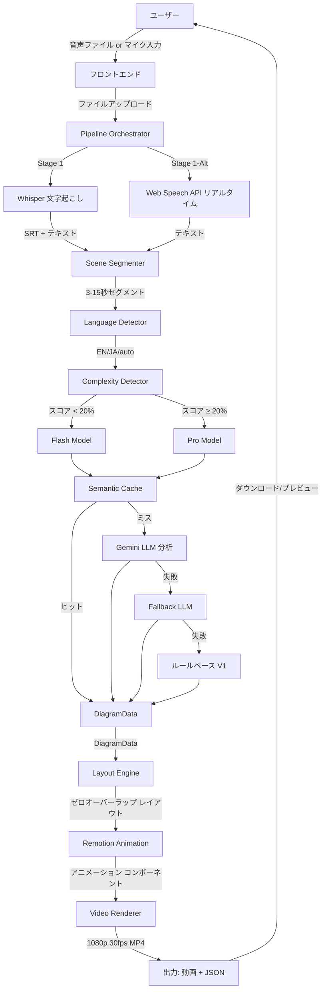
```mermaid
flowchart TD
    A[ユーザー] -->|音声ファイル or マイク入力| B[フロントエンド]
    B -->|ファイルアップロード| C[Pipeline Orchestrator]
    C -->|Stage 1| D[Whisper 文字起こし]
    C -->|Stage 1-Alt| D2[Web Speech API リアルタイム]
    D -->|SRT + テキスト| E[Scene Segmenter]
    D2 -->|テキスト| E
    E -->|3-15秒セグメント| F[Language Detector]
    F -->|EN/JA/auto| G[Complexity Detector]
    G -->|スコア < 20%| H1[Flash Model]
    G -->|スコア ≥ 20%| H2[Pro Model]
    H1 --> I[Semantic Cache]
    H2 --> I
    I -->|ヒット| J[DiagramData]
    I -->|ミス| K[Gemini LLM 分析]
    K -->|失敗| K2[Fallback LLM]
    K2 -->|失敗| K3[ルールベース V1]
    K --> J
    K2 --> J
    K3 --> J
    J -->|DiagramData| L[Layout Engine]
    L -->|ゼロオーバーラップ レイアウト| M[Remotion Animation]
    M -->|アニメーション コンポーネント| N[Video Renderer]
    N -->|1080p 30fps MP4| O[出力: 動画 + JSON]
    O -->|ダウンロード/プレビュー| A
```

## 主要機能のデータフロー

### 機能1: 音声ファイル文字起こし 🔵

**信頼性**: 🔵 *PIPELINE_FLOW.md Stage 1・ユーザーストーリー1.1・受け入れ基準TC-001より*

**関連要件**: REQ-001, REQ-003, REQ-004

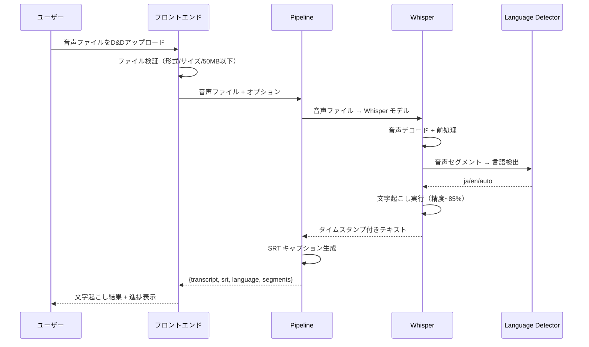
```mermaid
sequenceDiagram
    participant U as ユーザー
    participant FE as フロントエンド
    participant P as Pipeline
    participant W as Whisper
    participant LD as Language Detector

    U->>FE: 音声ファイルをD&Dアップロード
    FE->>FE: ファイル検証（形式/サイズ/50MB以下）
    FE->>P: 音声ファイル + オプション
    P->>W: 音声ファイル → Whisper モデル
    W->>W: 音声デコード + 前処理
    W->>LD: 音声セグメント → 言語検出
    LD-->>W: ja/en/auto
    W->>W: 文字起こし実行（精度~85%）
    W-->>P: タイムスタンプ付きテキスト
    P->>P: SRT キャプション生成
    P-->>FE: {transcript, srt, language, segments}
    FE-->>U: 文字起こし結果 + 進捗表示
```

**詳細ステップ**:

1. ユーザーが MP3/WAV/OGG/M4A（最大50MB）をドラッグ＆ドロップ
2. フロントエンドでファイル形式・サイズを検証
3. Whisper モデル（base/small/medium）で自動言語検出付き文字起こし
4. タイムスタンプ精度 ±50ms でセグメント分割
5. SRT キャプションファイルとプレーンテキストを出力
6. 処理進捗をリアルタイムで UI に表示

### 機能1-B: ストリーミング音声文字起こし 🔵

**信頼性**: 🔵 *src/transcription/streaming-transcriber.ts・要件定義REQ-036・ユーザーストーリー4.0より*

**関連要件**: REQ-036

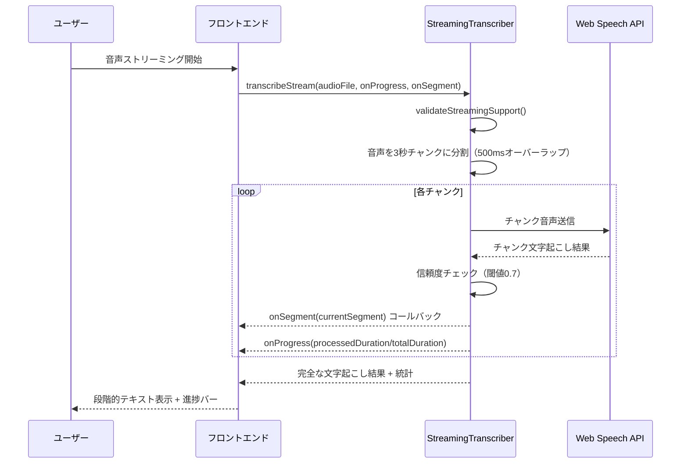
```mermaid
sequenceDiagram
    participant U as ユーザー
    participant FE as フロントエンド
    participant ST as StreamingTranscriber
    participant WSP as Web Speech API

    U->>FE: 音声ストリーミング開始
    FE->>ST: transcribeStream(audioFile, onProgress, onSegment)
    ST->>ST: validateStreamingSupport()
    ST->>ST: 音声を3秒チャンクに分割（500msオーバーラップ）
    loop 各チャンク
        ST->>WSP: チャンク音声送信
        WSP-->>ST: チャンク文字起こし結果
        ST->>ST: 信頼度チェック（閾値0.7）
        ST-->>FE: onSegment(currentSegment) コールバック
        ST-->>FE: onProgress(processedDuration/totalDuration)
    end
    ST-->>FE: 完全な文字起こし結果 + 統計
    FE-->>U: 段階的テキスト表示 + 進捗バー
```

**詳細ステップ**:

1. ブラウザの Web Speech API サポートを検証 🔵
2. 音声データを3秒チャンク（500msオーバーラップ）に分割 🔵
3. 各チャンクを逐次処理し、リアルタイムコールバックでUI更新 🔵
4. 信頼度スコア（デフォルト閾値0.7）による品質フィルタリング 🔵
5. 個別チャンク失敗時は継続（全体停止しない） 🔵
6. 処理統計（平均信頼度・セグメント数・処理時間）を返却 🔵

### 機能2: LLM 内容分析とフォールバック 🔵

**信頼性**: 🔵 *PIPELINE_FLOW.md Stage 2・SYSTEM_CORE.md §4.1-4.2・ユーザーストーリー2.1-2.2より*

**関連要件**: REQ-005, REQ-006, REQ-007, REQ-008, REQ-009, REQ-010

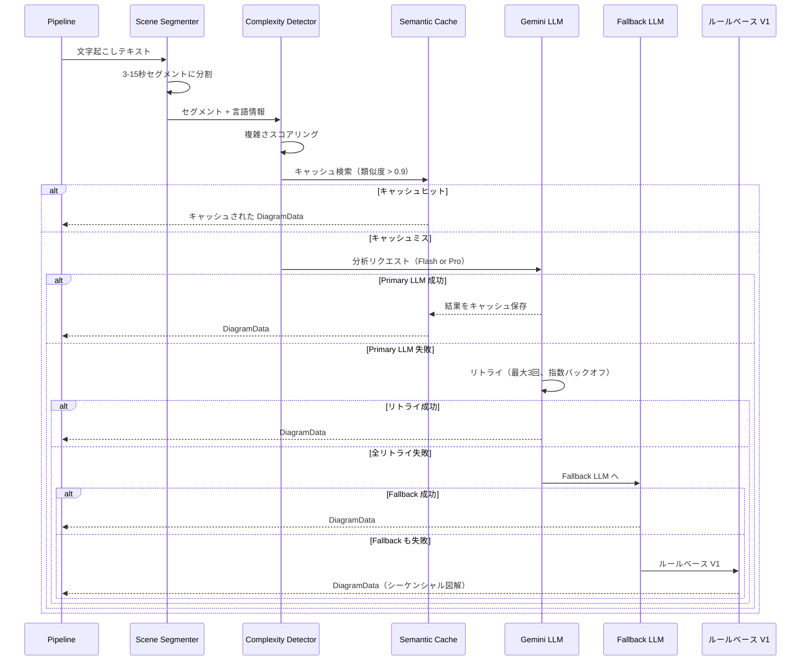
```mermaid
sequenceDiagram
    participant P as Pipeline
    participant SS as Scene Segmenter
    participant CD as Complexity Detector
    participant SC as Semantic Cache
    participant LLM as Gemini LLM
    participant FB as Fallback LLM
    participant RB as ルールベース V1

    P->>SS: 文字起こしテキスト
    SS->>SS: 3-15秒セグメントに分割
    SS->>CD: セグメント + 言語情報
    CD->>CD: 複雑さスコアリング
    CD->>SC: キャッシュ検索（類似度 > 0.9）
    alt キャッシュヒット
        SC-->>P: キャッシュされた DiagramData
    else キャッシュミス
        CD->>LLM: 分析リクエスト（Flash or Pro）
        alt Primary LLM 成功
            LLM-->>SC: 結果をキャッシュ保存
            SC-->>P: DiagramData
        else Primary LLM 失敗
            LLM->>LLM: リトライ（最大3回、指数バックオフ）
            alt リトライ成功
                LLM-->>P: DiagramData
            else 全リトライ失敗
                LLM->>FB: Fallback LLM へ
                alt Fallback 成功
                    FB-->>P: DiagramData
                else Fallback も失敗
                    FB->>RB: ルールベース V1
                    RB-->>P: DiagramData（シーケンシャル図解）
                end
            end
        end
    end
```

**詳細ステップ**:

1. 文字起こしテキストを意味単位（3-15秒）のセグメントに分割
2. 言語検出（EN/JA）→ 複雑さスコアリング
3. セマンティックキャッシュ検索（類似度閾値0.9）
4. キャッシュミス時: Flash/Pro 自動選択で LLM 分析
5. エンティティ抽出・関係性抽出・図解タイプ検出（flow/tree/timeline/matrix/cycle）
6. 失敗時は3層フォールバックで必ず結果を生成

### 機能3: ゼロオーバーラップレイアウト生成 🔵

**信頼性**: 🔵 *SYSTEM_CORE.md §4.3・ZERO_OVERLAP_DESIGN.md・ユーザーストーリー3.1より*

**関連要件**: NFR-302

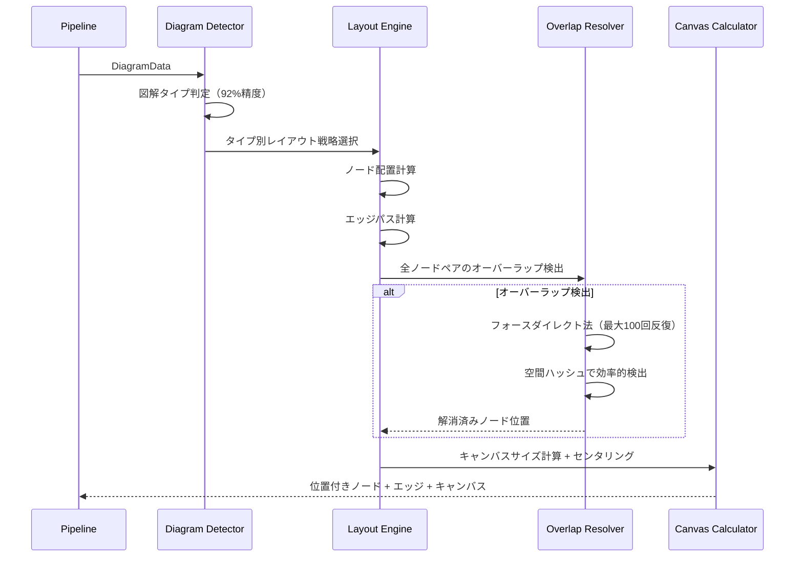
```mermaid
sequenceDiagram
    participant P as Pipeline
    participant DD as Diagram Detector
    participant LE as Layout Engine
    participant OR as Overlap Resolver
    participant CC as Canvas Calculator

    P->>DD: DiagramData
    DD->>DD: 図解タイプ判定（92%精度）
    DD->>LE: タイプ別レイアウト戦略選択
    LE->>LE: ノード配置計算
    LE->>LE: エッジパス計算
    LE->>OR: 全ノードペアのオーバーラップ検出
    alt オーバーラップ検出
        OR->>OR: フォースダイレクト法（最大100回反復）
        OR->>OR: 空間ハッシュで効率的検出
        OR-->>LE: 解消済みノード位置
    end
    LE->>CC: キャンバスサイズ計算 + センタリング
    CC-->>P: 位置付きノード + エッジ + キャンバス
```

**図解タイプ別レイアウト戦略**:

| タイプ | 主戦略 | フォールバック | 特記事項 |
|--------|--------|---------------|---------|
| flow | FlowStrategy (Dagre) | FallbackLayoutStrategy | フロー方向を強調 🔵 |
| tree | TreeStrategy (階層) | FallbackLayoutStrategy | 親子関係を維持 🔵 |
| timeline | TimelineStrategy (X制約) | FallbackLayoutStrategy | Y軸固定で時系列 🔵 |
| matrix | MatrixStrategy (Grid-Snap) | FallbackLayoutStrategy | 厳格グリッド配置 🔵 |
| cycle | CycleStrategy (円形) | FallbackLayoutStrategy | 円形構造を維持 🔵 |
| network | NetworkLayoutStrategy | FallbackLayoutStrategy | ネットワークグラフ 🔵 |
| concept-map | ConceptMapLayoutStrategy | FallbackLayoutStrategy | 概念マップ 🔵 |
| comparison | ComparisonLayoutStrategy | FallbackLayoutStrategy | 比較図 🔵 |
| flowchart | FlowchartLayoutStrategy | FallbackLayoutStrategy | フローチャート専用 🔵 |

**レイアウトエンジン構成** 🔵:
- **LayoutEvaluator**: セグメント内容から最適戦略を自動選択
- **LayoutOptimizer**: レイアウト結果の最適化
- **OverlapResolver**: フォースダイレクト法によるオーバーラップ解消
- **CulturalLayoutAdapter**: 言語・文化に応じたレイアウト調整
- **FallbackLayoutStrategy**: 全戦略失敗時のフォールバック

### 機能4: アニメーション動画生成 🔵

**信頼性**: 🔵 *PIPELINE_FLOW.md Stage 4-5・ユーザーストーリー3.2・Phase 4 実装より*

**関連要件**: REQ-025, REQ-026, REQ-027, REQ-028, REQ-029, REQ-030, REQ-301

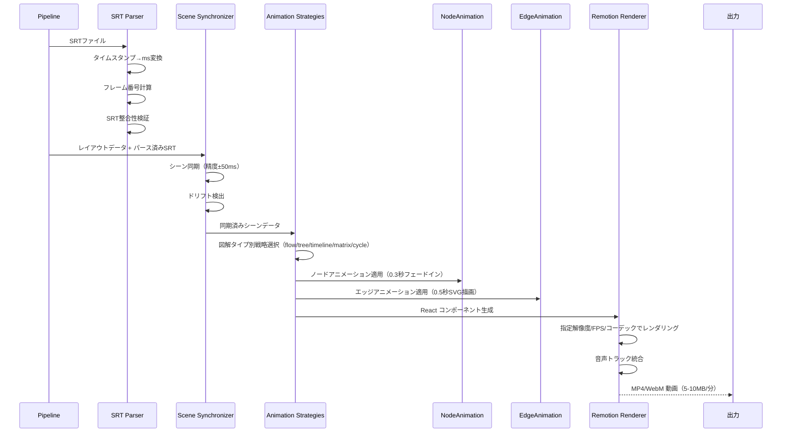
```mermaid
sequenceDiagram
    participant P as Pipeline
    participant SRTParser as SRT Parser
    participant Sync as Scene Synchronizer
    participant AnimStrat as Animation Strategies
    participant NodeAnim as NodeAnimation
    participant EdgeAnim as EdgeAnimation
    participant Rem as Remotion Renderer
    participant Out as 出力

    P->>SRTParser: SRTファイル
    SRTParser->>SRTParser: タイムスタンプ→ms変換
    SRTParser->>SRTParser: フレーム番号計算
    SRTParser->>SRTParser: SRT整合性検証
    P->>Sync: レイアウトデータ + パース済みSRT
    Sync->>Sync: シーン同期（精度±50ms）
    Sync->>Sync: ドリフト検出
    Sync->>AnimStrat: 同期済みシーンデータ
    AnimStrat->>AnimStrat: 図解タイプ別戦略選択（flow/tree/timeline/matrix/cycle）
    AnimStrat->>NodeAnim: ノードアニメーション適用（0.3秒フェードイン）
    AnimStrat->>EdgeAnim: エッジアニメーション適用（0.5秒SVG描画）
    AnimStrat->>Rem: React コンポーネント生成
    Rem->>Rem: 指定解像度/FPS/コーデックでレンダリング
    Rem->>Rem: 音声トラック統合
    Rem-->>Out: MP4/WebM 動画（5-10MB/分）
```

**Phase 4 実装詳細**:
1. SRTパーサーがタイムスタンプをミリ秒に変換し、フレーム番号を計算 🔵
2. シーン同期がキャプションとアニメーションを±50ms精度で同期 🔵
3. 5種図解タイプ別のアニメーション戦略がノード・エッジのタイミングを制御 🔵
4. ノードフェードイン（0.3秒）とエッジSVG描画（0.5秒）の段階的アニメーション 🔵
5. Remotion renderMedia()で720p/1080p/4K、30/60fps、H.264/H.265/VP9出力 🔵

### 機能5: パイプラインUI処理フロー 🔵

**信頼性**: 🔵 *src/components/SimplePipelineInterface.tsx・src/pages/SimplePipeline.tsx・Phase 4 実装より*

**関連要件**: REQ-031, REQ-032, REQ-033, REQ-034, REQ-035

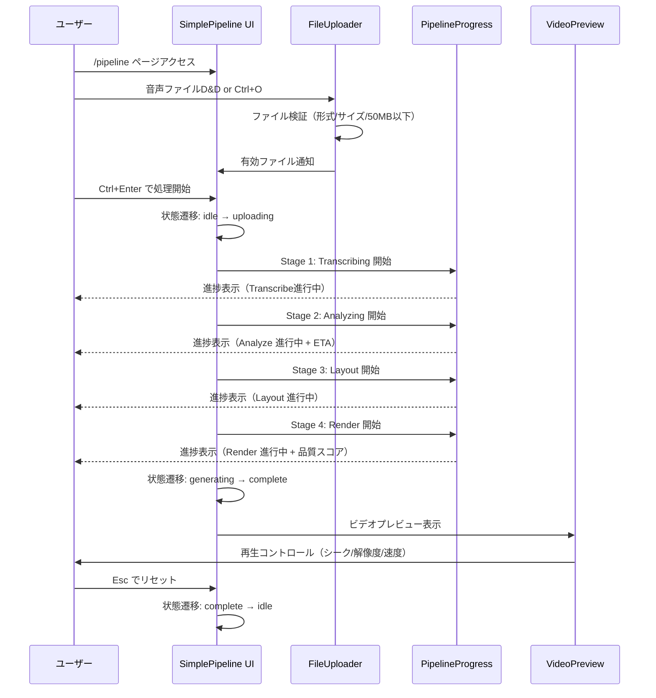
```mermaid
sequenceDiagram
    participant U as ユーザー
    participant FE as SimplePipeline UI
    participant FU as FileUploader
    participant PP as PipelineProgress
    participant VP as VideoPreview

    U->>FE: /pipeline ページアクセス
    U->>FU: 音声ファイルD&D or Ctrl+O
    FU->>FU: ファイル検証（形式/サイズ/50MB以下）
    FU->>FE: 有効ファイル通知
    U->>FE: Ctrl+Enter で処理開始
    FE->>FE: 状態遷移: idle → uploading
    FE->>PP: Stage 1: Transcribing 開始
    PP-->>U: 進捗表示（Transcribe進行中）
    FE->>PP: Stage 2: Analyzing 開始
    PP-->>U: 進捗表示（Analyze 進行中 + ETA）
    FE->>PP: Stage 3: Layout 開始
    PP-->>U: 進捗表示（Layout 進行中）
    FE->>PP: Stage 4: Render 開始
    PP-->>U: 進捗表示（Render 進行中 + 品質スコア）
    FE->>FE: 状態遷移: generating → complete
    FE->>VP: ビデオプレビュー表示
    VP->>U: 再生コントロール（シーク/解像度/速度）
    U->>FE: Esc でリセット
    FE->>FE: 状態遷移: complete → idle
```

**Phase 4 Pipeline UI 実装詳細**:
1. ドラッグ＆ドロップ + キーボードショートカット（Ctrl+O/Ctrl+Enter/Esc）対応 🔵
2. 4段階リアルタイム進捗（ETA・品質スコア・ステージ別表示）🔵
3. 処理完了後のビデオプレビュー（Remotion Player・シークバー・解像度切替）🔵
4. 結果表示（シーン一覧・トランスクリプト・品質メトリクス）🔵

## データ処理パターン

### 同期処理 🔵

**信頼性**: 🔵 *PIPELINE_FLOW.md・src/pipeline/ より*

- 文字起こし → シーン分割 → 言語検出: パイプライン内の直列処理
- レイアウト計算 → オーバーラップ解消: 同期的な反復処理
- 各ステージの完了を待って次ステージに進む品質ゲート方式

### 非同期処理 🔵

**信頼性**: 🔵 *PIPELINE_FLOW.md §4.2・src/analysis/llm-service.ts より*

- LLM API 呼び出し: 非同期 + タイムアウト管理
- キャッシュ検索: 非同期 I/O
- バッチジョブ: 非同期キューイング（最大3並列）

### バッチ処理 🔵

**信頼性**: 🔵 *src/api/batch-processing-api.ts・README.md より*

- 複数音声ファイルの一括処理（最大3並列）
- ジョブID ベースの進捗追跡（進捗率・ETA・品質スコア）
- ジョブキャンセル機能

## エラーハンドリングフロー 🔵

**信頼性**: 🔵 *PIPELINE_FLOW.md §7・SYSTEM_CORE.md §4.2・src/quality/ より*

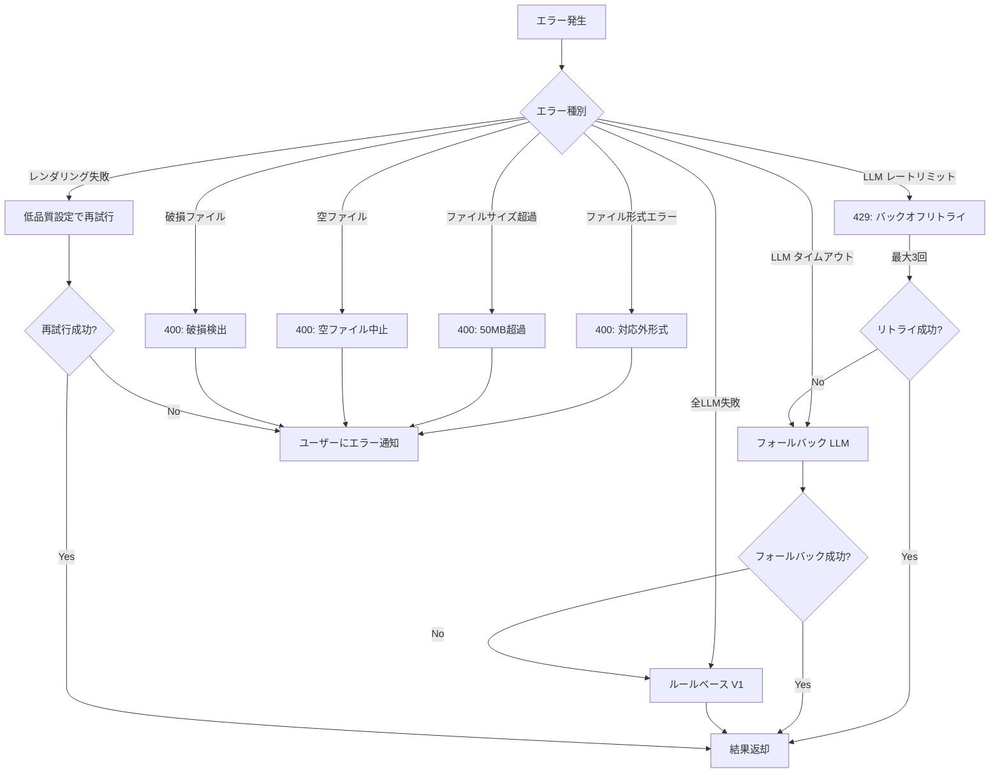
```mermaid
flowchart TD
    A[エラー発生] --> B{エラー種別}
    B -->|ファイル形式エラー| C[400: 対応外形式]
    B -->|ファイルサイズ超過| D[400: 50MB超過]
    B -->|空ファイル| E[400: 空ファイル中止]
    B -->|破損ファイル| F[400: 破損検出]
    B -->|LLM レートリミット| G[429: バックオフリトライ]
    B -->|LLM タイムアウト| H[フォールバック LLM]
    B -->|全LLM失敗| I[ルールベース V1]
    B -->|レンダリング失敗| J[低品質設定で再試行]

    C --> K[ユーザーにエラー通知]
    D --> K
    E --> K
    F --> K
    G --> |最大3回| L{リトライ成功?}
    L -->|Yes| M[結果返却]
    L -->|No| H
    H --> N{フォールバック成功?}
    N -->|Yes| M
    N -->|No| I
    I --> M
    J --> O{再試行成功?}
    O -->|Yes| M
    O -->|No| K
```

### ユーザー主導エラー回復フロー 🔵

**信頼性**: 🔵 *src/quality/user-guided-error-recovery.ts・要件定義REQ-037より*

**関連要件**: REQ-037

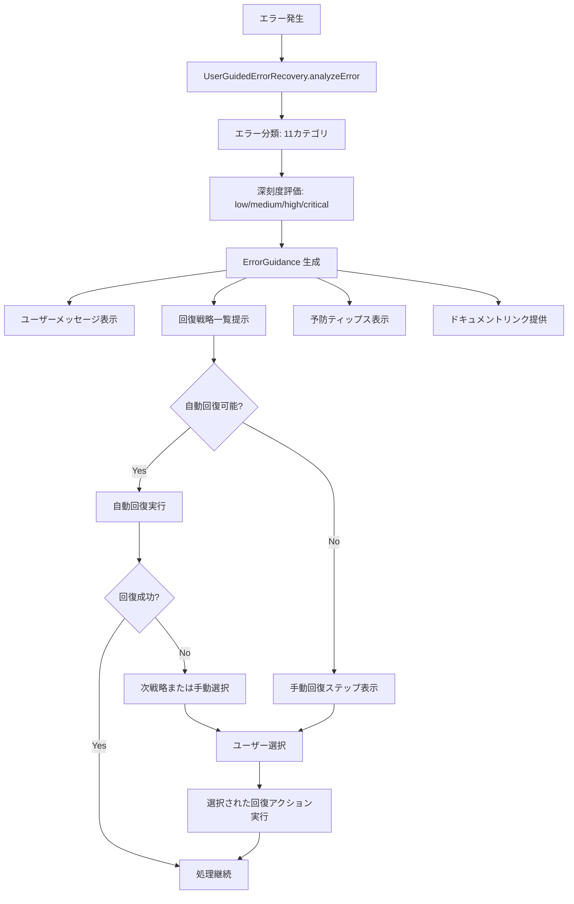
```mermaid
flowchart TD
    A[エラー発生] --> B[UserGuidedErrorRecovery.analyzeError]
    B --> C[エラー分類: 11カテゴリ]
    C --> D[深刻度評価: low/medium/high/critical]
    D --> E[ErrorGuidance 生成]
    E --> F[ユーザーメッセージ表示]
    E --> G[回復戦略一覧提示]
    G --> H{自動回復可能?}
    H -->|Yes| I[自動回復実行]
    I --> J{回復成功?}
    J -->|Yes| K[処理継続]
    J -->|No| L[次戦略または手動選択]
    H -->|No| M[手動回復ステップ表示]
    M --> N[ユーザー選択]
    N --> O[選択された回復アクション実行]
    O --> K
    L --> N
    E --> P[予防ティップス表示]
    E --> Q[ドキュメントリンク提供]
```

**エラーカテゴリ** 🔵:
- file_format, file_size, transcription, analysis, layout, rendering
- api, network, memory, timeout, unknown

### 設定バリデーションフロー 🔵

**信頼性**: 🔵 *src/config/validate.ts・src/config/schema.ts・要件定義REQ-038より*

**関連要件**: REQ-038

```mermaid
flowchart TD
    A[アプリケーション起動] --> B[環境変数読み込み]
    B --> C[validateConfig(config)]
    C --> D{バリデーション結果}
    D -->|エラーなし| E[ConfigSchema 型として設定利用]
    D -->|ValidationErrorあり| F[全エラー一覧表示]
    F --> G[プロセス終了 exit 1]
    E --> H[パイプライン処理開始]
```

**バリデーションルール** 🔵:
- 必須フィールド: googleApiKey, supabaseUrl, supabaseAnonKey
- URL形式検証: supabaseUrl
- 数値範囲: complexityThreshold (0-1), similarityThreshold (0-1), port (1024-65535), cacheSize (1-10000), cacheTtlMinutes (1-10080)
- 列挙型: nodeEnv (development/production/test)

## 状態管理フロー

### フロントエンド状態管理 🔵

**信頼性**: 🔵 *note.md・src/components/SimplePipelineInterface.tsx より*

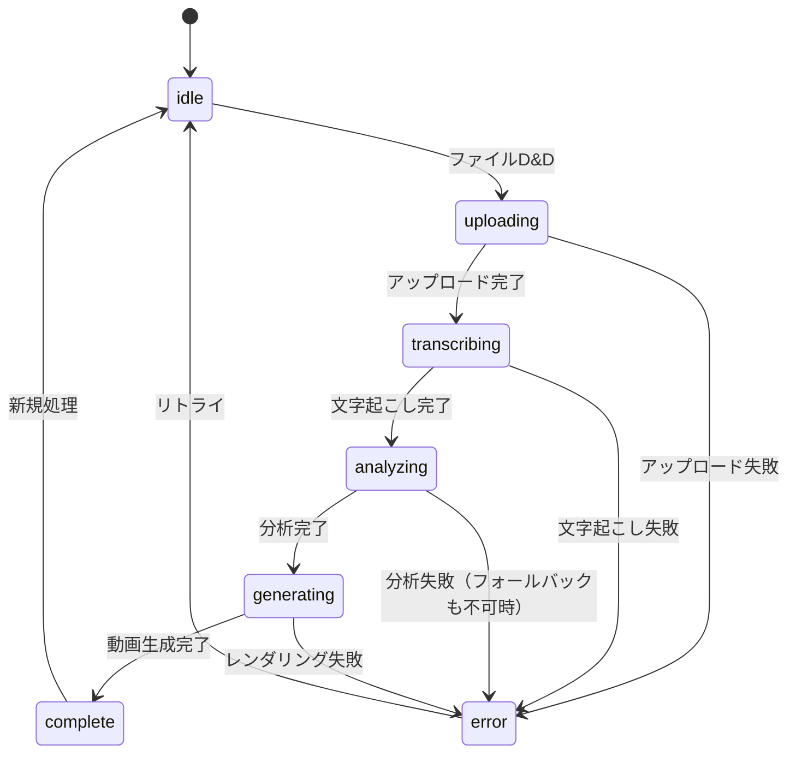
```mermaid
stateDiagram-v2
    [*] --> idle
    idle --> uploading: ファイルD&D
    uploading --> transcribing: アップロード完了
    transcribing --> analyzing: 文字起こし完了
    analyzing --> generating: 分析完了
    generating --> complete: 動画生成完了
    uploading --> error: アップロード失敗
    transcribing --> error: 文字起こし失敗
    analyzing --> error: 分析失敗（フォールバックも不可時）
    generating --> error: レンダリング失敗
    error --> idle: リトライ
    complete --> idle: 新規処理
```

### パイプライン内部状態 🔵

**信頼性**: 🔵 *PIPELINE_FLOW.md §6・src/pipeline/quality-monitor.ts より*

各ステージの品質ゲート管理:
- Stage 1: 音声長 ≥ 1秒、文字起こし精度チェック
- Stage 2: エンティティ/関係性抽出の完全性チェック
- Stage 3: オーバーラップ数 = 0 の保証
- Stage 4-5: キャプション同期精度 ±50ms

## データ整合性の保証 🔵

**信頼性**: 🔵 *PIPELINE_FLOW.md §7・supabase/migrations/・SYSTEM_CORE.md §4.3 より*

- **トランザクション管理**: Supabase（PostgreSQL）の標準トランザクション
- **データ整合性**: RLS によるアクセス制御 + 外部キー制約
- **キャッシュ整合性**: TTL 120分による自動失効 + 類似度ベースの整合判定
- **レイアウト整合性**: オーバーラップ検出 → フォースダイレクト解消 → 最終確認の3段階保証

## 自動改善サイクル 🔵

**信頼性**: 🔵 *src/framework/・src/pipeline/framework-integrated-pipeline.ts・SYSTEM_CORE.md §5・ITERATION_LOG より*

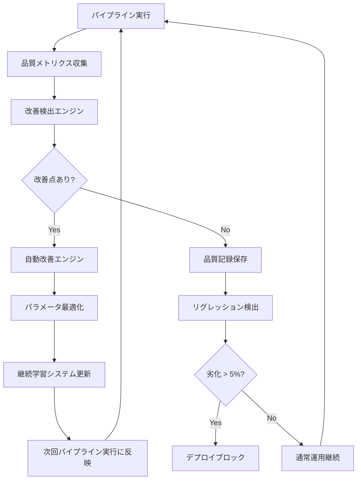
```mermaid
flowchart TD
    A[パイプライン実行] --> B[品質メトリクス収集]
    B --> C[改善検出エンジン]
    C --> D{改善点あり?}
    D -->|Yes| E[自動改善エンジン]
    D -->|No| F[品質記録保存]
    E --> G[パラメータ最適化]
    G --> H[継続学習システム更新]
    H --> I[次回パイプライン実行に反映]
    I --> A
    F --> J[リグレッション検出]
    J --> K{劣化 > 5%?}
    K -->|Yes| L[デプロイブロック]
    K -->|No| M[通常運用継続]
    M --> A
```

**改善サイクル概要**:
1. パイプライン実行ごとに品質メトリクスを収集
2. 改善検出エンジンが品質スコアの傾向を分析
3. 改善点が検出された場合、パラメータを自動最適化
4. リグレッション検出（>5%劣化）でデプロイブロック

**FrameworkIntegratedPipeline フロー** 🔵:
- MainPipeline + IterationManager + AutoImprovementEngine の統合パイプライン
- 自動フェーズ管理（MVP構築→機能拡張→品質改善→最適化）
- 品質閾値に基づく自動コミット判定

## 適応型品質プリセットフロー 🔵

**信頼性**: 🔵 *src/pipeline/adaptive-quality-presets.ts・PIPELINE_FLOW.md §8.2 より*

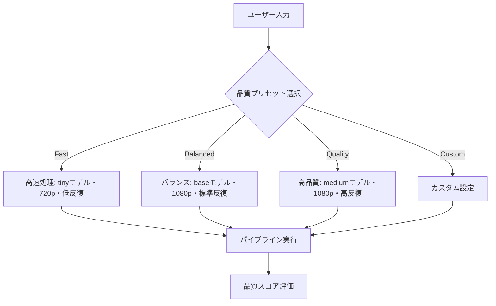
```mermaid
flowchart TD
    A[ユーザー入力] --> B{品質プリセット選択}
    B -->|Fast| C1[高速処理: tinyモデル・720p・低反復]
    B -->|Balanced| C2[バランス: baseモデル・1080p・標準反復]
    B -->|Quality| C3[高品質: mediumモデル・1080p・高反復]
    B -->|Custom| C4[カスタム設定]
    C1 --> D[パイプライン実行]
    C2 --> D
    C3 --> D
    C4 --> D
    D --> E[品質スコア評価]
```

**品質プリセット構成** 🔵:
| プリセット | 文字起こしモデル | 解像度 | FPS | レイアウト品質 | キャッシュ |
|-----------|----------------|--------|-----|--------------|----------|
| Fast | tiny | 720p | 24 | standard | 有効 |
| Balanced | base | 1080p | 30 | enhanced | 有効 |
| Quality | medium | 1080p | 30 | zero_overlap | 有効 |
| Custom | ユーザー指定 | ユーザー指定 | ユーザー指定 | ユーザー指定 | ユーザー指定 |

## パイプラインオーケストレーションフロー 🔵

**信頼性**: 🔵 *src/pipeline/pipeline-orchestrator.ts・要件定義REQ-042 より*

**関連要件**: REQ-040, REQ-041, REQ-042

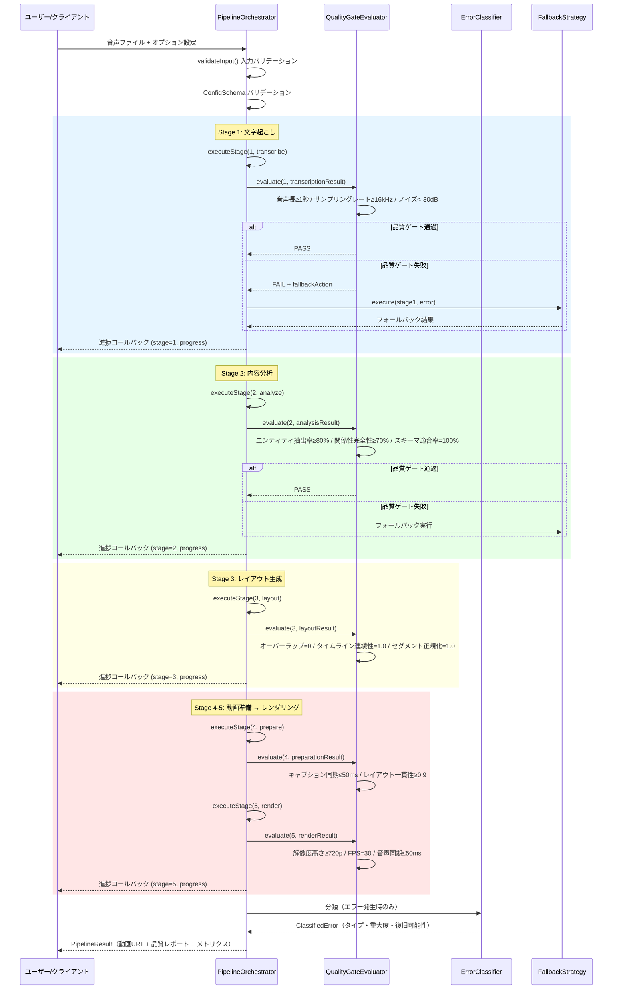
```mermaid
sequenceDiagram
    participant User as ユーザー/クライアント
    participant PO as PipelineOrchestrator
    participant QG as QualityGateEvaluator
    participant EC as ErrorClassifier
    participant FB as FallbackStrategy

    User->>PO: 音声ファイル + オプション設定
    PO->>PO: validateInput() 入力バリデーション
    PO->>PO: ConfigSchema バリデーション

    rect rgb(230, 245, 255)
    Note over PO: Stage 1: 文字起こし
    PO->>PO: executeStage(1, transcribe)
    PO->>QG: evaluate(1, transcriptionResult)
    QG->>QG: 音声長≥1秒 / サンプリングレート≥16kHz / ノイズ<-30dB
    alt 品質ゲート通過
        QG-->>PO: PASS
    else 品質ゲート失敗
        QG-->>PO: FAIL + fallbackAction
        PO->>FB: execute(stage1, error)
        FB-->>PO: フォールバック結果
    end
    PO-->>User: 進捗コールバック (stage=1, progress)
    end

    rect rgb(230, 255, 230)
    Note over PO: Stage 2: 内容分析
    PO->>PO: executeStage(2, analyze)
    PO->>QG: evaluate(2, analysisResult)
    QG->>QG: エンティティ抽出率≥80% / 関係性完全性≥70% / スキーマ適合率=100%
    alt 品質ゲート通過
        QG-->>PO: PASS
    else 品質ゲート失敗
        PO->>FB: フォールバック実行
    end
    PO-->>User: 進捗コールバック (stage=2, progress)
    end

    rect rgb(255, 255, 230)
    Note over PO: Stage 3: レイアウト生成
    PO->>PO: executeStage(3, layout)
    PO->>QG: evaluate(3, layoutResult)
    QG->>QG: オーバーラップ=0 / タイムライン連続性=1.0 / セグメント正規化=1.0
    PO-->>User: 進捗コールバック (stage=3, progress)
    end

    rect rgb(255, 230, 230)
    Note over PO: Stage 4-5: 動画準備 → レンダリング
    PO->>PO: executeStage(4, prepare)
    PO->>QG: evaluate(4, preparationResult)
    QG->>QG: キャプション同期≤50ms / レイアウト一貫性≥0.9
    PO->>PO: executeStage(5, render)
    PO->>QG: evaluate(5, renderResult)
    QG->>QG: 解像度高さ≥720p / FPS=30 / 音声同期≤50ms
    PO-->>User: 進捗コールバック (stage=5, progress)
    end

    PO->>EC: 分類（エラー発生時のみ）
    EC-->>PO: ClassifiedError（タイプ・重大度・復旧可能性）

    PO-->>User: PipelineResult（動画URL + 品質レポート + メトリクス）
```

**パイプラインオーケストレーター構成** 🔵:
- 5段階パイプラインの統合実行（文字起こし→分析→レイアウト→準備→レンダリング）
- 各ステージでの品質ゲート評価（QualityGateEvaluator）
- 品質ゲート失敗時のフォールバック戦略（3層チェーン）
- 進捗コールバック（各ステージの progress 0-100%）
- ErrorClassifier による構造化エラー分類
- StreamingTranscriber（REQ-036）とSmartParameterTuner（REQ-039）の統合

### 品質ゲート評価フロー 🔵

**信頼性**: 🔵 *src/quality/quality-gate.ts・要件定義REQ-041 より*

**関連要件**: REQ-041

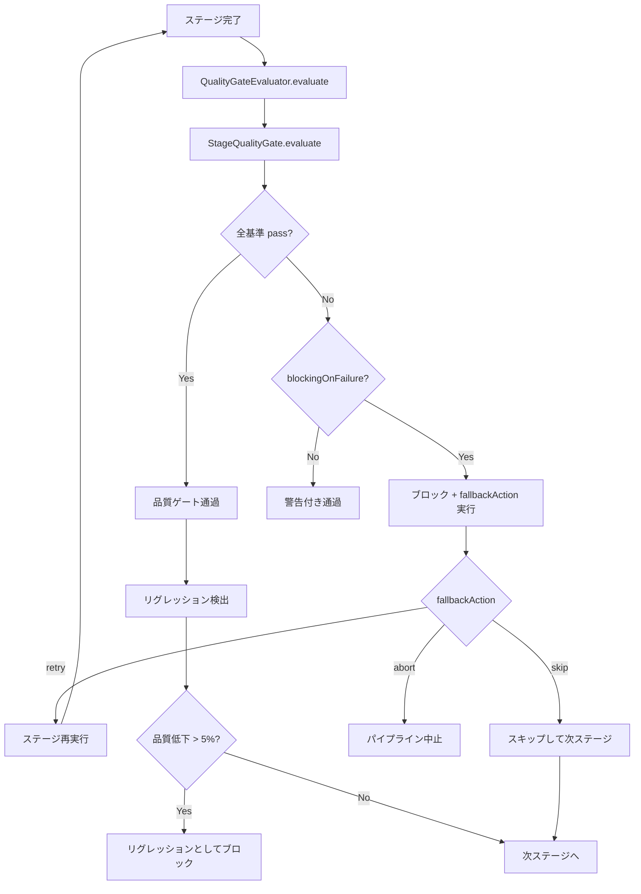
```mermaid
flowchart TD
    A[ステージ完了] --> B[QualityGateEvaluator.evaluate]
    B --> C[StageQualityGate.evaluate]
    C --> D{全基準 pass?}
    D -->|Yes| E[品質ゲート通過]
    D -->|No| F{blockingOnFailure?}
    F -->|Yes| G[ブロック + fallbackAction 実行]
    F -->|No| H[警告付き通過]
    G --> I{fallbackAction}
    I -->|retry| J[ステージ再実行]
    I -->|skip| K[スキップして次ステージ]
    I -->|abort| L[パイプライン中止]
    E --> M[リグレッション検出]
    M --> N{品質低下 > 5%?}
    N -->|Yes| O[リグレッションとしてブロック]
    N -->|No| P[次ステージへ]
    J --> A
    K --> P
```

**5段階品質ゲート基準** 🔵:
| ステージ | 基準 | 閾値 |
|---------|------|------|
| 1（文字起こし） | audioDuration, sampleRate, noiseLevel | ≥1秒, ≥16kHz, <-30dB |
| 2（分析） | entityExtractionRate, relationCompleteness, schemaConformance | ≥80%, ≥70%, =100% |
| 3（レイアウト） | zeroOverlap, timelineContinuity, segmentNormalization | =0, =1.0, =1.0 |
| 4（準備） | captionSync, layoutConsistency | ≤50ms, ≥0.9 |
| 5（レンダリング） | resolution, fps, audioSync | ≥720p, =30, ≤50ms |

### エラー分類フロー 🔵

**信頼性**: 🔵 *src/quality/error-classifier.ts・要件定義REQ-040 より*

**関連要件**: REQ-040

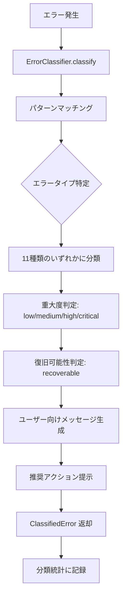
```mermaid
flowchart TD
    A[エラー発生] --> B[ErrorClassifier.classify]
    B --> C[パターンマッチング]
    C --> D{エラータイプ特定}
    D --> E[11種類のいずれかに分類]
    E --> F[重大度判定: low/medium/high/critical]
    F --> G[復旧可能性判定: recoverable]
    G --> H[ユーザー向けメッセージ生成]
    H --> I[推奨アクション提示]
    I --> J[ClassifiedError 返却]
    J --> K[分類統計に記録]
```

**エラータイプ一覧** 🔵:
| エラータイプ | 重大度 | 復旧可能 | 対象ステージ |
|------------|--------|---------|------------|
| FILE_FORMAT_INVALID | medium | false | transcription |
| FILE_SIZE_EXCEEDED | medium | false | transcription |
| LLM_API_ERROR | high | true | analysis |
| LLM_RATE_LIMITED | high | true | analysis |
| LLM_TIMEOUT | high | true | analysis |
| RENDERING_ERROR | high | true | rendering |
| RENDERING_OOM | critical | true | rendering |
| NETWORK_ERROR | medium | true | all |
| STORAGE_ERROR | high | true | all |
| QUALITY_GATE_FAILED | medium | true | quality |
| UNKNOWN | low | false | all |

### Edge Functions 共通基盤フロー 🔵

**信頼性**: 🔵 *supabase/functions/_shared/auth.ts・_shared/error-handler.ts・要件定義REQ-044~045 より*

**関連要件**: REQ-044, REQ-045

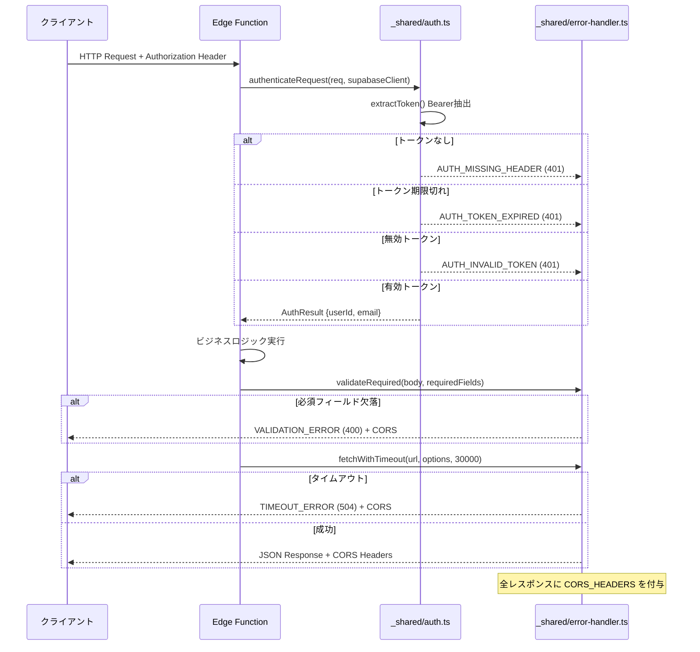
```mermaid
sequenceDiagram
    participant Client as クライアント
    participant EF as Edge Function
    participant Auth as _shared/auth.ts
    participant EH as _shared/error-handler.ts

    Client->>EF: HTTP Request + Authorization Header
    EF->>Auth: authenticateRequest(req, supabaseClient)
    Auth->>Auth: extractToken() Bearer抽出
    alt トークンなし
        Auth-->>EH: AUTH_MISSING_HEADER (401)
    else トークン期限切れ
        Auth-->>EH: AUTH_TOKEN_EXPIRED (401)
    else 無効トークン
        Auth-->>EH: AUTH_INVALID_TOKEN (401)
    else 有効トークン
        Auth-->>EF: AuthResult {userId, email}
    end

    EF->>EF: ビジネスロジック実行
    EF->>EH: validateRequired(body, requiredFields)
    alt 必須フィールド欠落
        EH-->>Client: VALIDATION_ERROR (400) + CORS
    end

    EF->>EH: fetchWithTimeout(url, options, 30000)
    alt タイムアウト
        EH-->>Client: TIMEOUT_ERROR (504) + CORS
    else 成功
        EH-->>Client: JSON Response + CORS Headers
    end

    Note over EH: 全レスポンスに CORS_HEADERS を付与
```

**共通基盤機能** 🔵:
- **認証（auth.ts）**: JWT抽出・検証・期限切れ検出・ユーザー情報返却
- **エラーハンドリング（error-handler.ts）**: CORS ヘッダー管理・エラー分類（AuthError/TimeoutError/ValidationError）・AbortController タイムアウト（デフォルト30秒）・必須フィールド検証

### WebSocket リアルタイム通知フロー 🔵

**信頼性**: 🔵 *src/api/websocket-handler.ts・要件定義REQ-046 より*

**関連要件**: REQ-046

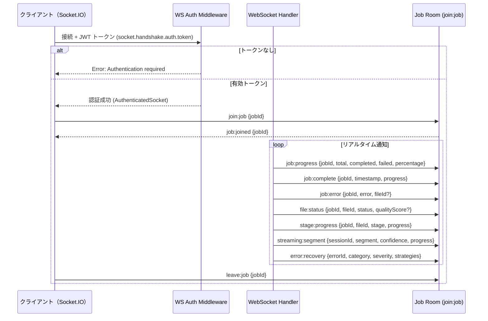
```mermaid
sequenceDiagram
    participant Client as クライアント（Socket.IO）
    participant Auth as WS Auth Middleware
    participant Handler as WebSocket Handler
    participant Room as Job Room (join:job)

    Client->>Auth: 接続 + JWT トークン (socket.handshake.auth.token)
    alt トークンなし
        Auth-->>Client: Error: Authentication required
    else 有効トークン
        Auth-->>Client: 認証成功 (AuthenticatedSocket)
        Client->>Room: join:job {jobId}
        Room-->>Client: job:joined {jobId}

        loop リアルタイム通知
            Handler->>Room: job:progress {jobId, total, completed, failed, percentage}
            Handler->>Room: job:complete {jobId, timestamp, progress}
            Handler->>Room: job:error {jobId, error, fileId?}
            Handler->>Room: file:status {jobId, fileId, status, qualityScore?}
            Handler->>Room: stage:progress {jobId, fileId, stage, progress}
            Handler->>Room: streaming:segment {sessionId, segment, confidence, progress}
            Handler->>Room: error:recovery {errorId, category, severity, strategies}
        end

        Client->>Room: leave:job {jobId}
    end
```

**WebSocket イベント一覧** 🔵:

| イベント | 方向 | ペイロード | 説明 |
|---------|------|-----------|------|
| join:job | Client→Server | `{jobId}` | ジョブルーム参加 |
| leave:job | Client→Server | `{jobId}` | ジョブルーム離脱 |
| job:joined | Server→Client | `{jobId}` | ルーム参加確認 |
| job:progress | Server→Client | `{jobId, total, completed, failed, percentage}` | ジョブ進捗 |
| job:complete | Server→Client | `{jobId, timestamp, progress}` | ジョブ完了 |
| job:error | Server→Client | `{jobId, error, fileId?}` | ジョブエラー |
| file:status | Server→Client | `{jobId, fileId, status, qualityScore?}` | ファイルステータス |
| stage:progress | Server→Client | `{jobId, fileId, stage, progress}` | ステージ進捗 |
| streaming:segment | Server→Client | `{sessionId, segment, confidence, progress}` | ストリーミングセグメント |
| streaming:complete | Server→Client | `{sessionId, fullTranscript, statistics}` | ストリーミング完了 |
| error:recovery | Server→Client | `{errorId, category, severity, strategies}` | エラー回復オプション |
| error:recovered | Server→Client | `{errorId, strategy, success}` | エラー回復結果 |

### バッチ最適化フロー 🔵

**信頼性**: 🔵 *src/optimization/batch-optimizer.ts・要件定義REQ-047 より*

**関連要件**: REQ-047

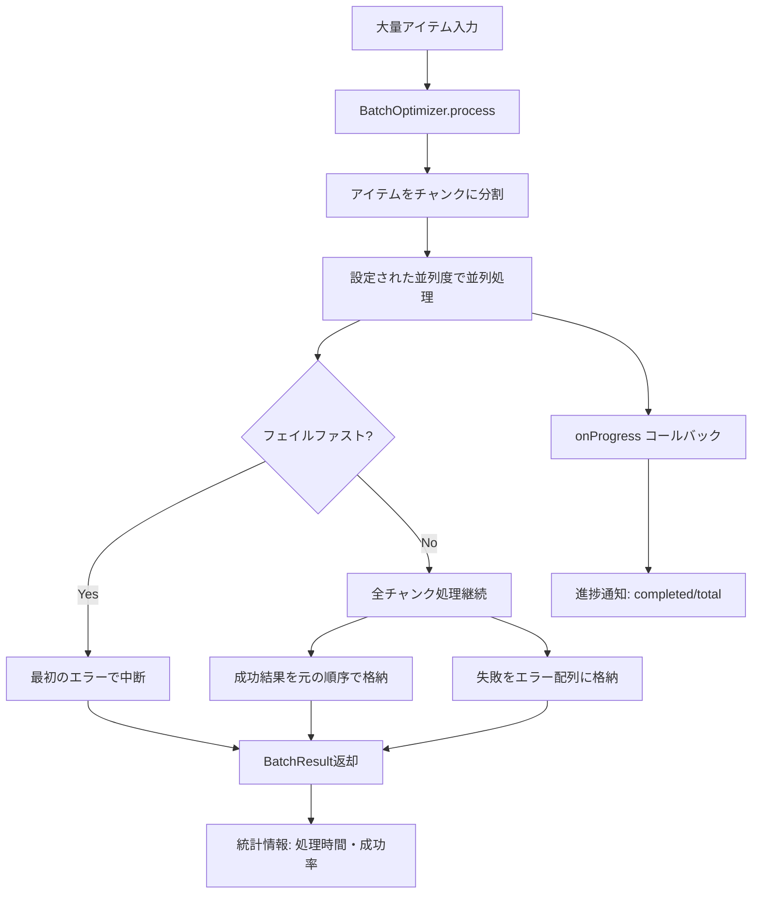
```mermaid
flowchart TD
    A[大量アイテム入力] --> B[BatchOptimizer.process]
    B --> C[アイテムをチャンクに分割]
    C --> D[設定された並列度で並列処理]
    D --> E{フェイルファスト?}
    E -->|Yes| F[最初のエラーで中断]
    E -->|No| G[全チャンク処理継続]
    G --> H[成功結果を元の順序で格納]
    G --> I[失敗をエラー配列に格納]
    F --> J[BatchResult返却]
    H --> J
    I --> J
    J --> K[統計情報: 処理時間・成功率]
    D --> L[onProgress コールバック]
    L --> M[進捗通知: completed/total]
```

**BatchOptimizer 設定** 🔵:
| パラメータ | 既定値 | 説明 |
|-----------|--------|------|
| concurrency | 4 | 最大並列チャンク数 |
| chunkSize | 50 | チャンクあたりのアイテム数 |
| failFast | false | 最初のエラーで中断するか |
| onProgress | - | 進捗コールバック (completed, total) |

### 計算キャッシュ・メモリキャッシュフロー 🔵

**信頼性**: 🔵 *src/optimization/computation-cache.ts・memory-cache.ts・要件定義REQ-048 より*

**関連要件**: REQ-048

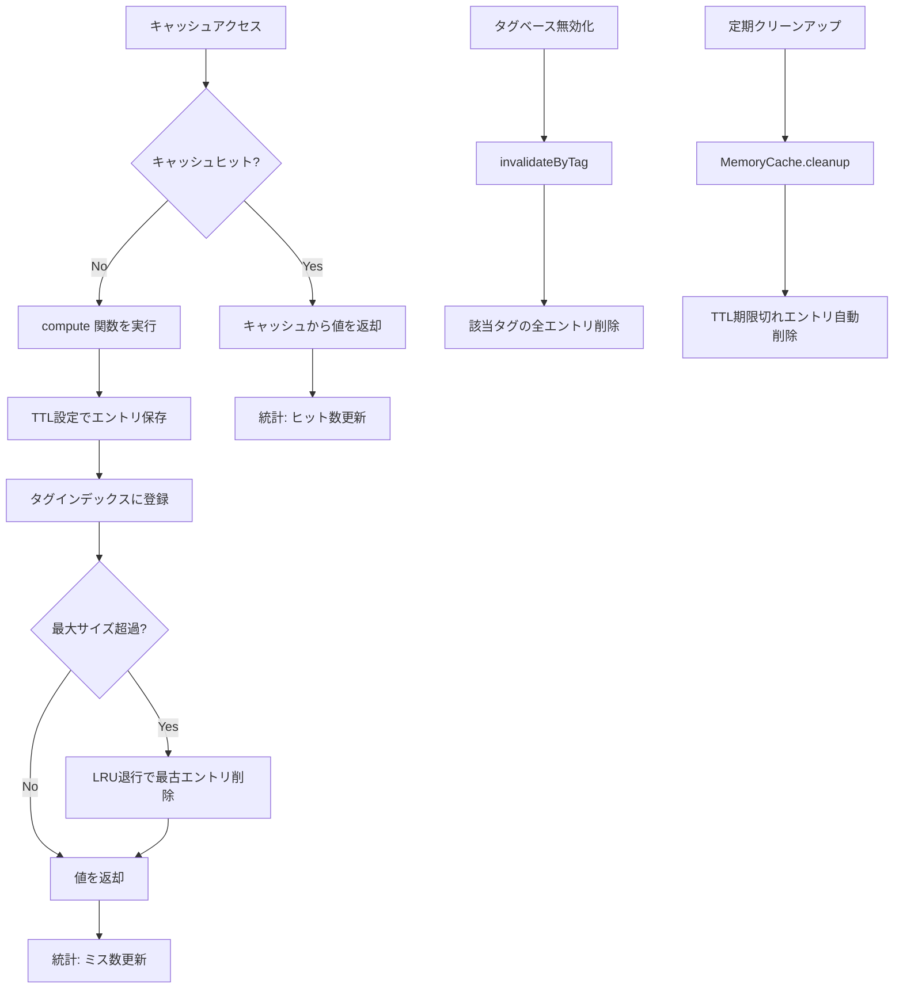
```mermaid
flowchart TD
    A[キャッシュアクセス] --> B{キャッシュヒット?}
    B -->|Yes| C[キャッシュから値を返却]
    B -->|No| D[compute 関数を実行]
    D --> E[TTL設定でエントリ保存]
    E --> F[タグインデックスに登録]
    F --> G{最大サイズ超過?}
    G -->|Yes| H[LRU退行で最古エントリ削除]
    G -->|No| I[値を返却]
    H --> I
    C --> J[統計: ヒット数更新]
    I --> K[統計: ミス数更新]

    L[タグベース無効化] --> M[invalidateByTag]
    M --> N[該当タグの全エントリ削除]

    O[定期クリーンアップ] --> P[MemoryCache.cleanup]
    P --> Q[TTL期限切れエントリ自動削除]
```

**キャッシュ構成** 🔵:
| キャッシュ | 最大サイズ | TTL | 特記事項 |
|-----------|-----------|-----|---------|
| ComputationCache | 200 | 10分 | タグベース無効化・async/sync両対応 |
| MemoryCache | 100 | 5分 | LRU退行・定期クリーンアップ・ヒット率統計 |

### 遅延ローダーフロー 🔵

**信頼性**: 🔵 *src/optimization/lazy-loader.ts・要件定義REQ-049 より*

**関連要件**: REQ-049

```mermaid
flowchart TD
    A[load(key, loader) 呼び出し] --> B{キャッシュにあり?}
    B -->|Yes| C[キャッシュから即座に返却]
    B -->|No| D{同時ロード中?}
    D -->|Yes| E[既存の Promise を再利用]
    D -->|No| F[loader 関数を実行]
    F --> G[モジュールをキャッシュに保存]
    G --> H[ロード時間を記録]
    H --> I[モジュールを返却]
    E --> I

    J[preload(key, loader)] --> K[非同期でロード]
    K --> L[エラーは無視]
    L --> G

    M[createHandle(key, loader)] --> N[再利用可能なハンドル生成]
    N --> O[handle.load() で随时ロード]
```

**遅延ローダー機能** 🔵:
- 動的インポートキャッシュ: 同一キーの重複ロード防止
- 同時ロード重複排除: 複数コンポーネントからの同時要求を1回に束ねる
- プリロード: 非同期で事前キャッシュ（エラーは無視）
- ハンドルファクトリ: `createHandle()` でカプセル化されたアクセス提供
- 統計情報: ロード回数・キャッシュヒット率・平均ロード時間

### グレースフルシャットダウンフロー 🔵

**信頼性**: 🔵 *src/quality/enhanced-error-recovery.ts shutdown()・要件定義REQ-050 より*

**関連要件**: REQ-050

```mermaid
flowchart TD
    A[shutdown() 呼び出し] --> B[ヘルスモニタリングタイマー停止]
    B --> C{アクティブリクエスト数}
    C -->|0件| D[即座にシャットダウン完了]
    C -->|1件以上| E[アクティブリクエスト完了待機]
    E --> F{30秒タイムアウト?}
    F -->|リクエスト完了| G[リクエストキュークリア]
    F -->|タイムアウト| H[残リクエスト強制終了]
    G --> I[サーキットブレーカーリセット]
    H --> I
    I --> J[シャットダウン完了ログ出力]
    D --> J
```

**グレースフルシャットダウン機能** 🔵:
- アクティブリクエストなし: 即座にシャットダウン完了
- アクティブリクエストあり: 完了を待機（最大30秒タイムアウト）
- タイムアウト時: 残リクエストを強制クリア
- クリーンアップ: ヘルスモニタリング停止・キュークリア・サーキットブレーカーリセット

### 型ガードによる図解タイプ検証フロー 🔵

**信頼性**: 🔵 *src/types/diagram.ts isDiagramType()・要件定義REQ-051 より*

**関連要件**: REQ-051

```mermaid
flowchart TD
    A[図解タイプ値の入力] --> B[isDiagramType(value)]
    B --> C{typeof value === 'string'?}
    C -->|No| D[false を返却]
    C -->|Yes| E{11種の有効値との照合}
    E -->|一致| F[true を返却 - value is DiagramType]
    E -->|不一致| D
    F --> G[DiagramType として安全に使用可能]
    D --> H[不正値として排除]
```

**11種の有効な DiagramType** 🔵:
| タイプ | 説明 | 追加時期 |
|--------|------|---------|
| flow | フロー図 | Phase 1 |
| tree | ツリー図 | Phase 1 |
| timeline | タイムライン | Phase 1 |
| matrix | マトリックス | Phase 1 |
| cycle | サイクル図 | Phase 1 |
| flowchart | フローチャート | 型エラー修正時 |
| comparison | 比較図 | 型エラー修正時 |
| network | ネットワーク図 | 型エラー修正時 |
| conceptmap | コンセプトマップ | 型エラー修正時 |
| mindmap | マインドマップ | 型エラー修正時 |
| general | 汎用図解 | 型エラー修正時 |

## 関連文書

- **アーキテクチャ**: [architecture.md](architecture.md)
- **型定義**: [interfaces.ts](interfaces.ts)
- **DBスキーマ**: [database-schema.sql](database-schema.sql)
- **API仕様**: [api-endpoints.md](api-endpoints.md)
- **旧パイプライン仕様（統合元）**: [../../docs/architecture/PIPELINE_FLOW.md](../../docs/architecture/PIPELINE_FLOW.md)

## 追加 UI コンポーネントデータフロー

### 機能6: チュートリアルシステムオンボーディングフロー 🔵

**信頼性**: 🔵 *src/components/TutorialSystem.tsx・要件定義REQ-052・ユーザーストーリー8.1より*

**関連要件**: REQ-052

```mermaid
sequenceDiagram
    participant U as ユーザー
    participant TS as TutorialSystem
    participant LS as LocalStorage

    U->>TS: 初回アクセス（自動検出）
    TS->>LS: isFirstVisit チェック
    alt 初回アクセス
        LS-->>TS: isFirstVisit = true
        TS->>U: チュートリアル自動表示
    else 再アクセス
        LS-->>TS: isFirstVisit = false
        U->>TS: チュートリアル手動表示
    end
    TS->>TS: カテゴリ一覧表示（概要/パイプライン/可視化/エクスポート）
    U->>TS: カテゴリ選択
    TS->>U: ステップ表示（難易度: 初級/中級/上級）
    loop 各ステップ
        U->>TS: ステップ完了
        TS->>LS: 進捗保存（completedSteps 更新）
    end
    TS->>U: カテゴリ完了表示
```

**詳細ステップ**:
1. 初回アクセス時、LocalStorage で isFirstVisit をチェック 🔵
2. カテゴリ別チュートリアル一覧（概要/パイプライン/可視化/エクスポート）を表示 🔵
3. 各ステップは難易度（初級/中級/上級）に分類 🔵
4. 完了したステップは LocalStorage に永続化 🔵

### 機能7: マルチモードパイプライン選択フロー 🔵

**信頼性**: 🔵 *src/pages/Index.tsx・src/components/StreamingProcessor.tsx・要件定義REQ-053・ユーザーストーリー8.2より*

**関連要件**: REQ-053

```mermaid
sequenceDiagram
    participant U as ユーザー
    participant IX as Index Page
    participant SP as StreamingProcessor
    participant PL as Pipeline

    U->>IX: トップページアクセス
    IX->>IX: モード選択UI表示
    alt Standard モード
        U->>IX: ファイルアップロード
        IX->>PL: パイプライン実行（一括処理）
        PL-->>IX: 処理結果
    else Streaming モード
        U->>IX: マイク録音開始
        IX->>SP: ライブ音声処理
        loop リアルタイム処理
            SP->>SP: 音声チャンク処理
            SP-->>IX: onSceneGenerated（プログレッシブシーン）
        end
        SP-->>IX: onComplete（全シーン統合）
    end
    IX-->>U: 動画プレビュー表示
```

**詳細ステップ**:
1. トップページで Standard/Streaming モードを切替 🔵
2. Standard: ファイルアップロード→一括処理→動画生成 🔵
3. Streaming: マイク録音→リアルタイム文字起こし→プログレッシブシーン生成 🔵
4. どちらのモードでも最終的に図解動画が生成される 🔵

### 機能8: フレームワークダッシュボードフロー 🔵

**信頼性**: 🔵 *src/components/FrameworkDashboard.tsx・FrameworkDashboardPage.tsx・要件定義REQ-054・ユーザーストーリー8.3より*

**関連要件**: REQ-054

```mermaid
sequenceDiagram
    participant U as 開発者
    participant FDP as FrameworkDashboardPage
    participant FD as FrameworkDashboard
    participant FW as FrameworkPipeline

    U->>FDP: /framework ルートアクセス
    FDP->>FW: useFrameworkPipeline フック初期化
    FW-->>FDP: パイプライン状態（イテレーション・品質・フェーズ）
    FDP->>FD: ダッシュボード表示
    FD->>FD: フェーズ別成功基準評価可視化
    FD->>FD: 品質メトリクス表示
    FD->>FD: 改善推奨表示
    U->>FDP: 手動コミット実行
    FDP->>FW: コミットトリガー
    FW-->>FDP: コミット結果
```

**設定** 🔵:
- enableAutoCommit: false（ユーザーが手動コミット）
- maxImprovementCycles: 5
- targetQualityScore: 95

### 機能9: プロダクション設定ダッシュボードフロー 🔵

**信頼性**: 🔵 *src/components/ProductionDashboard.tsx・要件定義REQ-055・ユーザーストーリー8.4より*

**関連要件**: REQ-055

```mermaid
sequenceDiagram
    participant U as システム管理者
    participant PD as ProductionDashboard
    participant Config as ProductionConfig

    U->>PD: /production ルートアクセス
    PD->>Config: 現在の設定取得
    Config-->>PD: ProductionEnvironment 設定
    PD->>U: 設定表示
    U->>PD: 設定変更
    PD->>PD: unsavedChanges フラグ設定
    PD->>U: 変更プレビュー表示
    U->>PD: 保存実行
    PD->>Config: 設定保存
    PD->>PD: パフォーマンスレポート生成
    PD->>U: レポート・最適化ステータス表示
```

**管理項目** 🔵:
- API キー・エンドポイント・閾値設定
- パフォーマンスレポート
- 最適化ステータス

### 機能10: グローバルエラーアラートシステムフロー 🔵

**信頼性**: 🔵 *src/components/ErrorAlertSystem.tsx・要件定義REQ-305・App.tsxより*

**関連要件**: REQ-305

```mermaid
flowchart TD
    A[エラー発生] --> B[ErrorAlertSystem]
    B --> C[エラー通知表示]
    C --> D{エラー分類: 11カテゴリ}
    D --> E[重大度表示]
    E --> F{回復アクションあり?}
    F -->|Yes| G[回復ボタン表示]
    F -->|No| H[閉じるボタンのみ]
    G --> I[ユーザー回復実行]
    I --> J{回復成功?}
    J -->|Yes| K[アラート解除]
    J -->|No| L[エラー更新]
    H --> M[手動解除 or 自動非表示]
    B --> N[エラーメトリクス更新]
```

**機能** 🔵:
- リアルタイムエラー通知: 全パイプラインエラーを即座にUIに表示
- 回復アクション実行: executingRecovery 経由でユーザー主導回復
- エラーメトリクス可視化: カテゴリ別・重大度別の統計表示
- 自動非表示: autoHide=true で自動的にアラートを非表示
- アラート展開/解除: expandedAlerts/dismissedAlerts で表示制御

### 機能11: キャッシュウォームアップフロー 🔵

**信頼性**: 🔵 *src/optimization/cache-warmup.ts・要件定義REQ-056・ユーザーストーリーPhase 8 より*

**関連要件**: REQ-056, REQ-202

```mermaid
flowchart TD
    A[システム起動] --> B{キャッシュ状態確認}
    B -->|コールドスタート| C[CacheWarmup.warmup]
    B -->|ウォーム済み| D[通常処理継続]
    C --> E[代表クエリパターン生成]
    E --> F[英語パターン: 一般・技術・ビジネス]
    E --> G[日本語パターン: 一般・技術・ビジネス]
    F --> H[キャッシュ事前充填]
    G --> H
    H --> I[ウォームアップ前ヒット率記録]
    I --> J[ウォームアップ後ヒット率記録]
    J --> K[統計レポート: 改善率]
    K --> D
```

**詳細ステップ**:
1. システム起動時にキャッシュ状態を確認し、コールドスタートを検出 🔵
2. 英語・日本語の代表的なクエリパターン（一般・技術・ビジネスドメイン）を生成 🔵
3. 各パターンでキャッシュ事前充填を実行 🔵
4. ウォームアップ前後のヒット率を統計追跡 🔵

### 機能12: パイプライン API エンドポイントフロー 🔵

**信頼性**: 🔵 *src/hooks/useFrameworkPipeline.ts・src/components/pipeline-interface.tsx・要件定義REQ-057 より*

**関連要件**: REQ-057

```mermaid
sequenceDiagram
    participant FE as フロントエンド
    participant API as Express API Server
    participant PL as Pipeline Layer
    participant FW as Framework

    rect rgb(230, 245, 255)
    Note over FE,API: POST /api/render
    FE->>API: POST /api/render {sceneData, options}
    API->>PL: レンダリング要求
    PL->>PL: Remotion renderMedia()
    PL-->>API: {videoUrl, metrics}
    API-->>FE: 200 {success, videoUrl, fileSize, duration}
    end

    rect rgb(230, 255, 230)
    Note over FE,API: POST /api/git/commit
    FE->>API: POST /api/git/commit {message, files}
    API->>FW: コミット実行
    FW-->>API: {commitHash, status}
    API-->>FE: 200 {success, commitHash}
    end

    rect rgb(255, 255, 230)
    Note over FE,API: GET /api/iteration-log
    FE->>API: GET /api/iteration-log
    API->>FW: イテレーションログ取得
    FW-->>API: {iterations, qualityMetrics}
    API-->>FE: 200 {iterations, qualityTrend, recommendations}
    end

    rect rgb(255, 230, 230)
    Note over FE,API: GET /api/framework/status
    FE->>API: GET /api/framework/status
    API->>FW: ステータス取得
    FW-->>API: {phase, qualityScore, improvementSuggestions}
    API-->>FE: 200 {currentPhase, qualityScore, isRunning}
    end
```

**API エンドポイント一覧** 🔵:
| エンドポイント | メソッド | 説明 | 主な利用元 |
|-------------|---------|------|-----------|
| /api/render | POST | 動画レンダリングトリガー | PipelineInterface.tsx |
| /api/git/commit | POST | フレームワーク自動コミット | FrameworkDashboard.tsx |
| /api/iteration-log | GET | イテレーションログ取得 | FrameworkDashboard.tsx |
| /api/framework/status | GET | フレームワークステータス | FrameworkDashboard.tsx |

## 関連文書（旧）

## 信頼性レベルサマリー

- 🔵 青信号: 142件 (99%)
- 🟡 黄信号: 1件 (1%)
- 🔴 赤信号: 0件 (0%)

**品質評価**: 高品質 - REQ-052~055・REQ-305 追加 UI コンポーネントフローを反映（第96回検証: Phase 1-16全完了・273ファイル・84,442行・全3,228テスト通過(120 suites)・要件カバレッジ100%維持確認・REQ-058/059/060反映済・ギャップなし）
