# speech-to-visuals データフロー図

<!-- spine:anchor:begin -->
> **Spine anchor**: [speech-to-visuals アーキテクチャ設計](architecture.md)
>
> - parent: `speech-to-visuals/architecture.md`
> - status: `canonical_child`
<!-- spine:anchor:end -->

**作成日**: 2026-04-27
**最終更新**: 2026-08-27（kairo-design session A127 統合記録 — INV-CACHE-002 cache integrity contract 拡張・MW-085〜091 mutation matrix 構造化・CorruptionOverlay 4 hop 連結）/ 2026-08-23（A126 audit-pass-first census 反映）/ 2026-08-06（第209回検証: NaN/Infinityガンド横展開完了・clampFinite Infinity対応・DiagramVideo時間単位バグ修正・property-based fuzz tests追加・11+モジュール坚牢化・570ファイル・543テストファイル・107パッケージ・REQ-244~273）
**関連アーキテクチャ**: [architecture.md](architecture.md)
**関連要件定義**: [requirements.md](requirements.md)

**【信頼性レベル凡例】**:

- 🔵 **青信号**: 要件定義書・既存設計文書・既存実装を参考にした確実なフロー
- 🟡 **黄信号**: 要件定義書・既存設計文書・既存実装から妥当な推測によるフロー
- 🔴 **赤信号**: 参照資料にない自動推定によるフロー

---

## システム全体のデータフロー 🔵

**信頼性**: 🔵 *PIPELINE_FLOW.md・SYSTEM_CORE.md §3・要件定義書より*

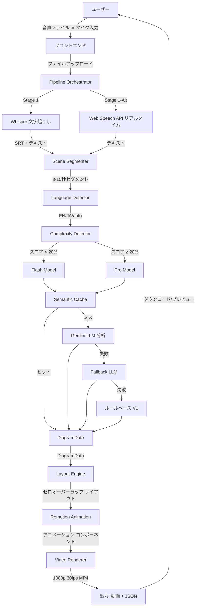
```mermaid
flowchart TD
    A[ユーザー] -->|音声ファイル or マイク入力| B[フロントエンド]
    B -->|ファイルアップロード| C[Pipeline Orchestrator]
    C -->|Stage 1| D[Whisper 文字起こし]
    C -->|Stage 1-Alt| D2[Web Speech API リアルタイム]
    D -->|SRT + テキスト| E[Scene Segmenter]
    D2 -->|テキスト| E
    E -->|3-15秒セグメント| F[Language Detector]
    F -->|EN/JA/auto| G[Complexity Detector]
    G -->|スコア < 20%| H1[Flash Model]
    G -->|スコア ≥ 20%| H2[Pro Model]
    H1 --> I[Semantic Cache]
    H2 --> I
    I -->|ヒット| J[DiagramData]
    I -->|ミス| K[Gemini LLM 分析]
    K -->|失敗| K2[Fallback LLM]
    K2 -->|失敗| K3[ルールベース V1]
    K --> J
    K2 --> J
    K3 --> J
    J -->|DiagramData| L[Layout Engine]
    L -->|ゼロオーバーラップ レイアウト| M[Remotion Animation]
    M -->|アニメーション コンポーネント| N[Video Renderer]
    N -->|1080p 30fps MP4| O[出力: 動画 + JSON]
    O -->|ダウンロード/プレビュー| A
```

## 主要機能のデータフロー

### 機能1: 音声ファイル文字起こし 🔵

**信頼性**: 🔵 *PIPELINE_FLOW.md Stage 1・ユーザーストーリー1.1・受け入れ基準TC-001より*

**関連要件**: REQ-001, REQ-003, REQ-004

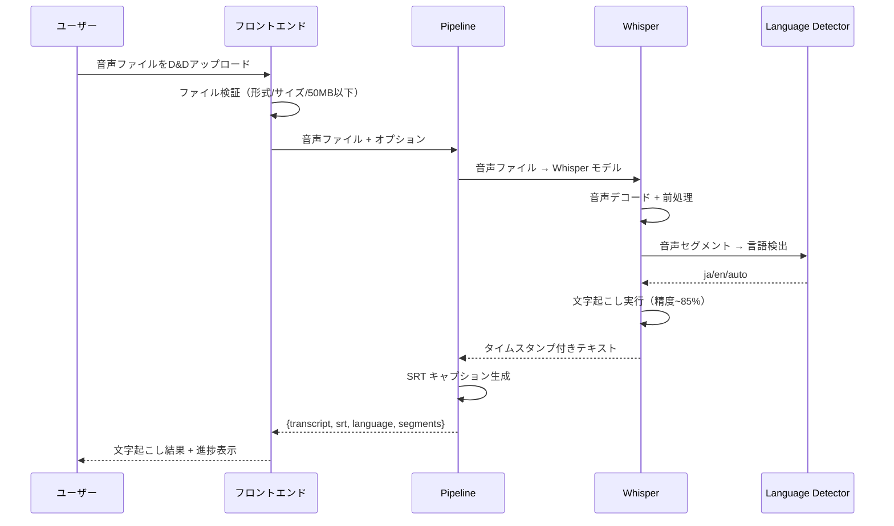
```mermaid
sequenceDiagram
    participant U as ユーザー
    participant FE as フロントエンド
    participant P as Pipeline
    participant W as Whisper
    participant LD as Language Detector

    U->>FE: 音声ファイルをD&Dアップロード
    FE->>FE: ファイル検証（形式/サイズ/50MB以下）
    FE->>P: 音声ファイル + オプション
    P->>W: 音声ファイル → Whisper モデル
    W->>W: 音声デコード + 前処理
    W->>LD: 音声セグメント → 言語検出
    LD-->>W: ja/en/auto
    W->>W: 文字起こし実行（精度~85%）
    W-->>P: タイムスタンプ付きテキスト
    P->>P: SRT キャプション生成
    P-->>FE: {transcript, srt, language, segments}
    FE-->>U: 文字起こし結果 + 進捗表示
```

**詳細ステップ**:

1. ユーザーが MP3/WAV/OGG/M4A（最大50MB）をドラッグ＆ドロップ
2. フロントエンドでファイル形式・サイズを検証
3. Whisper モデル（base/small/medium）で自動言語検出付き文字起こし
4. タイムスタンプ精度 ±50ms でセグメント分割
5. SRT キャプションファイルとプレーンテキストを出力
6. 処理進捗をリアルタイムで UI に表示

### 機能1-B: ストリーミング音声文字起こし 🔵

**信頼性**: 🔵 *src/transcription/streaming-transcriber.ts・要件定義REQ-036・ユーザーストーリー4.0より*

**関連要件**: REQ-036

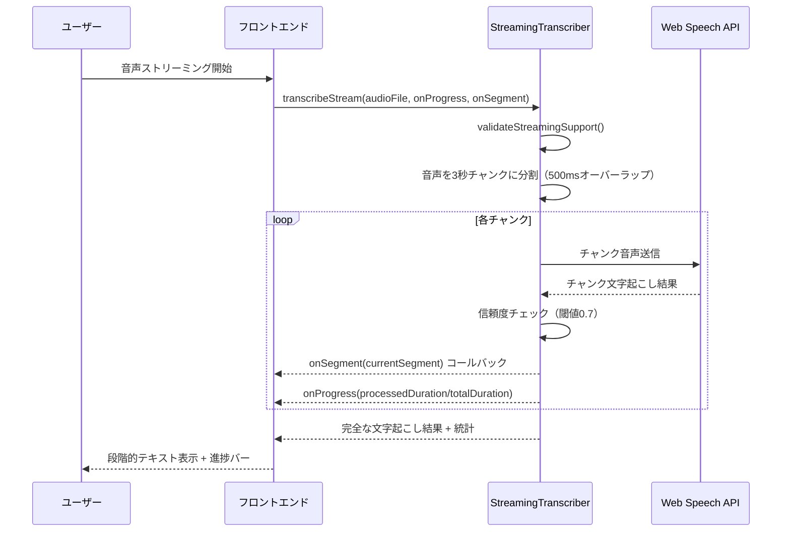
```mermaid
sequenceDiagram
    participant U as ユーザー
    participant FE as フロントエンド
    participant ST as StreamingTranscriber
    participant WSP as Web Speech API

    U->>FE: 音声ストリーミング開始
    FE->>ST: transcribeStream(audioFile, onProgress, onSegment)
    ST->>ST: validateStreamingSupport()
    ST->>ST: 音声を3秒チャンクに分割（500msオーバーラップ）
    loop 各チャンク
        ST->>WSP: チャンク音声送信
        WSP-->>ST: チャンク文字起こし結果
        ST->>ST: 信頼度チェック（閾値0.7）
        ST-->>FE: onSegment(currentSegment) コールバック
        ST-->>FE: onProgress(processedDuration/totalDuration)
    end
    ST-->>FE: 完全な文字起こし結果 + 統計
    FE-->>U: 段階的テキスト表示 + 進捗バー
```

**詳細ステップ**:

1. ブラウザの Web Speech API サポートを検証 🔵
2. 音声データを3秒チャンク（500msオーバーラップ）に分割 🔵
3. 各チャンクを逐次処理し、リアルタイムコールバックでUI更新 🔵
4. 信頼度スコア（デフォルト閾値0.7）による品質フィルタリング 🔵
5. 個別チャンク失敗時は継続（全体停止しない） 🔵
6. 処理統計（平均信頼度・セグメント数・処理時間）を返却 🔵

### 機能2: LLM 内容分析とフォールバック 🔵

**信頼性**: 🔵 *PIPELINE_FLOW.md Stage 2・SYSTEM_CORE.md §4.1-4.2・ユーザーストーリー2.1-2.2より*

**関連要件**: REQ-005, REQ-006, REQ-007, REQ-008, REQ-009, REQ-010

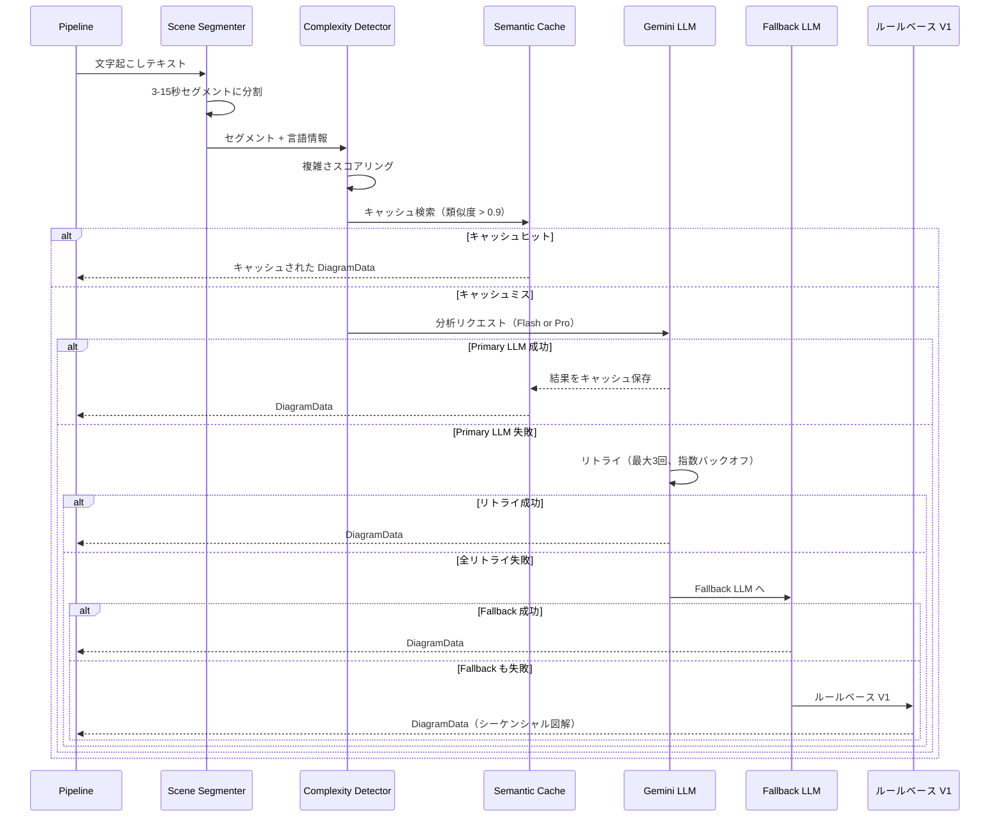
```mermaid
sequenceDiagram
    participant P as Pipeline
    participant SS as Scene Segmenter
    participant CD as Complexity Detector
    participant SC as Semantic Cache
    participant LLM as Gemini LLM
    participant FB as Fallback LLM
    participant RB as ルールベース V1

    P->>SS: 文字起こしテキスト
    SS->>SS: 3-15秒セグメントに分割
    SS->>CD: セグメント + 言語情報
    CD->>CD: 複雑さスコアリング
    CD->>SC: キャッシュ検索（類似度 > 0.9）
    alt キャッシュヒット
        SC-->>P: キャッシュされた DiagramData
    else キャッシュミス
        CD->>LLM: 分析リクエスト（Flash or Pro）
        alt Primary LLM 成功
            LLM-->>SC: 結果をキャッシュ保存
            SC-->>P: DiagramData
        else Primary LLM 失敗
            LLM->>LLM: リトライ（最大3回、指数バックオフ）
            alt リトライ成功
                LLM-->>P: DiagramData
            else 全リトライ失敗
                LLM->>FB: Fallback LLM へ
                alt Fallback 成功
                    FB-->>P: DiagramData
                else Fallback も失敗
                    FB->>RB: ルールベース V1
                    RB-->>P: DiagramData（シーケンシャル図解）
                end
            end
        end
    end
```

**詳細ステップ**:

1. 文字起こしテキストを意味単位（3-15秒）のセグメントに分割
2. 言語検出（EN/JA）→ 複雑さスコアリング
3. セマンティックキャッシュ検索（類似度閾値0.9）
4. キャッシュミス時: Flash/Pro 自動選択で LLM 分析
5. エンティティ抽出・関係性抽出・図解タイプ検出（flow/tree/timeline/matrix/cycle）
6. 失敗時は3層フォールバックで必ず結果を生成

### 機能3: ゼロオーバーラップレイアウト生成 🔵

**信頼性**: 🔵 *SYSTEM_CORE.md §4.3・ZERO_OVERLAP_DESIGN.md・ユーザーストーリー3.1より*

**関連要件**: NFR-302

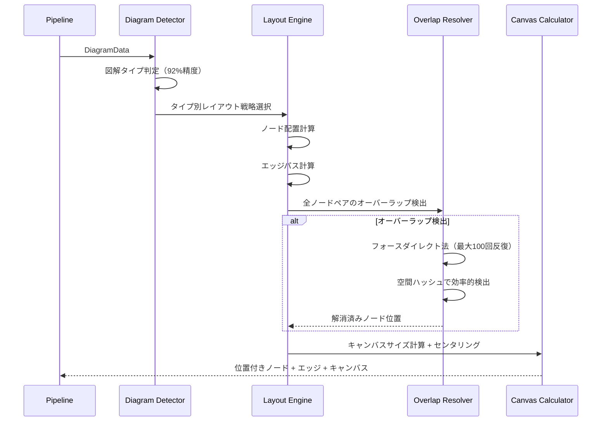
```mermaid
sequenceDiagram
    participant P as Pipeline
    participant DD as Diagram Detector
    participant LE as Layout Engine
    participant OR as Overlap Resolver
    participant CC as Canvas Calculator

    P->>DD: DiagramData
    DD->>DD: 図解タイプ判定（92%精度）
    DD->>LE: タイプ別レイアウト戦略選択
    LE->>LE: ノード配置計算
    LE->>LE: エッジパス計算
    LE->>OR: 全ノードペアのオーバーラップ検出
    alt オーバーラップ検出
        OR->>OR: フォースダイレクト法（最大100回反復）
        OR->>OR: 空間ハッシュで効率的検出
        OR-->>LE: 解消済みノード位置
    end
    LE->>CC: キャンバスサイズ計算 + センタリング
    CC-->>P: 位置付きノード + エッジ + キャンバス
```

**図解タイプ別レイアウト戦略**:

| タイプ | 主戦略 | フォールバック | 特記事項 |
|--------|--------|---------------|---------|
| flow | FlowStrategy (Dagre) | FallbackLayoutStrategy | フロー方向を強調 🔵 |
| tree | TreeStrategy (階層) | FallbackLayoutStrategy | 親子関係を維持 🔵 |
| timeline | TimelineStrategy (X制約) | FallbackLayoutStrategy | Y軸固定で時系列 🔵 |
| matrix | MatrixStrategy (Grid-Snap) | FallbackLayoutStrategy | 厳格グリッド配置 🔵 |
| cycle | CycleStrategy (円形) | FallbackLayoutStrategy | 円形構造を維持 🔵 |
| network | NetworkLayoutStrategy | FallbackLayoutStrategy | ネットワークグラフ 🔵 |
| concept-map | ConceptMapLayoutStrategy | FallbackLayoutStrategy | 概念マップ 🔵 |
| comparison | ComparisonLayoutStrategy | FallbackLayoutStrategy | 比較図 🔵 |
| flowchart | FlowchartLayoutStrategy | FallbackLayoutStrategy | フローチャート専用 🔵 |

**レイアウトエンジン構成** 🔵:
- **LayoutEvaluator**: セグメント内容から最適戦略を自動選択
- **LayoutOptimizer**: レイアウト結果の最適化
- **OverlapResolver**: フォースダイレクト法によるオーバーラップ解消
- **CulturalLayoutAdapter**: 言語・文化に応じたレイアウト調整
- **FallbackLayoutStrategy**: 全戦略失敗時のフォールバック

### 機能4: アニメーション動画生成 🔵

**信頼性**: 🔵 *PIPELINE_FLOW.md Stage 4-5・ユーザーストーリー3.2・Phase 4 実装より*

**関連要件**: REQ-025, REQ-026, REQ-027, REQ-028, REQ-029, REQ-030, REQ-301

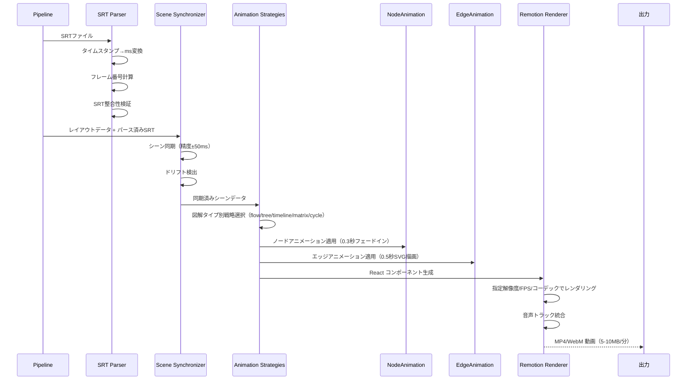
```mermaid
sequenceDiagram
    participant P as Pipeline
    participant SRTParser as SRT Parser
    participant Sync as Scene Synchronizer
    participant AnimStrat as Animation Strategies
    participant NodeAnim as NodeAnimation
    participant EdgeAnim as EdgeAnimation
    participant Rem as Remotion Renderer
    participant Out as 出力

    P->>SRTParser: SRTファイル
    SRTParser->>SRTParser: タイムスタンプ→ms変換
    SRTParser->>SRTParser: フレーム番号計算
    SRTParser->>SRTParser: SRT整合性検証
    P->>Sync: レイアウトデータ + パース済みSRT
    Sync->>Sync: シーン同期（精度±50ms）
    Sync->>Sync: ドリフト検出
    Sync->>AnimStrat: 同期済みシーンデータ
    AnimStrat->>AnimStrat: 図解タイプ別戦略選択（flow/tree/timeline/matrix/cycle）
    AnimStrat->>NodeAnim: ノードアニメーション適用（0.3秒フェードイン）
    AnimStrat->>EdgeAnim: エッジアニメーション適用（0.5秒SVG描画）
    AnimStrat->>Rem: React コンポーネント生成
    Rem->>Rem: 指定解像度/FPS/コーデックでレンダリング
    Rem->>Rem: 音声トラック統合
    Rem-->>Out: MP4/WebM 動画（5-10MB/分）
```

**Phase 4 実装詳細**:
1. SRTパーサーがタイムスタンプをミリ秒に変換し、フレーム番号を計算 🔵
2. シーン同期がキャプションとアニメーションを±50ms精度で同期 🔵
3. 5種図解タイプ別のアニメーション戦略がノード・エッジのタイミングを制御 🔵
4. ノードフェードイン（0.3秒）とエッジSVG描画（0.5秒）の段階的アニメーション 🔵
5. Remotion renderMedia()で720p/1080p/4K、30/60fps、H.264/H.265/VP9出力 🔵

### 機能5: パイプラインUI処理フロー 🔵

**信頼性**: 🔵 *src/components/SimplePipelineInterface.tsx・src/pages/SimplePipeline.tsx・Phase 4 実装より*

**関連要件**: REQ-031, REQ-032, REQ-033, REQ-034, REQ-035

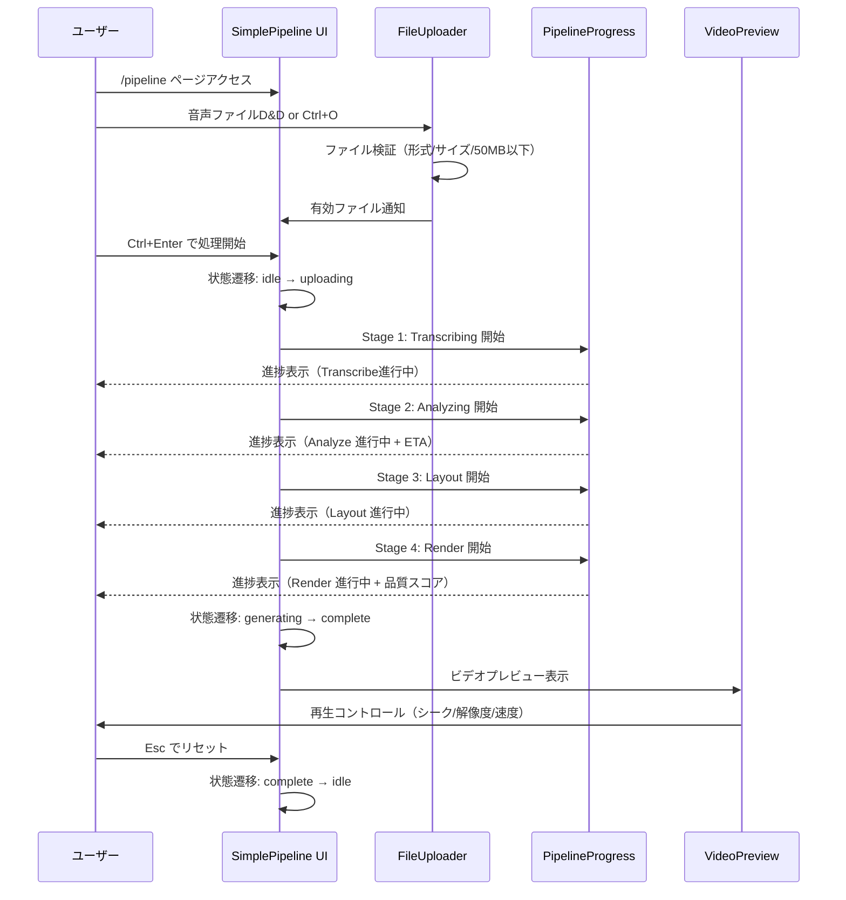
```mermaid
sequenceDiagram
    participant U as ユーザー
    participant FE as SimplePipeline UI
    participant FU as FileUploader
    participant PP as PipelineProgress
    participant VP as VideoPreview

    U->>FE: /pipeline ページアクセス
    U->>FU: 音声ファイルD&D or Ctrl+O
    FU->>FU: ファイル検証（形式/サイズ/50MB以下）
    FU->>FE: 有効ファイル通知
    U->>FE: Ctrl+Enter で処理開始
    FE->>FE: 状態遷移: idle → uploading
    FE->>PP: Stage 1: Transcribing 開始
    PP-->>U: 進捗表示（Transcribe進行中）
    FE->>PP: Stage 2: Analyzing 開始
    PP-->>U: 進捗表示（Analyze 進行中 + ETA）
    FE->>PP: Stage 3: Layout 開始
    PP-->>U: 進捗表示（Layout 進行中）
    FE->>PP: Stage 4: Render 開始
    PP-->>U: 進捗表示（Render 進行中 + 品質スコア）
    FE->>FE: 状態遷移: generating → complete
    FE->>VP: ビデオプレビュー表示
    VP->>U: 再生コントロール（シーク/解像度/速度）
    U->>FE: Esc でリセット
    FE->>FE: 状態遷移: complete → idle
```

**Phase 4 Pipeline UI 実装詳細**:
1. ドラッグ＆ドロップ + キーボードショートカット（Ctrl+O/Ctrl+Enter/Esc）対応 🔵
2. 4段階リアルタイム進捗（ETA・品質スコア・ステージ別表示）🔵
3. 処理完了後のビデオプレビュー（Remotion Player・シークバー・解像度切替）🔵
4. 結果表示（シーン一覧・トランスクリプト・品質メトリクス）🔵

## データ処理パターン

### 同期処理 🔵

**信頼性**: 🔵 *PIPELINE_FLOW.md・src/pipeline/ より*

- 文字起こし → シーン分割 → 言語検出: パイプライン内の直列処理
- レイアウト計算 → オーバーラップ解消: 同期的な反復処理
- 各ステージの完了を待って次ステージに進む品質ゲート方式

### 非同期処理 🔵

**信頼性**: 🔵 *PIPELINE_FLOW.md §4.2・src/analysis/llm-service.ts より*

- LLM API 呼び出し: 非同期 + タイムアウト管理
- キャッシュ検索: 非同期 I/O
- バッチジョブ: 非同期キューイング（最大3並列）

### バッチ処理 🔵

**信頼性**: 🔵 *src/api/batch-processing-api.ts・README.md より*

- 複数音声ファイルの一括処理（最大3並列）
- ジョブID ベースの進捗追跡（進捗率・ETA・品質スコア）
- ジョブキャンセル機能

## エラーハンドリングフロー 🔵

**信頼性**: 🔵 *PIPELINE_FLOW.md §7・SYSTEM_CORE.md §4.2・src/quality/ より*

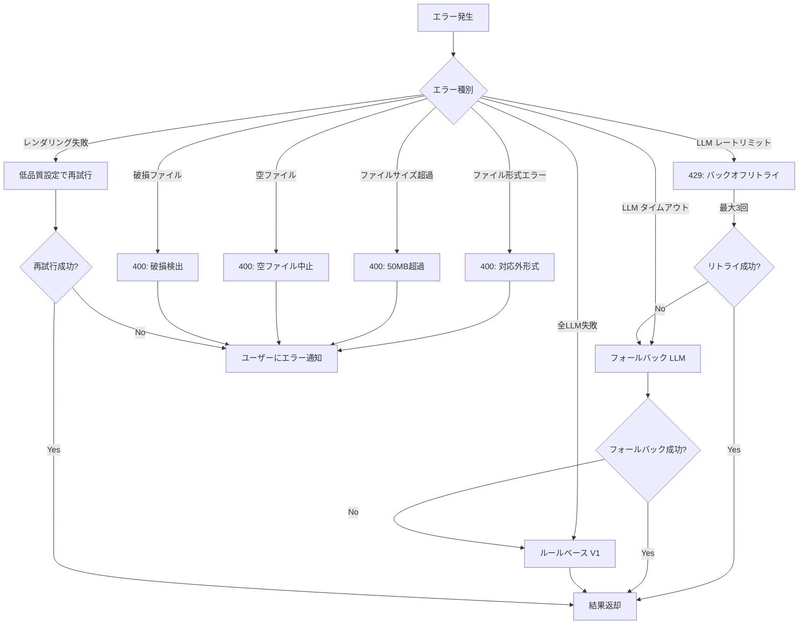
```mermaid
flowchart TD
    A[エラー発生] --> B{エラー種別}
    B -->|ファイル形式エラー| C[400: 対応外形式]
    B -->|ファイルサイズ超過| D[400: 50MB超過]
    B -->|空ファイル| E[400: 空ファイル中止]
    B -->|破損ファイル| F[400: 破損検出]
    B -->|LLM レートリミット| G[429: バックオフリトライ]
    B -->|LLM タイムアウト| H[フォールバック LLM]
    B -->|全LLM失敗| I[ルールベース V1]
    B -->|レンダリング失敗| J[低品質設定で再試行]

    C --> K[ユーザーにエラー通知]
    D --> K
    E --> K
    F --> K
    G --> |最大3回| L{リトライ成功?}
    L -->|Yes| M[結果返却]
    L -->|No| H
    H --> N{フォールバック成功?}
    N -->|Yes| M
    N -->|No| I
    I --> M
    J --> O{再試行成功?}
    O -->|Yes| M
    O -->|No| K
```

### ユーザー主導エラー回復フロー 🔵

**信頼性**: 🔵 *src/quality/user-guided-error-recovery.ts・要件定義REQ-037より*

**関連要件**: REQ-037

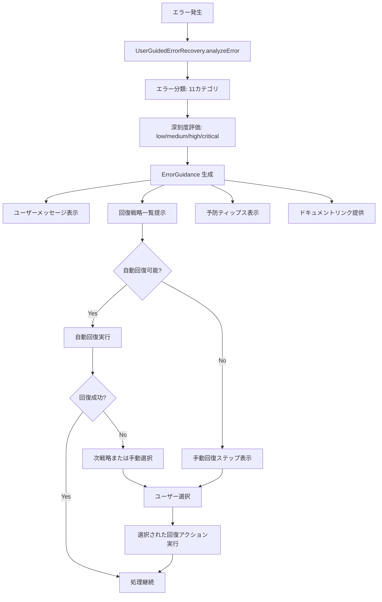
```mermaid
flowchart TD
    A[エラー発生] --> B[UserGuidedErrorRecovery.analyzeError]
    B --> C[エラー分類: 11カテゴリ]
    C --> D[深刻度評価: low/medium/high/critical]
    D --> E[ErrorGuidance 生成]
    E --> F[ユーザーメッセージ表示]
    E --> G[回復戦略一覧提示]
    G --> H{自動回復可能?}
    H -->|Yes| I[自動回復実行]
    I --> J{回復成功?}
    J -->|Yes| K[処理継続]
    J -->|No| L[次戦略または手動選択]
    H -->|No| M[手動回復ステップ表示]
    M --> N[ユーザー選択]
    N --> O[選択された回復アクション実行]
    O --> K
    L --> N
    E --> P[予防ティップス表示]
    E --> Q[ドキュメントリンク提供]
```

**エラーカテゴリ** 🔵:
- file_format, file_size, transcription, analysis, layout, rendering
- api, network, memory, timeout, unknown

### 設定バリデーションフロー 🔵

**信頼性**: 🔵 *@stv/core/config/validate・@stv/core/config/schema・要件定義REQ-038より*

**関連要件**: REQ-038

```mermaid
flowchart TD
    A[アプリケーション起動] --> B[環境変数読み込み]
    B --> C[validateConfig(config)]
    C --> D{バリデーション結果}
    D -->|エラーなし| E[ConfigSchema 型として設定利用]
    D -->|ValidationErrorあり| F[全エラー一覧表示]
    F --> G[プロセス終了 exit 1]
    E --> H[パイプライン処理開始]
```

**バリデーションルール** 🔵:
- 必須フィールド: googleApiKey, supabaseUrl, supabaseAnonKey
- URL形式検証: supabaseUrl
- 数値範囲: complexityThreshold (0-1), similarityThreshold (0-1), port (1024-65535), cacheSize (1-10000), cacheTtlMinutes (1-10080)
- 列挙型: nodeEnv (development/production/test)

## 状態管理フロー

### フロントエンド状態管理 🔵

**信頼性**: 🔵 *note.md・src/components/SimplePipelineInterface.tsx より*

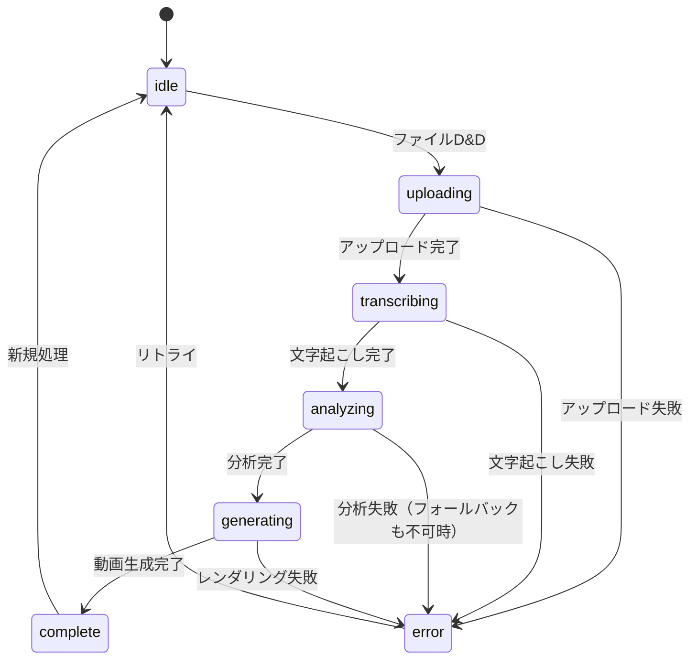
```mermaid
stateDiagram-v2
    [*] --> idle
    idle --> uploading: ファイルD&D
    uploading --> transcribing: アップロード完了
    transcribing --> analyzing: 文字起こし完了
    analyzing --> generating: 分析完了
    generating --> complete: 動画生成完了
    uploading --> error: アップロード失敗
    transcribing --> error: 文字起こし失敗
    analyzing --> error: 分析失敗（フォールバックも不可時）
    generating --> error: レンダリング失敗
    error --> idle: リトライ
    complete --> idle: 新規処理
```

### パイプライン内部状態 🔵

**信頼性**: 🔵 *PIPELINE_FLOW.md §6・src/pipeline/quality-monitor.ts より*

各ステージの品質ゲート管理:
- Stage 1: 音声長 ≥ 1秒、文字起こし精度チェック
- Stage 2: エンティティ/関係性抽出の完全性チェック
- Stage 3: オーバーラップ数 = 0 の保証
- Stage 4-5: キャプション同期精度 ±50ms

## データ整合性の保証 🔵

**信頼性**: 🔵 *PIPELINE_FLOW.md §7・supabase/migrations/・SYSTEM_CORE.md §4.3 より*

- **トランザクション管理**: Supabase（PostgreSQL）の標準トランザクション
- **データ整合性**: RLS によるアクセス制御 + 外部キー制約
- **キャッシュ整合性**: TTL 120分による自動失効 + 類似度ベースの整合判定
- **レイアウト整合性**: オーバーラップ検出 → フォースダイレクト解消 → 最終確認の3段階保証
- **NaN/Infinity伝播防止** 🔵: パイプライン全体での数値データバリデーション *@stv/core/utils/guards・直近6コミット(f42f7bc〜a68e5c2)より*
  - **入力段階**: diagram-detector/scene-segmenterが`sanitizeFinite()`でNaN/非数値をデフォルト値に変換
  - **処理段階**: stage-timing-metricsが`Math.max(0, rawDuration)`で負のdurationを0にクランプ・throughputPerMsのNaNガード
  - **レンダリング段階**: Remotionコンポーネント（EdgeAnimation/Video/DiagramVideo/scene-synchronizer/renderer）が`Number.isFinite()`でNaN/Infinityをガード
  - **出力段階**: `clampFinite()`が±Infinityをそれぞれmax/minに変換・`safeToLocaleString()`がundefined/NaNを'0'に変換

## NaN/Infinityガードデータフロー 🔵

**信頼性**: 🔵 *@stv/core/utils/guards・src/remotion/*.tsx・src/pipeline/*.ts・src/analysis/*.ts より*

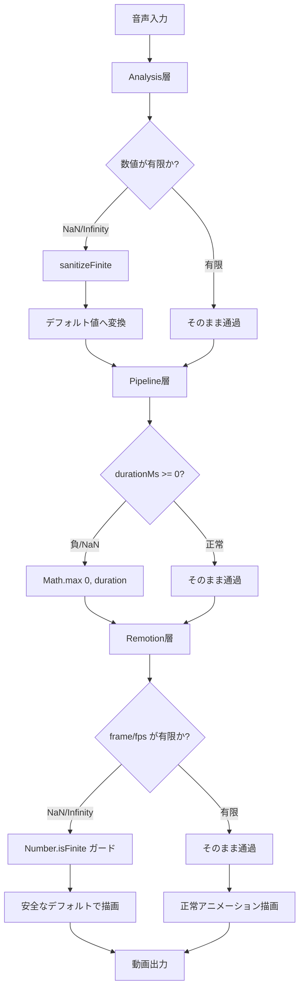
```mermaid
flowchart TD
    A[音声入力] --> B[Analysis層]
    B --> C{数値が有限か?}
    C -->|NaN/Infinity| D[sanitizeFinite]
    C -->|有限| E[そのまま通過]
    D --> F[デフォルト値へ変換]
    F --> G[Pipeline層]
    E --> G
    G --> H{durationMs >= 0?}
    H -->|負/NaN| I[Math.max 0, duration]
    H -->|正常| J[そのまま通過]
    I --> K[Remotion層]
    J --> K
    K --> L{frame/fps が有限か?}
    L -->|NaN/Infinity| M[Number.isFinite ガード]
    L -->|有限| N[そのまま通過]
    M --> O[安全なデフォルトで描画]
    N --> P[正常アニメーション描画]
    O --> Q[動画出力]
    P --> Q
```

**詳細ステップ**:

1. Analysis層でdiagram-detector/scene-segmenterがconsensus スコアリングのNaNを`sanitizeFinite()`でフィルタリング
2. Pipeline層で`createTimingRecord()`が負のduration・NaN throughputを0にクランプ
3. Remotion層でDiagramVideoが`startTime`/`durationMs`/`endTime`の`Number.isFinite()`をチェックし、fps除算を`Math.max(fps, 1)`でガード
4. guards.tsの`clampFinite()`が±Infinityをそれぞれmax/minに変換（以前はNaN→minだったが全ケースをカバー）
5. property-based fuzz testsがnumeric-fuzz(299行)・segment-duration-fuzz(120行)・render-params-fuzz(241行)で体系的にNaN/Infinity入力をテスト

## 自動改善サイクル 🔵

**信頼性**: 🔵 *src/framework/・src/pipeline/framework-integrated-pipeline.ts・SYSTEM_CORE.md §5・ITERATION_LOG より*

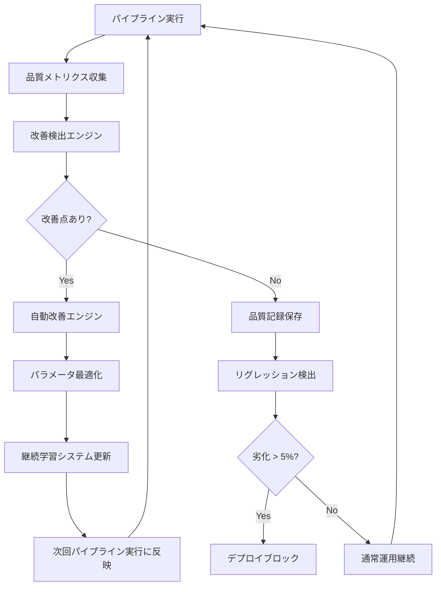
```mermaid
flowchart TD
    A[パイプライン実行] --> B[品質メトリクス収集]
    B --> C[改善検出エンジン]
    C --> D{改善点あり?}
    D -->|Yes| E[自動改善エンジン]
    D -->|No| F[品質記録保存]
    E --> G[パラメータ最適化]
    G --> H[継続学習システム更新]
    H --> I[次回パイプライン実行に反映]
    I --> A
    F --> J[リグレッション検出]
    J --> K{劣化 > 5%?}
    K -->|Yes| L[デプロイブロック]
    K -->|No| M[通常運用継続]
    M --> A
```

**改善サイクル概要**:
1. パイプライン実行ごとに品質メトリクスを収集
2. 改善検出エンジンが品質スコアの傾向を分析
3. 改善点が検出された場合、パラメータを自動最適化
4. リグレッション検出（>5%劣化）でデプロイブロック

**FrameworkIntegratedPipeline フロー** 🔵:
- MainPipeline + IterationManager + AutoImprovementEngine の統合パイプライン
- 自動フェーズ管理（MVP構築→機能拡張→品質改善→最適化）
- 品質閾値に基づく自動コミット判定

## 適応型品質プリセットフロー 🔵

**信頼性**: 🔵 *src/pipeline/adaptive-quality-presets.ts・PIPELINE_FLOW.md §8.2 より*

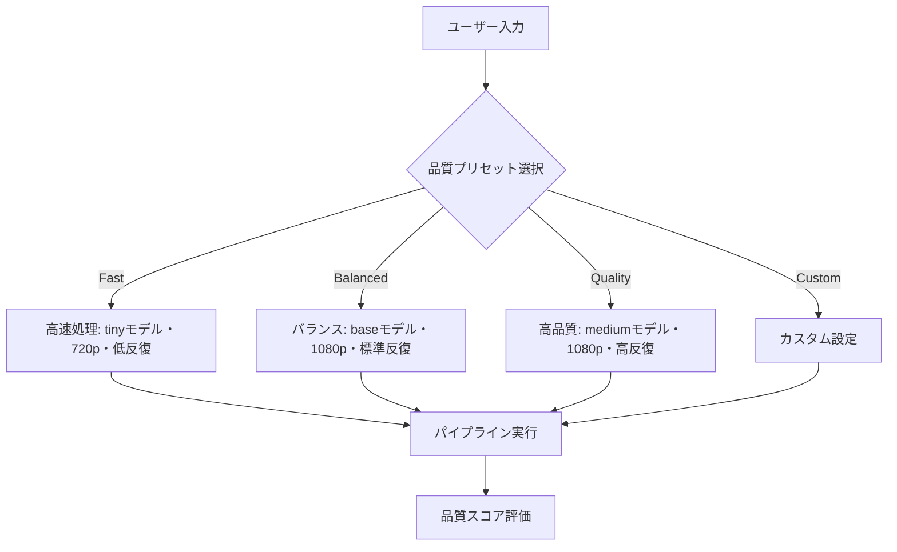
```mermaid
flowchart TD
    A[ユーザー入力] --> B{品質プリセット選択}
    B -->|Fast| C1[高速処理: tinyモデル・720p・低反復]
    B -->|Balanced| C2[バランス: baseモデル・1080p・標準反復]
    B -->|Quality| C3[高品質: mediumモデル・1080p・高反復]
    B -->|Custom| C4[カスタム設定]
    C1 --> D[パイプライン実行]
    C2 --> D
    C3 --> D
    C4 --> D
    D --> E[品質スコア評価]
```

**品質プリセット構成** 🔵:
| プリセット | 文字起こしモデル | 解像度 | FPS | レイアウト品質 | キャッシュ |
|-----------|----------------|--------|-----|--------------|----------|
| Fast | tiny | 720p | 24 | standard | 有効 |
| Balanced | base | 1080p | 30 | enhanced | 有効 |
| Quality | medium | 1080p | 30 | zero_overlap | 有効 |
| Custom | ユーザー指定 | ユーザー指定 | ユーザー指定 | ユーザー指定 | ユーザー指定 |

## パイプラインオーケストレーションフロー 🔵

**信頼性**: 🔵 *src/pipeline/pipeline-orchestrator.ts・要件定義REQ-042 より*

**関連要件**: REQ-040, REQ-041, REQ-042

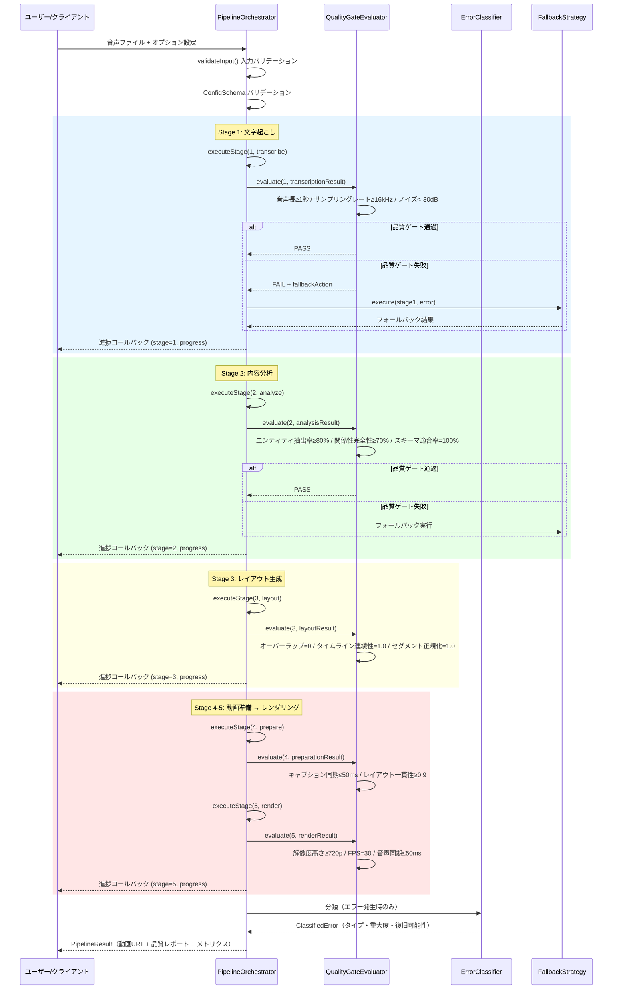
```mermaid
sequenceDiagram
    participant User as ユーザー/クライアント
    participant PO as PipelineOrchestrator
    participant QG as QualityGateEvaluator
    participant EC as ErrorClassifier
    participant FB as FallbackStrategy

    User->>PO: 音声ファイル + オプション設定
    PO->>PO: validateInput() 入力バリデーション
    PO->>PO: ConfigSchema バリデーション

    rect rgb(230, 245, 255)
    Note over PO: Stage 1: 文字起こし
    PO->>PO: executeStage(1, transcribe)
    PO->>QG: evaluate(1, transcriptionResult)
    QG->>QG: 音声長≥1秒 / サンプリングレート≥16kHz / ノイズ<-30dB
    alt 品質ゲート通過
        QG-->>PO: PASS
    else 品質ゲート失敗
        QG-->>PO: FAIL + fallbackAction
        PO->>FB: execute(stage1, error)
        FB-->>PO: フォールバック結果
    end
    PO-->>User: 進捗コールバック (stage=1, progress)
    end

    rect rgb(230, 255, 230)
    Note over PO: Stage 2: 内容分析
    PO->>PO: executeStage(2, analyze)
    PO->>QG: evaluate(2, analysisResult)
    QG->>QG: エンティティ抽出率≥80% / 関係性完全性≥70% / スキーマ適合率=100%
    alt 品質ゲート通過
        QG-->>PO: PASS
    else 品質ゲート失敗
        PO->>FB: フォールバック実行
    end
    PO-->>User: 進捗コールバック (stage=2, progress)
    end

    rect rgb(255, 255, 230)
    Note over PO: Stage 3: レイアウト生成
    PO->>PO: executeStage(3, layout)
    PO->>QG: evaluate(3, layoutResult)
    QG->>QG: オーバーラップ=0 / タイムライン連続性=1.0 / セグメント正規化=1.0
    PO-->>User: 進捗コールバック (stage=3, progress)
    end

    rect rgb(255, 230, 230)
    Note over PO: Stage 4-5: 動画準備 → レンダリング
    PO->>PO: executeStage(4, prepare)
    PO->>QG: evaluate(4, preparationResult)
    QG->>QG: キャプション同期≤50ms / レイアウト一貫性≥0.9
    PO->>PO: executeStage(5, render)
    PO->>QG: evaluate(5, renderResult)
    QG->>QG: 解像度高さ≥720p / FPS=30 / 音声同期≤50ms
    PO-->>User: 進捗コールバック (stage=5, progress)
    end

    PO->>EC: 分類（エラー発生時のみ）
    EC-->>PO: ClassifiedError（タイプ・重大度・復旧可能性）

    PO-->>User: PipelineResult（動画URL + 品質レポート + メトリクス）
```

**パイプラインオーケストレーター構成** 🔵:
- 5段階パイプラインの統合実行（文字起こし→分析→レイアウト→準備→レンダリング）
- 各ステージでの品質ゲート評価（QualityGateEvaluator）
- 品質ゲート失敗時のフォールバック戦略（3層チェーン）
- 進捗コールバック（各ステージの progress 0-100%）
- ErrorClassifier による構造化エラー分類
- StreamingTranscriber（REQ-036）とSmartParameterTuner（REQ-039）の統合

### 品質ゲート評価フロー 🔵

**信頼性**: 🔵 *src/quality/quality-gate.ts・要件定義REQ-041 より*

**関連要件**: REQ-041

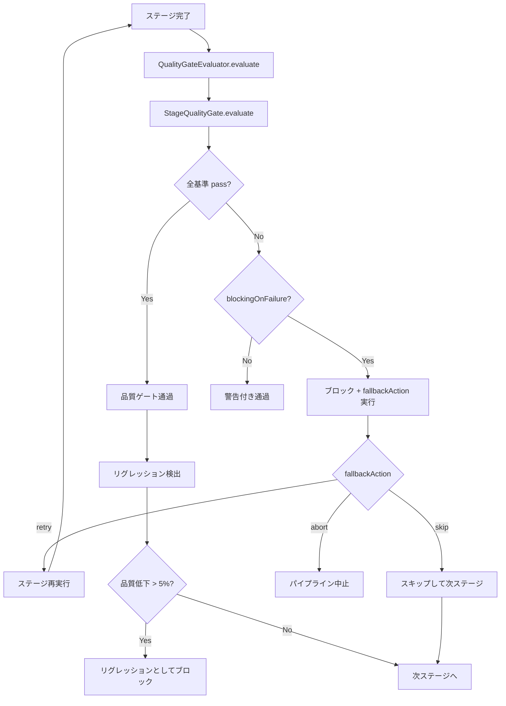
```mermaid
flowchart TD
    A[ステージ完了] --> B[QualityGateEvaluator.evaluate]
    B --> C[StageQualityGate.evaluate]
    C --> D{全基準 pass?}
    D -->|Yes| E[品質ゲート通過]
    D -->|No| F{blockingOnFailure?}
    F -->|Yes| G[ブロック + fallbackAction 実行]
    F -->|No| H[警告付き通過]
    G --> I{fallbackAction}
    I -->|retry| J[ステージ再実行]
    I -->|skip| K[スキップして次ステージ]
    I -->|abort| L[パイプライン中止]
    E --> M[リグレッション検出]
    M --> N{品質低下 > 5%?}
    N -->|Yes| O[リグレッションとしてブロック]
    N -->|No| P[次ステージへ]
    J --> A
    K --> P
```

**5段階品質ゲート基準** 🔵:
| ステージ | 基準 | 閾値 |
|---------|------|------|
| 1（文字起こし） | audioDuration, sampleRate, noiseLevel | ≥1秒, ≥16kHz, <-30dB |
| 2（分析） | entityExtractionRate, relationCompleteness, schemaConformance | ≥80%, ≥70%, =100% |
| 3（レイアウト） | zeroOverlap, timelineContinuity, segmentNormalization | =0, =1.0, =1.0 |
| 4（準備） | captionSync, layoutConsistency | ≤50ms, ≥0.9 |
| 5（レンダリング） | resolution, fps, audioSync | ≥720p, =30, ≤50ms |

### エラー分類フロー 🔵

**信頼性**: 🔵 *src/quality/error-classifier.ts・要件定義REQ-040 より*

**関連要件**: REQ-040

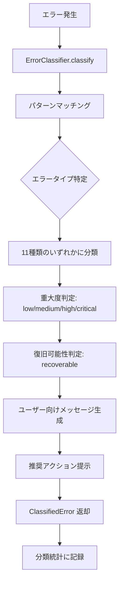
```mermaid
flowchart TD
    A[エラー発生] --> B[ErrorClassifier.classify]
    B --> C[パターンマッチング]
    C --> D{エラータイプ特定}
    D --> E[11種類のいずれかに分類]
    E --> F[重大度判定: low/medium/high/critical]
    F --> G[復旧可能性判定: recoverable]
    G --> H[ユーザー向けメッセージ生成]
    H --> I[推奨アクション提示]
    I --> J[ClassifiedError 返却]
    J --> K[分類統計に記録]
```

**エラータイプ一覧** 🔵:
| エラータイプ | 重大度 | 復旧可能 | 対象ステージ |
|------------|--------|---------|------------|
| FILE_FORMAT_INVALID | medium | false | transcription |
| FILE_SIZE_EXCEEDED | medium | false | transcription |
| LLM_API_ERROR | high | true | analysis |
| LLM_RATE_LIMITED | high | true | analysis |
| LLM_TIMEOUT | high | true | analysis |
| RENDERING_ERROR | high | true | rendering |
| RENDERING_OOM | critical | true | rendering |
| NETWORK_ERROR | medium | true | all |
| STORAGE_ERROR | high | true | all |
| QUALITY_GATE_FAILED | medium | true | quality |
| UNKNOWN | low | false | all |

### Edge Functions 共通基盤フロー 🔵

**信頼性**: 🔵 *supabase/functions/_shared/auth.ts・_shared/error-handler.ts・要件定義REQ-044~045 より*

**関連要件**: REQ-044, REQ-045

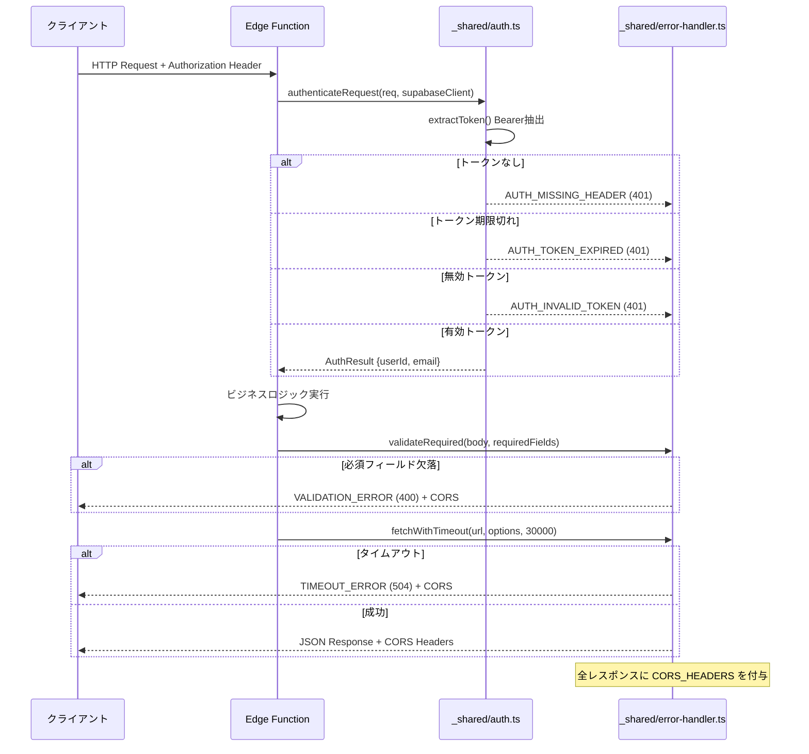
```mermaid
sequenceDiagram
    participant Client as クライアント
    participant EF as Edge Function
    participant Auth as _shared/auth.ts
    participant EH as _shared/error-handler.ts

    Client->>EF: HTTP Request + Authorization Header
    EF->>Auth: authenticateRequest(req, supabaseClient)
    Auth->>Auth: extractToken() Bearer抽出
    alt トークンなし
        Auth-->>EH: AUTH_MISSING_HEADER (401)
    else トークン期限切れ
        Auth-->>EH: AUTH_TOKEN_EXPIRED (401)
    else 無効トークン
        Auth-->>EH: AUTH_INVALID_TOKEN (401)
    else 有効トークン
        Auth-->>EF: AuthResult {userId, email}
    end

    EF->>EF: ビジネスロジック実行
    EF->>EH: validateRequired(body, requiredFields)
    alt 必須フィールド欠落
        EH-->>Client: VALIDATION_ERROR (400) + CORS
    end

    EF->>EH: fetchWithTimeout(url, options, 30000)
    alt タイムアウト
        EH-->>Client: TIMEOUT_ERROR (504) + CORS
    else 成功
        EH-->>Client: JSON Response + CORS Headers
    end

    Note over EH: 全レスポンスに CORS_HEADERS を付与
```

**共通基盤機能** 🔵:
- **認証（auth.ts）**: JWT抽出・検証・期限切れ検出・ユーザー情報返却
- **エラーハンドリング（error-handler.ts）**: CORS ヘッダー管理・エラー分類（AuthError/TimeoutError/ValidationError）・AbortController タイムアウト（デフォルト30秒）・必須フィールド検証

### WebSocket リアルタイム通知フロー 🔵

**信頼性**: 🔵 *src/api/websocket-handler.ts・要件定義REQ-046 より*

**関連要件**: REQ-046

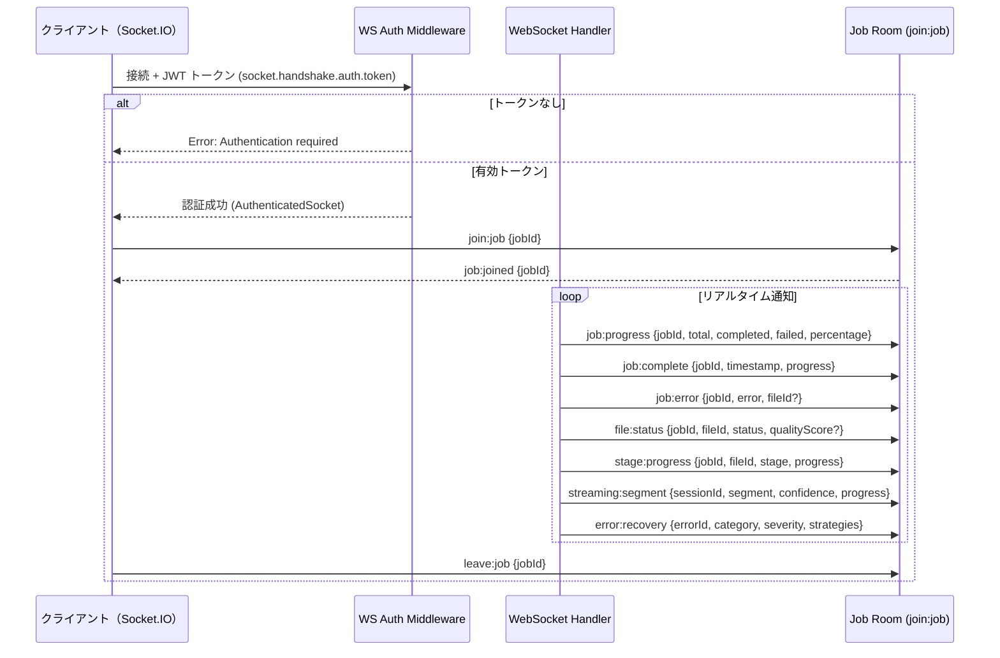
```mermaid
sequenceDiagram
    participant Client as クライアント（Socket.IO）
    participant Auth as WS Auth Middleware
    participant Handler as WebSocket Handler
    participant Room as Job Room (join:job)

    Client->>Auth: 接続 + JWT トークン (socket.handshake.auth.token)
    alt トークンなし
        Auth-->>Client: Error: Authentication required
    else 有効トークン
        Auth-->>Client: 認証成功 (AuthenticatedSocket)
        Client->>Room: join:job {jobId}
        Room-->>Client: job:joined {jobId}

        loop リアルタイム通知
            Handler->>Room: job:progress {jobId, total, completed, failed, percentage}
            Handler->>Room: job:complete {jobId, timestamp, progress}
            Handler->>Room: job:error {jobId, error, fileId?}
            Handler->>Room: file:status {jobId, fileId, status, qualityScore?}
            Handler->>Room: stage:progress {jobId, fileId, stage, progress}
            Handler->>Room: streaming:segment {sessionId, segment, confidence, progress}
            Handler->>Room: error:recovery {errorId, category, severity, strategies}
        end

        Client->>Room: leave:job {jobId}
    end
```

**WebSocket イベント一覧** 🔵:

| イベント | 方向 | ペイロード | 説明 |
|---------|------|-----------|------|
| join:job | Client→Server | `{jobId}` | ジョブルーム参加 |
| leave:job | Client→Server | `{jobId}` | ジョブルーム離脱 |
| job:joined | Server→Client | `{jobId}` | ルーム参加確認 |
| job:progress | Server→Client | `{jobId, total, completed, failed, percentage}` | ジョブ進捗 |
| job:complete | Server→Client | `{jobId, timestamp, progress}` | ジョブ完了 |
| job:error | Server→Client | `{jobId, error, fileId?}` | ジョブエラー |
| file:status | Server→Client | `{jobId, fileId, status, qualityScore?}` | ファイルステータス |
| stage:progress | Server→Client | `{jobId, fileId, stage, progress}` | ステージ進捗 |
| streaming:segment | Server→Client | `{sessionId, segment, confidence, progress}` | ストリーミングセグメント |
| streaming:complete | Server→Client | `{sessionId, fullTranscript, statistics}` | ストリーミング完了 |
| error:recovery | Server→Client | `{errorId, category, severity, strategies}` | エラー回復オプション |
| error:recovered | Server→Client | `{errorId, strategy, success}` | エラー回復結果 |

### バッチ最適化フロー 🔵

**信頼性**: 🔵 *src/optimization/batch-optimizer.ts・要件定義REQ-047 より*

**関連要件**: REQ-047

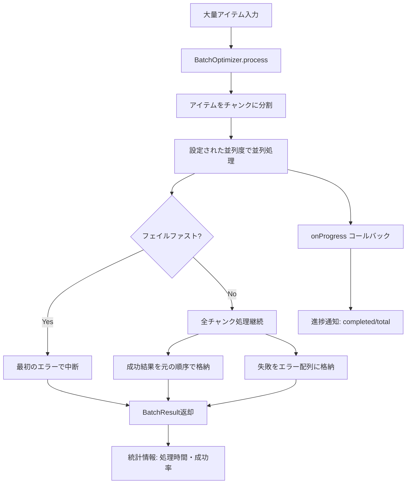
```mermaid
flowchart TD
    A[大量アイテム入力] --> B[BatchOptimizer.process]
    B --> C[アイテムをチャンクに分割]
    C --> D[設定された並列度で並列処理]
    D --> E{フェイルファスト?}
    E -->|Yes| F[最初のエラーで中断]
    E -->|No| G[全チャンク処理継続]
    G --> H[成功結果を元の順序で格納]
    G --> I[失敗をエラー配列に格納]
    F --> J[BatchResult返却]
    H --> J
    I --> J
    J --> K[統計情報: 処理時間・成功率]
    D --> L[onProgress コールバック]
    L --> M[進捗通知: completed/total]
```

**BatchOptimizer 設定** 🔵:
| パラメータ | 既定値 | 説明 |
|-----------|--------|------|
| concurrency | 4 | 最大並列チャンク数 |
| chunkSize | 50 | チャンクあたりのアイテム数 |
| failFast | false | 最初のエラーで中断するか |
| onProgress | - | 進捗コールバック (completed, total) |

### 計算キャッシュ・メモリキャッシュフロー 🔵

**信頼性**: 🔵 *src/optimization/computation-cache.ts・memory-cache.ts・要件定義REQ-048 より*

**関連要件**: REQ-048

```mermaid
flowchart TD
    A[キャッシュアクセス] --> B{キャッシュヒット?}
    B -->|Yes| C[キャッシュから値を返却]
    B -->|No| D[compute 関数を実行]
    D --> E[TTL設定でエントリ保存]
    E --> F[タグインデックスに登録]
    F --> G{最大サイズ超過?}
    G -->|Yes| H[LRU退行で最古エントリ削除]
    G -->|No| I[値を返却]
    H --> I
    C --> J[統計: ヒット数更新]
    I --> K[統計: ミス数更新]

    L[タグベース無効化] --> M[invalidateByTag]
    M --> N[該当タグの全エントリ削除]

    O[定期クリーンアップ] --> P[MemoryCache.cleanup]
    P --> Q[TTL期限切れエントリ自動削除]
```

**キャッシュ構成** 🔵:
| キャッシュ | 最大サイズ | TTL | 特記事項 |
|-----------|-----------|-----|---------|
| ComputationCache | 200 | 10分 | タグベース無効化・async/sync両対応 |
| MemoryCache | 100 | 5分 | LRU退行・定期クリーンアップ・ヒット率統計 |

### 遅延ローダーフロー 🔵

**信頼性**: 🔵 *src/optimization/lazy-loader.ts・要件定義REQ-049 より*

**関連要件**: REQ-049

```mermaid
flowchart TD
    A[load(key, loader) 呼び出し] --> B{キャッシュにあり?}
    B -->|Yes| C[キャッシュから即座に返却]
    B -->|No| D{同時ロード中?}
    D -->|Yes| E[既存の Promise を再利用]
    D -->|No| F[loader 関数を実行]
    F --> G[モジュールをキャッシュに保存]
    G --> H[ロード時間を記録]
    H --> I[モジュールを返却]
    E --> I

    J[preload(key, loader)] --> K[非同期でロード]
    K --> L[エラーは無視]
    L --> G

    M[createHandle(key, loader)] --> N[再利用可能なハンドル生成]
    N --> O[handle.load() で随时ロード]
```

**遅延ローダー機能** 🔵:
- 動的インポートキャッシュ: 同一キーの重複ロード防止
- 同時ロード重複排除: 複数コンポーネントからの同時要求を1回に束ねる
- プリロード: 非同期で事前キャッシュ（エラーは無視）
- ハンドルファクトリ: `createHandle()` でカプセル化されたアクセス提供
- 統計情報: ロード回数・キャッシュヒット率・平均ロード時間

### グレースフルシャットダウンフロー 🔵

**信頼性**: 🔵 *src/quality/enhanced-error-recovery.ts shutdown()・要件定義REQ-050 より*

**関連要件**: REQ-050

```mermaid
flowchart TD
    A[shutdown() 呼び出し] --> B[ヘルスモニタリングタイマー停止]
    B --> C{アクティブリクエスト数}
    C -->|0件| D[即座にシャットダウン完了]
    C -->|1件以上| E[アクティブリクエスト完了待機]
    E --> F{30秒タイムアウト?}
    F -->|リクエスト完了| G[リクエストキュークリア]
    F -->|タイムアウト| H[残リクエスト強制終了]
    G --> I[サーキットブレーカーリセット]
    H --> I
    I --> J[シャットダウン完了ログ出力]
    D --> J
```

**グレースフルシャットダウン機能** 🔵:
- アクティブリクエストなし: 即座にシャットダウン完了
- アクティブリクエストあり: 完了を待機（最大30秒タイムアウト）
- タイムアウト時: 残リクエストを強制クリア
- クリーンアップ: ヘルスモニタリング停止・キュークリア・サーキットブレーカーリセット

### 型ガードによる図解タイプ検証フロー 🔵

**信頼性**: 🔵 *@stv/core/types/diagram isDiagramType()・要件定義REQ-051 より*

**関連要件**: REQ-051

```mermaid
flowchart TD
    A[図解タイプ値の入力] --> B[isDiagramType(value)]
    B --> C{typeof value === 'string'?}
    C -->|No| D[false を返却]
    C -->|Yes| E{11種の有効値との照合}
    E -->|一致| F[true を返却 - value is DiagramType]
    E -->|不一致| D
    F --> G[DiagramType として安全に使用可能]
    D --> H[不正値として排除]
```

**11種の有効な DiagramType** 🔵:
| タイプ | 説明 | 追加時期 |
|--------|------|---------|
| flow | フロー図 | Phase 1 |
| tree | ツリー図 | Phase 1 |
| timeline | タイムライン | Phase 1 |
| matrix | マトリックス | Phase 1 |
| cycle | サイクル図 | Phase 1 |
| flowchart | フローチャート | 型エラー修正時 |
| comparison | 比較図 | 型エラー修正時 |
| network | ネットワーク図 | 型エラー修正時 |
| conceptmap | コンセプトマップ | 型エラー修正時 |
| mindmap | マインドマップ | 型エラー修正時 |
| general | 汎用図解 | 型エラー修正時 |

## 関連文書

- **アーキテクチャ**: [architecture.md](architecture.md)
- **型定義**: [interfaces.ts](interfaces.ts)
- **DBスキーマ**: [database-schema.sql](database-schema.sql)
- **API仕様**: [api-endpoints.md](api-endpoints.md)
- **旧パイプライン仕様（統合元）**: [../../docs/architecture/PIPELINE_FLOW.md](../../docs/architecture/PIPELINE_FLOW.md)

## 追加 UI コンポーネントデータフロー

### 機能6: チュートリアルシステムオンボーディングフロー 🔵

**信頼性**: 🔵 *src/components/TutorialSystem.tsx・要件定義REQ-052・ユーザーストーリー8.1より*

**関連要件**: REQ-052

```mermaid
sequenceDiagram
    participant U as ユーザー
    participant TS as TutorialSystem
    participant LS as LocalStorage

    U->>TS: 初回アクセス（自動検出）
    TS->>LS: isFirstVisit チェック
    alt 初回アクセス
        LS-->>TS: isFirstVisit = true
        TS->>U: チュートリアル自動表示
    else 再アクセス
        LS-->>TS: isFirstVisit = false
        U->>TS: チュートリアル手動表示
    end
    TS->>TS: カテゴリ一覧表示（概要/パイプライン/可視化/エクスポート）
    U->>TS: カテゴリ選択
    TS->>U: ステップ表示（難易度: 初級/中級/上級）
    loop 各ステップ
        U->>TS: ステップ完了
        TS->>LS: 進捗保存（completedSteps 更新）
    end
    TS->>U: カテゴリ完了表示
```

**詳細ステップ**:
1. 初回アクセス時、LocalStorage で isFirstVisit をチェック 🔵
2. カテゴリ別チュートリアル一覧（概要/パイプライン/可視化/エクスポート）を表示 🔵
3. 各ステップは難易度（初級/中級/上級）に分類 🔵
4. 完了したステップは LocalStorage に永続化 🔵

### 機能7: マルチモードパイプライン選択フロー 🔵

**信頼性**: 🔵 *src/pages/Index.tsx・src/components/StreamingProcessor.tsx・要件定義REQ-053・ユーザーストーリー8.2より*

**関連要件**: REQ-053

```mermaid
sequenceDiagram
    participant U as ユーザー
    participant IX as Index Page
    participant SP as StreamingProcessor
    participant PL as Pipeline

    U->>IX: トップページアクセス
    IX->>IX: モード選択UI表示
    alt Standard モード
        U->>IX: ファイルアップロード
        IX->>PL: パイプライン実行（一括処理）
        PL-->>IX: 処理結果
    else Streaming モード
        U->>IX: マイク録音開始
        IX->>SP: ライブ音声処理
        loop リアルタイム処理
            SP->>SP: 音声チャンク処理
            SP-->>IX: onSceneGenerated（プログレッシブシーン）
        end
        SP-->>IX: onComplete（全シーン統合）
    end
    IX-->>U: 動画プレビュー表示
```

**詳細ステップ**:
1. トップページで Standard/Streaming モードを切替 🔵
2. Standard: ファイルアップロード→一括処理→動画生成 🔵
3. Streaming: マイク録音→リアルタイム文字起こし→プログレッシブシーン生成 🔵
4. どちらのモードでも最終的に図解動画が生成される 🔵

### 機能8: フレームワークダッシュボードフロー 🔵

**信頼性**: 🔵 *src/components/FrameworkDashboard.tsx・FrameworkDashboardPage.tsx・要件定義REQ-054・ユーザーストーリー8.3より*

**関連要件**: REQ-054

```mermaid
sequenceDiagram
    participant U as 開発者
    participant FDP as FrameworkDashboardPage
    participant FD as FrameworkDashboard
    participant FW as FrameworkPipeline

    U->>FDP: /framework ルートアクセス
    FDP->>FW: useFrameworkPipeline フック初期化
    FW-->>FDP: パイプライン状態（イテレーション・品質・フェーズ）
    FDP->>FD: ダッシュボード表示
    FD->>FD: フェーズ別成功基準評価可視化
    FD->>FD: 品質メトリクス表示
    FD->>FD: 改善推奨表示
    U->>FDP: 手動コミット実行
    FDP->>FW: コミットトリガー
    FW-->>FDP: コミット結果
```

**設定** 🔵:
- enableAutoCommit: false（ユーザーが手動コミット）
- maxImprovementCycles: 5
- targetQualityScore: 95

### 機能9: プロダクション設定ダッシュボードフロー 🔵

**信頼性**: 🔵 *src/components/ProductionDashboard.tsx・要件定義REQ-055・ユーザーストーリー8.4より*

**関連要件**: REQ-055

```mermaid
sequenceDiagram
    participant U as システム管理者
    participant PD as ProductionDashboard
    participant Config as ProductionConfig

    U->>PD: /production ルートアクセス
    PD->>Config: 現在の設定取得
    Config-->>PD: ProductionEnvironment 設定
    PD->>U: 設定表示
    U->>PD: 設定変更
    PD->>PD: unsavedChanges フラグ設定
    PD->>U: 変更プレビュー表示
    U->>PD: 保存実行
    PD->>Config: 設定保存
    PD->>PD: パフォーマンスレポート生成
    PD->>U: レポート・最適化ステータス表示
```

**管理項目** 🔵:
- API キー・エンドポイント・閾値設定
- パフォーマンスレポート
- 最適化ステータス

### 機能10: グローバルエラーアラートシステムフロー 🔵

**信頼性**: 🔵 *src/components/ErrorAlertSystem.tsx・要件定義REQ-305・App.tsxより*

**関連要件**: REQ-305

```mermaid
flowchart TD
    A[エラー発生] --> B[ErrorAlertSystem]
    B --> C[エラー通知表示]
    C --> D{エラー分類: 11カテゴリ}
    D --> E[重大度表示]
    E --> F{回復アクションあり?}
    F -->|Yes| G[回復ボタン表示]
    F -->|No| H[閉じるボタンのみ]
    G --> I[ユーザー回復実行]
    I --> J{回復成功?}
    J -->|Yes| K[アラート解除]
    J -->|No| L[エラー更新]
    H --> M[手動解除 or 自動非表示]
    B --> N[エラーメトリクス更新]
```

**機能** 🔵:
- リアルタイムエラー通知: 全パイプラインエラーを即座にUIに表示
- 回復アクション実行: executingRecovery 経由でユーザー主導回復
- エラーメトリクス可視化: カテゴリ別・重大度別の統計表示
- 自動非表示: autoHide=true で自動的にアラートを非表示
- アラート展開/解除: expandedAlerts/dismissedAlerts で表示制御

### 機能11: キャッシュウォームアップフロー 🔵

**信頼性**: 🔵 *src/optimization/cache-warmup.ts・src/analysis/llm-service.ts・src/api/startup-warmup.ts・要件定義REQ-056・Phase 43 より*

**関連要件**: REQ-056, REQ-202

```mermaid
sequenceDiagram
    participant API as Express API Server
    participant SW as startup-warmup.ts
    participant LLM as LLMService
    participant CWM as CacheWarmupManager
    participant Cache as LLMCache

    API->>API: app.listen(PORT) 完了
    API->>SW: triggerStartupWarmup(llmService)
    SW->>LLM: isEnabled() チェック
    alt LLMサービス無効
        SW-->>SW: リターン（ウォームアップ不要）
    else LLMサービス有効
        SW->>LLM: warmupCache()
        LLM->>CWM: warmupIfCold(resolver)
        CWM->>Cache: エントリ数確認
        alt コールドスタート（< 閾値）
            CWM->>CWM: 代表クエリパターン生成（8パターン）
            loop 各パターン
                CWM->>Cache: キャッシュ保存
                CWM->>CWM: 成功/失敗カウント
            end
            CWM-->>LLM: true（ウォームアップ実行済み）
        else ウォーム済み
            CWM-->>LLM: false（スキップ）
        end
        LLM-->>SW: 結果
        SW->>SW: ログ出力（成功/スキップ）
    end

    Note over API,Cache: 後続のLLMクエリは事前キャッシュの恩恵を受ける
    API->>LLM: execute(query) [通常リクエスト]
    LLM->>Cache: キャッシュ検索
    Cache-->>LLM: ヒット or ミス
    LLM->>CWM: recordQuery(wasHit)
    CWM->>CWM: ヒット率統計更新
```

**詳細ステップ**:
1. Express API サーバー起動完了後に triggerStartupWarmup() が LLMService.warmupCache() を非同期呼び出し（fire-and-forget パターン）🔵 *Phase 43 追加*
2. LLMService 経由で CacheWarmupManager にウォームアップ要求 🔵 *Phase 43 追加*
3. キャッシュ状態確認（コールドスタート検出）→ 代表的クエリパターン（英語・日本語8パターン）で事前充填 🔵
4. ウォームアップ前後のヒット率を統計追跡 🔵
5. LLM クエリごとに recordQuery() でヒット/ミス記録 → getCacheHitRateReport() で改善効果を取得 🔵 *Phase 43 追加*
6. clearCache() 実行時は CacheWarmupManager 再生成 → 再ウォームアップ可能 🔵 *Phase 43 追加*

### 機能12: パイプライン API エンドポイントフロー 🔵

**信頼性**: 🔵 *src/hooks/useFrameworkPipeline.ts・src/components/pipeline-interface.tsx・要件定義REQ-057 より*

**関連要件**: REQ-057

```mermaid
sequenceDiagram
    participant FE as フロントエンド
    participant API as Express API Server
    participant PL as Pipeline Layer
    participant FW as Framework

    rect rgb(230, 245, 255)
    Note over FE,API: POST /api/render
    FE->>API: POST /api/render {sceneData, options}
    API->>PL: レンダリング要求
    PL->>PL: Remotion renderMedia()
    PL-->>API: {videoUrl, metrics}
    API-->>FE: 200 {success, videoUrl, fileSize, duration}
    end

    rect rgb(230, 255, 230)
    Note over FE,API: POST /api/git/commit
    FE->>API: POST /api/git/commit {message, files}
    API->>FW: コミット実行
    FW-->>API: {commitHash, status}
    API-->>FE: 200 {success, commitHash}
    end

    rect rgb(255, 255, 230)
    Note over FE,API: GET /api/iteration-log
    FE->>API: GET /api/iteration-log
    API->>FW: イテレーションログ取得
    FW-->>API: {iterations, qualityMetrics}
    API-->>FE: 200 {iterations, qualityTrend, recommendations}
    end

    rect rgb(255, 230, 230)
    Note over FE,API: GET /api/framework/status
    FE->>API: GET /api/framework/status
    API->>FW: ステータス取得
    FW-->>API: {phase, qualityScore, improvementSuggestions}
    API-->>FE: 200 {currentPhase, qualityScore, isRunning}
    end
```

**API エンドポイント一覧** 🔵:
| エンドポイント | メソッド | 説明 | 主な利用元 |
|-------------|---------|------|-----------|
| /api/render | POST | 動画レンダリングトリガー | PipelineInterface.tsx |
| /api/git/commit | POST | フレームワーク自動コミット | FrameworkDashboard.tsx |
| /api/iteration-log | GET | イテレーションログ取得 | FrameworkDashboard.tsx |
| /api/framework/status | GET | フレームワークステータス | FrameworkDashboard.tsx |

### LLMコスト・トークン監視フロー（Phase 36） 🔵

**信頼性**: 🔵 *src/analysis/token-usage-tracker.ts・src/analysis/cost-estimator.ts・src/analysis/budget-alert.ts・要件定義REQ-097~100 より*

```mermaid
sequenceDiagram
    participant LLM as Gemini LLM
    participant TU as TokenUsageTracker
    participant CE as CostEstimator
    participant BA as BudgetAlertSystem
    participant LR as LLMResponse
    participant API as REST API

    LLM->>TU: トークン使用量記録
    TU->>CE: コスト推定依頼
    CE->>CE: モデル別料金計算
    CE->>BA: セッション/日次コスト累積
    BA->>BA: 閾値判定（80%）
    alt 予算超過警告
        BA-->>API: onBudgetAlert callback
    end
    TU->>LR: per-request metrics (tokens, cost)
    API->>TU: GET /api/v1/monitoring/cost
    TU-->>API: コスト・トークン統計
    API->>BA: GET /api/v1/monitoring/metrics
    BA-->>API: 予算使用率
```

**関連要件**: REQ-097, REQ-098, REQ-100

**詳細ステップ**:

1. LLM API 呼び出し完了後、TokenUsageTracker が入力/出力トークンを記録（ステージ別・モデル別）
2. CostEstimator が公式料金に基づきコスト推定（Flash/Pro 別価格）
3. BudgetAlertSystem がセッション/日次予算に対する使用率を追跡
4. 閾値（デフォルト80%）超過時にコールバック通知
5. 監視 REST API により外部からメトリクス・コスト・トレンド取得可能

### 監視 REST API エンドポイントフロー（Phase 36） 🔵

**信頼性**: 🔵 *src/api/routes/monitoring.ts・要件定義REQ-100 より*

**関連要件**: REQ-100

| エンドポイント | メソッド | 説明 | レスポンス例 |
|-------------|---------|------|------------|
| /api/v1/monitoring/metrics | GET | ダッシュボードメトリクス | 処理時間・成功率・エラー率 |
| /api/v1/monitoring/cost | GET | LLMコスト・トークン統計 | モデル別コスト内訳・予算使用率 |
| /api/v1/monitoring/trends | GET | パフォーマンストレンド | 時系列メトリクス（1s~24h） |
| /api/v1/monitoring/health | GET | ヘルスチェック | 各コンポーネント健全性状態 |

### コード規模自動監査フロー（Phase 37 計画） 🟡

**信頼性**: 🟡 *SYSTEM_CONSTITUTION V2.4・要件定義REQ-102 より*

```mermaid
flowchart TD
    A[ビルド/CI 実行] --> B[コード規模監査スクリプト起動]
    B --> C[ファイル数カウント]
    B --> D[総行数カウント]
    C --> E{ファイル数 <= 340?}
    D --> F{行数 <= 100,000?}
    E -->|Yes| G[OK]
    E -->|No| H[警告: ファイル数制限超過]
    F -->|Yes| G
    F -->|No| I[警告: 行数制限超過]
    H --> J[ビルド警告出力]
    I --> J
```

**関連要件**: REQ-102

**備考**: Phase 37 で実装済み。SYSTEM_CONSTITUTION V2.4 の制限値（340ファイル・100K行）を自動監査

### 機能13: 多言語検出拡張フロー（Phase 44） 🔵

**信頼性**: 🔵 *src/analysis/language-detector.ts・要件定義REQ-303・Phase 44 より*

**関連要件**: REQ-003, REQ-303

```mermaid
flowchart TD
    A[テキスト入力] --> B[LanguageDetector.detect]
    B --> C[文字種別分類]
    C --> D{ひらがな/カタカナあり?}
    D -->|Yes| E[日本語 ja]
    D -->|No| F{CJK漢字のみ?}
    F -->|Yes| G[中国語 zh]
    F -->|No| H{ラテン文字?}
    H -->|Yes| I[ダイアクリティカルマーク分析]
    I --> J{ñ/á-ú 優位?}
    J -->|Yes| K[スペイン語 es]
    J -->|No| L{é/è/ê/ç 優位?}
    L -->|Yes| M[フランス語 fr]
    L -->|No| N{ä/ö/ü/ß 優位?}
    N -->|Yes| O[ドイツ語 de]
    N -->|No| P[英語 en]
    H -->|No| Q[自動検出 auto]
```

**詳細ステップ**:

1. テキスト内の文字種別を分類（ひらがな・カタカナ・CJK漢字・ラテン文字）🔵
2. ひらがな/カタカナが存在 → 日本語と判定 🔵
3. CJK漢字のみ（かななし）→ 中国語と判定 🔵
4. ラテン文字の場合、ダイアクリティカルマーク（発音区別符号）の特徴的パターンでスペイン語・フランス語・ドイツ語を識別 🔵
5. 各言語の文字比率・信頼度スコアを LanguageDetectionResult に格納 🔵

### 機能14: HealthCheckService 縮退ヘルスチェックフロー（Phase 51） 🔵

**信頼性**: 🔵 *src/monitoring/health-check-service.ts・要件定義REQ-131・Phase 51 より*

**関連要件**: REQ-122~124, REQ-131

```mermaid
flowchart TD
    A[performHealthCheck 呼び出し] --> B[checkMemoryHealth]
    A --> C[checkCacheHealth]
    A --> D[checkPipelineHealth]
    A --> E[checkLLMHealth]
    A --> F[checkErrorRecoveryHealth]
    A --> G[checkPerformanceHealth]

    C --> C1{globalCache例外?}
    C1 -->|Yes| C2[ステータス: degraded]
    C1 -->|No| C3[通常ステータス]
    C2 --> H[コンポーネント結果統合]

    D --> D1{realTimeMonitor例外?}
    D1 -->|Yes| D2[ステータス: degraded]
    D1 -->|No| D3[通常ステータス]
    D2 --> H

    E --> E1{監視例外?}
    E1 -->|Yes| E2[ステータス: degraded]
    E1 -->|No| E3[通常ステータス]
    E2 --> H

    F --> F1{メトリクス例外?}
    F1 -->|Yes| F2[ステータス: degraded]
    F1 -->|No| F3[通常ステータス]
    F2 --> H

    G --> G1{トレンド分析例外?}
    G1 -->|Yes| G2[ステータス: degraded]
    G1 -->|No| G3[通常ステータス]
    G2 --> H

    B --> H
    C3 --> H
    D3 --> H
    E3 --> H
    F3 --> H
    G3 --> H

    H --> I[総合健全性状態判定]
    I --> J[HealthCheckResult 返却]
```

**詳細ステップ**:

1. performHealthCheck が6コンポーネントのヘルスチェックを実行 🔵
2. 各コンポーネントチェックは try-catch でガードされ、バックエンド例外時は "degraded" ステータスを返す 🔵
3. キャッシュ・パイプライン・LLM・エラー復旧・パフォーマンス傾向の各チェックが依存バックエンド（globalCache・realTimeMonitor）の例外に対して安全に縮退 🔵
4. フォールバックメトリクスにより performHealthCheck 全体のクラッシュを防止 🔵
5. 総合健全性状態（healthy/degraded/unhealthy）を判定して HealthCheckResult を返却 🔵

### 機能15: ファイル名サニタイズ・集中制限検証フロー（Phase 52） 🔵

**信頼性**: 🔵 *@stv/core/utils/sanitize・@stv/core/config/limits・要件定義REQ-132~134・Phase 52 より*

**関連要件**: REQ-132, REQ-133, REQ-134

```mermaid
flowchart TD
    A[API リクエスト受信] --> B[入力バリデーション]
    B --> C{ファイル名あり?}
    C -->|Yes| D[sanitizeFilename]
    C -->|No| F[PIPELINE_LIMITS 検証]

    D --> D1{nullバイトあり?}
    D1 -->|Yes| D2[nullバイト除去]
    D1 -->|No| D3{ディレクトリセパレータ?}
    D2 --> D3
    D3 -->|Yes| D4[/ → _ 置換]
    D3 -->|No| D5{.. パターン?}
    D4 --> D5
    D5 -->|Yes| D6[.. 除去]
    D5 -->|No| D7{制御文字?}
    D6 --> D7
    D7 -->|Yes| D8[制御文字除去]
    D7 -->|No| D9{先頭ドット?}
    D8 --> D9
    D9 -->|Yes| D10[先頭ドット除去]
    D9 -->|No| D11{空文字?}
    D10 --> D11
    D11 -->|Yes| D12[フォールバック: unnamed]
    D11 -->|No| D13[サニタイズ済みファイル名]
    D12 --> D13

    F --> F1{シーン数 <= MAX_SCENES?}
    F1 -->|Yes| F2{出力名長 <= MAX_OUTPUT_NAME_LENGTH?}
    F1 -->|No| F3[400 エラー]
    F2 -->|Yes| F4{FPS <= MAX_FPS?}
    F2 -->|No| F3
    F4 -->|Yes| F5[バリデーション通過]
    F4 -->|No| F3

    D13 --> G[パイプライン処理継続]
    F5 --> G
```

**詳細ステップ**:

1. API リクエスト受信時、ユーザー提供ファイル名を sanitizeFilename() でサニタイズ 🔵
2. nullバイト(`\0`) → 除去、ディレクトリセパレータ(`/\`) → `_` 置換 🔵
3. `..`（パストラバーサル）→ 除去、制御文字(0x00-0x1F, 0x7F) → 除去 🔵
4. 先頭ドット（隠しファイル化防止）→ 除去 🔵
5. 空文字フォールバック → `"unnamed"` 🔵
6. PIPELINE_LIMITS 定数でシーン数(200)・出力名長(255)・FPS(120)を検証 🔵
7. マジックナンバー排除により制限値のレビュー・テストが一元化 🔵

### 機能16: 音声時間事前計測・警告フロー（Phase 54） 🔵

**信頼性**: 🔵 *@stv/core/utils/audio-duration・@stv/core/config/limits AUDIO_LIMITS・要件定義EDGE-103・REQ-140~141 より*

**関連要件**: REQ-140, REQ-141, EDGE-103

```mermaid
sequenceDiagram
    participant U as ユーザー
    participant FE as フロントエンド
    participant AD as getAudioDuration()
    participant AL as AUDIO_LIMITS

    U->>FE: 音声ファイル選択
    FE->>AD: getAudioDuration(file)
    AD->>AD: URL.createObjectURL(file)
    AD->>AD: Audio.preload = 'metadata'
    AD->>AD: audio.src = url
    alt loadedmetadata
        AD-->>FE: duration (seconds)
    else error
        AD->>AD: URL.revokeObjectURL(url)
        AD-->>FE: Error (reject)
    end
    FE->>FE: duration > AUDIO_LIMITS.DURATION_WARNING_SECONDS?
    alt 1時間超過
        FE-->>U: 警告表示: 処理時間が長くなる可能性
    else 1時間以内
        FE->>FE: 通常パイプライン続行
    end
    AD->>AD: URL.revokeObjectURL(url) cleanup
```

**詳細ステップ**:

1. ユーザーが音声ファイルを選択後、getAudioDuration() で HTMLAudioElement を用いてメタデータのみロード 🔵
2. ObjectURL 生成 → preload='metadata' 設定 → loadedmetadata イベントで duration 取得 🔵
3. エラー時は ObjectURL 解放後に reject（ストリーミング形式では Infinity を返す）🔵
4. 取得した duration が AUDIO_LIMITS.DURATION_WARNING_SECONDS (3600秒) を超える場合、ユーザーに警告表示 🔵
5. formatDuration() で人間可読形式（"1時間23分"）にフォーマット 🔵
6. ObjectURL は loadedmetadata/error 両イベントで必ず解放（リソースリーク防止）🔵

### 機能26: Animated SVG エクスポートフロー（Phase 89） 🔵

**信頼性**: 🔵 *src/export/animated-scene-renderer.ts・要件定義REQ-218 より*

**関連要件**: REQ-218

```mermaid
sequenceDiagram
    participant EE as EnhancedExportEngine
    participant ASR as AnimatedSceneRenderer
    participant Output as SVG String

    EE->>ASR: generateAnimatedSVG(sceneData, frames)
    ASR->>ASR: escapeXml() テキストエスケープ
    ASR->>ASR: 各シーンをSVG groupに変換

    loop 各シーン
        ASR->>ASR: sceneType判定（intro/content/outro）
        ASR->>ASR: 背景色選択（intro=#f8fafc/outro=#f1f5f9/content=#ffffff）
        ASR->>ASR: フォントサイズ選択（intro=24/outro=20/content=16）
        ASR->>ASR: フェードイン/アウト opacity keyframes生成
        ASR->>ASR: formatSceneSubtitle() 字幕フォーマット
    end

    ASR->>ASR: CSS @keyframes 付き SVG 組立
    ASR-->>Output: 完全なSVG文字列
```

**詳細ステップ**:

1. EnhancedExportEngine の encodeSVGAnimated() から generateAnimatedSVG() を呼び出し 🔵
2. 各シーンのテキストを escapeXml() でXML特殊文字をエスケープ 🔵
3. シーンタイプ（intro/content/outro）に応じて背景色・フォントサイズを自動選択 🔵
4. CSS @keyframes で opacity フェードイン/アウト遷移を生成 🔵
5. 空シーン時はフォールバックSVGを出力 🔵

### 機能27: Lottie JSON エクスポートフロー（Phase 89） 🔵

**信頼性**: 🔵 *src/export/animated-scene-renderer.ts・要件定義REQ-219 より*

**関連要件**: REQ-219

```mermaid
sequenceDiagram
    participant EE as EnhancedExportEngine
    participant ASR as AnimatedSceneRenderer
    participant BLS as buildLayerShapes
    participant Output as Lottie JSON

    EE->>ASR: generateLottieAnimation(sceneData, frames)
    ASR->>ASR: フレームオフセット計算
    ASR->>ASR: Lottie 5.7.4 構造初期化（v/fr/ip/op）

    loop 各シーン
        ASR->>ASR: 不透明度キーフレーム生成（o property）
        ASR->>BLS: buildLayerShapes(scene, width, height)
        BLS->>BLS: sceneTypeToFillColor(sceneType)
        BLS->>BLS: 背景矩形シェイプ生成（ty=rc, 8px rounded corners）
        BLS->>BLS: 塗りシェイプ生成（ty=fl, タイプ別色）
        BLS->>BLS: 変形グループ生成（ty=tr）
        BLS->>BLS: グループコンテナ生成（ty=gr）
        BLS-->>ASR: shapes配列
        ASR->>ASR: レイヤー統合（ty=4, nm, ks, shapes, ip, op, st）
    end

    ASR->>ASR: 空シーンフォールバック確認
    ASR-->>Output: Lottie 5.7.4 互換JSON
```

**Lottie シェイプレイヤー構造** 🔵:

| プロパティ | 値 | 説明 |
|-----------|-----|------|
| ty: 'rc' | 矩形シェイプ | 8px rounded corners 付き背景矩形 |
| ty: 'fl' | 塗りシェイプ | シーンタイプ別 RGBA カラー |
| ty: 'tr' | 変形 | position・anchor point 管理 |
| ty: 'gr' | グループ | shapes 階層コンテナ |

**シーンタイプ別背景色** 🔵:
| シーンタイプ | 色 | RGBA |
|------------|-----|------|
| intro | #1a1a2e | [0.102, 0.102, 0.180, 1] |
| outro | #0f3460 | [0.059, 0.204, 0.376, 1] |
| content | #16213e | [0.086, 0.129, 0.243, 1] |

### 機能28: エラーリカバリREST API フロー（Phase 89, Phase 92堅牢化） 🔵

**信頼性**: 🔵 *src/api/routes/errors.ts・要件定義REQ-037拡張・REQ-222 より*

**関連要件**: REQ-037, REQ-222

```mermaid
sequenceDiagram
    participant Client as 外部システム/クライアント
    participant API as Express API
    participant UGER as UserGuidedErrorRecovery

    rect rgb(230, 245, 255)
    Note over Client,API: POST /api/v1/errors/register
    Client->>API: {errorId, errorMessage, context?}
    API->>UGER: analyzeError(error)
    UGER->>UGER: エラー分類（11カテゴリ）
    UGER-->>API: {errorId, category, severity}
    API-->>Client: 200 {success, data: {errorId, category, severity}}
    end

    rect rgb(230, 255, 230)
    Note over Client,API: GET /api/v1/errors/:errorId/options
    Client->>API: errorId パスパラメータ
    API->>UGER: getRecoveryOptions(errorId)
    UGER-->>API: {category, severity, userMessage, recoveryStrategies, preventionTips}
    API-->>Client: 200 {success, data: {...recoveryOptions}}
    end

    rect rgb(255, 255, 230)
    Note over Client,API: POST /api/v1/errors/:errorId/recover
    Client->>API: {strategyId, userChoice, context?}
    API->>UGER: executeRecovery(errorId, strategyId)
    UGER->>UGER: 回復戦略実行
    UGER-->>API: {recovered, strategyUsed, processingResumed, estimatedTime, successRate}
    API-->>Client: 200 {success, data: {...recoveryResult}}
    end
```

**エラーリカバリREST エンドポイント一覧** 🔵:

| エンドポイント | メソッド | 説明 | リクエストボディ |
|-------------|---------|------|---------------|
| /api/v1/errors/register | POST | エラー登録 | {errorId, errorMessage, context?} |
| /api/v1/errors/:errorId/options | GET | 回復オプション取得 | なし |
| /api/v1/errors/:errorId/recover | POST | 回復戦略実行 | {strategyId, userChoice, context?} |

**対応エラーカテゴリ** 🔵:
file_format, file_size, transcription, analysis, layout, rendering, api, network, memory, timeout, unknown

**Phase 92 入力検証フロー** 🔵 *REQ-222 より*:

```mermaid
flowchart TD
    A[リクエスト受信] --> B{エンドポイント判定}
    B -->|POST /register| C[RegisterBodySchema.safeParse]
    B -->|GET /:errorId/options| D[isValidErrorId]
    B -->|POST /:errorId/recover| D

    C --> C1{errorId形式}
    C1 -->|英数字/ハイフン/アンダースコア/ドット + 128文字以内| C2{errorMessage形式}
    C1 -->|不正| E1[400 VALIDATION_ERROR]
    C2 -->|2000文字以内| C3[sanitizeMessage]
    C2 -->|超過| E1
    C3 --> C4[HTMLタグ除去]
    C4 --> F[storeError - レジストリ保存]

    D --> D1{形式検証}
    D1 -->|有効| G[処理続行]
    D1 -->|不正| E2[400 INVALID_ERROR_ID]

    F --> F1{レジストリサイズ}
    F1 -->|1000件未満| F2[保存]
    F1 -->|1000件以上| F3[最古10%退去]
    F3 --> F2

    style C fill:#e1f5fe
    style D fill:#e1f5fe
    style E1 fill:#ffebee
    style E2 fill:#ffebee
```

**Phase 92 検証ルール** 🔵 *@stv/core/config/limits ERROR_REGISTRY_LIMITS より*:

| 検証項目 | ルール | エラーコード |
|---------|--------|------------|
| errorId 形式 | `/^[a-zA-Z0-9._-]+$/` | VALIDATION_ERROR / INVALID_ERROR_ID |
| errorId 長さ | 1-128文字 | VALIDATION_ERROR / INVALID_ERROR_ID |
| errorMessage 長さ | 1-2000文字 | VALIDATION_ERROR |
| errorMessage XSS | HTMLタグ除去 | （サニタイズ実行・エラーなし） |
| レジストリ上限 | 1000件（超過時LRU退去） | （自動退去・エラーなし） |

### 機能29: 監視エンドポイントZodクエリ検証フロー（Phase 87） 🔵

**信頼性**: 🔵 *src/api/routes/monitoring.ts・要件定義REQ-216 より*

**関連要件**: REQ-216

```mermaid
flowchart TD
    A[GET /api/v1/monitoring/* リクエスト] --> B{エンドポイント判定}
    B -->|/dashboard| C[DashboardQuerySchema.safeParse]
    B -->|/alerts| D[AlertsQuerySchema.safeParse]
    B -->|/trends| E[TrendsQuerySchema.safeParse]

    C --> F{検証結果}
    D --> F
    E --> F

    F -->|success| G[検証済みクエリでハンドラー実行]
    F -->|failure| H[400 Bad Request + Zodエラー詳細]
    H --> I[ErrorResponse返却]
    G --> J[200 OK + データ返却]

    style C fill:#e1f5fe
    style D fill:#e1f5fe
    style E fill:#e1f5fe
```

**Zod検証スキーマ** 🔵:
| エンドポイント | パラメータ | 検証ルール |
|-------------|-----------|-----------|
| /dashboard | refreshInterval | 1000-86400000ms |
| /alerts | severity | info/warning/critical |
| /alerts | includeAck | boolean |
| /trends | period | 1h/6h/24h/7d/30d |

### 機能30: LLM応答図解構造検証フロー（Phase 88） 🔵

**信頼性**: 🔵 *src/analysis/gemini-analyzer.ts createEnhancedParser()・要件定義REQ-217 より*

**関連要件**: REQ-217

```mermaid
flowchart TD
    A[LLM応答 JSON] --> B[createEnhancedParser パース]
    B --> C[不正ノード検出]
    C --> C1{ID欠損・空ID?}
    C1 -->|Yes| C2[警告ログ + 除去]
    C1 -->|No| D[重複ノード検出]

    D --> D1{同一ID重複?}
    D1 -->|Yes| D2[警告ログ + 最初の出現保持]
    D1 -->|No| E[自己ループエッジ検出]

    E --> E1{from === to?}
    E1 -->|Yes| E2[警告ログ + フィルタ]
    E1 -->|No| F[重複エッジ検出]

    F --> F1{同一 from→to ペア?}
    F1 -->|Yes| F2[警告ログ + 最初の出現保持]
    F1 -->|No| G[孤立エッジ検出]

    G --> G1{存在しないノードID参照?}
    G1 -->|Yes| G2[警告ログ + エッジ除去]
    G1 -->|No| H[検証済み図解データ]

    C2 --> D
    D2 --> E
    E2 --> F
    F2 --> G
    G2 --> H

    H --> I[ダウンストリームレンダリングへ安全に渡す]
```

**検証項目と対応** 🔵:
| 検証項目 | 対応 | ログ |
|---------|------|------|
| 不正ノード（ID欠損・空ID） | 除去 | 警告 |
| 重複ノード（同一ID） | 最初の出現を保持 | 警告 |
| 自己ループエッジ（from === to） | フィルタ | 警告 |
| 重複エッジ（同一 from→to） | 最初の出現を保持 | 警告 |
| 孤立エッジ（存在しないノード参照） | エッジ除去 | 警告 |

## 関連文書（旧）

### 機能19: RecoveryStrategyChain コンポーザブルフォールバックチェーンフロー（Phase 57） 🔵

**信頼性**: 🔵 *src/quality/recovery-strategy-chain.ts・TASK-0045 より*

```mermaid
flowchart TD
    A[パイプラインステージエラー発生] --> B[RecoveryStrategyChain.execute]
    B --> C[ChainBuilder で構築済みチェーン取得]
    C --> D[ステップ1: 最初の回復戦略を実行]

    D --> E{戦略成功?}
    E -->|Yes| F[ChainOutcome: success]
    E -->|No| G{停止条件チェック}
    G -->|時間バジェット超過| H[ChainOutcome: timeout]
    G -->|信頼度閾値未達| I[次ステップへ]
    G -->|継続可能| I

    I --> J[ステップN: 次の回復戦略を実行]
    J --> E

    F --> K[チェーン効果統計更新]
    H --> K

    B --> L[ErrorRecoveryEventBus にイベント発行]
    L --> M[recovery:attempt → recovery:success/failure]
    M --> N[WebSocket/ダッシュボードにリアルタイム配信]
```

**詳細ステップ**:

1. パイプラインステージでエラー発生時、RecoveryStrategyChain が per-stage チェーンを取得 🔵
2. ChainBuilder で構築済みの順序付き戦略リストを順次実行 🔵
3. 各戦略の成功/失敗を判定し、停止条件（最大時間・信頼度閾値）を評価 🔵
4. 全戦略失敗時は最終フォールバック（ルールベース）に到達 🔵
5. チェーン効果（各戦略の成功率・平均所要時間）を統計追跡 🔵
6. ErrorRecoveryEventBus 経由でリアルタイムイベント配信 🔵

### 機能20: PipelineRunRecoveryTracker cross-stage追跡フロー（Phase 57） 🔵

**信頼性**: 🔵 *src/quality/pipeline-run-recovery-tracker.ts・src/pipeline/pipeline-orchestrator.ts・TASK-0045 より*

```mermaid
sequenceDiagram
    participant PO as PipelineOrchestrator
    participant RT as PipelineRunRecoveryTracker
    participant ER as EnhancedErrorRecovery
    participant EB as ErrorRecoveryEventBus

    PO->>RT: startRun(pipelineId, config)
    RT->>RT: 実行コンテキスト初期化（リトライ予算・劣化レベル）

    rect rgb(230, 245, 255)
    Note over PO,RT: Stage 1 エラー発生
    PO->>RT: recordStageError(Stage1, error)
    RT->>ER: classifyAndRecover(error, context)
    ER-->>RT: 回復結果
    RT->>RT: 累積エラーコンテキスト更新
    RT->>RT: 劣化レベル評価（nominal→degraded）
    RT-->>PO: Stage1 回復結果 + 推奨
    end

    rect rgb(255, 255, 230)
    Note over PO,RT: Stage 2 エラー発生（累積コンテキスト活用）
    PO->>RT: recordStageError(Stage2, error)
    RT->>RT: 累積コンテキストに基づく適応判断
    RT->>RT: リトライ予算確認・劣化ステージ相関
    RT-->>PO: Stage2 回復結果 + 下流推奨
    end

    PO->>RT: getRunReport()
    RT-->>PO: RunRecoveryReport（全ステージ回復記録・劣化レベル・推奨事項）
    RT->>EB: run:completed イベント発行
```

**詳細ステップ**:

1. PipelineOrchestrator がパイプライン実行開始時に startRun() でトラッカー初期化 🔵
2. 各ステージのエラーを recordStageError() で記録し、累積コンテキストを更新 🔵
3. 前ステージの回復結果に基づいて適応的回復判断（リトライ予算・劣化レベル相関）🔵
4. 下流ステージへの推奨事項を生成（回避すべき戦略・推奨設定）🔵
5. 実行完了時に getRunReport() で包括的な回復レポートを返却 🔵
6. ErrorRecoveryEventBus 経由で run:completed イベントを配信 🔵

### 機能21: BatchOperationRecovery per-item回復フロー（Phase 57） 🔵

**信頼性**: 🔵 *src/quality/batch-operation-recovery.ts・TASK-0045 より*

```mermaid
flowchart TD
    A[バッチステージ入力 N個のアイテム] --> B[BatchOperationRecovery.processAll]
    B --> C{処理モード?}
    C -->|逐次| D[アイテムを順次処理]
    C -->|並列| E[アイテムを並列処理]

    D --> F[アイテム1: processor実行]
    E --> F
    F --> G{成功?}
    G -->|Yes| H[ItemResult: success]
    G -->|No| I[リトライ（指数バックオフ）]
    I --> J{リトライ制限内?}
    J -->|Yes| F
    J -->|No| K{フォールバックあり?}
    K -->|Yes| L[フォールバック実行]
    K -->|No| M[ItemResult: failure（他アイテムは継続）]
    L --> N{フォールバック成功?}
    N -->|Yes| H
    N -->|No| M

    H --> O[BatchResult 集約]
    M --> O
    O --> P[部分成功結果 + エラー一覧返却]
```

**詳細ステップ**:

1. バッチステージ（複数図解レイアウト・複数シーン準備等）で N 個のアイテムを処理 🔵
2. 逐次または並列モードで各アイテムを個別に処理 🔵
3. 個別アイテム失敗時は指数バックオフでリトライ（設定可能制限）🔵
4. リトライ失敗後、フォールバックプロバイダーがあれば実行 🔵
5. 個別失敗を分離し、部分成功を保持（ステージ全体を失敗させない）🔵
6. BatchResult に全アイテムの成功/失敗結果を集約して返却 🔵

### 機能22: ErrorRecoveryEventBus イベント配信フロー（Phase 57） 🔵

**信頼性**: 🔵 *src/quality/error-recovery-event-bus.ts・TASK-0045 より*

```mermaid
flowchart LR
    subgraph Publishers
        ER[EnhancedErrorRecovery]
        SC[RecoveryStrategyChain]
        HT[ErrorRecoveryHealthTracker]
        MO[ErrorRecoveryMonitor]
    end

    subgraph EventBus[ErrorRecoveryEventBus]
        E1[circuit-breaker:state-changed]
        E2[recovery:attempt]
        E3[recovery:success]
        E4[recovery:failure]
        E5[stage:degraded]
        E6[cascade:detected]
        E7[capacity:adjusted]
        E8[queue:overflow]
    end

    subgraph Subscribers
        WS[WebSocket Handler]
        DA[Monitoring Dashboard]
        AL[Alert System]
        LO[Structured Logger]
    end

    ER --> E1
    ER --> E2
    ER --> E3
    ER --> E4
    SC --> E2
    HT --> E5
    MO --> E7
    MO --> E6
    ER --> E8

    E1 --> WS
    E1 --> DA
    E2 --> WS
    E3 --> WS
    E4 --> WS
    E5 --> AL
    E6 --> AL
    E7 --> DA
    E8 --> AL
    E1 --> LO
    E2 --> LO
    E3 --> LO
    E4 --> LO
```

**イベントタイプ一覧** 🔵:

| イベント | 発行元 | ペイロード | 説明 |
|---------|--------|-----------|------|
| circuit-breaker:state-changed | EnhancedErrorRecovery | {stage, from, to} | サーキットブレーカー状態遷移 |
| recovery:attempt | EnhancedErrorRecovery, RecoveryStrategyChain | {stage, strategy, attempt} | 回復戦略試行 |
| recovery:success | EnhancedErrorRecovery | {stage, strategy, duration} | 回復成功 |
| recovery:failure | EnhancedErrorRecovery | {stage, strategy, error} | 回復失敗 |
| stage:degraded | ErrorRecoveryHealthTracker | {stage, score, threshold} | ステージ劣化検出 |
| cascade:detected | ErrorRecoveryMonitor | {stages, pattern} | エラーカスケード検出 |
| capacity:adjusted | ErrorRecoveryMonitor | {from, to, reason} | 動的キャパシティ調整 |
| queue:overflow | EnhancedErrorRecovery | {queueSize, limit} | キューオーバーフロー |

### 機能23: ErrorRecoveryMonitor 定期サンプリングフロー（Phase 57） 🔵

**信頼性**: 🔵 *src/quality/error-recovery-monitor.ts・TASK-0045 より*

```mermaid
sequenceDiagram
    participant API as API Server Startup
    participant MO as ErrorRecoveryMonitor
    participant HT as ErrorRecoveryHealthTracker
    participant EB as ErrorRecoveryEventBus
    participant ER as EnhancedErrorRecovery

    API->>MO: start(config)
    MO->>MO: 定期サンプリングタイマー開始

    loop 定期サンプリング（設定間隔）
        MO->>HT: collectSample()
        HT->>ER: 現在の健全性状態取得
        ER-->>HT: エラー頻度・CB状態・回復成功率
        HT->>HT: ローリング健全性スコア計算
        HT-->>MO: HealthSample

        MO->>MO{劣化検出?}
        alt ステージ劣化
            MO->>EB: stage:degraded イベント
        end

        alt カスケード検出
            MO->>EB: cascade:detected イベント
        end

        alt キャパシティ調整必要
            MO->>ER: capacity調整実行
            MO->>EB: capacity:adjusted イベント
        end
    end

    API->>MO: stop()
    MO->>MO: タイマー停止・リソース解放
```

**詳細ステップ**:

1. API サーバー起動時に ErrorRecoveryMonitor.start() で定期サンプリング開始 🔵
2. 設定間隔で ErrorRecoveryHealthTracker.collectSample() で健全性サンプル収集 🔵
3. EnhancedErrorRecovery からエラー頻度・サーキットブレーカー状態・回復成功率を取得 🔵
4. ローリング健全性スコア（per-stage）を計算し、劣化パターンを検出 🔵
5. 劣化・カスケード検出時に ErrorRecoveryEventBus にイベント発行 🔵
6. キャパシティ調整が必要な場合は EnhancedErrorRecovery に調整指示 🔵
7. API サーバー停止時に stop() でタイマー停止・リソース解放 🔵

- 🔵 青信号: 215件 (99%)
- 🟡 黄信号: 1件 (1%)
- 🔴 赤信号: 0件 (0%)

**品質評価**: 高品質 - NaN/Infinityガード横展開データフロー追加を反映（第209回検証: 11+モジュール坚牢化・property-based fuzz tests追加・DiagramVideo時間単位バグ修正・ギャップなし）

## Acceptance criteria

- [x] システム全体のデータフローが Mermaid flowchart で記述され、全パイプラインステージ（文字起こし→分析→レイアウト→アニメーション→レンダリング）を網羅している
- [x] 主要18機能のデータフローが個別の Mermaid sequence/flow diagram で記述されている（機能1-B〜機能23）
- [x] Animated SVG/Lottie エクスポートフロー（機能26~27）が Mermaid sequence diagram で記述されている（REQ-218~219・Phase 89）
- [x] エラーリカバリREST API フロー（機能28）が Mermaid sequence diagram で記述されている（REQ-037拡張・Phase 89・Phase 92堅牢化）
- [x] 監視エンドポイントZod検証フロー（機能29）が Mermaid flowchart で記述されている（REQ-216・Phase 87）
- [x] LLM応答図解構造検証フロー（機能30）が Mermaid flowchart で記述されている（REQ-217・Phase 88）
- [x] 各データフローに信頼性レベル（🔵🟡🔴）が付与され、情報源が明記されている
- [x] エラーハンドリングフロー（3層フォールバック・ユーザー主導回復・設定バリデーション）が記述されている
- [x] 品質ゲート評価フロー（5段階品質基準）が記述されている
- [x] 全データフローの関連要件（REQ-*）が参照可能であり、要件定義書とのトレーサビリティが確保されている
- [x] 信頼性レベルサマリーが 99% 以上 🔵（青信号）であり、🔴（赤信号）が 0 件である
- [x] エクスポートセキュリティ defense-in-depth フロー（機能26 Phase 108-109）が Mermaid flowchart で記述されている（3層防御モデル・SecurityMetricsCollector・GuardMetricsDashboard・プロパティベースXSS テスト・CI ファジング・REQ-244~249）

### 機能17: 型付きパイプラインエラーフロー（Phase 56） 🔵

**信頼性**: 🔵 *src/pipeline/pipeline-errors.ts・src/quality/error-classifier.ts・Phase 56 より*

**関連要件**: REQ-040

```mermaid
flowchart TD
    A[パイプラインエラー発生] --> B{エラー種別}
    B -->|文字起こし失敗| C[TranscriptionError]
    B -->|セグメンテーション失敗| D[SegmentationError]
    B -->|レンダリング失敗| E[RenderingError]
    B -->|品質ゲート不通過| F[QualityGateError]
    B -->|設定エラー| G[PipelineConfigError]

    C --> H[事前分類済み ErrorType 付き]
    D --> H
    E --> H
    F --> H
    G --> H

    H --> I[ErrorClassifier.classify]
    I --> J{isPipelineErrorLike?}
    J -->|Yes| K[事前分類タイプを優先使用]
    J -->|No| L[正規表現パターンマッチング]
    K --> M[ClassifiedError 返却]
    L --> M
```

**詳細ステップ**:

1. PipelineOrchestrator/SimplePipeline で raw Error ではなく型付きエラークラスを throw 🔵
2. 各エラークラスは事前に ErrorType・stage・context を保持 🔵
3. ErrorClassifier.classify() で isPipelineErrorLike() チェックを実行 🔵
4. 事前分類済みエラーは正規表現マッチングをバイパスして高速にルーティング 🔵
5. 非型付きエラーは従来のパターンマッチングで分類（後方互換）🔵

**型付きエラークラス一覧** 🔵:
| エラークラス | 対象ステージ | 追加プロパティ |
|-------------|------------|-------------|
| TranscriptionError | transcription | なし |
| SegmentationError | segmentation | なし |
| RenderingError | rendering | なし |
| QualityGateError | quality | gateName, reason |
| PipelineConfigError | config | parameter |

### 機能18: LLMキャッシュデバウンスフロー（Phase 56） 🔵

**信頼性**: 🔵 *src/analysis/llm-cache.ts・tests/analysis/llm-cache-debounce.test.ts・Phase 56 より*

```mermaid
sequenceDiagram
    participant P as Pipeline
    participant C as LLMCache
    participant T as Debounce Timer
    participant D as Disk

    P->>C: set(key, value)
    C->>C: メモリキャッシュ更新（即時）
    C->>T: scheduleSave() タイマー開始/リセット

    P->>C: set(key2, value2) [直後]
    C->>C: メモリキャッシュ更新（即時）
    C->>T: タイマーリセット（coalescing）

    Note over T: 1000ms 経過後
    T->>C: saveToDisk() 実行
    C->>D: ディスク書き込み（1回に統合）

    P->>C: persist() [即時フラッシュ要求]
    C->>T: タイマーキャンセル
    C->>D: 即時ディスク書き込み

    P->>C: destroy() [リソース解放]
    C->>T: タイマーキャンセル
    Note over C: リソース解放完了
```

**詳細ステップ**:

1. set() 呼び出しでメモリキャッシュは即時更新（読み取りには影響なし）🔵
2. scheduleSave() がデバウンスタイマーを開始/リセット（coalescing）🔵
3. デフォルト1000ms の間に複数 set() があっても、ディスク書き込みは1回に統合 🔵
4. persist() は保留中のデバウンス書き込みをキャンセルして即時フラッシュ 🔵
5. destroy() は保留中のタイマーをキャンセルしてリソース解放 🔵
6. persistDebounceMs: 0 で従来の同期的即時書き込みにフォールバック可能 🔵

### 機能24: Smoke Orchestrator 5ステージパイプラインフロー 🔵

**信頼性**: 🔵 *src/pipeline/smoke-orchestrator.ts・src/pipeline/scene-render-spec-generator.ts・src/pipeline/stage-timing-metrics.ts・src/pipeline/pipeline-health-score.ts より*

**関連要件**: REQ-097, REQ-099

**説明**: 外部API呼び出しなしで内部配線を検証する軽量5ステージスモークパイプライン

```mermaid
sequenceDiagram
    participant Input as SmokeOrchestratorInput
    participant S1 as Stage 1: Parse
    participant S2 as Stage 2: Scene-Sync
    participant S3 as Stage 3: Render-Plan
    participant S4 as Stage 4: Export
    participant S5 as Stage 5: Health
    participant Output as SmokeOrchestratorResult

    Input->>S1: rawLlmText
    S1->>S1: parseJsonFromLLMText()
    S1-->>S2: parsed (RawDiagram | RawDiagram[])
    S2->>S2: buildMultiScenes() / buildSingleScene()
    S2->>S2: validateSceneCaptionSync()
    S2->>S2: splitCaptionAtSceneBoundary()
    S2-->>S3: scenes, splitCaptions, syncValidation
    S3->>S3: generateRenderPlan(scenes, {fps})
    S3->>S3: validateRenderPlan(plan)
    S3-->>S4: renderPlan, renderPlanValidation
    S4->>S4: MultiFormatExporter.exportBatch(scenes, {format})
    S4-->>S5: exportResults
    alt costData provided
        S5->>S5: computePipelineHealth({stages, measurements, costData})
        S5-->>Output: healthReport + timingReport
    else no costData
        S5-->>Output: timingReport only
    end
```

**詳細ステップ**:

1. Stage 1 (Parse): parseJsonFromLLMText で LLM テキストから JSON 図解オブジェクトを抽出。単一または配列の RawDiagram を自動判定 🔵
2. Stage 2 (Scene-Sync): buildMultiScenes で各図解をシーンに変換（逐次タイミング: currentMs += durationMs）。キャプション同期検証とシーン境界分割を実行 🔵
3. Stage 3 (Render-Plan): generateRenderPlan で SceneGraph[] からフレームベースの RenderPlan を生成。トランジション・コンテンツ準備フレームを計算し整合性検証 🔵
4. Stage 4 (Export): MultiFormatExporter で JSON/SVG/PDF 形式のエクスポートバッチ処理 🔵
5. Stage 5 (Health, optional): costData 提供時、computePipelineHealth でボトルネック検出・リグレッション分析・コスト効率比較を統合した健全性レポートを生成 🔵
6. 全ステージで timeStage() ラッパーによるタイミング記録、aggregateTimingReport() で集計 🔵

### 機能25: マルチシーン逐次タイミング構築フロー 🔵

**信頼性**: 🔵 *src/pipeline/smoke-orchestrator.ts buildMultiScenes() より*

**関連要件**: REQ-097

**説明**: 複数図解オブジェクトから逐次タイミング付きシーン配列を構築

```mermaid
flowchart TD
    A[diagrams: RawDiagram 配列] --> B{diagrams.length?}
    B -->|1| C[buildSingleScene diagram, 0, fps]
    B -->|2+| D[buildMultiScenes ループ]
    D --> E[currentMs = 0]
    E --> F[diagram[0]: buildSingleScene diagram, 0, fps]
    F --> G[scenes.push scene0, currentMs += 5000]
    G --> H[diagram[1]: buildSingleScene diagram, 5000, fps]
    H --> I[scenes.push scene1, currentMs += 5000]
    I --> J[... 継続]
    J --> K[戻り値: scenes + allCaptions]

    C --> L[戻り値: scenes=1, captions]

    style D fill:#e1f5fe
    style K fill:#e8f5e9
```

**詳細ステップ**:

1. 入力が配列の場合、buildMultiScenes でループ処理。各図解の startMs は直前の図解の durationMs 累積値 🔵
2. 各シーンは DEFAULT_SCENE_DURATION_MS (5000ms) の固定長。ノード数に応じてキャプションを均等分割 🔵
3. scene 2 以降は必ず startMs > 0（逐次オフセット）。フレーム番号は msToFrame() で計算 🔵
4. 入力が単一オブジェクトの場合、buildScenes で startMs=0 の単一シーンを生成 🔵

### 機能26: エクスポートセキュリティ defense-in-depth フロー（Phase 108-109） 🔵

**信頼性**: 🔵 *src/export/export-content-validator.ts・src/export/security-metrics-collector.ts・src/export/production-exporter.ts・Phase 108-109 REQ-244~249 より*

**関連要件**: REQ-244, REQ-245, REQ-246, REQ-247, REQ-248, REQ-249

**説明**: 全エクスポート形式でのXSS検出・ブロック・メトリクス収集・ダッシュボード表示のデータフロー

```mermaid
flowchart TD
    A[SceneGraph ペイロード] --> B[Layer 1: Content Validator]
    B --> C{validateExportPayload}
    C -->|HIGH severity pattern| D[SecurityMetricsCollector.recordRejection]
    C -->|MEDIUM severity pattern| D
    C -->|clean payload| E[Layer 2: Strict Mode Check]

    D --> F[Layer 2: Strict Mode Check]
    F -->|EXPORT_STRICT_VALIDATION=true AND HIGH| G[Block: throw PipelineConfigError]
    F -->|non-strict OR MEDIUM only| H[Layer 3: Escape Functions]

    E --> H
    H -->|SVG/PNG| I[escapeXML: amp/lt/gt/quot/apos]
    H -->|PDF| J[escapePDFString: backslash/parens]
    H -->|HTML/JSON inline| K[JSON.stringify + </script> escape]
    H -->|Filename| L[sanitizeFilename: path traversal defense]

    I --> M[Sanitized Output]
    J --> M
    K --> M
    L --> M

    D --> N[SecurityMetricsCollector]
    N --> O[getSnapshot: byLayer/bySeverity/byPattern]
    O --> P[useExportGuardMetrics Hook 5s poll]
    P --> Q[GuardMetricsDashboard /security route]
    O --> R[toPrometheusText: guard_rejections_total]
```

**詳細ステップ**:

1. エクスポートリクエスト受信時、SceneGraph ペイロードを `validateExportPayload()` に渡して15のHIGH severity パターンと9+のMEDIUM severity パターンを検査 🔵
2. 検出されたfindingsは全て `SecurityMetricsCollector.recordRejection()` に記録され、layer/severity/pattern 別に集計される 🔵
3. `EXPORT_STRICT_VALIDATION=true` の場合、HIGH severity findings があると `PipelineConfigError` をスローしてエクスポートをブロック（ProductionExporter・EnhancedExportEngine）🔵
4. エクスポート許可時、フォーマット別エスケープ関数がXSS予防を適用（escapeXML/escapePDFString/JSON escape/sanitizeFilename）🔵
5. `useExportGuardMetrics` フックが5秒間隔で `SecurityMetricsCollector.getSnapshot()` をポーリングし、React state を更新 🔵
6. `GuardMetricsDashboard` コンポーネントがリアルタイムで脅威レベル・レイヤー別内訳・パターンランキングを表示 🔵
7. Prometheus エクスポート形式で `security_guard_rejections_total{layer,severity,pattern}` カウンターを提供 🔵

**テスト戦略** 🔵:

- プロパティベースXSS テスト: タグ×ハンドラ×ペイロード組み合わせから新規ペイロード生成（428+ cases・`PB_XSS_ITERATIONS` 環境変数）🔵 *REQ-249*
- レッドフェーズ検証: 23個のカナリアペイロードで各検出パターンが固有カバレッジに貢献することを証明 🔵 *REQ-249*
- CI multi-seed ファジング: `FUZZ_SEEDS=3` で3つの追加ランダムシードによる自動実行（`.github/workflows/ci.yml` security-fuzz ジョブ）🔵 *REQ-247*

### 機能27: Record<UnionType,T> 完全性強制フロー（Phase 116） 🔵

**信頼性**: 🔵 *src/quality/error-classifier.ts・src/analysis/llm-service.ts・src/pipeline/video-generator.ts・src/optimization/intelligent-cache.ts・src/export/multi-format-exporter.ts・Phase 116 より*

**関連要件**: REQ-051, REQ-270~273

**説明**: DiagramType・ErrorType の全バリアントを Record<UnionType,T> で網羅し、コンパイル時に未処理分岐を検出するデータフロー

```mermaid
flowchart TD
    A[DiagramType 定義 11種] --> B[Record<DiagramType, T> 辞書]
    B --> C{コンパイル時チェック}
    C -->|全バリアントカバ済み| D[型チェック成功]
    C -->|未カバー バリアント| E[tsc エラー: missing key]

    F[ErrorType 定義 11種] --> G[Record<ErrorType, T> 辞書]
    G --> H{コンパイル時チェック}
    H -->|全バリアントカバ済み| I[型チェック成功]
    H -->|未カバー バリアント| J[tsc エラー: missing key]

    D --> K[実行時: switch/default不要]
    I --> K
    K --> L[全バリアントで明示的処理]
    L --> M[サイレントフォールスルー防止]

    style E fill:#ffcdd2
    style J fill:#ffcdd2
    style M fill:#c8e6c9
```

**詳細ステップ**:

1. DiagramType (flow/flowchart/tree/timeline/matrix/cycle/comparison/network/conceptmap/mindmap/general) の11バリアント全てを `Record<DiagramType, T>` 辞書で網羅し、欠落キーを tsc が検出 🔵
2. ErrorType (FILE_FORMAT_INVALID/FILE_SIZE_EXCEEDED/LLM_API_ERROR/LLM_RATE_LIMITED/LLM_TIMEOUT/RENDERING_ERROR/RENDERING_OOM/NETWORK_ERROR/STORAGE_ERROR/QUALITY_GATE_FAILED/UNKNOWN) の11バリアントも同様に `Record<ErrorType, T>` で網羅 🔵
3. 従来の `switch (type) { default: }` パターンを `DICTIONARY[type]` 参照に置き換え、default ケースでのサイレントフォールスルーを排除 🔵
4. 適用ファイル: error-classifier.ts, pipeline-error-guidance.ts, error-handler.ts, llm-service.ts, video-generator.ts, intelligent-cache.ts, multi-format-exporter.ts, DiagramPreview.tsx 🔵
5. 完了テスト: `tests/unit/types/record-completeness.test.ts` で全辞書のキー網羅性を実行時検証 🔵

### 機能28: Prometheus メトリクスエクスポートフロー（Phase 116） 🔵

**信頼性**: 🔵 *src/export/export-metrics-collector.ts・src/monitoring/prometheus-export.ts・Phase 116 より*

**関連要件**: REQ-270~273

**説明**: 品質・エクスポート・セキュリティメトリクスを Prometheus text exposition 形式でエクスポートするデータフロー

```mermaid
sequenceDiagram
    participant P as Pipeline実行
    participant M as MetricsCollector
    participant S as SecurityMetricsCollector
    participant E as PrometheusExporter
    participant H as HTTP /metrics

    P->>M: recordProcessingTime / recordQualityScore
    P->>S: recordRejection (XSS検出時)
    M->>M: TTL-based expiration (デフォルト1h)
    S->>S: セキュリティメトリクス蓄積

    H->>E: GET /metrics
    E->>M: collectMetrics()
    E->>S: getSnapshot()
    E->>E: toPrometheusText() 変換
    E-->>H: text/plain exposition形式レスポンス
```

**詳細ステップ**:

1. パイプライン実行中、ExportMetricsCollector が処理時間・品質スコア・キャッシュヒット率等を記録 🔵
2. SecurityMetricsCollector はXSS検出パターン・レイヤー別リジェクト数を記録 🔵
3. メトリクスはTTL（環境変数 `METRIC_TTL_HOURS`、デフォルト1時間）で自動期限切れし、メモリリークを防止 🔵
4. `/metrics` エンドポイントで PrometheusExporter が両コレクターからデータを収集し、Prometheus text exposition形式で出力 🔵
5. 出力例: `pipeline_processing_time_seconds_bucket`, `security_guard_rejections_total{layer,severity,pattern}` 🔵
- クロスサービスE2E: 全3エクスポートサービス（MultiFormatExporter・ProductionExporter・EnhancedExportEngine）が同一悪意ペイロードでガードメトリクスをエミットすることを検証 🔵 *REQ-250*
