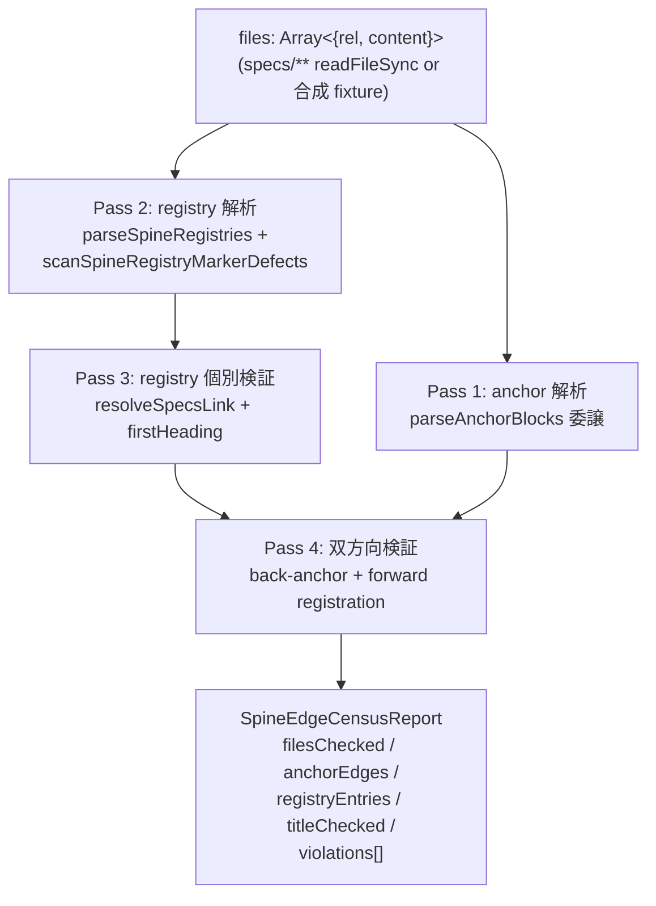

# spine-edge-bidirectional-census アーキテクチャ設計

<!-- spine:anchor:begin -->
> **Spine anchor**: [Speech-to-Visuals システム憲法 V2.8](../../SYSTEM_CONSTITUTION.md)
>
> - parent: `SYSTEM_CONSTITUTION.md`
> - role: `feature_root`
> - status: `canonical_child`
<!-- spine:anchor:end -->

**作成日**: 2026-08-27
**最終更新**: 2026-09-02（hub spine-feature pass — Acceptance criteria 節を新設。実装済み guard の verified reality を 2026-09-02 実測値〈31/31 green・在庫 383/374/130/130・violations 0〉とともに正文化。前回 2026-08-27: kairo-design session A127 — interface / verification 節を architecture.md へ昇格。REQ-402 で確定した 7 violation kind に REQ-406（Phase 209）で追加された 2 kind を含む 8 kind 体制を整理し、`auditSpineEdges` の 4 段階 pass の検証プロトコルを明文化）
**関連要件定義**: [requirements.md](requirements.md)
**分析記録**: [interview-record.md](interview-record.md)

**【信頼性レベル凡例】**:

- 🔵 **青信号**: 要件定義書・既存実装（`tests/guards/spine-edge-contract.ts` / `tests/guards/spine-edge-census.test.ts`）を参考にした確実な設計
- 🟡 **黄信号**: 要件定義書・実装から妥当な推測による設計
- 🔴 **赤信号**: 参照資料にない自動推定による設計

---

## システム概要 🔵

**信頼性**: 🔵 *requirements.md REQ-402-001〜007・spine-edge-contract.ts:1-57 ヘッダより*

`speech-to-visuals` リポジトリの docs/spine 系 wiring（`<!-- spine:anchor -->` block による anchor 宣言と、`<!-- spine:children -->` / `<!-- spine:references -->` block による親 index 側登録）の **edge 両端**を構造的に検証する census guard。REQ-388（`spine-anchor-contract.ts`）が anchor block **単体**の shape（parent 行・role 導出値）しか検証せず、parent 側 registry block の網羅性を一切検証しなかった隙間を、656a0d58/bb844a0f → c818286f の事故（facet-5 spec 2 件が片方向 dangling anchor のまま GREEN で land、修復が sweep commit に分離）が実証した。本 guard は同じ事故 class を**構造で封じる**: anchor 宣言 ↔ parent 側 registry 登録の edge 双方向を exact sweep し、未登録 landing を即 RED 化する。

**Phase 別拡張履歴**:

| Phase | 追加 kind | 動機 commit | 概要 |
|---|---|---|---|
| 201/202 | 5 kind（PARENT_DOC_MISSING・PARENT_UNREGISTERED・REGISTRY_TARGET_MISSING・REGISTRY_LINK_UNSUPPORTED・CHILD_BACK_ANCHOR_MISSING）| ea867880（family 12・REQ-402・MW-066）| forward / reverse 双方向 + 1 marker |
| 201/202 補 | REGISTRY_BLOCK_UNCLOSED（marker 構造） | ea867880 | begin/end 件数不一致 |
| 209 | REGISTRY_TITLE_DRIFT / REGISTRY_TARGET_H1_MISSING | family 13（spine registry title-sync）| 47d71cd5 sweep 分離事故 class の構造化 |

## アーキテクチャパターン 🔵

**信頼性**: 🔵 *REQ-391〜401 audit-pass-first census pattern + REQ-388 委譲構成より*

- **パターン**: 純関数 audit 関数 + real-tree exact sweep + 合成 fixture unit test（audit-pass-first census / Phase 189-193 で確立された 4 step 終了条件の踏襲）
- **選択理由**: (a) sweep 修復 commit（事故後に別 commit で分離修復する運用）は人間が忘れた時点で再発するため、構造で封じる必要がある（`tests/guards/spine-edge-contract.ts:11-15` header）。(b) anchor 解析は REQ-388 の `parseAnchorBlocks` / `isTaskFile` に委譲し、anchor 解析の単一実装を保つ（invariant-split 回避、`tests/guards/spine-edge-contract.ts:55-57`）。
- **4 段階 pass 構成**（`auditSpineEdges` 実装に対応、`tests/guards/spine-edge-contract.ts:227-340`）:
  1. **anchor 解析 pass**: 各 file の anchor block を `parseAnchorBlocks` で抽出、`anchorParents` Map（file → parent[]）に集約、parent 行あり block を `anchorEdges` として集計。
  2. **registry 解析 pass**: 各 file の registry block を `parseSpineRegistries` で解析 → `registries` 配列に集約、`scanSpineRegistryMarkerDefects` で begin/end 不一致を違反化。
  3. **registry 個別検証 pass**: link 解決不能（REGISTRY_LINK_UNSUPPORTED）・対象未存在（REGISTRY_TARGET_MISSING）・表題 sync（REGISTRY_TITLE_DRIFT / REGISTRY_TARGET_H1_MISSING）を違反化。`registeredOn` Map（target → holder[]）と `titleChecked` を集計。
  4. **双方向検証 pass**: children entry の back-anchor 存在（CHILD_BACK_ANCHOR_MISSING）、anchor parent の registry 登録存在（PARENT_DOC_MISSING / PARENT_UNREGISTERED）を違反化。

## コンポーネント構成 🔵

**信頼性**: 🔵 *tests/guards/spine-edge-contract.ts:58-340 実装より*

### parser 層 🔵

**信頼性**: 🔵 *REQ-388 委譲・spine-edge-contract.ts:58 委譲 import より*

- **`parseAnchorBlocks`**（REQ-388 から import）: anchor block 解析の単一実装。本 guard は再実装せず委譲（invariant-split 回避）。
- **`parseSpineRegistries(holderRel, content)`**（`spine-edge-contract.ts:118-149`）: 1 file の registry block を解析し、`- [title](link)` 行を `SpineRegistryEntry[]` に変換。閉じ marker の無い block は行を末尾まで entry として数える（marker 件数不一致は `scanSpineRegistryMarkerDefects` で別途違反化）。
- **`scanSpineRegistryMarkerDefects(holderRel, content)`**（`spine-edge-contract.ts:156-173`）: begin/end marker 件数不一致を REGISTRY_BLOCK_UNCLOSED として違反化。

### resolver 層 🔵

**信頼性**: 🔵 *spine-edge-contract.ts:95-110 実装より*

- **`resolveSpecsLink(holderRel, link)`**（`spine-edge-contract.ts:95-110`）: markdown 相対 link を holder の dir 基準で specs-relative path に解決。`http(s)://` 等の scheme 付き・`/` absolute・`..` で specs/ 外へ出る link は本契約の対象外（specs 内 doc でない）として `null` を返す。`null` 返値は呼び出し側で REGISTRY_LINK_UNSUPPORTED 違反化される。

### audit 層 🔵

**信頼性**: 🔵 *spine-edge-contract.ts:227-340 実装より*

- **`firstHeading(content)`**（`spine-edge-contract.ts:214-220`）: doc の最初の `# ` 見出しの text（前後空白除去）。H1 無し / 空の場合は `null` — 呼び出し側で REGISTRY_TARGET_H1_MISSING 違反化。
- **`auditSpineEdges(files)`**（`spine-edge-contract.ts:227-340`）: specs/** 全 file の双方向 census。純関数（書き込みなし・副作用なし）。`files` 入力は `Array<{ rel: string; content: string }>`（test 合成 fixture 可能）。戻り値 `SpineEdgeCensusReport` は以下を保証:
  - `filesChecked` / `anchorEdges` / `registryEntries` / `titleChecked`: **floor pin**（在庫検出用）。
  - `violations[]`: **exact-0**（ceiling pin ではなく「全 edge が契約を満たす」ことを担保。REQ-402-005）。

### test 層 🔵

**信頼性**: 🔵 *tests/guards/spine-edge-census.test.ts:1-417 実装 + MW-066 ledger より*

- **`tests/guards/spine-edge-census.test.ts`**: real-tree sweep test（violations exact-0）+ 6 violation kind の合成 fixture unit test（TC-402-04）+ 境界（TASK file exempt / root doc exempt / children・references 両登録受容）の test。
- **MW-066 mutation 検証**: guard commit から分離した TASK-0286 で、(a) c818286f~1 事故 shape 再現、(b) architecture.md children からの登録行削除、(c) registry への phantom 対象追加の 3 独立 mutation で RED を実測し、`mutation-witness-ledger.md` に 5 列 template 行を記載。

## インターフェース 🔵

**信頼性**: 🔵 *spine-edge-contract.ts:60-208 exported types/functions より*

### exported types 🔵

```typescript
// registry block の種別（children = 構造 tree edge・references = one-way 参照）
export type SpineRegistryKind = 'children' | 'references';

// 解析済み registry entry（行番号は 1-based）
export interface SpineRegistryEntry {
  kind: SpineRegistryKind;
  holderRel: string;       // entry が置かれた file（specs-relative）
  targetRel: string | null; // link を specs-relative に解決した値（解決不能なら null）
  link: string;             // 生 link 文字列（違反 detail 用）
  title: string;            // `- [title](link)` の title
  startLine: number;        // entry の `- [..](..)` 行
}

// census 違反の種別（Phase 209 で 2 kind 追加・計 8 kind）
export type SpineEdgeViolationKind =
  | 'PARENT_DOC_MISSING'          // anchor parent（`/` 含む）が specs/ に存在しない
  | 'PARENT_UNREGISTERED'         // TASK file 以外が parent 宣言・parent 側登録なし
  | 'REGISTRY_TARGET_MISSING'     // registry entry の対象 doc が specs/ に存在しない
  | 'REGISTRY_LINK_UNSUPPORTED'   // registry link が specs-relative でない
  | 'CHILD_BACK_ANCHOR_MISSING'   // children 対象が holder を parent 宣言していない
  | 'REGISTRY_BLOCK_UNCLOSED'     // begin/end marker 件数不一致
  | 'REGISTRY_TITLE_DRIFT'        // entry 表題が対象 H1 と不一致
  | 'REGISTRY_TARGET_H1_MISSING'; // entry 対象が H1 見出しを持たない

export interface SpineEdgeViolation {
  kind: SpineEdgeViolationKind;
  detail: string; // file:line 付きで人間が読める形
}

export interface SpineEdgeCensusReport {
  filesChecked: number;
  anchorEdges: number;       // parent 行を持つ anchor block の数
  registryEntries: number;   // children + references entry の総数
  titleChecked: number;      // 表題 sync を検証した entry 数（silent skip 検出用）
  violations: SpineEdgeViolation[]; // exact-0 目標
}
```

### exported constants 🔵

```typescript
// registry marker（hub 側 doc-spine engine が manifest から機械生成する形式）
export const SPINE_REGISTRY_BEGIN: Record<SpineRegistryKind, string> = {
  children: '',
  references: '<!-- spine:references:end -->',
};
```

### exempt 規則 🔵

**信頼性**: 🔵 *note.md 設計決定 2・3 + REQ-402-002 より*

| 条件 | 検証方向 | 扱い |
|---|---|---|
| `isTaskFile(rel) === true`（`tasks/TASK-\d+.md`）| forward（PARENT_UNREGISTERED）| exempt（登録粒度 = tasks/overview.md。実在 288 TASK anchor が全て個別登録なし = engine schema 通り）|
| parent に `/` を含まない（repo root 直下 doc = `SYSTEM_CONSTITUTION.md`）| forward（PARENT_UNREGISTERED）| exempt（top-level root。role は REQ-388 が feature_root / system_design_root で検証）|
| bare parent 観測集合 | exact pin | `['SYSTEM_CONSTITUTION.md']` — 新規 root doc 追加時に test 側 pin に引っかかる |
| `entry.kind === 'references'` | reverse（CHILD_BACK_ANCHOR_MISSING）| one-way（engine schema。実在 60 entry 中 58 が TASK file への one-way reference）|

## データフロー 🔵

**信頼性**: 🔵 *spine-edge-contract.ts:227-340 auditSpineEdges 4 pass 構成より*



**Pass 別出力**:

| Pass | 入力 | 出力（集計 / 違反）|
|---|---|---|
| 1 | 全 file content | `anchorEdges`（parent 行あり block 数）・`anchorParents: Map<file, parent[]>` |
| 2 | 全 file content | `registries: SpineRegistryEntry[]`（line scan）・`REGISTRY_BLOCK_UNCLOSED` 違反 |
| 3 | `registries` + `contentByRel` | `registeredOn: Map<target, holder[]>`・`titleChecked`・`REGISTRY_LINK_UNSUPPORTED` / `REGISTRY_TARGET_MISSING` / `REGISTRY_TITLE_DRIFT` / `REGISTRY_TARGET_H1_MISSING` 違反 |
| 4 | `anchorParents` + `registeredOn` | `CHILD_BACK_ANCHOR_MISSING`（children back-anchor 不足）・`PARENT_DOC_MISSING` / `PARENT_UNREGISTERED`（forward 登録漏れ）|

## 検証プロトコル 🔵

**信頼性**: 🔵 *requirements.md TC-402-01〜04・REQ-402-005・REQ-402-007 + spine-edge-census.test.ts 実装より*

### 2 層検証 🔵

**層 1: real-tree exact sweep**（`tests/guards/spine-edge-census.test.ts`）

- 全 specs/ .md を `readFileSync` で読み、`auditSpineEdges([...])` に渡す。
- `violations.length === 0` を exact-0 で検証（**ceiling pin ではない**。REQ-402-005。新規 file が違反 shape で land した時点で RED）。
- 在庫は floor pin: `filesChecked` / `anchorEdges` / `registryEntries` / `titleChecked` で回帰検出（silent skip や doc 取りこぼしの検出）。

**層 2: 合成 fixture unit test**（TC-402-04）

- 8 violation kind 各 1 件以上を検出する合成 fixture（`{rel, content}` を in-memory 構築）を unit test として実行。
- 「violations が空 GREEN = 契約満足」の確認と独立に、各 kind の **detection 能力** を担保（REAL tree が違反 0 のとき、合成 fixture で違反検出できることが teeth の証明）。

### 境界 test 🔵

| テスト ID | 検証内容 | 期待結果 |
|---|---|---|
| TC-402-02 | c818286f~1 事故 shape（children block を持たない doc への parent 宣言）| `PARENT_UNREGISTERED` 1 件以上を検出 |
| TC-402-03 | TASK file exempt / root doc exempt / children と references 両登録受容（note→note wiring）| 3 ケース全て violation 0 |
| TC-402-04 | 8 violation kind の合成 fixture 検出 | 各 kind 1 件以上 |
| TC-402-01 | real tree violations exact-0 + 在庫 floor pin | violations 0・在庫 ≥ c818286f 修復後の tree 観測値 |

### mutation 検証（MW-066）🔵

**信頼性**: 🔵 *REQ-402-007 + mutation-witness-ledger.md MW-066 5 列 template より*

guard commit から分離した TASK-0286 で 3 独立 mutation を実施:

1. **c818286f~1 事故再現**: facet-5 `requirements.md` を `parent: speech-to-visuals/requirements.md` に re-parent → guard RED。
2. **登録削除**: `architecture.md` children からの登録行を 1 件削除 → guard RED。
3. **phantom 登録**: registry への phantom 対象（実在しない file）追加 → `REGISTRY_TARGET_MISSING` RED。

各 mutation で実測した RED の command / observed を `mutation-witness-ledger.md` の 5 列 template 行（target / mutation / command / observed / [EVIDENCE]）に記録。

## ディレクトリ構造 🔵

**信頼性**: 🔵 *spine-edge-contract.ts 配置・test 命名規約より*

```
tests/
├── guards/
│   ├── spine-anchor-contract.ts          # REQ-388 — anchor 解析の単一実装（委譲元）
│   ├── spine-anchor-role-census.test.ts  # REQ-388 — anchor block 単体 census
│   ├── spine-edge-contract.ts            # 本 guard（純関数 module・341 行）
│   └── spine-edge-census.test.ts         # 本 guard test（real-tree sweep + 合成 fixture・417 行）
└── helpers/
    └── readSpecsTree.ts                  # tests/ 配下共通 helper（readFileSync sweep の fixture 化）
```

実装は tests/ 配下のみ（実装予算外）。憲法の LOC 議論に触れない bounded な変更（`note.md` 設計決定 6）。

## 非機能要件の実現方法

### 保守性 🔵

**信頼性**: 🔵 *REQ-388 と同じ構成・note.md 設計決定 4 より*

- **anchor 解析の単一実装**: 本 guard は `parseAnchorBlocks` / `isTaskFile` を REQ-388 から import のみ。anchor block 解析ロジックを再実装しない（invariant-split 回避、`tests/guards/spine-edge-contract.ts:55-57`）。
- **registry parser の単一実装**: `parseSpineRegistries` / `scanSpineRegistryMarkerDefects` を本 guard 内で 1 度だけ実装し、Phase 209 で追加された title sync 検証も同 module 内で完結（`auditSpineEdges` Pass 3、`spine-edge-contract.ts:269-289`）。
- **純関数 module**: 書き込みなし・副作用なし。`files` を外部から注入可能で、合成 fixture unit test が green 状態を直接構築できる。

### 性能 🟡

**信頼性**: 🟡 *requirements.md 「最小限の非機能要件」+ 実測経験値より*

- specs/ 全 .md の marker/行 scan のみ（数百 file 想定）。秒単位。guard suite 実行時間は経験的に 1〜2 秒の追加。
- 4 pass 構成は重複 scan なし（Pass 1〜2 で全 file を 1 度ずつ walk、Pass 3〜4 は in-memory Map 操作のみ）。

### 信頼性 🔵

**信頼性**: 🔵 *REQ-402-006 atomic dogfood + REQ-402-007 mutation 分離より*

- **atomic dogfood**: 本 spec 一式（requirements.md / note.md / interview-record.md / tasks/overview.md / TASK-0285 / TASK-0286）の landing が、各 file の anchor block と parent 側登録（`specs/speech-to-visuals/architecture.md` children への本 spec 追加等）を同一 commit に同梱。本 guard が同 commit 内で GREEN になることをもって atomicity の実証とする（REQ-402-006）。
- **mutation 検証の分離**: MW-066 は guard commit から分離した TASK-0286 で実施（Phase 196 の MW-060/061 で確立した分離実施 pattern 踏襲）。guard 実装の確定状態に対する mutation で teeth を実測。

## 技術的制約

### 性能制約 🔵

**信頼性**: 🔵 *requirements.md 「最小限の非機能要件」性能節より*

- census は specs/ の .md 全走査（数百 file・marker/行 scan のみ）で秒単位。guard suite の実行時間を増やさない。

### 互換性制約 🔵

**信頼性**: 🔵 *note.md 設計決定 2・3・4 + REQ-388 委譲構成より*

- REQ-388 の `parseAnchorBlocks` / `isTaskFile` export に依存（REQ-388 側で export 化が必要、REQ-388 改変時に同時更新）。
- `SPINE_REGISTRY_BEGIN` / `SPINE_REGISTRY_END` marker 文字列は hub 側 doc-spine engine が manifest から機械生成する形式と一致させる必要あり。marker 変更時は hub 側と version sync。

### セキュリティ制約 🔵

**信頼性**: 🔵 *tests/ 配下純関数 module + 書き込みなしより*

- 純関数 module（書き込みなし・副作用なし）。specs/ tree を readFileSync のみ。テスト helper は合成 fixture（`{rel, content}`）で実 tree に触れない unit test が可能（CI 環境差分の影響なし）。

## Acceptance criteria（完了条件）

**信頼性**: 🔵 *2026-09-02 hub spine-feature 実施時に全項目を実測検証（各 bullet に command と観測値を記載）*

- [x] `auditSpineEdges` が 4 pass 構成で 8 violation kind を違反化し、real tree（specs/** 全 .md）に対して violations **exact-0** を返す — 実測 (2026-09-02): `tsx` で `auditSpineEdges(specs 全 .md)` を直接呼び出し `filesChecked 383` / `anchorEdges 374` / `registryEntries 130` / `titleChecked 130` / `violations 0`
- [x] 2 層検証（real-tree exact sweep + 合成 fixture unit test）が `tests/guards/spine-edge-census.test.ts` として green — 実測 (2026-09-02): `NODE_OPTIONS='--experimental-vm-modules --max-old-space-size=4096' npx jest --config jest.config.cjs spine-edge-census` が **31/31 passed**（floor pin 333/324/100/112 は現 tree の 383/374/130/130 で充足）
- [x] anchor 解析が REQ-388 に委譲され単一実装（invariant-split 無し）— `tests/guards/spine-edge-contract.ts:58` の `import { isTaskFile, parseAnchorBlocks } from './spine-anchor-contract'` のみで再実装なし
- [x] MW-066 として 3 独立 mutation（事故再現 re-parent / children 登録行削除 / phantom 対象追加）の RED 実測が `../speech-to-visuals/mutation-witness-ledger.md` に 5 列 template 行（claim / target / mutation / command / observed）として記録済み（Phase 202・TASK-0286 実施、observed 行に各 `Tests: N failed` 実測値あり）
- [x] atomic dogfood: 本 spec 一式の anchor parent 宣言と parent 側登録（`speech-to-visuals/architecture.md` children への本 doc 登録を含む）が edge 双方向で過不足なし — census violations 0 が機械証明（`PARENT_UNREGISTERED` / `CHILD_BACK_ANCHOR_MISSING` / `REGISTRY_TITLE_DRIFT` すべて 0）
- [x] 兄弟 gate との同居: `npm run spine:validate`（specs mirror contract 0 violations・manifest は gitignore 正常 skip）および `tsx scripts/sync-spine-anchor-roles.ts --check`（383 file / 374 anchor block / 0 violations）が本 doc を含む tree で green — 実測 (2026-09-02)

## 関連文書

- **要件定義**: [requirements.md](requirements.md)（REQ-402-001〜007）
- **コンテキストノート**: [note.md](note.md)（設計決定 1〜6）
- **分析記録**: [interview-record.md](interview-record.md)（A1〜A4）
- **タスク概要**: [tasks/overview.md](tasks/overview.md)（Phase 201/202）
- **MW ledger**: [../speech-to-visuals/mutation-witness-ledger.md](../speech-to-visuals/mutation-witness-ledger.md)（MW-066・3 mutation 5 列 template 行）
- **先行 guard**: REQ-388（spine-anchor-contract.ts）— anchor 解析の単一実装
- **親 architecture**: [../speech-to-visuals/architecture.md](../speech-to-visuals/architecture.md)（audit-pass-first census 拡張 family 12 節）
- **事故記録**: c818286f（facet-5 の sweep 修復・本要件の直接動機）/ 47d71cd5（表題 sync の sweep 修復・REQ-406 で構造化）

## 信頼性レベルサマリー

- 🔵 青信号: 19件（システム概要 / 4 pass 構成 / parser 層 / resolver 層 / audit 層 / test 層 / exported types / exported constants / exempt 規則 / データフロー / 2 層検証 / 境界 test / mutation 検証 / 保守性 / 信頼性 / 性能制約 / 互換性制約 / セキュリティ制約 / Acceptance criteria）
- 🟡 黄信号: 1件（性能・経験値より）
- 🔴 赤信号: 0件

**品質評価**: 高品質（実装は `tests/guards/spine-edge-contract.ts` 341 行・`tests/guards/spine-edge-census.test.ts` 417 行として実在、8 violation kind・4 pass 構成・2 層検証プロトコルが requirements.md REQ-402 / TC-402 / MW-066 と直接対応）
