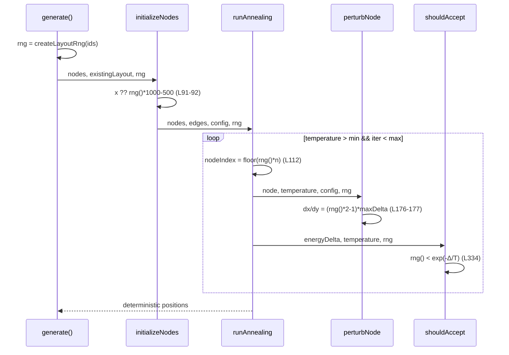
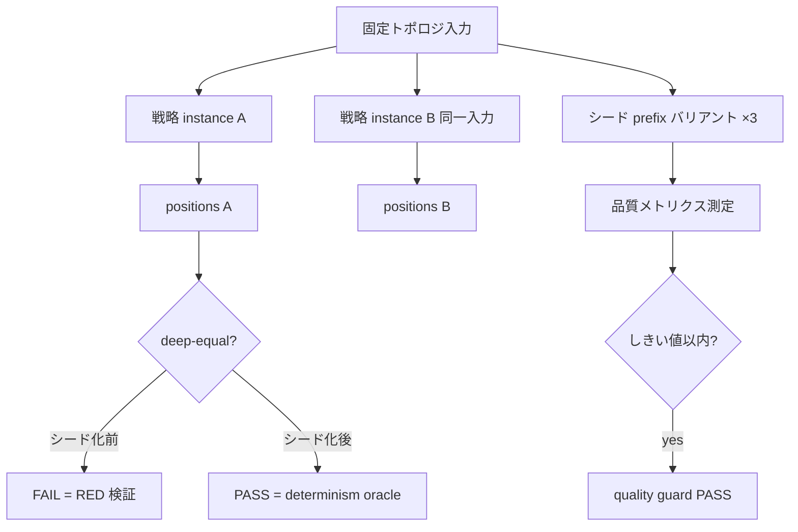

# stochastic-layout-seeding データフロー図

**作成日**: 2026-08-15
**関連アーキテクチャ**: [architecture.md](architecture.md)

**【信頼性レベル凡例】**:

- 🔵 **青信号**: 既存実装を参考にした確実なフロー
- 🟡 **黄信号**: 既存実装から妥当な推測によるフロー
- 🔴 **赤信号**: 参照資料にない自動推定によるフロー

---

## 対象パス全体のデータフロー 🔵

**信頼性**: 🔵 *NetworkLayoutStrategy.ts:94・enhanced-zero-overlap-layout.ts:597 の r16 実装より*

```mermaid
flowchart TD
    A[DiagramData nodes/edges] --> B[戦略 generate() エントリ]
    B --> C["rng = createLayoutRng(nodeIds.join('|'))"]
    C --> D[初期配置 欠損位置フォールバック]
    D --> E[反復: 選択/変位/受理/脱出ジッタ]
    E --> F{収束判定}
    F -->|継続| E
    F -->|終了| G[PositionedNode[] 出力]
    G --> H[SceneGraph → Remotion レンダリング]
    C -.同一系列供給.-> D
    C -.同一系列供給.-> E
```

**ポイント**: rng は generate 呼び出し単位で 1 つ。複数プライベートメソッドに引数で伝達し、`this` には保持しない（インスタンス再利用時の stale-seed 回避）。

## 主要機能のデータフロー

### 機能1: SimulatedAnnealingStrategy のシード化 🔵

**信頼性**: 🔵 *該当行実装より*



**詳細ステップ**:

1. `rng` を L91-92, L112, L176-177, L334 の **全 6 描点** に伝達。`shouldAccept` は受理率→ノード温度→冷却に波及するため部分シード化は禁止（architecture.md D3）
2. `perturbNode`/`shouldAccept` のシグネチャに `rng: () => number` を追加（ 既存 `Math.random` と同シグネチャで置換可能）

### 機能2: ProgressiveForceStrategy のシード化 🔵

**信頼性**: 🔵 *該当行実装より*

- 初期配置フォールバック (L86-87): rng を initializeNodes へ引数追加
- ゼロ距離脱出ジッタ (L217-218, L277-278): 反復メソッドへ rng 伝達
- `escapeLocalMinimum` (L450-451): ノードループの外で rng を受け取る

**備考** 🟡: L217/L277 はすべてゼロ距離ペアに同系列から引くため、同一反復内の複数ゼロ距離ペアは互いに異なる変位を受ける（旧 `Math.random` と同じ統計的性質）。

### 機能3: OverlapResolver ×2 + mindmap + complex-engine id 🔵

**信頼性**: 🔵 *該当行実装より*

- `layout/OverlapResolver.ts` L193-194/208-209: `initializeNodes` 内。resolver の公開エントリで rng 生成
- `strategies/OverlapResolver.ts` L247: `handleIdenticalPositions` の default 分岐 `angle = rng() * 2π`。flow/flowchart/timeline/tree の決定的分岐は変更しない
- `strategies/mindmap-strategy.ts` L178-179: 未割当ノードの `(rng()-0.5)*400`
- `complex-layout-engine.ts` L847: 既存 693 行の rng から id サフィックス生成

## 検証（オラクル）のデータフロー 🔵

**信頼性**: 🔵 *round-16 オラクル（tests/visualization/force-directed-layout-outcome-oracle.test.ts）の踏襲*



**詳細**:

1. **決定性オラクル**: 同一入力で 2 インスタンス（または 2 回 generate）→ `expect(a).toEqual(b)`。シード化前は必ず FAIL を 1 回観測してから修正する（RED-verify）
2. **品質ガード**: シードテキストに `"v1:"`/`"v2:"`/`"v3:"` prefix を付したバリアント入力で複数系列を走らせ、オーバーラップ率等が既存レイアウト品質しきい値（layout-quality-threshold 単一ソース）を満たすことを確認。特定シードが品質を大きく下回る「不運シード」を捕捉する 🟡（バリアント数 3 は運用上の十分性からの妥当な推測）

## エラーハンドリング 🔵

**信頼性**: 🔵 *layout-rng.ts 実装より*

- `seedFromString` は任意文字列で有限の uint32 を返すため、空ノード配列（`ids.join('|') === ''`）でも破綻しない。空配列自体は既存の戦略前段で拒否される前提は変えない
- rng は例外を投げない。エラーパスの追加なし

## 関連文書

- **アーキテクチャ**: [architecture.md](architecture.md)
- **分析記録**: [design-interview.md](design-interview.md)

## 信頼性レベルサマリー

- 🔵 青信号: 6件 (75%)
- 🟡 黄信号: 2件 (25%)
- 🔴 赤信号: 0件 (0%)

**品質評価**: 高品質
