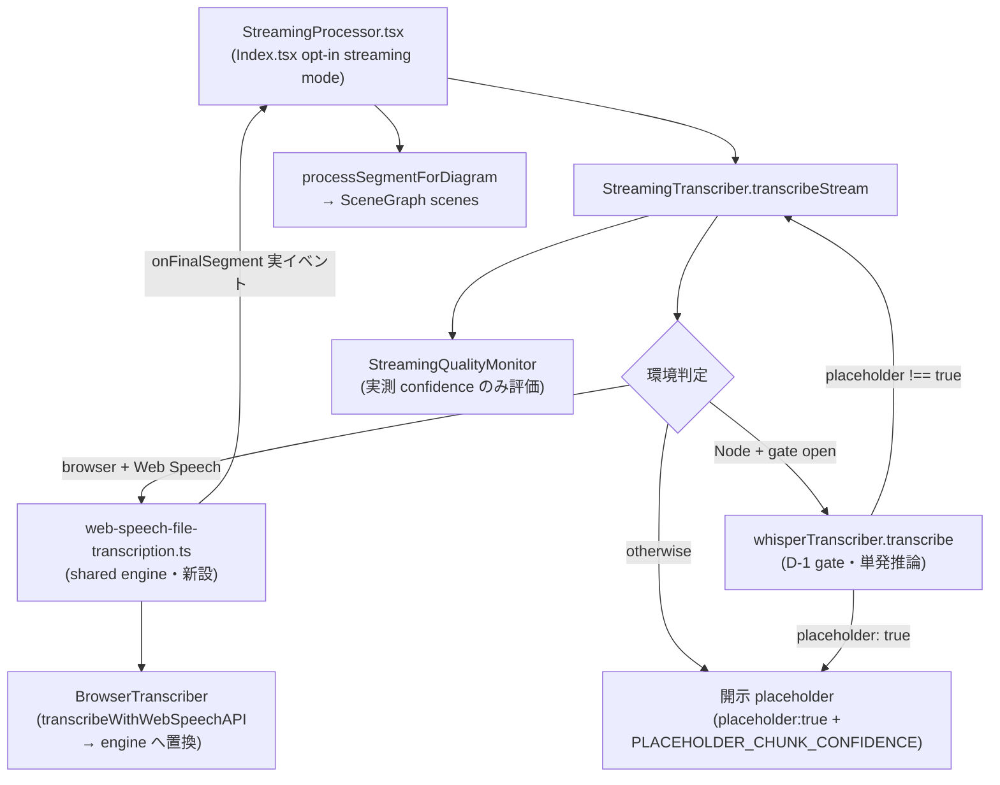

# streaming-real-asr-inference アーキテクチャ設計


<!-- spine:anchor:begin -->
> **Spine anchor**: [speech-to-visuals アーキテクチャ設計](../speech-to-visuals/architecture.md)
>
> - parent: `speech-to-visuals/architecture.md`
> - role: `system`
> - status: `canonical_child`
<!-- spine:anchor:end -->

**作成日**: 2026-09-04
**関連要件定義**: [speech-to-visuals 要件定義書](../speech-to-visuals/requirements.md) REQ-424（Phase 195・提案ベース `- [ ]`）
**関連受け入れ基準**: [speech-to-visuals 受け入れ基準](../speech-to-visuals/acceptance-criteria.md) TC-408-01〜04（未実施）
**分析記録**: [design-interview.md](design-interview.md)

**【信頼性レベル凡例】**:

- 🔵 **青信号**: 要件定義書・既存設計文書・既存実装を参考にした確実な設計
- 🟡 **黄信号**: 要件定義書・既存設計文書・既存実装から妥当な推測による設計
- 🔴 **赤信号**: 参照資料にない自動推定による設計

---

## システム概要 🔵

**信頼性**: 🔵 *requirements.md REQ-424（Phase 195）・README「音声認識の現状」・AI_HUB_DEVELOPMENT_DIRECTION mission 文（「streaming-transcriber も chunk モック」）より*

コアパイプライン入力段の残る未接続経路を潰す。D-1（gated real whisper.cpp 推論・server 経路）〜D-3 は main 済み、D-4/D-5 は specs/real-audio-e2e-regression/（PR #100）で設計・実装進行中。それらが対象としたのは **batch/server 経路**（`WhisperTranscriber` / `TranscriptionPipeline`）であり、**streaming file 経路**（`StreamingTranscriber.transcribeStream`）は今も:

1. **固定文シミュレーション**: `processAudioChunk` は "Process chunk (simulate for now)"（streaming-transcriber.ts:168）のまま、`Processed segment N from chunk X-Ys` 固定文（:441）を chunk 数分だけ生成する。ASR は一切走らない。
2. **偽成功**: 結果は `success: true`（:244）で返り、`placeholder` flag（types.ts:29・D-1 で導入）を**付けない**。server 経路が D-1 で解消した「fabricated success が実測文字起こしと同一視される」class が streaming 経路に残存する。
3. **生産 UI が消費**: `StreamingProcessor.tsx`（Index.tsx:202-209 の opt-in streaming mode）が `transcribeStream(file, …)`（:207）を呼び、固定文から `processSegmentForDiagram` で SceneGraph scene を生成して図解化している — つまりユーザーに見せる図解が偽物の入力で作られている。
4. **偽 confidence**: 固定文に `PLACEHOLDER_CHUNK_CONFIDENCE = 0.75`（:25・REQ-391 (f) の disclosed constant）が付き、UI は `averageConfidence*100`（StreamingProcessor.tsx:574）を品質 stats として表示する。

実経路は両環境に既存であり、**新規に ASR を書く必要はない** — browser は Web Speech file 経路（`BrowserTranscriber.transcribeWithWebSpeechAPI`・browser-transcriber.ts:324 が実装済み）、Node は D-1 gate 付き `WhisperTranscriber.transcribe`（whisper-transcriber.ts:395）。本設計はこれらへの**委譲と開示**で経路を実質化する。

## アーキテクチャパターン 🔵

**信頼性**: 🔵 *D-1 の gate + lazy load + 開示 placeholder パターン（whisper-transcriber.ts）・TranscriptionPipeline の優先 routing（transcriber.ts:135-161）より*

- **パターン**: 環境別優先 routing + 単一ソース委譲 + 開示 placeholder。`transcribeStream` は (1) browser かつ Web Speech available → 実 Web Speech file 経路（progressive・final result 単位）(2) Node かつ D-1 gate open → `WhisperTranscriber.transcribe` への丸ごと委譲（単発推論・完了時 emit）(3) いずれも不可 → `placeholder: true` 付き開示 placeholder、の順で解決する。優先順は TranscriptionPipeline（whisper → browser Web Speech → placeholder）と同型。
- **選択理由**: 実エンジンが既に存在する以上、第二の ASR 経路を作ると duplicate-formula class（TC-408-02 の pin 対象）。また per-chunk 分割推論は後述の SD2 により技術的に不採用のため、streaming 独自の推論実装は存在意義を持たない。

## コンポーネント構成

### routing 改修 `StreamingTranscriber.transcribeStream` 🔵

**信頼性**: 🔵 *現行実装（streaming-transcriber.ts:147-254）と両委譲先の実在より*

シミュレーション chunk loop（`createAudioChunks` + `processAudioChunk` + 10x realtime の setTimeout(:224)）を廃止し、環境判定で 3 分岐する:

1. **browser + Web Speech available**（`typeof window !== 'undefined'` かつ recognition 構築成功）: 後述の shared file engine に委譲。final result（utterance）ごとに実 `onSegment` / `onProgress` が発火する — 進捗 callback は**実イベントのみ**（合成 stagger 禁止・SD3）。
2. **Node**（`typeof window === 'undefined'`）: `whisperTranscriber.transcribe(audioInput)`（singleton・whisper-transcriber.ts:704）へ丸ごと委譲。結果の `placeholder !== true` のとき segments をそのまま流用し、完了時に `onProgress` を 1 回 emit する。`placeholder: true` のときは 3 へフォールスルー。
3. **開示 placeholder**: 現行の固定文生成（`processAudioChunk` 相当）を「ASR が走らなかった経路の開示済み出力」としてのみ残置し、結果に `placeholder: true` を付与する。`PLACEHOLDER_CHUNK_CONFIDENCE`（:25）と `detectTranscriptionLanguage` 委譲（:242）は維持。

結果の `TranscriptionResult` は経路を区別するため `placeholder` を必ず設定する（実経路 = `false` / 開示経路 = `true`）。`qualitySummary` は後述の実測 semantics で populate する。

### shared file engine `src/transcription/web-speech-file-transcription.ts`（新設）🔵

**信頼性**: 🔵 *browser-transcriber.ts:324-391（transcribeWithWebSpeechAPI）が持つ mechanism の抽出先として実在より*

Web Speech による File 文字起こし mechanism（`URL.createObjectURL` + `Audio` 再生 + `SpeechRecognition` の onresult/onend/onerror + `URL.revokeObjectURL`）を、**final result が出るたびに callback を発火する**形で持つ純粋 engine として抽出する:

- `transcribeFileWithWebSpeech(audioFile: File, hooks: { onFinalSegment?: (segment: TranscriptionSegment) => void }): Promise<TranscriptionSegment[]>`
- confidence は Web Speech 実測値を用い、欠落時のみ `FINAL_NO_CONFIDENCE_STANDIN`（browser-transcriber.ts:355 と同一規約・REQ-393）。
- 空結果で mock を resolve する現行の `getEnhancedMockSegments()` フォールバック（browser-transcriber.ts:382）は**engine には持ち込まない** — 空は空（`[]`）として呼び出し側が開示 placeholder へ routing する。mock の所属と開示は BrowserTranscriber 側の別課題（design-interview A7 残課題）。
- `BrowserTranscriber.transcribeWithWebSpeechAPI` は本 engine へ置き換える（単一ソース化・missed-sibling-site class の事前封じ）。

### confidence semantics（minConfidence filter と StreamingQualityMonitor）🔵

**信頼性**: 🔵 *whisper.cpp 出力が confidence を持たないこと（whisper-transcriber.ts convertWhisperRows の「NO confidence」契約）と現行 filter（streaming-transcriber.ts:178-179）の衝突より*

実 whisper segments の `confidence` は `undefined`（未測定）。現行 filter `(segment.confidence ?? Number.NaN) >= (minConfidence ?? 0.7)` は未測定を全て reject するため、**実経路の結果が全滅する**。そこで「未測定」と「低測定値」を区別する:

- **filter**: `confidence` が `undefined`（未測定）の segment は通過。数値である場合のみ `minConfidence` と比較する。数値コンテキストで `undefined` を下限扱いしていた従来 comment 语义（:172-177）は「開示 placeholder segment には常に数値 confidence が付く」本設計の下で成立し続ける。
- **StreamingQualityMonitor（REQ-091）**: `evaluateChunk` は**実測 confidence が 1 つでもある chunk でのみ**呼ぶ（平均は実測値のみで計算）。未測定 chunk（whisper 経由・engine 空結果）では呼ばない — `evaluateChunk` の非有限 → 0 変換（streaming-quality-monitor.ts:131）が「未測定」を「reject 測定値 0」に捏造するため。summary の accepted/rejected 計数は評価対象 chunk のみを数える。

### UI 開示 `src/components/StreamingProcessor.tsx` 🟡

**信頼性**: 🟡 *現行 UI 表示（:574 averageConfidence・:217 segments.length 検査のみ）からの最小差分推測*

- 結果が `placeholder: true` のとき、偽の品質 stats（`averageConfidence` 表示）を品質実測値として表示せず、placeholder 経路である旨の notice を出す（server 経路の D-1 開示・README「音声認識の現状」と同一の開示方針）。
- 実経路（Web Speech）では final result ごとの実 `onSegment` が既存の `processSegmentForDiagram` に流れるため、図解生成は実音声から行われる。

### constructor の環境 guard 🔵

**信頼性**: 🔵 *streaming-transcriber.ts:111 の bare `window` 参照（Node で ReferenceError）より*

`'webkitSpeechRecognition' in window`（:111）と `validateStreamingSupport`（:632-634）の bare 参照を `typeof window !== 'undefined'` guard の内側へ置く。Node（API server / batch）での構築が可能になり、routing の Node 分岐が到達可能になる。browser での挙動は不変。

## システム構成図



**信頼性**: 🔵 *上記コンポーネント構成（既存実装 path はすべて実在・新設は WS engine と routing のみ）より*

## ディレクトリ構造（差分）🔵

**信頼性**: 🔵 *現行 tree と本設計の差分より*

```
src/transcription/
├── web-speech-file-transcription.ts   # 新設: Web Speech file engine（progressive・単一ソース）
├── streaming-transcriber.ts           # routing 改修: simulate loop 廃止 → 環境別 3 分岐 + placeholder 開示
└── browser-transcriber.ts             # transcribeWithWebSpeechAPI → engine 委譲に置換

src/components/
└── StreamingProcessor.tsx             # placeholder 開示 notice・偽 stats 表示の抑制

src/transcription/__tests__/
├── streaming-transcriber.test.ts      # routing 契約へ書き換え（simulate 固定文 pin は廃止）
└── web-speech-file-transcription.test.ts  # 新設: engine 契約（progressive callback・空は空・cleanup）

tests/unit/pipeline/streaming-transcriber.test.ts  # simulate pin（language 'en' 固定等）の置換
```

## 主要設計決定

### SD1: 実ASRは「委譲」で接続する（第二実装禁止）🔵

**信頼性**: 🔵 *TC-406-03（D-4 WER 単一ソース）と同一の duplicate-formula 回避方針・両委譲先の実在より*

browser 経路は Web Speech file mechanism の共有 engine、Node 経路は `whisperTranscriber.transcribe` の丸ごと委譲。streaming 側に ASR call path を新しく作らない。gate 解決（`resolveWhisperInferencePaths`）・backend 読み込み・audio staging・row 変換（`convertWhisperRows`）は全て whisper-transcriber 側の単一ソースを通る。

### SD2: per-chunk 分割推論は行わない 🔵

**信頼性**: 🔵 *whisper-node の API 形状（per-call callable・whisper-transcriber.ts:60, :240）より*

whisper-node の backend は呼び出しごとに model を読み込む per-call API である。3 秒 chunk × N 回の分割推論は model 再読み込みを N 回起こし RTF が実用性を失う（D-4 の RTF 実測基盤で測るべきものが悪化する）。よって Node 経路は**単発の whole-file 推論**とし、進捗 callback は完了時の一括 emit のみ。**合成 stagger（実結果を chunk 長で分割して progressive に見せかける）は偽 progress として禁止する**。`chunkSizeMs` / `overlapMs` 設定は API 互換で残すが、v1 でこれらを実推論に使う経路は存在しないことを doc に開示する。

### SD3: 進捗 callback は実イベントのみ 🔵

**信頼性**: 🔵 *REQ-391「測定を約束する field への fixture publish 禁止」の進捗版としての適用より*

`onProgress` / `onSegment` は Web Speech の final result 到達・Node の推論完了という実イベントでのみ発火する。現行の chunk loop + `setTimeout(100)`（:224）による時間経過の演出は廃止対象。

### SD4: 未測定 confidence の取り扱い 🔵

**信頼性**: 🔵 *convertWhisperRows の「NO confidence」契約（whisper-transcriber.ts:108-127）より*

「未測定（undefined）」は「低測定値」と区別する。filter は未測定を通過させ、quality monitor は実測値のみを評価する。開示 placeholder segment には引き続き数値の disclosed constant（`PLACEHOLDER_CHUNK_CONFIDENCE`）が付くため、REQ-391 (f) の契約（決定的 named constant・random 禁止）は不変。

### SD5: 偽成功の廃止 — placeholder 開示 🔵

**信頼性**: 🔵 *types.ts:29 の placeholder doc comment・transcriber.ts:138-145（pipeline が `placeholder !== true` で成功判定）と同一契約より*

ASR が走らなかった run の結果は `placeholder: true` を持つ。`success: true` のみで実測と区別不能な現行（:235-246）を改め、TranscriptionPipeline の priority routing と同じ判別可能性を streaming 経路にも与える。

### SD6: Node 分岐は window guard で到達可能にする 🔵

**信頼性**: 🔵 *streaming-transcriber.ts:111 の bare `window`（Node で ReferenceError）より*

constructor の recognition 構築と `validateStreamingSupport` を `typeof window !== 'undefined'` で guard する。テスト（jsdom / Node 両面）と server 利用の双方で構築可能になる。

### SD7: streaming 経路の WER 実測は D-4/D-5 基盤に委譲する 🔵

**信頼性**: 🔵 *scripts/measure-transcription-accuracy.ts（D-2）の pure core と specs/real-audio-e2e-regression/ の測定契約より*

本 feature は経路の実質化と開示のみを対象とし、streaming 経路独自の WER harness は作らない。`WhisperTranscriber` 委譲（Node 経路）は D-1 と同一出力 therefore D-2 harness の測定対象と同一品質。browser Web Speech 経路の実測は D-5 コーパスを browser で再生する測定として将来 D-4 report の拡張で扱う（本 feature の scope 外・design-interview A8）。

## 非機能要件の実現方法

### パフォーマンス 🔵

**信頼性**: 🔵 *SD2（単発推論）と Web Speech の utterance 単位進捗より*

- Node 経路: 推論回数 = 1（D-1 と同一）。chunk loop の 10x realtime setTimeout（:224）が消えるため、gate 閉状態の偽 streaming 待ち時間も消滅する。
- browser 経路: 実時間再生を伴う（現行 BrowserTranscriber と同一制約）。progressive callback は final result 単位。

### セキュリティ 🔵

**信頼性**: 🔵 *既存 Object-URL cleanup 契約（tests/unit/async-resource-cleanup.test.ts・ISS-A）より*

- shared engine は `URL.createObjectURL` / `revokeObjectURL` を onend/onerror 両 path で必ず解放する（現行 browser-transcriber.ts:374, :379 の契約を engine が継承）。

### 互換性 🔵

**信頼性**: 🔵 *現行 public API（transcribeStream signature・config keys・callback 型）より*

- `transcribeStream(audioFile, onProgress?, onSegment?)` の signature・`StreamingProgress` / callback 型・constructor 検証（chunkSizeMs/overlapMs/minConfidence の境界・updateConfig 検証）は不変。
- `startLiveTranscription` / `stopLiveTranscription` / `destroy` / REQ-091 API（`onQualityAlert` / `getQualitySummary`）は不変（live mic 経路は既に実 Web Speech であり対象外）。

## Acceptance criteria

**信頼性**: 🔵 *TC-408-01〜04（acceptance-criteria.md・未実施 `- [ ]`）と本設計の対応関係より*

- [ ] **AC-D6-1**（≡ TC-408-01 / REQ-424）: `transcribeStream` が環境別に実ASRへ接続すること — browser + Web Speech では shared file engine 経由で final result（utterance）単位の実 `onSegment` / `onProgress` が発火し、Node + D-1 gate open では `whisperTranscriber.transcribe` への委譲結果（`placeholder !== true` の segments）を返すこと。検証（履行時）: routing 契約 test（browser 分岐・Node 分岐・gate 閉フォールスルー）が RED→GREEN
- [ ] **AC-D6-2**（≡ TC-408-02 / REQ-424）: Web Speech file mechanism が `web-speech-file-transcription.ts` に単一ソース化され、`BrowserTranscriber` と `StreamingTranscriber` の両方がこれを消費すること（第二の file 再生 + recognition 実装が存在しないこと）。検証（履行時）: 委譲 import witness test が RED→GREEN
- [ ] **AC-D6-3**（≡ TC-408-03 / REQ-424）: ASR が走らなかった run が `placeholder: true` 付きで返り、`StreamingProcessor` が placeholder 経路を開示 notice で示し偽の品質 stats を表示しないこと（固定文 "Processed segment …" は開示 placeholder のみに残存・`success: true` 単独の偽成功は消滅）。検証（履行時）: placeholder 開示 pin（result flag + UI 表示）が RED→GREEN
- [ ] **AC-D6-4**（≡ TC-408-04 / REQ-424）: confidence 未測定（undefined）と低測定値が区別されること — minConfidence filter は未測定 segment を reject せず、`StreamingQualityMonitor.evaluateChunk` は実測 confidence を持つ chunk のみで呼ばれ未測定 chunk を 0-rejected に捏造しないこと。検証（履行時）: filter・monitor semantics test が RED→GREEN

## 関連文書

- **データフロー**: [dataflow.md](dataflow.md)
- **分析記録**: [design-interview.md](design-interview.md)
- **要件定義（正本）**: [speech-to-visuals 要件定義書](../speech-to-visuals/requirements.md) REQ-424（Phase 195）
- **受け入れ基準（正本）**: [speech-to-visuals 受け入れ基準](../speech-to-visuals/acceptance-criteria.md) TC-408-01〜04
- **委譲先（server・D-1）**: `src/transcription/whisper-transcriber.ts`
- **委譲先 mechanism（browser）**: `src/transcription/browser-transcriber.ts`（`transcribeWithWebSpeechAPI`）
- **測定基盤（D-2〜D-5）**: `scripts/measure-transcription-accuracy.ts`・[../real-audio-e2e-regression/architecture.md](../real-audio-e2e-regression/architecture.md)（PR #100・進行中）

## 信頼性レベルサマリー

- 🔵 青信号: 17件（概要 / パターン / routing / shared engine / confidence semantics / constructor guard / 構成図 / ディレクトリ / SD1〜SD5 / SD7 / パフォーマンス / 互換性）
- 🟡 黄信号: 1件（UI 開示の表示形状 — notice の具体的 UI 形状は実装時に確定）
- 🔴 赤信号: 0件

**品質評価**: 高品質（実装 agent が追加質問なしで進められる粒度 — 委譲先 path・行番号付き現状証拠・非機能契約・テスト影響範囲が全て実在コードに接地。UI notice の具体形状のみ実装時判断として design-interview 残課題に列挙）
