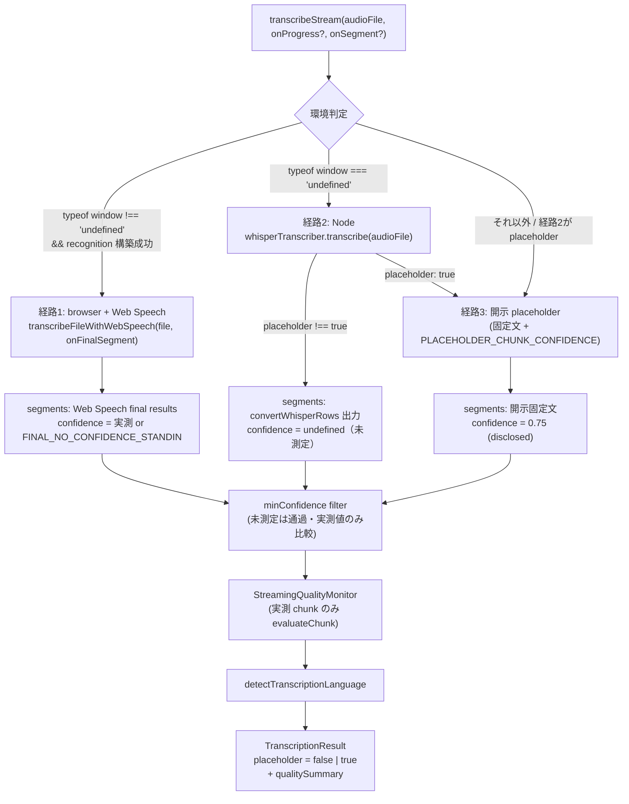

# streaming-real-asr-inference データフロー設計

<!-- spine:anchor:begin -->
> **Spine anchor**: [speech-to-visuals アーキテクチャ設計](../speech-to-visuals/architecture.md)
>
> - parent: `speech-to-visuals/architecture.md`
> - role: `detailed`
> - status: `canonical_child`
<!-- spine:anchor:end -->

**作成日**: 2026-09-04
**関連要件定義**: [speech-to-visuals 要件定義書](../speech-to-visuals/requirements.md) REQ-424（Phase 195・提案ベース `- [ ]`）
**関連受け入れ基準**: [speech-to-visuals 受け入れ基準](../speech-to-visuals/acceptance-criteria.md) TC-408-01〜04（未実施）
**親設計**: [architecture.md](architecture.md)

**【信頼性レベル凡例】**: 🔵 青信号（既存実装・文書に基づく確実な設計）/ 🟡 黄信号（妥当な推測）/ 🔴 赤信号（参照資料にない自動推定）

---

## データフロー全体 🔵

**信頼性**: 🔵 *architecture.md（routing 3 分岐）と委譲先の実在データ形状より*

`transcribeStream` 入口で環境判定し、3 経路のいずれかで `TranscriptionResult` を組み立てる。いずれの経路も `placeholder` flag と経路別の segments 生成規則が定義済みであることが本設計の核心。

## 経路別データ変換

### 経路1: browser + Web Speech（shared file engine）🔵

**信頼性**: 🔵 *browser-transcriber.ts:324-391 の現行 mechanism（Audio 再生 + onresult final processing）と Req-393 の standin 規約より*

入力 `File` → `URL.createObjectURL` → `Audio` 実時間再生 → `SpeechRecognition.onresult` の `isFinal` result ごとに:

- `segment.text = result[n].transcript`
- `segment.startMs / endMs = audio.currentTime * 1000`（final result 到達時点 — 現行 transcribeWithWebSpeechAPI と同一の timestamp 規約）
- `segment.confidence = result[n].confidence`（未提供時のみ `FINAL_NO_CONFIDENCE_STANDIN`）
- `hooks.onFinalSegment(segment)` を発火 → 呼び出し側（StreamingTranscriber）が `onSegment` / `onProgress` を転送

終了時（onend / onerror）: `URL.revokeObjectURL` を**両 path で必ず**実行し、累積 segments を返す。空結果は `[]`（engine は mock を生成しない — 呼び出し側が経路3 へフォールスルーするか空のまま返すかを決める）。

### 経路2: Node（whisperTranscriber 委譲）🔵

**信頼性**: 🔵 *whisper-transcriber.ts:395-475 の transcribe 契約（D-1）と convertWhisperRows の出力形状より*

入力（`File | ArrayBuffer | string` path）→ `whisperTranscriber.transcribe(audioInput)`:

- 結果 `placeholder !== true`（実推論）: `result.segments` をそのまま streaming 経路の segments として採用（`convertWhisperRows` 出力 — `confidence` は undefined・timestamp は ms 契約）。`onProgress` は完了時に 1 回のみ emit（SD3: 合成 stagger 禁止）。
- 結果 `placeholder: true`（gate 閉 / backend 不在 / 推論失敗）: 経路3 へフォールスルー（whisper 側の固定文を二重に持ち込まず、streaming 側の開示 placeholder で統一）。

### 経路3: 開示 placeholder 🔵

**信頼性**: 🔵 *現行 processAudioChunk の固定文生成（streaming-transcriber.ts:441）と REQ-391 (f) 契約より*

実ASRが走らなかったことを開示する最終出力。現行の固定文生成を「開示済み出力」として残置:

- `segment.text = "Processed segment N"` 相当の固定文（duration から chunk 数を算出する現行ロジックは開示のために保持）
- `segment.confidence = PLACEHOLDER_CHUNK_CONFIDENCE`（:25・決定的 named constant）
- 結果に `placeholder: true` を付与（SD5）
- `qualitySummary` は evaluate しない（未測定 chunk を monitor に流さない — AC-D6-4）

## 品質 monitor / 言語検出への流入 🔵

**信頼性**: 🔵 *streaming-quality-monitor.ts:129-131（evaluateChunk・非有限→0）と streaming-transcriber.ts:187-192, :242 の現行 wiring より*

- 経路1: utterance（final result）を chunk とみなし、**実測 confidence を持つ utterance のみ** `evaluateChunk(index, measuredConfidence)` を呼ぶ。`FINAL_NO_CONFIDENCE_STANDIN` 付きの utterance は standin 実測値として評価に含める（REQ-093 の standin 语义と同一）。
- 経路2: segments が confidence を持たないため `evaluateChunk` を呼ばない。`getQualitySummary()` は「評価対象 chunk なし」の summary 形状を返す（accepted/rejected 計数 0・捏造 0-reject なし）。
- 言語検出 `detectTranscriptionLanguage` は全経路で最終 segments に対して従来通り 1 回（:242）。

## エラーフロー 🔵

**信頼性**: 🔵 *browser-transcriber.ts:374-391（onerror cleanup）と D-1 の失敗時挙動（placeholder 開示・throw しない）より*

- engine の `onerror`（not-allowed / no-speech / network 等）: cleanup 後、それまでの final results で結果を組み立てる。final result が 1 つも無い場合は経路3（開示 placeholder）へフォールスルー。**throw しない** — `TranscriptionResult` の形状契約（success / error message）を維持。
- 経路2 の推論例外: WhisperTranscriber 側の契約に従い placeholder 経路へフォールスルー（D-1 と同一の fail-closed）。
- `getAudioDuration` 失敗（経路3 の chunk 数算出のみで使用）: duration 不明時は既存の既定扱いに従い、結果は `placeholder: true` で返す。

## UI への開示データ 🟡

**信頼性**: 🟡 *StreamingProcessor.tsx:574（averageConfidence 表示）と D-1 の README 開示方針からの最小差分推測*

`TranscriptionResult` に `placeholder: true` が立っている場合、StreamingProcessor は:

- 品質 stats 欄（`averageConfidence*100`）を実測表示として出さない（placeholder 経路の 0.75 は実測ではない）
- placeholder 経路である旨の notice（badge / note 形状は実装時に確定 — design-interview A9 残課題）

実経路（`placeholder: false`）では現行の stats 表示を維持（経路1 は実測 confidence なので表示が正当化される）。

## 信頼性レベルサマリー

- 🔵 青信号: 6件（全体 flow / 経路1 / 経路2 / 経路3 / monitor・言語検出 / エラーフロー）
- 🟡 黄信号: 1件（UI 開示データ — notice の UI 形状）
- 🔴 赤信号: 0件

**品質評価**: 高品質（3 経路すべての入出力形状・timestamp/confidence 単位・cleanup 契約・フォールスルー条件が既存実装の行番号に接地。実装 agent は経路ごとに着手可能）
