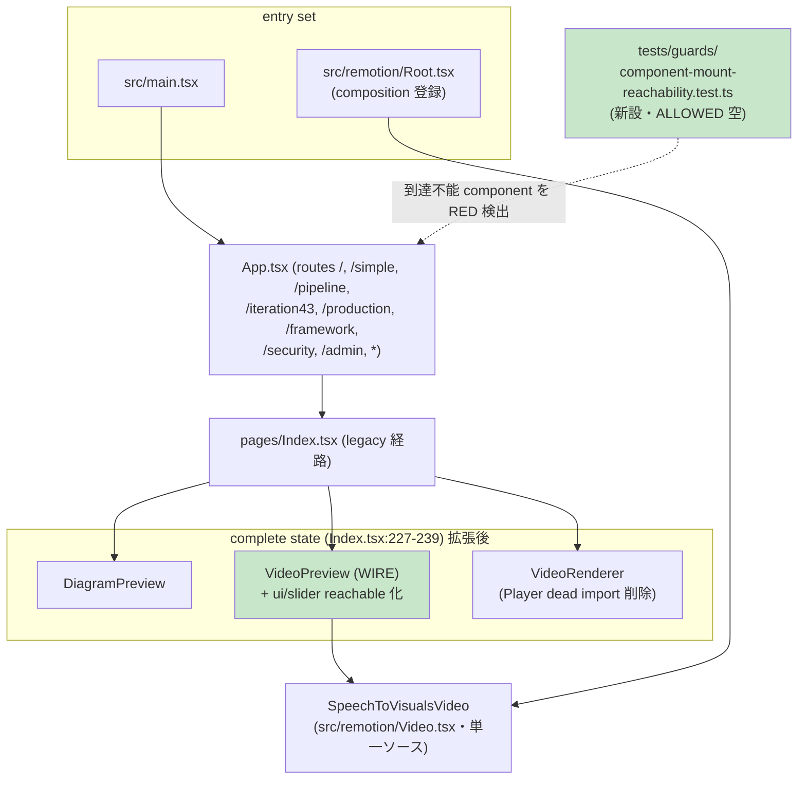

# unreachable-ui-wire-or-retire アーキテクチャ設計


<!-- spine:anchor:begin -->
> **Spine anchor**: [speech-to-visuals アーキテクチャ設計](../speech-to-visuals/architecture.md)
>
> - parent: `speech-to-visuals/architecture.md`
> - role: `system`
> - status: `canonical_child`
<!-- spine:anchor:end -->

**作成日**: 2026-09-07
**関連要件定義**: [speech-to-visuals 要件定義書](../speech-to-visuals/requirements.md) REQ-425 / REQ-426（Phase 196・提案ベース `- [ ]`）
**関連受け入れ基準**: [speech-to-visuals 受け入れ基準](../speech-to-visuals/acceptance-criteria.md) TC-409-01〜02 / TC-410-01〜02（未実施）
**要件段階分析記録**: [interview-record.md A157](../speech-to-visuals/interview-record.md)（2026-09-05 第238回検証・到達可能性全走査）
**分析記録**: [design-interview.md](design-interview.md)

**【信頼性レベル凡例】**:

- 🔵 **青信号**: 要件定義書・既存設計文書・既存実装を参考にした確実な設計
- 🟡 **黄信号**: 要件定義書・既存設計文書・既存実装から妥当な推測による設計
- 🔴 **赤信号**: 参照資料にない自動推定による設計

---

## システム概要 🔵

**信頼性**: 🔵 *requirements.md REQ-425 / REQ-426・interview-record.md A157・本設計時の全走査（2026-09-07・main 2a38d191 時点）より*

生産 UI の到達可能性を仕組みとして保証する。app entry（`index.html` → `src/main.tsx` → `src/App.tsx` の route / mount tree + Remotion composition 登録 `src/remotion/Root.tsx`）から到達不能な production component 6 件（VideoPreview・PipelineProgress・StageIndicator・EnhancedFileUploader・PerformanceMetricsVisualization・InteractiveResultViewer）と transitively unreachable な ui primitive 1 件（`ui/slider.tsx`）について、**wire または retire の個別裁決を確定**し、(1) 憲法ホワイトリスト「ビデオプレビュー」の実体化（VideoPreview 結線）、(2) 機能重複 5 件の retire と live 参照の完全整理、(3) 到達性回帰 guard の新設、を単一 Phase で実装可能な粒度に固定する。

A157（要件段階）が固定した観測可能条件 — (a) 全 production component が到達可能 or 削除済み (b) test-only 存置禁止 (c) 重複機能の単一ソース化 (d) 到達性回帰 test — はそのまま本設計の Acceptance criteria に展開する。

## 裁決 roster（個別 verdict）🔵

**信頼性**: 🔵 *REQ-425 (a)〜(d)・下記個別根拠（全て 2026-09-07 時点の実コード行番号）より*

| # | 対象 | verdict | 決め手（出典） | mounted 側単一ソース（REQ-425 (c)） |
|---|------|---------|----------------|-----------------------------------|
| 1 | `src/components/VideoPreview.tsx`（405 行） | **WIRE** | 憲法ホワイトリスト「ビデオプレビュー」の実体実装（`SpeechToVisualsVideo` Remotion Player wrapper・seekbar・解像度切替・再生速度）が一度も生産 mount されず、reachable 側 `VideoRenderer.tsx:10` は `Player` を import したまま未使用（`@typescript-eslint/no-unused-vars: "off"` = eslint.config.js:26 で潜在）— REQ-426 が結線を要件化 | 新規 mount（本設計「WIRE 設計」節）。composition は既存正典 `src/remotion/Video.tsx` の `SpeechToVisualsVideo` を消費（第二実装を作らない） |
| 2 | `src/components/PipelineProgress.tsx`（440 行） | **RETIRE** | orphan（非 test import 0 件）。WebSocket 統合は client 側で不活性 — `src/` に `socket.io-client` import 0 件・eventEmitter props（:35-37）を構築する reachable code 0 件。server 側 WS（`src/api/websocket-handler.ts`）は別 surface で影響なし | 進捗表示は mounted 3 経路が既に提供: Index legacy `ProcessingStatus`（Index.tsx:220-225）・`/simple` SimplePipelineInterface の `Progress` UI・`/pipeline` SimplePipeline |
| 3 | `src/components/StageIndicator.tsx`（220 行） | **RETIRE** | transitively unreachable — 唯一の production consumer が retire する PipelineProgress（PipelineProgress.tsx:23） | #2 と同一 |
| 4 | `src/components/EnhancedFileUploader.tsx`（329 行） | **RETIRE** | orphan。drag-and-drop・file 検証は mounted 側 `AudioUploader` が実装済み（handleDragOver AudioUploader.tsx:55・handleDrop :96・mount :142-144・検証は `@stv/core/utils/audio-validation` の `validateAudioFile` を :66 で消費 — EnhancedFileUploader と同一単一ソース） | `src/components/AudioUploader.tsx`（Index.tsx:216 で mount） |
| 5 | `src/components/PerformanceMetricsVisualization.tsx`（420 行） | **RETIRE** | orphan。`/admin` AdminAnalyticsDashboard が同等メトリクス表示を inline（同 file :84 の comment が関係を自認）。`quality-display-tiers` 単一ソースは `FrameworkDashboard`（FrameworkDashboardPage.tsx:9 経由で `/framework` route App.tsx:45 から reachable）が live consumer として継続 | `AdminAnalyticsDashboard.tsx`・`FrameworkDashboard.tsx` |
| 6 | `src/components/InteractiveResultViewer.tsx`（651 行） | **RETIRE** | guard test のみが import（REQ-425 (b) の test-only 存置そのもの）。`onEdit` / `onShare` props（:43-45）と `Edit3` / `Share2` icon は憲法完全禁止カテゴリー（手動編集・共有）に隣接する UI を含み、**wire は憲法違反リスクを生む方向** — retire のみ整合 | scene preview は `DiagramPreview`（Index.tsx:229）・video 再生は VideoPreview（本 Phase で wire）・export は `src/export/enhanced-export-engine.ts`（API 経由）が存続 |
| 7 | `src/components/ui/slider.tsx` | **WIRED 経由で存続** | importer は VideoPreview.tsx:11 と InteractiveResultViewer.tsx:15 の 2 件のみ。#1 の wire で reachable 化し、#6 の retire で consumer は VideoPreview 1 件に確定 — REQ-425 (d)「wire された consumer とともに回収するか削除」の存続側 | （ui primitive は削除対象外） |

retire 合計: **5 file / 2,060 行**（440 + 220 + 329 + 420 + 651）。実装規模集計は 299 file / 87,419 行（2026-09-07 実測・上限 320 / 90,000）から **294 file / 約 85,359 行**へ縮小 — V2.8 規模予算に新規枠を消費せず余裕を拡大する。

## WIRE 設計（VideoPreview 結線）🔵

**信頼性**: 🔵 *REQ-426 (a)〜(d)・Index.tsx:227-239 の complete state 実装・VideoPreview.tsx:74-85 の props 契約より*

### mount point の決定

REQ-426 (a) は mount point を「現行 `VideoRenderer` 表示箇所（Index.tsx:234）を基本とし最終位置は設計段階で決定」と留保していた。本設計の決定: **Index legacy 経路の complete state fragment（Index.tsx:227-239）において、`DiagramPreview` と `VideoRenderer` の間に独立行で mount する**。

```tsx
{result && status === 'complete' && (
  <>
    <DiagramPreview
      scenes={result.scenes}
      onRender={handleRender}
      isRendering={false}
    />
    <VideoPreview
      scenes={result.scenes}
      audioUrl={result.audioUrl}
    />
    <VideoRenderer
      scenes={result.scenes}
      audioUrl={result.audioUrl}
    />
  </>
)}
```

決定根拠:

1. **表示の自然な進行** — 静的 scene 一覧（DiagramPreview）→ in-app interactive 再生（VideoPreview）→ file render/download（VideoRenderer）の順で、同一 complete state に結果消費の段階が並ぶ。
2. **props は既存 state のみ** — `VideoPreviewProps`（VideoPreview.tsx:74-85）の必須は `scenes` のみで `audioUrl` は optional。`result.scenes` / `result.audioUrl`（Index.tsx:110-114 で set）の pass-through で済み、新規 state・callback・route は一切不要。
3. **VideoRenderer は置換しない** — VideoRenderer は file 出力（`videoRenderer` service 経由の MP4 render/download）という別価値を持ち、VideoPreview（in-app 再生）と重複しない。両者の consumer である `Player` は VideoPreview 側のみが使うため、`VideoRenderer.tsx:10` の未使用 import は**削除**で解消する（REQ-426 (b) の「結線または削除」の削除側 — Player を VideoRenderer で使い始めると第二の player 実装になる）。
4. **JSX は独立行で置く** — mount 要素は既存要素と同一行に押し込まない（make-run feedback 指摘の diff ノイズ再発防止）。

### 単一ソースの維持（REQ-426 (d)）

VideoPreview.tsx:8 は既存正典 composition `SpeechToVisualsVideo`（`src/remotion/Video.tsx`・Remotion `Root.tsx` 登録と同じ実体）を `calculateTotalFrames` / `DEFAULT_FPS` とともに消費しており、結線はこの既存 import を変更しない。第二の composition 実装・第二の Player wrapper は作らない。

## RETIRE 設計（5 file 削除 + live 参照の完全整理）🔵

**信頼性**: 🔵 *REQ-425 (a)「retire は file 削除と参照（test・comment）の整理で実行」・2026-09-07 全走査（src/ tests/ scripts/ を grep・specs/ docs/ は歴史記録として区別）より*

### 削除対象と参照整理 roster

歴史記録（`specs/speech-to-visuals/tasks/TASK-*.md`・interview-record.md・requirements.md 本文・`docs/llm-wiki/**`）は**編集しない** — それらは過去 Phase の追記専用記録であり、実装時の chain 記録（TASK-0322〜）で本裁決を記録する。整理対象は live code / live test / live guard のみ:

| 対象 | 参照元 | 整理内容 |
|------|--------|----------|
| PipelineProgress | `src/components/__tests__/mobile-responsive.test.ts` | 同 test 内の当該 describe block を削除（reachable component の block は存続） |
| StageIndicator | `src/components/__tests__/StageIndicator.test.ts` | test file ごと削除（component 削除に随伴） |
| StageIndicator | `tests/guards/round-then-decompose-sweep-mutation-pinning.test.ts` :102-105 | TC-310-01 Layer 1 witness（`StageIndicator.formatElapsed` の safe-form pin）を**合成 liveness fixture（in-test の合成 source 文字列）へ re-home**。Layer 2 の構造 sweep（src 全域の unsafe form 検出）は無変更で存続 — REQ-388 precedent（実 tree から witness が消えた際の detector 歯の保持） |
| StageIndicator | `src/components/__tests__/mobile-responsive.test.ts` | 当該 block 削除 |
| EnhancedFileUploader | `tests/regression/react-anti-patterns.regression.test.ts` :104 | file list から当該 entry を削除 |
| EnhancedFileUploader | `tests/guards/toast-whitespace-pre-line-guard.test.ts` :19 前後 | pin 対象は `src/components/ui/sonner.tsx`（存続）のため guard 本体は無影響。comment の "THE LIVE SITE" 説明が削除 file を引用しているため、発生経路の説明を sonner.tsx 側の現行契約に reword して guard を再実行 |
| EnhancedFileUploader | `src/components/ui/sonner.tsx` :20 | comment 内の `errors.join('\n')` 出典引用を、存続する複数行 toast の一般論へ reword（pin されている classNames key には触れない） |
| EnhancedFileUploader | `tests/guards/frozen-literal-families/quality-display-tiers.ts` :21 | roster comment の "(SimplePipelineInterface, EnhancedFileUploader)" 列挙から当該名を除去 |
| PerformanceMetricsVisualization | `tests/guards/quality-display-tiers-single-source.test.ts` :123-124 | "PMV delegates all three display shapes" leg を削除（live consumer は FrameworkDashboard に残り、単一ソース不変量は維持） |
| PerformanceMetricsVisualization | `tests/guards/optional-metric-producer-census.test.ts` :186 | ALLOWED roster から当該 row を削除（PipelineProgress 由来の row があれば同時に削除） |
| PerformanceMetricsVisualization | `src/components/AdminAnalyticsDashboard.tsx` :84 | comment の PMV 言及を削除（inline 実装が正本である旨は残置可） |
| PerformanceMetricsVisualization | `src/components/__tests__/AdminAnalyticsDashboard.test.tsx`・`src/analysis/__tests__/diagram-detector-llm-boundary.test.ts` | comment 引用の reword |
| InteractiveResultViewer | `tests/guards/fallback-default-census.test.ts` :239 | ALLOWED roster から `InteractiveResultViewer.tsx:136` row を削除 |
| InteractiveResultViewer | `tests/guards/target-aspect-ratio-single-source.test.ts` :23 前後・`tests/guards/frozen-literal-families/canvas-aspect-ratio.ts` :14 | negative anchor / roster comment から当該言及を除去 |
| InteractiveResultViewer | `src/remotion/__tests__/default-fps-coupling.test.ts` | IRV 由来の leg を削除（`DEFAULT_FPS` 単一ソース pin は VideoPreview 経由で存続） |
| InteractiveResultViewer | `tests/guards/async-state-after-unmount-real-fix-witness.test.tsx`・`tests/guards/iteration43-interface-unmount-real-fix-witness.test.tsx`・`tests/guards/audio-uploader-unmount-real-fix-witness.test.tsx` | IRV を witness 素材にしている leg は、同一 `mountedRef` pattern の live site（`AudioUploader.tsx:48-56`・`VideoRenderer.tsx`）へ re-point（pattern pin は存続） |
| InteractiveResultViewer | `src/components/AudioUploader.tsx` :47・`src/hooks/useFrameworkPipeline.ts` :116 | comment の参照先列挙から `InteractiveResultViewer.tsx` を除去（`VideoRenderer.tsx` / `AudioUploader.tsx` への言及は存続） |
| PipelineProgress | `src/pipeline/pipeline-orchestrator.ts` :61 | **編集しない** — これは同名の `PipelineProgress` **interface**（orchestrator 進捗 callback 型）であり UI component と無関係。retire で触れる対象外 |

### 機能重複の単一ソース化確認（REQ-425 (c)）

- drag-and-drop + 音声検証 → `AudioUploader`（`validateAudioFile` は両 component が同一 `@stv/core` 単一ソースを消費 — 重複解消は mount 側一本化で完了）
- 進捗表示 → `ProcessingStatus` / SimplePipelineInterface / SimplePipeline の mounted 3 経路
- メトリクス表示 → `AdminAnalyticsDashboard` / `FrameworkDashboard`（`quality-display-tiers` 単一ソースの live consumer は FrameworkDashboard として存続）
- scene preview・動画再生・export → `DiagramPreview` / VideoPreview（wire 後）/ `src/export` engine + API

## 到達性 guard 設計（REQ-425 (e)）🔵

**信頼性**: 🔵 *REQ-425 (e)・TC-409-02・freeze-guard.ts:135 `walkProductionSurface`（census guard の enumeration precedent）・jest 既存 guard 形式（ALLOWED roster = reason 付き exclude map・無 reason entry は fail）より*

新設 `tests/guards/component-mount-reachability.test.ts`（+ 純関数 helper）:

1. **純関数 graph walker** — 入力は `Map<repoRelPath, content>` のみ（fs に触れない・決定論的）。`from '…'` / `import('…')` を行走査で抽出し、`@/x` → `src/x`・相対 path は解決候補拡張子 `.tsx` / `.ts` / `/index.tsx` / `/index.ts` で解決。package 外部 import（`react` / `@stv/core/...` 等）は辺を持たない。
2. **entry set** = `src/main.tsx`（app mount 連鎖の唯一入口・main.tsx:2 が App を import）+ `src/remotion/Root.tsx`（Remotion composition 登録 — studio/render tool 経由の別正規入口。A157 が composition 登録を確認済み）。React.lazy / barrel file は不存在（A157 走査済み）のため静的走査で完結する。
3. **検査対象** = `src/components/**/*.tsx` から `__tests__` を除いた全 file。**ALLOWED roster（path → documented reason）は本 Phase 完了時点で空**（6 件 wire-or-retire + slider 存続で全域 reachable になるため）。roster に reason なし entry を追加した場合は test が fail する構造（既存 census guard と同一規約）— 新規未配線 component の追加が即 RED になる歯。
4. **mutation witness（TC-409-02）** — (a) 合成 leg: walker を in-memory fixture graph（孤立 component 1 件入り）に適用し孤立を検出する単体 leg（graph が空でも歯が残る・REQ-388 precedent）(b) 実 tree mutation: 実装時に VideoPreview mount の import 辺を一時除去して guard が RED することを確認後 revert（MW ledger に記録 — 手順は mutation-witness-ledger.md の定型）。

## システム構成図 🔵

**信頼性**: 🔵 *App.tsx:40-49 の route 実装・本設計の裁決 roster より*



retire 5 file（PipelineProgress・StageIndicator・EnhancedFileUploader・PerformanceMetricsVisualization・InteractiveResultViewer）は本図から消滅する。

## ディレクトリ構造（差分）🔵

**信頼性**: 🔵 *現構造（src/components/ 直下 20+ file・ui/ primitive 18 file）と本設計の差分より*

```
src/components/
├── VideoPreview.tsx          # 存続 → Index complete state で mount（WIRE）
├── VideoRenderer.tsx         # 存続（:10 の dead Player import を削除のみ）
├── ui/slider.tsx             # 存続（consumer = VideoPreview 1 件）
├── PipelineProgress.tsx      # 削除 ❌
├── StageIndicator.tsx        # 削除 ❌
├── EnhancedFileUploader.tsx  # 削除 ❌
├── PerformanceMetricsVisualization.tsx  # 削除 ❌
├── InteractiveResultViewer.tsx         # 削除 ❌
└── (その他 mounted components は不変)
```

## 非機能要件の実現方法

### パフォーマンス 🔵

**信頼性**: 🔵 *VideoPreview.tsx:108 の useMemo / useCallback 実装・@remotion/player は既依存より*

- mount は complete state のみで idle / processing 中の render cost は増えない。`calculateTotalFrames` は `useMemo` 済み・player event listener は unmount cleanup 済み（VideoPreview.tsx:137-143）。
- @remotion/player は既に依存（package.json）で新規 package なし — 依存上限 110 は不変。

### セキュリティ 🔵

**信頼性**: 🔵 *Index.tsx:66-101 の trust boundary 実装より*

- 新規 trust boundary なし。VideoPreview が消費する `result.scenes` / `result.audioUrl` は、Index.tsx:71 / :99 の `parseUntrustedJson` chokepoint を通過済みの同じ data を DiagramPreview / VideoRenderer が既に消費している経路を踏襲する。
- retire は攻撃対象表面の純減（2,060 行の未到達 code とその依存 edge の消滅）。

### 規模・互換性 🔵

**信頼性**: 🔵 *2026-09-07 `npm run audit:code-size` 実測（299 file / 87,419 行）より*

- 規模: 299→294 file（−5）/ 87,419→約 85,359 行（−2,060）。wire 追加分は Index.tsx の import 1 行 + mount 6 行程度で相殺を上回る削減。
- 互換性: route 構成・ProcessingStatus / DiagramPreview / VideoRenderer の props 契約・`src/api/websocket-handler.ts`（server 側 WS）は全て不変。

## テスト影響範囲 🔵

**信頼性**: 🔵 *2026-09-07 全走査（tests/ src/ を grep・下記は全 hit）より*

- **存続（無影響）**: `src/components/__tests__/VideoPreview.test.tsx`・`tests/unit/components/VideoPreview.test.tsx`（VideoPreview が wire され本番 mount を得る — REQ-425 (b) の「wire 後の本番 mount で witness 代替」の実体）・`tests/guards/inline-mmss-formatter-guard-mutation-pinning.test.ts`（pin 対象 VideoPreview.tsx:60-68 存続）・`tests/guards/non-null-assertion-census.test.ts` の VideoPreview 行
- **新設**: `tests/guards/component-mount-reachability.test.ts`（本設計「到達性 guard 設計」節）
- **page test（TC-410-01）**: Index complete state の mount 立証 — `data-testid="video-preview"`（VideoPreview.tsx:210）が render されること（RED→GREEN）。🔴 完了後 DOM assertion は act 内 microtask flush を要する点は実装時に注意（既知の React test 挙動）
- **re-home / 削除**: 上記「RETIRE 設計」roster 表の全行（guard 連鎖 — src 変更に伴う comment 移動が stale-comment / dead-idiom / three-way guard を連鎖させる既知パターンのため、実装 commit では guards full run で新行番号を確認する）

## Acceptance criteria

**信頼性**: 🔵 *TC-409-01〜02 / TC-410-01〜02（acceptance-criteria.md・未実施 `- [ ]`）と本設計の対応関係より*

- [ ] **AC-P196-1**（≡ TC-410-01 / REQ-426）: VideoPreview が Index legacy 経路の complete state（DiagramPreview と VideoRenderer の間）に mount され、page test が mount を立証すること（`data-testid="video-preview"` の render・RED→GREEN）
- [ ] **AC-P196-2**（≡ TC-410-02 / REQ-426）: preview が既存 `SpeechToVisualsVideo` composition を単一ソースとして消費していること（VideoPreview.tsx:8 の既存 import を変更しない witness）・`VideoRenderer.tsx:10` の未使用 `Player` import が削除されていること
- [ ] **AC-P196-3**（≡ TC-409-01 / REQ-425）: 5 file（PipelineProgress・StageIndicator・EnhancedFileUploader・PerformanceMetricsVisualization・InteractiveResultViewer）が src/ から削除され、live 参照（src comment・test import・guard roster/witness）が全て整理済みであること — 削除 file 名の live code/test grep が 0 hit（歴史記録 specs/tasks/*.md・docs/llm-wiki は除外・UI 単一ソースは mounted 側で提供済み）
- [ ] **AC-P196-4**（≡ TC-409-02 / REQ-425）: 到達性 guard が green で ALLOWED roster が空であること・mutation witness（合成 fixture leg + 実 tree での一時 edge 除去）が isolated RED を実証すること（MW ledger 記録）

## 関連文書

- **データフロー**: [dataflow.md](dataflow.md)
- **分析記録**: [design-interview.md](design-interview.md)
- **要件定義（正本）**: [speech-to-visuals 要件定義書](../speech-to-visuals/requirements.md) REQ-425 / REQ-426（Phase 196）
- **受け入れ基準（正本）**: [speech-to-visuals 受け入れ基準](../speech-to-visuals/acceptance-criteria.md) TC-409-01〜02 / TC-410-01〜02
- **要件段階分析**: [interview-record.md A157](../speech-to-visuals/interview-record.md)
- **wire 対象**: `src/components/VideoPreview.tsx`・`src/pages/Index.tsx`
- **composition 単一ソース**: `src/remotion/Video.tsx`（`SpeechToVisualsVideo`）
- **guard precedent**: `tests/guards/freeze-guard.ts`（walkProductionSurface）・REQ-388 合成 liveness precedent

## 信頼性レベルサマリー

- 🔵 青信号: 14件（概要 / 裁決 roster / WIRE 設計 / mount point / 単一ソース / RETIRE 設計 / 単一ソース化 / 到達性 guard / 構成図 / ディレクトリ / パフォーマンス / セキュリティ / 規模互換 / テスト影響範囲）
- 🟡 黄信号: 1件（到達性 guard の行走査正規表現が全 import 形態を覆うかは実装時の合成 fixture で検証 — 動的 import や再 export のエッジケースは fixture で補強）
- 🔴 赤信号: 0件

**品質評価**: 高品質（実装 agent が追加質問なしで進められる粒度 — 裁決 7 件全てに出典付き根拠・削除 file の参照整理 roster が live code/test/guard まで列挙・mount point と JSX 形状まで固定。残る実装時判断は guard fixture の辺 case 設計のみ）
