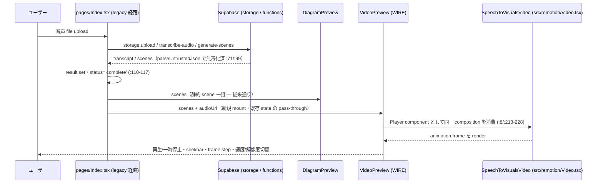
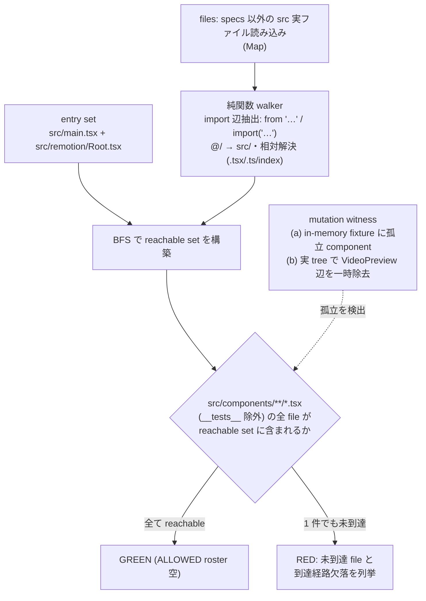
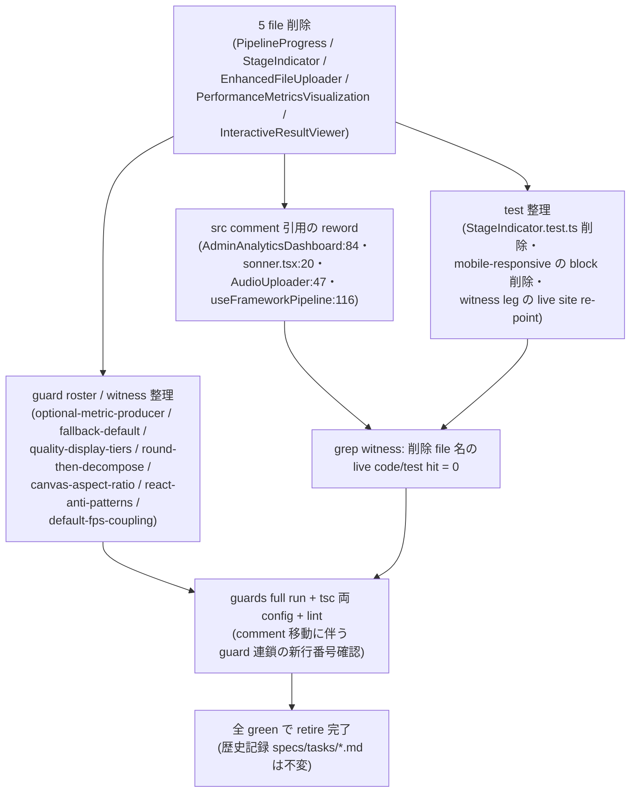
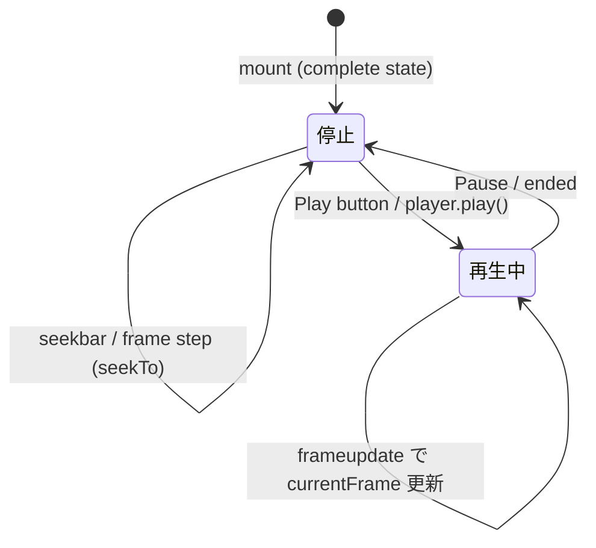

# unreachable-ui-wire-or-retire データフロー設計

<!-- spine:anchor:begin -->
> **Spine anchor**: [speech-to-visuals アーキテクチャ設計](../speech-to-visuals/architecture.md)
>
> - parent: `speech-to-visuals/architecture.md`
> - role: `detailed`
> - status: `canonical_child`
<!-- spine:anchor:end -->

**作成日**: 2026-09-07
**関連要件定義**: [speech-to-visuals 要件定義書](../speech-to-visuals/requirements.md) REQ-425 / REQ-426（Phase 196・提案ベース `- [ ]`）
**関連受け入れ基準**: [speech-to-visuals 受け入れ基準](../speech-to-visuals/acceptance-criteria.md) TC-409-01〜02 / TC-410-01〜02（未実施）
**親設計**: [architecture.md](architecture.md)

**【信頼性レベル凡例】**: 🔵 青信号（既存実装・文書に基づく確実なフロー）/ 🟡 黄信号（妥当な推測）/ 🔴 赤信号（参照資料にない自動推定）

---

## WIRE 経路のデータフロー（complete state の結果消費）🔵

**信頼性**: 🔵 *Index.tsx:25-126 の handleUpload 実装・Index.tsx:227-239 の complete state 実装・VideoPreview.tsx:74-228 の props/Player 実装より*

**詳細ステップ**:

1. upload → complete state までの流れは全て既存（本 Phase は complete state の表示構成のみ変更）。
2. `result.scenes` / `result.audioUrl` は DiagramPreview・VideoRenderer が既に消費している同一 data を VideoPreview へ渡すのみ — 新規の取得・変換・store は存在しない。
3. VideoPreview 内部は自律完結（player event 購読 :115-144・seek/speed/resolution の local state）で、親へ callback を上げない。

## 到達性 guard のデータフロー（静的 import graph 走査）🔵

**信頼性**: 🔵 *REQ-425 (e)・本設計 architecture.md「到達性 guard 設計」節・tests/guards の既存 census 形式（readFileSync + 純関数 + ALLOWED roster）より*

**設計要点**:

1. walker は fs 非依存の純関数（合成 fixture で単体検証可能・REQ-388 precedent と同じ「実 tree が clean でも detector の歯が残る」構造）。
2. entry set が 2 file なのは、app mount（main.tsx）と Remotion composition 登録（Root.tsx）が**共に正規の生産入口**だから（A157 が React.lazy / barrel 不在を確認済み — 静的走査で漏れない）。
3. 外部 package（react・@remotion/player・@stv/core 等）は辺を持たず、解決は repo 内 `src/` に限る。

## RETIRE 経路のクリーンアップフロー 🔵

**信頼性**: 🔵 *REQ-425 (a)・architecture.md「RETIRE 設計」roster 表より*

**注意（既知の連鎖クラス）**: src 変更で comment が動くと stale-comment / dead-idiom / three-way spec 句の guard が連鎖 RED する既知パターンのため、実装 commit では guards full run を回して新行番号・新句を確認する（本設計の roster は 2026-09-07 時点の行番号）。

## 状態管理フロー（VideoPreview 内部）🔵

**信頼性**: 🔵 *VideoPreview.tsx:98-194 の実装より*

- 全 state は VideoPreview の local state（isPlaying / currentFrame / resolution / playbackSpeed / loop）で、Index の state と結合しない。
- unmount（complete state からの離脱）時は player event listener を全解除（:137-143）— listener-leak class の既知対策を踏襲。

## データ整合性の保証 🔵

**信頼性**: 🔵 *Index.tsx:66-101 の chokepoint 実装より*

- **トランザクション性は非対象**（単一 client の表示 tree 変更のみ・永続化なし）。
- **整合性チェック**: VideoPreview が受け取る scenes は `parseUntrustedJson`（Infinity/`__proto__` 無毒化 chokepoint）通過済みの同一 data を既存 2 component が消費している経路と同じ — 検証二重化は行わず単一 chokepoint を維持する（export-security 2 paths class の教訓：検証経路の重複を作らない）。
- **空データ**: `scenes` が空配列の場合は VideoPreview.tsx:197-207 の empty fallback（`data-testid="video-preview-empty"`）が既存実装のまま機能する。

## 関連文書

- **アーキテクチャ**: [architecture.md](architecture.md)
- **分析記録**: [design-interview.md](design-interview.md)
- **要件定義（正本）**: [speech-to-visuals 要件定義書](../speech-to-visuals/requirements.md) REQ-425 / REQ-426
- **受け入れ基準（正本）**: [speech-to-visuals 受け入れ基準](../speech-to-visuals/acceptance-criteria.md) TC-409-01〜02 / TC-410-01〜02

## 信頼性レベルサマリー

- 🔵 青信号: 5件（WIRE 経路 / guard データフロー / RETIRE クリーンアップ / 状態管理 / データ整合性）
- 🟡 黄信号: 0件
- 🔴 赤信号: 0件

**品質評価**: 高品質（全フローが既存実装の行番号に接地し、新規に作るのは到達性 guard の walker 1 点のみ）
